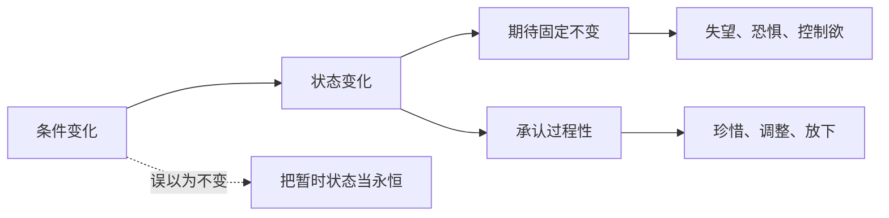

## 佛学思维筑基课: 公理03: 无常

### 作者
digoal

### 日期
2026-05-18

### 标签
佛学 , 无常 , 诸行无常 , 缘起 , 变化 , 执著 , 珍惜 , 修行 , 苦 , 过程性

----

## 背景

> 面向对象: 高中生到普通读者  
> 核心问题: “诸行无常”为什么不是一句消极感叹, 而是佛学的底层判断?  
> 先说结论: 无常公理说, 只要某物依条件而生, 它就会随条件变化而变化。无常不是悲观, 而是对过程世界的清醒描述。

## 一张图先看懂

## 求真讲法

### 它到底说了什么

“诸行无常”中的“行”可理解为有为法: 依条件形成的现象。身体、情绪、关系、财富、名声、知识、注意力, 都不是固定实体, 而是持续变化的过程。

无常不是说“什么都马上消失”, 而是说没有一个依条件而成的东西能永远保持同一状态。

### 它是怎么来的

从缘起公理可推出无常: 如果一个现象靠条件维持, 条件一变, 它就不可能绝对不变。佛学把这个观察用于人生最敏感的地方: 身体会衰老, 感受会变, 喜欢会变, 关系会变, 自我形象也会变。

无常的动机不是制造悲伤, 而是减少错误期待。痛苦常常来自把流动的东西当成固定的东西。

### 它依赖哪些假设

| 假设 | 解释 |
|---|---|
| 现象依条件成立 | 无常来自缘起 |
| 条件不断变化 | 没有绝对静止的生活环境 |
| 人倾向于追求固定 | 人会希望好感、青春、成功永远不变 |
| 认知可被训练 | 人可以从抗拒变化转向理解变化 |

### 常见误解

误解一: 无常就是一切都没有价值。错。正因为会变, 才需要珍惜、维护和负责。

误解二: 无常就是不做长期计划。错。长期计划也承认无常, 所以要留反馈、调整和风险缓冲。

误解三: 无常只指坏事会发生。错。痛苦会变, 坏习惯会变, 困境也会变。

## 求存讲法

### 它有什么用

无常让人降低对“永久占有”的幻想, 转向维护条件。想保持健康, 不是祈求身体永远年轻, 而是维护睡眠、饮食、运动和医疗条件。

### 它怎么迁移到熟悉领域

学习中, 领先不是永久身份; 落后也不是永久命运。关系中, 喜欢不是一次性承诺后自动保鲜, 而是需要持续沟通和照顾。

### 它的适用范围和边界

无常不等于否认稳定性。有些变化很慢, 有些制度和习惯能保持相当长时间。成熟理解是: 承认相对稳定, 但不把相对稳定误作绝对不变。

### 正例: 怎么用它提升能力

一个学生这次考得很好。理解无常后, 他不会把成绩当成永久标签, 而会复盘条件: 哪些方法有效? 哪些条件要继续保持? 这样成功不会变成傲慢。

### 反例: 前提不成立会怎样

一个人以为关系一旦确定就永远稳定, 因而停止沟通和关心。后来关系变淡, 他觉得“对方变了就是背叛”。失败点在于否认无常, 把关系当成不需维护的固定物。

## 思考

无常有两面: 它夺走你想永久抓住的东西, 也松开你以为永远逃不出的困境。它既是失去的原因, 也是成长的条件。

## 最后记住

1. 无常从缘起推出: 条件变, 现象变。
2. 无常不是虚无, 而是过程性。
3. 承认无常, 才会珍惜和维护条件。
4. 把暂时状态当永恒, 是许多痛苦的入口。

## 参考资料

- Encyclopaedia Britannica, “Buddhism - Suffering, impermanence, and no-self”: https://www.britannica.com/topic/Buddhism
- SN 22.59, *The Five*, Dhammatalks: https://www.dhammatalks.org/suttas/SN/SN22_59.html
- 《杂阿含经》, CBETA 电子佛典集成: https://tripitaka.cbeta.org/T02n0099_012
  
#### [PostgreSQL 解决方案集合](../201706/20170601_02.md "40cff096e9ed7122c512b35d8561d9c8")
  
  
#### [德哥 / digoal's Github - 公益是一辈子的事.](https://github.com/digoal/blog/blob/master/README.md "22709685feb7cab07d30f30387f0a9ae")
  
  
#### [About 德哥](https://github.com/digoal/blog/blob/master/me/readme.md "a37735981e7704886ffd590565582dd0")
  
  

  
