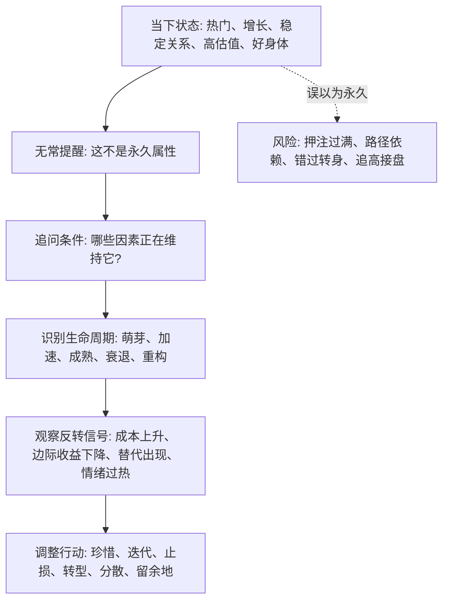

## 佛学思维筑基课: 无常: 在变化世界里识别生命周期和反转点

### 作者
digoal

### 日期
2026-05-18

### 标签
无常 , 生命周期 , 反转信号 , 条件变化 , 长期主义 , 产品增长 , 运营玩法 , 创业窗口 , 投资周期 , 风险控制

----

## 背景

> 面向对象: 大学生、产品经理、运营经理、有投资需求的人  
> 核心问题: 表面世界变化太快, 但我们总喜欢把当下状态当成长期状态: 热门会一直热门, 高增长会一直高增长, 好关系会自动稳定, 好公司会永远好。这个错觉会让生活、创业和投资都付出代价。  
> 先说结论: 无常不是悲观地说“一切都会变坏”, 而是指出: 凡是由条件维持的状态, 都会随条件变化而变化。真正的判断力, 是识别一个状态处在什么生命周期、依赖什么条件、什么时候可能反转。

说明: “无常”在佛学中对应巴利语 *anicca*、梵语 *anitya*, 是三法印之一。本文把它抽象为一条跨领域的变化公理: 稳定不是默认值, 稳定只是条件暂时维持出来的结果。

## 一张图先看懂



## 求真讲法

### 它到底说了什么

无常最容易被误解成一句情绪化的话: “一切都会过去。”  
这句话有安慰作用, 但还不够锋利。

更准确地说, 无常讲的是:

> 任何依赖条件而成立的状态, 都没有永久不变的保证。条件持续, 状态暂时维持; 条件改变, 状态就会改变。

它不是说所有东西都立刻消失, 也不是说所有努力都没有意义。它说的是: 你不能把一个过程误认为固定实体, 不能把某一阶段的结果误认为永恒属性。

比如:

| 表面状态 | 无常视角 |
|---|---|
| 我现在成绩好 | 方法、时间、反馈、健康、环境共同维持了成绩 |
| 产品现在增长快 | 渠道、需求、竞争、补贴、口碑共同维持了增长 |
| 公司现在利润高 | 行业结构、成本、品牌、技术、管理共同维持了利润 |
| 股票现在上涨 | 盈利、估值、流动性、预期、情绪共同维持了价格 |
| 关系现在稳定 | 沟通、信任、时间投入、共同目标共同维持了稳定 |

### 它是怎么来的

从缘起看无常, 推理很简单:

```text
前提 1: 现实中的状态依赖条件而成立
前提 2: 条件会变化, 也会互相影响
结论: 由条件维持的状态不可能永久固定
```

佛学讲“诸行无常”。这里的“行”可以理解为有条件生成的复合过程。身体、情绪、关系、组织、市场、技术、产品, 都不是一个永恒不变的东西, 而是许多条件暂时组合出来的过程。

现代商业和投资里, 很多规律其实也在重复这件事:

- 技术会迭代, 所以产品优势会衰减。
- 竞争会进入, 所以超额利润会被压缩。
- 用户会疲劳, 所以运营玩法会失效。
- 资本会拥挤, 所以便宜机会会变贵。
- 人会衰老和学习, 所以能力结构会变化。
- 组织会复杂化, 所以早期速度不一定能延续。

无常不是反常识, 它只是把“变化”提升为判断的基本前提。

### 它依赖哪些假设

第一, 我们讨论的是有条件生成的事物。无常不是在讨论数学命题“1+1=2”这种抽象关系, 而是在讨论身体、情绪、产品、组织、资产价格、社会趋势这类现实过程。

第二, 条件会变化。变化可能来自内部, 例如疲劳、老化、成本上升、边际收益下降; 也可能来自外部, 例如技术替代、政策变化、竞争进入、利率变化。

第三, 人类容易把短期状态外推到未来。涨了就觉得会继续涨, 火了就觉得会一直火, 顺利就觉得自己掌控一切。这种心理倾向会放大无常带来的损失。

第四, 变化并不等于不可预测。无常不是说未来完全随机, 而是提醒我们追踪条件、周期和反转信号。

### 常见误解

误解一: 无常就是消极。  
不对。无常同时意味着风险和机会。坏状态不会必然永远持续, 好状态也不会自动保鲜。

误解二: 无常就是不要长期主义。  
不对。真正的长期主义恰恰要承认无常: 因为环境会变, 所以长期策略必须能适应、迭代和留有冗余。

误解三: 无常就是反复横跳。  
不对。无常要求你观察条件变化, 不是被每个短期波动牵着走。

误解四: 无常说明预测没有意义。  
不对。无常否定的是僵硬预测, 不是条件预测。更好的预测形式是: 如果关键条件 A、B、C 延续, 结果更可能怎样; 如果其中一个反转, 判断必须更新。

## 求存讲法

### 它有什么用

无常最大的现实价值, 是让你在状态最好的时候看见风险, 在状态最差的时候看见可改变的条件。

| 场景 | 忘记无常的错误 | 理解无常后的动作 |
|---|---|---|
| 学习 | 一次成绩好就停止复盘 | 维护方法、节奏、反馈和健康 |
| 职业 | 把热门岗位当永久红利 | 建立可迁移能力, 关注供需变化 |
| 产品 | 把增长曲线当永动机 | 追踪留存、复购、渠道成本和竞争 |
| 运营 | 把爆款玩法无限复制 | 观察用户疲劳和平台规则变化 |
| 创业 | 把融资热度当市场需求 | 验证现金流和单位经济模型 |
| 投资 | 把上涨趋势当确定未来 | 检查估值、周期、仓位和反转信号 |

### 它怎么迁移到熟悉领域

#### 生活

情绪无常, 所以不要在情绪最高点承诺, 也不要在情绪最低点否定人生。  
身体无常, 所以健康不是“现在没事”就可以透支。  
关系无常, 所以稳定关系不是拥有, 而是持续维护。

无常让人更现实: 好的时候不挥霍, 差的时候不绝望。

#### 产品

产品增长通常有生命周期:

```text
发现需求 -> 早期增长 -> 渠道放大 -> 竞争进入 -> 增速放缓 -> 迭代或衰退
```

产品经理如果不理解无常, 会在增长期误以为“功能天然优秀”; 等到留存下降、竞品进入、渠道变贵时, 才发现增长依赖的条件已经变了。

理解无常后, 产品管理要持续问:

- 用户痛点是否仍然强?
- 替代方案是否变好?
- 渠道成本是否上升?
- 老用户是否疲劳?
- 核心价值是否被新技术重写?

#### 运营

运营玩法最容易无常。一次有效的裂变、补贴、直播、社群打法, 很快会经历:

```text
新鲜 -> 有效 -> 模仿 -> 拥挤 -> 疲劳 -> 失效
```

所以运营不能只复刻动作, 要追踪条件: 用户为什么愿意参与? 平台是否还给流量? 奖励是否还能覆盖成本? 用户是否开始免疫?

#### 创业

创业机会窗口也是无常的。一个机会成立, 通常需要技术成熟、客户痛点强、旧方案低效、获客可行、监管允许、团队能交付。  
这些条件不会永远等你。

太早, 用户不买单; 太晚, 竞争过度。无常提醒创业者: 时机不是口号, 时机是条件成熟度。

#### 投融资

投资里, 无常最直接地表现为周期、均值回归和估值反转。

```text
好资产 + 高估值 + 拥挤交易 + 流动性收紧 = 也可能亏钱
普通资产 + 低估值 + 预期极低 + 条件改善 = 也可能上涨
```

无常要求投资者分清:

- 企业质量是否变化?
- 行业周期是否变化?
- 利率和流动性是否变化?
- 市场预期是否过满?
- 价格是否已经反映了太多好消息?

它不会告诉你明天涨跌, 但会提醒你: 越多人把当前趋势当永久趋势, 越要检查反转条件。

### 它的适用范围和边界

无常适用于有条件维持的现实过程, 特别适用于人的状态、组织能力、商业模式、技术优势、市场价格、用户行为和社会潮流。

但它有边界。

第一, 不能把无常滥用成“什么都不值得做”。如果一切都会变, 反而更要做那些能适应变化、穿越周期、积累复利的事。

第二, 不能把无常误用成短线主义。短期波动不等于长期条件改变。优秀判断要区分噪声、周期和结构性变化。

第三, 不能用无常否定责任。关系会变, 不代表可以不维护; 市场会变, 不代表亏损都怪环境; 人会变, 不代表承诺没有意义。

第四, 不能只在坏事发生时才承认无常。真正有用的无常观, 是在顺境中预留余地, 在逆境中寻找条件变化。

### 正例: 怎么用它提升能力

一个大学生发现自己靠短视频运营赚到第一笔钱。忘记无常的人会立刻扩张团队、租办公室、买课包装自己, 以为流量会一直便宜。

理解无常的人会先拆条件:

1. 平台是否正处在流量红利期?
2. 内容形式是否容易被模仿?
3. 粉丝是否信任自己, 还是只被算法推到?
4. 变现是否依赖单一平台?
5. 如果规则改变、流量下降, 还有没有私域、产品、品牌和复购?

然后他会把短期收入的一部分投入可迁移能力: 选题能力、用户理解、产品化、交付能力、现金储备和多渠道分发。这样即使平台红利消失, 他也不是从零开始。

### 反例: 前提不成立会怎样

某投资者在一只高成长股票上涨三年后重仓买入。他的理由是: 公司过去收入年年高增长, 行业空间巨大, 所以未来还会继续。

这个判断失败, 不是因为“成长股一定不好”, 而是因为他把过去状态当成永久属性, 忽略了无常:

- 渗透率提高后, 新增用户空间变小。
- 竞争者进入后, 获客成本上升。
- 公司为了维持增长开始降价, 毛利率下降。
- 利率上行后, 市场不再愿意给高估值。
- 管理层为了完成预期做激进扩张, 现金流恶化。

这里失效的前提是: “过去高增长可以线性外推”。无常提醒我们, 增长也是有条件的; 条件变化后, 增长曲线会弯折。

## 思考

无常不是让你失去安全感, 而是让你把安全感建立在更真实的地方。

低级安全感来自“这个状态会一直在”。  
高级安全感来自“我知道它会变, 所以我有观察、调整和承受变化的能力”。

可以用下面这张检查表训练自己:

| 问题 | 目的 |
|---|---|
| 这个状态靠哪些条件维持? | 防止把结果当成本质 |
| 哪个条件最脆弱? | 找到反转点 |
| 哪些变化是噪声, 哪些是结构变化? | 避免过度反应 |
| 如果它持续, 我怎样受益? | 不错过趋势 |
| 如果它反转, 我怎样活下来? | 控制下行风险 |
| 有没有能穿越变化的能力或资产? | 建立长期复利 |

如果把无常用于生活, 你会更珍惜而不是更冷漠。  
如果把无常用于创业, 你会更快迭代而不是死守剧本。  
如果把无常用于投资, 你会更重视估值、周期和仓位, 而不是只相信故事。

## 最后记住

1. 无常不是悲观, 而是变化公理: 条件维持状态, 条件改变状态。
2. 稳定不是默认值, 稳定是许多条件暂时协调出来的结果。
3. 好状态不要线性外推, 坏状态也不要永久化。
4. 判断未来, 要看生命周期、关键条件和反转信号。
5. 真正的长期主义不是假装世界不变, 而是在变化中持续调整并保留下行空间。

## 参考资料

- Encyclopaedia Britannica, “Anicca”: https://www.britannica.com/topic/anicca
- Encyclopaedia Britannica, “Buddhism”: https://www.britannica.com/topic/Buddhism
- Access to Insight, “The Three Basic Facts of Existence: I. Impermanence (Anicca)”: https://www.accesstoinsight.org/lib/authors/various/wheel186.html
- SuttaCentral, Buddhist texts and translations on impermanence: https://suttacentral.net/
- Stanford Encyclopedia of Philosophy, “Scientific Method”: https://plato.stanford.edu/entries/scientific-method/
  
#### [PostgreSQL 解决方案集合](../201706/20170601_02.md "40cff096e9ed7122c512b35d8561d9c8")
  
  
#### [德哥 / digoal's Github - 公益是一辈子的事.](https://github.com/digoal/blog/blob/master/README.md "22709685feb7cab07d30f30387f0a9ae")
  
  
#### [About 德哥](https://github.com/digoal/blog/blob/master/me/readme.md "a37735981e7704886ffd590565582dd0")
  
  

  
