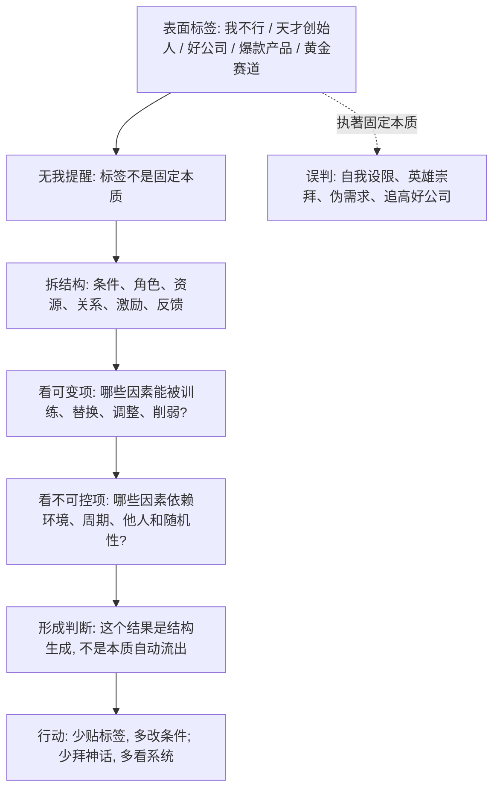

## 佛学思维筑基课: 非我与无我: 看穿固定本质幻觉的结构公理

### 作者
digoal

### 日期
2026-05-18

### 标签
非我 , 无我 , 反本质化 , 五蕴 , 标签幻觉 , 结构分析 , 自我认知 , 产品结构 , 创业判断 , 投资标签

----

## 背景

> 面向对象: 大学生、产品经理、运营经理、有投资需求的人  
> 核心问题: 世界变化很快, 但我们常把人、公司、产品、行业、资产贴成固定标签: “我就是不行”“他天生厉害”“这是好公司”“这是差行业”“这个产品有爆款基因”。这些本质化判断让我们误判能力、需求、风险和未来。  
> 先说结论: 非我与无我不是说“我不存在”, 而是说不存在一个永恒、独立、完全可控的固定本质。人、产品、组织、资产都是由条件、角色、资源、关系、习惯和反馈暂时组合出来的过程。判断未来, 不能只看标签, 要看结构如何生成行为和结果。

说明: “无我”在佛学中对应巴利语 *anatta*、梵语 *anatman*。传统语境里, 它主要否定永恒不变的实体我或灵魂我。本文为了服务生活、产品、运营、创业、投资决策, 把它抽象成一条“反本质化公理”: 不要把复杂系统误认为拥有固定、单一、永恒的内在本质。

## 一张图先看懂



## 求真讲法

### 它到底说了什么

“非我与无我”最容易被误解为: “我不存在, 所以什么都无所谓。”  
这个理解太粗, 也很危险。

更准确地说, 它否定的是一种固定本质幻觉:

> 不存在一个永恒不变、独立自足、完全主宰一切的“我”。我们称为“我”的东西, 更像身体、感受、记忆、认知、习惯、关系、角色和环境共同生成的连续过程。

在佛学里, 常用“五蕴”来分析这个过程: 色、受、想、行、识。简单说:

| 五蕴 | 通俗理解 | 现代迁移 |
|---|---|---|
| 色 | 身体和物质基础 | 精力、健康、设备、环境 |
| 受 | 感受: 苦、乐、不苦不乐 | 用户体验、情绪反馈、风险感受 |
| 想 | 识别和概念化 | 标签、品牌认知、市场叙事 |
| 行 | 意志、习惯、心理倾向 | 行为模式、组织流程、激励机制 |
| 识 | 觉知和分别 | 注意力、信息处理、决策意识 |

佛学说“五蕴非我”, 不是否定这些现象存在, 而是说: 它们都不是一个可永久控制、永恒不变的实体我。

迁移到现代判断, 就是:

- 人不是一个固定标签, 而是能力、处境、习惯、关系和选择的组合。
- 产品不是一个固定物品, 而是用户问题、场景、交互、渠道和反馈的组合。
- 公司不是一个抽象名词, 而是资产、人员、流程、文化、激励、客户、资本结构的组合。
- 投资标的不是“好”或“坏”的本质, 而是质量、价格、周期、预期、流动性和风险补偿的组合。

### 它是怎么来的

从缘起和无常推到无我, 逻辑并不复杂:

```text
前提 1: 现实中的身心和组织状态依条件而生
前提 2: 依条件而生的东西会变化
前提 3: 会变化、受条件制约的东西不能被完全主宰
结论: 不能把这些过程当成永恒、独立、完全可控的固定本质
```

这不是“证明世界没有任何主体”, 而是提供一种观察策略: 当你想说“这就是我”“这就是他”“这家公司天然优秀”“这个行业永远赚钱”时, 先停下来问:

- 这个判断是不是把过程当成了本质?
- 我看到的是稳定结构, 还是短期表现?
- 哪些条件支撑了这个标签?
- 条件改变后, 标签还成立吗?

### 它依赖哪些假设

第一, 我们讨论的是现实中的复合对象, 例如人、团队、公司、产品、资产, 而不是数学定义或纯逻辑概念。

第二, 复合对象由多个因素组成。一个人的表现依赖能力、资源、情绪、健康、平台、反馈; 一家公司的表现依赖行业、管理、资本、客户、竞争和制度。

第三, 这些因素会变化, 也会互相影响。能力可训练, 激励可改变, 关系可修复, 组织会老化, 竞争格局会重写。

第四, 人类容易贴标签, 因为标签省力。问题是, 标签让我们获得心理确定性, 也让我们忽略真实结构。

### 常见误解

误解一: 无我就是自我否定。  
不对。无我否定的是固定本质, 不是否定行动能力。相反, 因为没有固定本质, 人才有改变条件、训练能力、重塑习惯的空间。

误解二: 无我就是不用负责。  
不对。责任仍然存在, 只是责任不建立在永恒灵魂上, 而建立在行为、后果、因果连续和社会关系上。

误解三: 无我就是没有个性。  
不对。个性可以存在, 但它更像长期习惯和条件塑造出的模式, 不是不可改变的命运。

误解四: 无我就是一切都一样。  
不对。无我不是抹平差异, 而是提醒你差异来自结构条件, 不是来自神秘本质。

## 求存讲法

### 它有什么用

非我与无我最大的现实价值, 是帮你减少“本质化误判”。

| 场景 | 本质化判断 | 无我式判断 |
|---|---|---|
| 学习 | 我就是不适合数学 | 我的基础、方法、反馈、训练量和情绪条件哪里出了问题? |
| 职业 | 他天生会管理 | 他的经验、平台、授权、团队和激励如何支撑管理表现? |
| 产品 | 这个产品天然会爆 | 用户痛点、场景、渠道、传播、留存是否共同成立? |
| 运营 | 这个玩法就是有效 | 玩法依赖哪些用户心理、平台规则和成本条件? |
| 创业 | 创始人很强, 所以公司会成 | 强在哪里? 是否匹配行业阶段、组织能力和现金流约束? |
| 投资 | 好公司永远值得买 | 好公司、好价格、好周期、好仓位是不同问题 |

它让你从“贴标签”进入“拆结构”。拆结构以后, 你才知道什么能改变, 什么不能改变, 什么值得押注, 什么只是叙事。

### 它怎么迁移到熟悉领域

#### 生活

很多痛苦来自把暂时状态贴成永久身份。

考试失败, 就说“我不行”。  
一次表达不好, 就说“我不适合沟通”。  
一段关系失败, 就说“我不值得被爱”。

无我视角会把这些话拆开:

```text
不是: 我不行
而是: 当前方法 + 训练量 + 情绪 + 反馈 + 环境, 共同生成了这个结果

不是: 我天生不会沟通
而是: 经验不足 + 场景压力 + 表达结构缺失 + 反馈太少, 共同生成了表现
```

这不是自我安慰, 而是让改变有抓手。

#### 产品

产品经理容易说“这个产品很强”或“这个需求很弱”。无我式产品判断会问:

- 强的是功能, 还是场景?
- 用户喜欢的是产品, 还是补贴?
- 留存来自真实价值, 还是迁移成本?
- 增长来自口碑, 还是渠道红利?
- 产品优势来自技术, 还是组织交付?

产品不是一个有固定本质的东西。它是用户、问题、场景、交互、渠道、品牌和商业模式的组合。

#### 运营

运营里常见的本质化幻觉是“某个玩法永远有效”。但玩法没有固定灵魂, 它依赖:

- 用户是否还有新鲜感。
- 平台是否继续分发。
- 奖励是否覆盖参与成本。
- 模仿者是否稀释效果。
- 品牌是否承受得住频繁刺激。

所以运营经理不能只复制动作, 要理解动作背后的心理结构和条件结构。

#### 创业

创业圈最容易制造“创始人神话”: 某个人很聪明、很有魅力、履历很好, 所以公司会成功。

无我式创业判断会更冷静:

- 创始人的优势是否匹配当前行业阶段?
- 早期个人能力能否转化成组织能力?
- 团队激励是否支持长期协作?
- 产品是否真的解决高价值问题?
- 现金流是否允许试错?
- 竞争变强后, 公司是否还能防守?

创始人重要, 但创始人不是公司命运的单一实体本质。

#### 投融资

投资里,“好公司”是最危险也最常见的标签之一。

无我式投资判断会拆成:

```text
公司 = 业务质量 + 管理层 + 行业结构 + 资产负债表 + 现金流 + 资本配置 + 估值 + 周期位置
```

一家好公司在高估值、强竞争、错误周期、管理层激进扩张时, 也可能带来差回报。  
一家普通公司在极低估值、周期改善、资产质量修复时, 也可能有阶段性机会。

无我不是否定公司质量, 而是反对把“好公司”当成一个脱离价格和条件的永恒实体。

### 它的适用范围和边界

非我与无我适合用于所有容易被标签误导的场景: 自我评价、人才判断、产品判断、组织判断、创业判断、投资判断。

但它有边界。

第一, 不能把无我滥用成“没有主体”。日常生活中仍然需要身份、责任、承诺和法律主体。无我只是提醒这些主体不是永恒不变、完全独立的实体。

第二, 不能把无我滥用成“谁都一样”。结构不同, 结果就不同。能力、资源、组织、资本、位置、时机会造成真实差异。

第三, 不能用无我逃避价值判断。一个组织作恶, 不能说“无我所以没人负责”。行为仍有后果, 决策链条仍要被追责。

第四, 不能只拆结构而不行动。拆结构的目的, 是找到可以改变的条件和必须尊重的约束。

### 正例: 怎么用它提升能力

一个大学生连续两次面试失败, 觉得“我就是不适合职场”。如果他接受这个标签, 可能会逃避面试, 甚至把一次阶段性失败固化成自我身份。

无我式分析会把“我不适合”拆成结构:

1. 简历是否把项目价值说清楚?
2. 面试表达是否有结构?
3. 是否理解岗位真实需求?
4. 是否缺少模拟反馈?
5. 是否投递了不匹配的公司?
6. 是否因为紧张导致表现失真?

拆完以后, “我不行”变成了“简历、表达、岗位理解、反馈训练需要调整”。这不是降低标准, 而是把模糊自责变成可执行改进。

### 反例: 前提不成立会怎样

某投资者相信“这家公司是伟大公司, 买了长期持有就行”。他没有拆公司结构, 也没有看价格和周期。

几年后回报很差。原因不是“伟大公司都是骗局”, 而是他把公司本质化了:

- 行业渗透率接近天花板, 增速下降。
- 新竞争者压低利润率。
- 管理层为了维持增长做高价并购。
- 债务上升, 现金流质量下降。
- 买入时估值过高, 已经透支多年增长。

这里失效的前提是: “好公司这个标签可以独立于结构、价格和条件存在”。无我提醒我们, 公司不是一个固定本质, 而是变化中的条件系统。

## 思考

非我与无我训练的是一种反标签能力。

它让你少问:

- 我到底是不是某种人?
- 这家公司到底是不是好公司?
- 这个产品到底是不是爆款?
- 这个行业到底是不是黄金赛道?

它让你多问:

| 更好的问题 | 为什么重要 |
|---|---|
| 这个结果由哪些结构条件生成? | 防止把结果误认为本质 |
| 哪些条件能改变? | 找到行动抓手 |
| 哪些条件不能由我控制? | 避免过度自责和过度自信 |
| 这个标签在什么边界内成立? | 防止过度外推 |
| 条件改变后, 判断是否仍然成立? | 提高预测质量 |
| 我是否把叙事中的主角当成了全部原因? | 避免英雄崇拜和单因解释 |

对个人来说, 无我带来的不是虚无, 而是自由: 我不必被一次失败、一个标签、一种身份永久定义。  
对管理者来说, 无我带来的不是冷漠, 而是系统思维: 人的表现来自角色、激励、流程和反馈。  
对投资者来说, 无我带来的不是怀疑一切, 而是更精确: 没有脱离价格、周期和结构的“永远好资产”。

## 最后记住

1. 非我与无我不是“我不存在”, 而是“不存在永恒、独立、完全可控的固定本质”。
2. 人、产品、公司、资产都更像条件组合出来的过程, 不是单一标签。
3. 判断真伪, 要拆结构; 预测未来, 要看结构条件会怎样变化。
4. 无我能减少自我设限、英雄崇拜、产品神话和好公司迷信。
5. 不要用无我逃避责任。行为仍有后果, 结构仍能改造, 决策仍要承担。

## 参考资料

- Encyclopaedia Britannica, “Anatta”: https://www.britannica.com/topic/anatta
- Dhammatalks.org, “Pañca Sutta (SN 22:59), also known as Anatta-lakkhaṇa Sutta”: https://www.dhammatalks.org/suttas/SN/SN22_59.html
- Access to Insight, “On the No-self Characteristic: The Anatta-lakkhana Sutta”: https://www.accesstoinsight.org/lib/authors/mendis/wheel268.html
- Encyclopaedia Britannica, “Indian philosophy - Early Buddhist developments”: https://www.britannica.com/topic/Indian-philosophy/Early-Buddhist-developments
- SuttaCentral, Buddhist texts and translations: https://suttacentral.net/
  
#### [PostgreSQL 解决方案集合](../201706/20170601_02.md "40cff096e9ed7122c512b35d8561d9c8")
  
  
#### [德哥 / digoal's Github - 公益是一辈子的事.](https://github.com/digoal/blog/blob/master/README.md "22709685feb7cab07d30f30387f0a9ae")
  
  
#### [About 德哥](https://github.com/digoal/blog/blob/master/me/readme.md "a37735981e7704886ffd590565582dd0")
  
  

  
