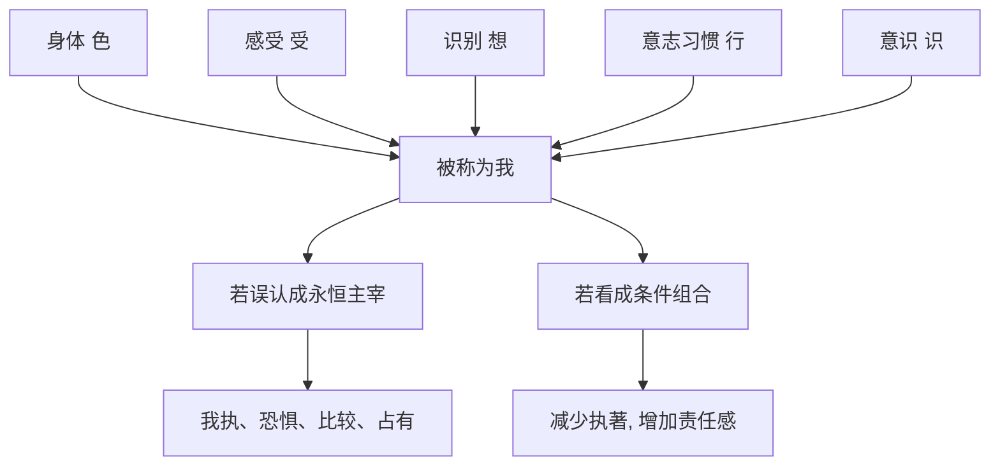

## 佛学思维筑基课: 公理04: 非我与无我

### 作者
digoal

### 日期
2026-05-18

### 标签
佛学 , 无我 , 非我 , 五蕴 , 我执 , 身心 , 缘起 , 无常 , 责任 , 解脱

----

## 背景

> 面向对象: 高中生到普通读者  
> 核心问题: “无我”是不是说人不存在、责任不存在?  
> 先说结论: 无我公理不是否定日常生活中的人, 而是否定一个永恒、独立、绝对可控制的实体我。佛学把“我”看成五蕴等条件过程的暂时组合。

## 一张图先看懂

## 求真讲法

### 它到底说了什么

佛学并不是说“你不存在”, 而是说: 你找不到一个永恒不变、独立存在、完全主宰身心的实体我。所谓“我”, 在经验中通常表现为身体、感受、想法、意志习惯和意识活动的组合, 也就是五蕴。

如果身体真是绝对的我, 我就应能命令它永远健康、年轻、不痛。但事实不是这样。感受、念头、情绪也是如此: 它们出现、变化、消失, 并不完全听命于一个主宰者。

### 它是怎么来的

无我从缘起和无常推出。凡是依条件生灭的东西, 都不能作为永恒独立的实体我。SN 22.59 通过五蕴分析说明: 色、受、想、行、识都无常、会带来逼迫, 因而不适合被认作“这是我、这是我所、这是我的自我”。

这不是为了打击人格, 而是为了松动我执。很多痛苦来自把过程性的身心活动当成必须捍卫的固定自我。

### 它依赖哪些假设

| 假设 | 说明 |
|---|---|
| 自我可在经验中被分析 | 不把“我”当不可检查的神秘实体 |
| 五蕴依条件生灭 | 身心组成部分都不是绝对主宰 |
| 执著自我会带来苦 | 面子、占有、比较、恐惧都依我执增强 |
| 责任不依赖永恒灵魂 | 行为后果可以依因果连续成立 |

### 常见误解

误解一: 无我就是没有人, 所以不用负责。错。佛学否定实体我, 不否定因果责任。

误解二: 无我就是自我否定、低自尊。错。低自尊仍然执著于一个被贬低的“我”。

误解三: 无我等于麻木无情。错。无我常常导向慈悲, 因为不再把自我边界看得绝对。

## 求存讲法

### 它有什么用

无我帮助人从“维护自我形象”转向“处理真实问题”。很多争吵不是为事实, 而是为“我不能输”“我不能被看低”。

### 它怎么迁移到熟悉领域

学习中, “我不是学数学的料”是把能力实体化。无我视角会问: 现在的理解、练习、反馈条件是什么? 这些过程能不能改变?

管理中, 领导若把批评当作攻击自我, 就无法学习。若把角色和意见看成条件过程, 就更容易修正。

### 它的适用范围和边界

无我不能被用来抹除人的权利和边界。日常层面仍有姓名、身体、财产、承诺和法律责任。佛学的无我是胜义分析, 不是现实生活中取消责任主体。

### 正例: 怎么用它提升能力

一个人被指出方案有漏洞。若执著“我不能错”, 他会辩解。若用无我视角, 他会把方案看成条件产物: 信息不足、假设不清、验证不够。于是他能修正方案, 而不是防卫自尊。

### 反例: 前提不成立会怎样

有人说“既然无我, 我伤害别人也无所谓”。这是误用。失败点在于把无我理解成无责任, 忽略了缘起因果和业力: 行为仍会造成后果, 伤害仍是伤害。

## 思考

你最想保护的“我”, 可能只是某个阶段形成的形象。无我不是要毁掉你, 而是让你不必为了维护旧形象而牺牲真实成长。

## 最后记住

1. 无我否定永恒独立的实体我, 不否定日常人格。
2. 五蕴是理解无我的重要分析工具。
3. 无我不是逃避责任, 而是把责任放回因果连续。
4. 松动我执, 才能减少比较、恐惧和防卫。

## 参考资料

- SN 22.59, *The Five / Anattalakkhana Sutta*, Dhammatalks: https://www.dhammatalks.org/suttas/SN/SN22_59.html
- Encyclopaedia Britannica, “Buddhism - The life of the Buddha”: https://www.britannica.com/topic/Buddhism/The-life-of-the-Buddha
- 《杂阿含经》, CBETA 电子佛典集成: https://tripitaka.cbeta.org/T02n0099_012
  
#### [PostgreSQL 解决方案集合](../201706/20170601_02.md "40cff096e9ed7122c512b35d8561d9c8")
  
  
#### [德哥 / digoal's Github - 公益是一辈子的事.](https://github.com/digoal/blog/blob/master/README.md "22709685feb7cab07d30f30387f0a9ae")
  
  
#### [About 德哥](https://github.com/digoal/blog/blob/master/me/readme.md "a37735981e7704886ffd590565582dd0")
  
  

  
