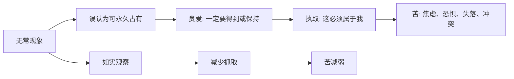

## 佛学思维筑基课: 公理05: 苦的机制

### 作者
digoal

### 日期
2026-05-18

### 标签
佛学 , 苦 , 苦谛 , 贪爱 , 执取 , 无明 , 情绪 , 四圣谛 , 减苦 , 修行

----

## 背景

> 面向对象: 高中生到普通读者  
> 核心问题: 佛学说“苦”, 是不是认为人生只有痛苦?  
> 先说结论: 苦的机制公理说, 痛苦不只是外部打击, 还来自无明、贪爱、执取对无常世界的错误抓取。佛学的“苦”更接近不圆满、不安稳、不可彻底满足。

## 一张图先看懂

## 求真讲法

### 它到底说了什么

佛学讲“苦”, 不只是疼痛、悲伤、灾难, 还包括更细的“不安稳”: 快乐会结束, 拥有会失去, 想控制却控制不了, 讨厌的偏偏出现, 想要的偏偏得不到。

苦的机制不是“活着本身毫无意义”, 而是: 当人把无常、非我的东西当作永恒、可占有、能证明自我的东西, 心就进入不安。

### 它是怎么来的

四圣谛第一谛承认苦, 第二谛追问苦因。经典中常把苦因指向贪爱、执取以及更深的无明。无明不是没有知识, 而是看错了现象的性质: 把无常看成常, 把苦看成乐, 把无我看成我。

因此, 佛学的诊断不是“人生全坏”, 而是“错误理解和执著会把生命经验加工成苦”。

### 它依赖哪些假设

| 假设 | 含义 |
|---|---|
| 人会追求稳定满足 | 欲望本身不是问题, 盲目抓取才是问题 |
| 对现实的误判会制造苦 | 认知错误会转化成情绪和行为后果 |
| 苦有可观察机制 | 苦不是神秘惩罚, 而是条件链 |
| 机制可被削弱 | 看见无明、爱、取, 就有松动空间 |

### 常见误解

误解一: 佛学否定快乐。错。佛学否定的是把快乐当永久归宿。

误解二: 苦就是悲观。错。承认病症是治疗的开始, 不是对生命下绝望判决。

误解三: 不执著就是不关心。错。不执著是减少占有和控制, 不是减少慈悲和责任。

## 求存讲法

### 它有什么用

它帮助人识别痛苦中的“第二支箭”。第一支箭是事实打击, 第二支箭是我执、怨恨、反复解释和灾难化想象。

### 它怎么迁移到熟悉领域

考试失败是事实; “我完了、别人都会看不起我、我永远不行”是加工出来的苦。失恋是事实; “我再也不值得被爱”是执取和自我叙事制造的加重痛苦。

### 它的适用范围和边界

苦的机制分析不能用来否认现实伤害。贫困、疾病、暴力、歧视是真实条件, 需要现实层面的帮助和制度改变。佛学只是补充说明: 在现实痛苦之外, 心还会制造额外捆绑。

### 正例: 怎么用它提升能力

一个学生没考好后先承认难过, 然后把事实和解释分开: 事实是这次数学 70 分; 解释是“我永远不行”。他处理事实, 而不喂养解释, 苦就减少。

### 反例: 前提不成立会怎样

一个人把“减少执著”误读成“压抑情绪”。他假装不难过, 结果情绪在身体和关系中爆发。失败点在于他跳过了如实观察, 没有真正看见苦的条件。

## 思考

佛学最现实的地方是: 它不承诺世界按你的愿望运行, 但它指出你可以减少自己对世界的错误抓取。不是所有痛都能避免, 但很多苦可以不再加码。

## 最后记住

1. 苦不只是疼痛, 也是不安稳和不可彻底满足。
2. 苦的关键燃料是无明、贪爱、执取。
3. 佛学不是否定快乐, 而是看清快乐的无常性。
4. 看见苦的机制, 才可能停止制造额外痛苦。

## 参考资料

- Encyclopaedia Britannica, “Four Noble Truths”: https://www.britannica.com/topic/Four-Noble-Truths
- SN 56.11, *Setting in Motion the Wheel of the Dhamma*: https://dhammatalks.net/suttacentral/sc2016/sc/en/sn56.11.html
- Encyclopaedia Britannica, “Indian philosophy - Early Buddhist developments”: https://www.britannica.com/topic/Indian-philosophy/Early-Buddhist-developments
  
#### [PostgreSQL 解决方案集合](../201706/20170601_02.md "40cff096e9ed7122c512b35d8561d9c8")
  
  
#### [德哥 / digoal's Github - 公益是一辈子的事.](https://github.com/digoal/blog/blob/master/README.md "22709685feb7cab07d30f30387f0a9ae")
  
  
#### [About 德哥](https://github.com/digoal/blog/blob/master/me/readme.md "a37735981e7704886ffd590565582dd0")
  
  

  
