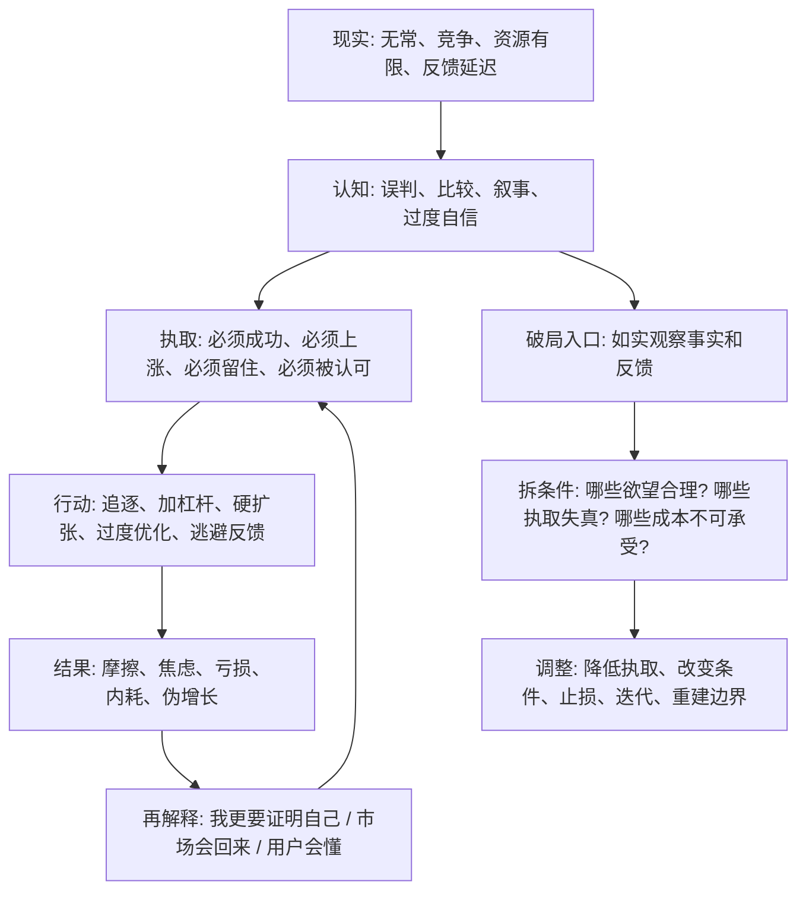

## 佛学思维筑基课: 苦的机制: 看穿不满足、摩擦和失控如何生成

### 作者
digoal

### 日期
2026-05-18

### 标签
苦 , 苦的机制 , 执取 , 不满足 , 失控 , 摩擦成本 , 焦虑管理 , 产品验证 , 创业现金流 , 投资止损

----

## 背景

> 面向对象: 大学生、产品经理、运营经理、有投资需求的人  
> 核心问题: 表面世界变化太快, 我们常把痛苦、焦虑、亏损、失败、增长停滞当作孤立事件。只看表象, 就会把问题归因成“我不行”“市场坏”“用户变了”“运气差”, 结果无法判断真伪, 更无法预测未来。  
> 先说结论: “苦”不是简单的悲观, 而是一套生成机制: 当无常的现实、有限的资源、失真的认知和强烈的执取相撞, 就会产生不满足、摩擦、焦虑和失控。真正的判断力, 是识别苦从哪里生起, 哪些条件在喂养它, 哪些条件可以被停止或改造。

说明: 佛学里的“苦”常译为 suffering, 但它不只指疼痛和悲伤, 也包括不满足、紧张、不可完全掌控和对无常事物的执取。本文把“苦的机制”抽象成跨生活、产品、运营、创业、投资都能使用的现实分析框架。

## 一张图先看懂



## 求真讲法

### 它到底说了什么

“苦的机制”不是说人生只有痛苦, 也不是说快乐不真实。它说的是:

> 只要我们把无常、不可完全控制的东西当成必须满足、必须占有、必须按我想法运转的对象, 不满足和失控就会反复出现。

佛学中四圣谛把问题拆成四步: 苦、集、灭、道。用现代语言说:

| 四圣谛 | 现代解释 | 决策含义 |
|---|---|---|
| 苦 | 不满足、摩擦、失控、脆弱性真实存在 | 不要粉饰问题 |
| 集 | 苦有成因, 常与贪爱、执取、无明有关 | 找生成机制, 不只看结果 |
| 灭 | 苦的条件可被削弱或停止 | 问哪些燃料可以减少 |
| 道 | 有训练和行动路径 | 用方法改变认知、行为和环境 |

在生活里, 苦可能表现为焦虑、比较、怕落后。  
在产品里, 苦可能表现为用户不留存、需求不成立、团队反复返工。  
在运营里, 苦可能表现为数据好看但利润难看。  
在创业里, 苦可能表现为融资叙事很强但现金流很弱。  
在投资里, 苦可能表现为明明买了“好故事”, 却被估值、周期和仓位反噬。

### 它是怎么来的

苦的机制可以从“缘起、无常、无我”推出来:

```text
缘起: 结果依赖条件, 不是孤立发生
无常: 条件会变, 状态不能永久维持
无我: 人和组织没有完全主宰一切的固定本质
  ↓
如果仍然执著: 必须照我期待发展、必须长期拥有、必须证明我是对的
  ↓
现实与执取发生冲突
  ↓
苦产生: 焦虑、内耗、亏损、失望、失控、反复加码
```

一个典型机制是:

```text
感受到刺激 -> 产生喜欢/讨厌 -> 形成想要/抗拒 -> 把愿望当成必须
-> 忽视成本和边界 -> 行动变形 -> 结果反噬 -> 更强执取
```

这套机制很像产品、运营和投资里的错误循环:

- 产品经理听到用户一句“想要”, 就执取为“必须做”, 结果做出伪需求。
- 运营经理看到一次活动爆了, 就执取为“必须复制”, 结果补贴越来越重、留存越来越差。
- 创业者听到投资人认可赛道, 就执取为“必须扩张”, 结果现金流先死。
- 投资者看到股价上涨, 就执取为“必须抓住机会”, 结果在高估值处加仓。

### 它依赖哪些假设

第一, 现实不是完全按个人愿望运转。用户、市场、组织、价格、关系和身体都有自己的条件链。

第二, 人有趋乐避苦的本能。喜欢收益, 讨厌损失; 喜欢被认可, 讨厌被否定; 喜欢确定性, 讨厌不确定性。

第三, 执取会放大痛苦。普通愿望并不必然制造严重痛苦, 但当愿望变成“必须如此, 否则我不能接受”, 摩擦会迅速上升。

第四, 苦有反馈价值。痛苦不是只用来忍受的, 它也在提示某个条件链出了问题: 目标、资源、认知、关系、杠杆、节奏或边界不匹配。

第五, 苦的条件可以被改变。不是所有外部事实都能改变, 但认知、投入、仓位、关系边界、产品假设、运营节奏和组织结构往往可以调整。

### 常见误解

误解一: 苦就是悲观。  
不对。苦的机制是诊断模型, 不是情绪立场。医生说你发烧, 不是悲观, 是为了找到病因。

误解二: 有欲望就一定错。  
不对。学习、赚钱、创业、投资都需要目标和愿望。问题不是愿望本身, 而是愿望失去边界、证据和成本意识。

误解三: 看见苦就应该放弃。  
不对。苦可能说明方向错, 也可能说明训练不足、资源不足、节奏错误。关键是拆机制, 不是立刻逃跑。

误解四: 接受苦就是忍受不公。  
不对。佛学里的“如实知苦”不是要求受害者沉默, 而是先看清伤害如何生成, 再减少伤害条件。

## 求存讲法

### 它有什么用

苦的机制最实用的地方, 是把“我很难受”变成“哪条机制正在制造难受”。

| 场景 | 表面痛苦 | 机制追问 |
|---|---|---|
| 学习 | 我焦虑、怕落后 | 目标是否过载? 比较对象是否失真? 反馈是否太少? |
| 产品 | 团队总在返工 | 需求是否未经验证? 决策是否被高层偏好绑架? |
| 运营 | 数据增长但利润下降 | 增长是否依赖补贴? 用户质量是否下降? |
| 创业 | 越努力越缺现金 | 扩张是否早于验证? 单位经济模型是否不成立? |
| 投资 | 越亏越想加仓 | 是基于事实改善, 还是不愿承认判断错误? |
| 关系 | 总觉得不被理解 | 期待是否说清? 对方是否有能力满足? |

它让你不再只处理情绪表层, 而是处理生成情绪和损失的条件。

### 它怎么迁移到熟悉领域

#### 生活

很多个人焦虑来自三件事叠加:

```text
比较系统过载 + 目标过多 + 控制感不足 = 持续焦虑
```

如果一个大学生每天看同龄人创业、考研、进大厂、出国、做自媒体, 大脑会误以为这些路径必须同时完成。痛苦不是单纯来自“不努力”, 而是来自目标系统失真。

调整方式不是喊口号, 而是减少输入噪声, 明确当前主目标, 建立可反馈的训练节奏。

#### 产品

产品里的苦, 常来自“把声音当需求, 把需求当价值, 把价值当商业模式”。

用户说“希望有这个功能”, 产品团队很兴奋, 但没有验证:

- 用户是否真的高频遇到这个问题?
- 他是否愿意为解决问题付成本?
- 这个功能是否提高留存或转化?
- 它是否增加复杂度和维护成本?

如果没有验证, 团队会进入功能债: 做得越多, 越难维护, 用户越迷路, 产品越痛苦。

#### 运营

运营里的苦, 常来自对短期数字的执取。

一次活动带来新增, 团队就执取“新增必须继续涨”。于是加预算、加补贴、加骚扰, 最后出现:

- 用户质量下降。
- 留存变差。
- 毛利被补贴吃掉。
- 品牌心智变低价。
- 团队为了数字造数字。

苦的根源不是增长, 而是把短期增长指标当成唯一真实。

#### 创业

创业里的苦, 常来自“愿景太大, 验证太少, 成本太重”。

创始人执著于“我要做平台”“我要改变行业”, 但客户只愿意为一个很小、很具体的问题付费。愿景和现金流之间的落差, 会制造持续痛苦。

苦的机制提醒创业者:

- 先验证真实付费, 再扩张叙事。
- 先跑通交付成本, 再扩大销售。
- 先确认复购和留存, 再加组织杠杆。
- 先承认约束, 再谈理想。

#### 投融资

投资里的苦, 常来自四个执取:

```text
执取上涨: 买了就必须涨
执取正确: 我不能承认看错
执取故事: 叙事还在, 价格就该回来
执取回本: 不回本就不卖
```

这些执取会让人忽略事实变化:

- 基本面恶化。
- 估值仍然过高。
- 流动性环境改变。
- 原来的买入理由不成立。
- 仓位已经超过承受能力。

苦的机制不是让投资者没有信念, 而是让信念接受事实、估值和风险边界的检验。

### 它的适用范围和边界

苦的机制适合处理由认知、欲望、资源、反馈、关系和不确定性共同造成的问题。它特别适合用于焦虑管理、产品验证、运营复盘、创业决策、投资风控。

但它有边界。

第一, 不能用“苦来自执取”来责怪受害者。贫困、疾病、歧视、暴力、剥削等现实伤害有外部结构原因, 不能简化成个人心态问题。

第二, 不能替代医学和心理治疗。严重抑郁、焦虑、创伤、成瘾等问题需要专业支持。

第三, 不能把降低执取误解为降低标准。真正的降低执取, 是让目标接受事实反馈和成本约束, 不是躺平。

第四, 不能把所有痛苦都消灭。必要的训练痛苦、成长摩擦、责任压力可能有价值。关键是区分“建设性痛苦”和“机制性内耗”。

### 正例: 怎么用它提升能力

一个产品经理负责新功能, 上线后数据不好。他第一反应是焦虑: “是不是我能力不行?”

如果用苦的机制分析, 可以拆成:

1. 事实层: 使用率、留存、转化、用户反馈分别怎样?
2. 假设层: 原来认为用户有什么痛点? 这个假设是否成立?
3. 执取层: 我是否执著于证明自己的方案正确?
4. 成本层: 继续迭代、回滚、重做分别要付出什么代价?
5. 行动层: 用什么小实验验证下一步?

这样, 焦虑被转化成复盘。痛苦没有被否认, 但它变成了改进系统的信号。

### 反例: 前提不成立会怎样

某投资者买入一家公司后亏损 40%。他不断告诉自己“长期主义要坚持”, 于是继续加仓。但他没有检查原来的买入条件是否还成立。

后来公司继续下跌。问题不是长期主义错了, 而是他把“坚持”变成了执取:

- 原来预期的利润增长没有兑现。
- 行业竞争加剧, 毛利率下降。
- 公司债务上升, 现金流恶化。
- 买入估值过高, 安全边际不足。
- 继续加仓只是为了回本, 不是因为风险收益更好。

这里失效的前提是: “只要我不卖, 痛苦就还没有成为现实。”苦的机制提醒我们, 不承认损失并不会消灭损失, 只会让执取继续喂养风险。

## 思考

苦的机制训练的是一种“从情绪回到结构”的能力。

当你感到焦虑、愤怒、亏损、失控时, 不要只问“谁害了我”或“我是不是完了”。先问:

| 问题 | 作用 |
|---|---|
| 我现在的痛苦来自事实, 还是来自解释? | 区分现实损失和二次痛苦 |
| 我执著的“必须”是什么? | 找到痛苦燃料 |
| 这个目标有没有证据支持? | 防止愿望驱动决策 |
| 哪些成本被我忽略了? | 防止继续加码 |
| 哪个条件改变后, 痛苦会下降? | 找到行动入口 |
| 我是在解决问题, 还是在证明自己没错? | 防止自我执取 |

对个人来说, 苦的机制让你少把焦虑当身份, 多把焦虑当信号。  
对产品经理来说, 它让你少执著方案, 多验证需求。  
对运营经理来说, 它让你少执著单一指标, 多看质量和成本。  
对创业者来说, 它让你少被愿景绑架, 多尊重现金流。  
对投资者来说, 它让你少为了回本而加码, 多检查买入条件是否还成立。

## 最后记住

1. 苦不是悲观口号, 而是“不满足和失控如何生成”的机制模型。
2. 苦常来自无常现实、控制幻觉、认知失真、资源约束和执取之间的冲突。
3. 判断真伪, 要看痛苦背后的条件链; 预测未来, 要看这些条件是否还会继续喂养痛苦。
4. 降低执取不是躺平, 而是让目标接受事实、成本、边界和反馈。
5. 在生活、产品、运营、创业、投资里, 痛苦常常是系统报警器: 不要只关掉声音, 要检查系统。

## 参考资料

- Encyclopaedia Britannica, “Dukkha”: https://www.britannica.com/topic/dukkha
- Encyclopaedia Britannica, “The Four Noble Truths”: https://www.britannica.com/topic/Four-Noble-Truths
- Encyclopaedia Britannica, “Buddhism - The Four Noble Truths”: https://www.britannica.com/topic/Buddhism/The-Four-Noble-Truths
- SuttaCentral/Dhammatalks, “SN 56.11: Setting in Motion the Wheel of the Dhamma”: https://dhammatalks.net/suttacentral/sc2016/sc/en/sn56.11.html
- Encyclopedia of Buddhism, “Dukkha”: https://encyclopediaofbuddhism.org/wiki/Dukkha
  
#### [PostgreSQL 解决方案集合](../201706/20170601_02.md "40cff096e9ed7122c512b35d8561d9c8")
  
  
#### [德哥 / digoal's Github - 公益是一辈子的事.](https://github.com/digoal/blog/blob/master/README.md "22709685feb7cab07d30f30387f0a9ae")
  
  
#### [About 德哥](https://github.com/digoal/blog/blob/master/me/readme.md "a37735981e7704886ffd590565582dd0")
  
  

  
