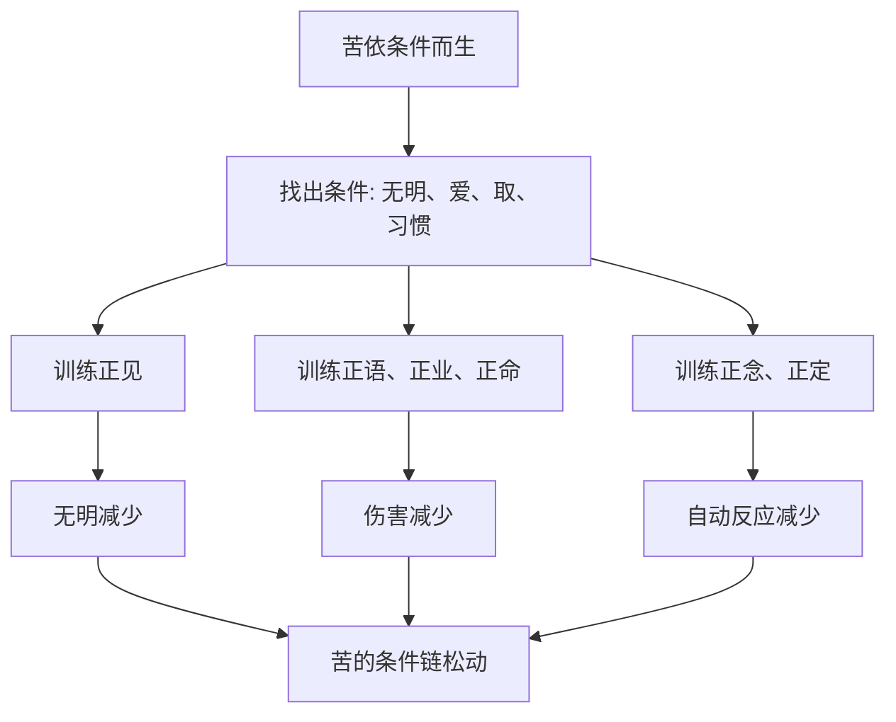

## 佛学思维筑基课: 公理06: 苦可修正与解脱可能

### 作者
digoal

### 日期
2026-05-18

### 标签
佛学 , 解脱 , 灭谛 , 道谛 , 八正道 , 修行 , 可修正 , 缘起 , 正念 , 改变

----

## 背景

> 面向对象: 高中生到普通读者  
> 核心问题: 如果佛学看见无常、无我和苦, 为什么它不是绝望哲学?  
> 先说结论: 可修正公理说, 既然苦依条件而生, 就可以通过改变条件而减少。修行的意义正在于训练认知、行为和注意力, 让苦的条件链逐步失去燃料。

## 一张图先看懂

## 求真讲法

### 它到底说了什么

佛学不是只说“有苦”, 还说“苦可以止息”。这条公理来自缘起: 如果某个结果依赖条件, 那么减少或转化关键条件, 结果就会改变。

因此, 修行不是向外求神秘拯救, 而是改变身口意三方面的因缘: 看法更准确, 行为更少伤害, 注意力更稳定, 欲望更少盲目。

### 它是怎么来的

四圣谛中的灭谛和道谛就是这条公理的展开。灭谛说苦的止息可能; 道谛说止息不是空想, 而有方法, 经典表达为八正道。

如果没有“可修正”这条公理, 前面的无常、无我、苦都会变成冷冰冰的诊断。有了它, 佛学才成为实践系统。

### 它依赖哪些假设

| 假设 | 说明 |
|---|---|
| 苦依条件生 | 不是命定实体 |
| 关键条件可识别 | 无明、贪爱、执取、恶习可被看见 |
| 人能训练 | 注意力、语言、行为和理解能被塑造 |
| 改变需要路径 | 不能只靠一句“放下” |

### 常见误解

误解一: 修行就是忍耐。错。忍耐只是可能的阶段, 核心是理解和改变苦因。

误解二: 解脱就是逃避生活。错。至少在实际训练层面, 解脱意味着少被贪嗔痴驱动, 更清醒地生活。

误解三: 既然可修正, 就应该立刻不痛苦。错。条件链长期形成, 也需要长期训练。

## 求存讲法

### 它有什么用

它给人一种不虚假的希望: 不是“只要想开就好”, 而是“找到条件, 逐步训练, 结果会变”。

### 它怎么迁移到熟悉领域

坏情绪不是只能压住。可以训练睡眠、运动、表达、觉察、求助、减少刺激源。坏习惯不是人格缺陷, 是提示系统需要重设条件。

### 它的适用范围和边界

可修正不等于全能控制。有些疾病、创伤、社会条件需要专业支持和外部资源。佛学训练可以参与改变条件, 但不能替代所有现实手段。

### 正例: 怎么用它提升能力

一个人容易冲动发火。他不再只说“我脾气差”, 而是记录触发条件, 学会身体放松, 发消息前等待十分钟, 练习正语。几个月后, 争吵频率下降。

### 反例: 前提不成立会怎样

若一个人相信“我生来如此, 永远改不了”, 他就不会观察触发条件, 也不会训练新反应。失败点在于否定可修正公理, 把缘起结果当成固定命运。

## 思考

真正的自由不是想要什么就得到什么, 而是在欲望、恐惧、愤怒升起时, 不再被它们完全拖走。可修正公理给出的自由, 是训练出来的自由。

## 最后记住

1. 苦可修正来自缘起: 条件变, 苦变。
2. 修行不是口号, 而是认知、伦理、注意力的系统训练。
3. 可修正不是全能控制, 仍要尊重现实条件。
4. 没有这条公理, 佛学就只剩诊断, 没有道路。

## 参考资料

- SN 56.11, *Setting in Motion the Wheel of the Dhamma*: https://dhammatalks.net/suttacentral/sc2016/sc/en/sn56.11.html
- Encyclopaedia Britannica, “Eightfold Path”: https://www.britannica.com/topic/Eightfold-Path
- Encyclopaedia Britannica, “Four Noble Truths”: https://www.britannica.com/topic/Four-Noble-Truths
  
#### [PostgreSQL 解决方案集合](../201706/20170601_02.md "40cff096e9ed7122c512b35d8561d9c8")
  
  
#### [德哥 / digoal's Github - 公益是一辈子的事.](https://github.com/digoal/blog/blob/master/README.md "22709685feb7cab07d30f30387f0a9ae")
  
  
#### [About 德哥](https://github.com/digoal/blog/blob/master/me/readme.md "a37735981e7704886ffd590565582dd0")
  
  

  
