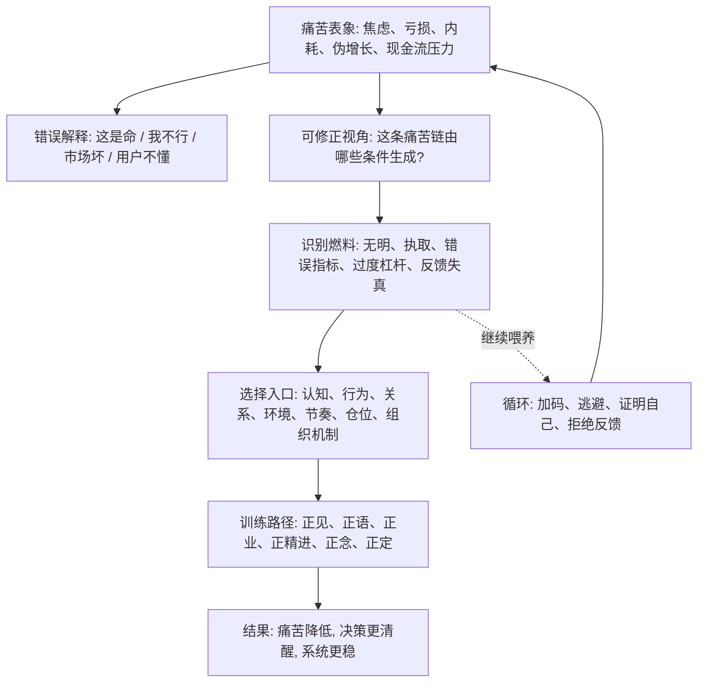

## 佛学思维筑基课: 苦可修正与解脱可能: 把痛苦从命运改写成条件工程

### 作者
digoal

### 日期
2026-05-18

### 标签
苦可修正 , 解脱可能 , 条件工程 , 灭谛 , 道谛 , 训练路径 , 复盘 , 止损 , 创业修正 , 投资纪律

----

## 背景

> 面向对象: 大学生、产品经理、运营经理、有投资需求的人  
> 核心问题: 表面世界变化太快, 人很容易在焦虑、亏损、失败、内耗里得出一个结论: “这就是我的命”“市场就是这样”“创业只能赌”“投资亏了只能扛”。如果只看痛苦表象, 就会把可修正的问题误认为不可改变的命运。  
> 先说结论: 苦可修正, 因为苦不是凭空出现的实体, 而是由认知、欲望、行为、环境、资源和反馈共同生成的条件链。解脱不是逃离现实, 而是看清条件、减少错误燃料、训练新的反应方式, 让痛苦不再自动复制。

说明: 佛学里的“灭谛”和“道谛”说明: 苦的原因可以止息, 也存在通向止息的路径。本文把它抽象成一条跨生活、产品、运营、创业、投资的底层公理: 凡是依条件生成的问题, 都有可能通过改变条件而被削弱、转化或终止。

## 一张图先看懂



## 求真讲法

### 它到底说了什么

“苦可修正与解脱可能”不是说所有痛苦都能立刻消失, 也不是说人只要想开就能解决问题。

它真正说的是:

> 如果痛苦依条件而生, 那么痛苦就不是铁板一块。改变关键条件, 痛苦的强度、频率、持续时间和复制能力就可能改变。

这条公理的核心是把问题从“我被痛苦吞没”改写成“我能不能识别并改变痛苦的生成条件”。

| 原始反应 | 可修正视角 |
|---|---|
| 我焦虑, 所以我不行 | 焦虑由目标过载、比较系统、睡眠、反馈缺失共同生成 |
| 产品失败, 所以团队差 | 失败可能来自需求假设、渠道、交互、价格、组织协作 |
| 运营数据差, 所以继续加预算 | 数据差可能说明用户质量、留存、毛利和渠道条件不成立 |
| 创业痛苦, 所以只能硬扛 | 痛苦可能来自扩张早于验证、现金流节奏错、组织成本过高 |
| 投资亏损, 所以必须回本 | 亏损可能来自估值、仓位、周期、基本面判断和执取回本 |

### 它是怎么来的

从前面几条底层公理可以推出这条:

```text
缘起: 痛苦依条件生成
无常: 条件会变化, 状态不会永久固定
无我: 人和组织不是固定本质, 反应方式可以被训练
苦的机制: 执取、误判、资源约束会制造不满足和失控
  ↓
结论: 如果识别并改变关键条件, 苦可以被削弱或止息
```

佛学用四圣谛表达这套逻辑:

| 步骤 | 不是在说 | 真正在说 |
|---|---|---|
| 苦谛 | 人生只有痛苦 | 先承认不满足和失控真实存在 |
| 集谛 | 都怪你有欲望 | 苦有生成条件, 尤其与贪爱、执取、无明有关 |
| 灭谛 | 什么都不要就好了 | 当燃料停止, 苦的循环可以停止 |
| 道谛 | 靠信念祈求改变 | 通过训练认知、行为、伦理、注意力来改变条件 |

这也是“解脱可能”的现实含义: 不是从世界消失, 而是不再被旧的条件链自动拖着走。

### 它依赖哪些假设

第一, 痛苦有条件。它不是一个无法分析的黑箱, 而是由事实、解释、欲望、习惯、关系、资源和环境共同生成。

第二, 至少一部分条件可被改变。外部世界不完全受你控制, 但注意力、投入、边界、节奏、仓位、表达方式、验证方法、组织机制常常可调。

第三, 改变需要训练, 不只是理解。知道“不要执著”和真正减少执著之间, 有持续练习的距离。

第四, 解脱不是一次性事件。对普通生活和商业决策来说, 更现实的表达是: 从自动反应中多一点自由, 从错误循环中少一点复制。

第五, 可修正不等于全能。疾病、贫困、结构性不公、重大创伤、黑天鹅事件不是靠个人修心就能解决, 需要专业、制度和集体层面的条件改变。

### 常见误解

误解一: 苦可修正就是“想开点”。  
不对。想开只是认知层的一小部分。真正的修正还包括行为、环境、关系、资源、系统和反馈。

误解二: 解脱就是逃避现实。  
不对。逃避现实是不看条件; 解脱恰恰是更清醒地看条件, 不再被习惯性反应绑架。

误解三: 放下就是放弃目标。  
不对。放下的是执取和错误燃料, 不是放弃合理目标。你仍然可以学习、创业、投资, 但不必用“必须证明我对”来驱动行动。

误解四: 既然可修正, 痛苦的人就是自己没修好。  
不对。可修正不是责备个人。很多痛苦有外部结构条件, 需要医疗、法律、组织、家庭、社会支持共同介入。

## 求存讲法

### 它有什么用

这条公理最大的用处, 是让人从宿命感里退出来。

| 场景 | 宿命式解释 | 可修正式解释 |
|---|---|---|
| 学习 | 我就是学不会 | 方法、反馈、时间、情绪和基础条件需要调整 |
| 职业 | 我就是不适合表达 | 表达结构、练习场景、反馈频率可以训练 |
| 产品 | 用户不懂我们 | 需求假设、价值表达、交互成本、价格可能错了 |
| 运营 | 不补贴就没增长 | 可能是用户质量、产品价值和渠道模型没跑通 |
| 创业 | 创业就是赌命 | 可以先验证付费、交付、复购、现金流, 再扩张 |
| 投资 | 亏了只能等回本 | 应检查买入理由、估值、仓位和机会成本 |

它不是让你相信“凡事都能成功”, 而是让你问: 哪些条件能改? 哪些条件不能改? 哪些投入还值得? 哪些应该止损?

### 它怎么迁移到熟悉领域

#### 生活

一个人长期焦虑, 可能以为自己“天生脆弱”。可修正视角会拆成:

```text
睡眠不足 + 信息过载 + 目标太多 + 缺少反馈 + 经济压力 + 过度比较
= 焦虑系统持续被喂养
```

修正不一定从“人生意义”开始, 可能从更具体的条件开始: 睡眠、运动、减少噪声、明确主目标、建立反馈节奏、寻求专业支持。

#### 产品

产品失败并不自动说明团队差。它可能说明:

- 用户问题不够痛。
- 替代方案已经足够好。
- 交互成本太高。
- 价值表达不清。
- 定价和支付能力错配。
- 没有持续留存场景。

可修正路径是小成本实验: 改用户分层、改场景、改定价、改交互、砍功能、重新验证需求。  
如果多次实验都证明条件不成立, “放弃这个方向”也是修正, 不是失败。

#### 运营

运营痛苦经常来自被指标绑架。比如新增用户下降, 团队立刻加预算, 但加来的用户不留存。

可修正视角会把指标拆开:

- 新增下降是渠道问题, 还是产品价值问题?
- 留存下降是人群不准, 还是承诺过度?
- 转化低是价格问题, 还是信任问题?
- 毛利恶化是补贴问题, 还是交付成本问题?

运营的解脱, 不是不要指标, 而是不被单一指标牵着做伤害系统的动作。

#### 创业

创业者最需要这条公理。因为创业痛苦很容易被包装成“坚持就是胜利”。

可修正视角会问:

| 维度 | 修正问题 |
|---|---|
| 需求 | 客户是否真的持续付费? |
| 交付 | 单位交付成本是否随规模下降? |
| 获客 | 渠道是否可持续, CAC 是否可承受? |
| 现金流 | 账上现金能否覆盖验证周期? |
| 组织 | 团队规模是否早于业务复杂度? |
| 叙事 | 我是在服务客户, 还是在证明愿景? |

有时解脱不是“继续冲”, 而是砍掉伪需求、缩小团队、回到现金流、停止错误扩张。

#### 投融资

投资里的痛苦最常见于亏损后不愿修正。

可修正视角会建立一张决策表:

```text
买入理由是否还成立?
基本面是否变坏?
估值是否仍然过高?
仓位是否超过承受力?
是否存在更好的机会成本?
我继续持有是因为事实, 还是因为不想认错?
```

投资中的“解脱”不是不亏钱, 而是不让一次亏损绑架后续所有判断。能承认错误、降低仓位、重新评估, 就是在切断痛苦复制。

### 它的适用范围和边界

苦可修正适用于由认知、行为、习惯、关系、组织、资源配置、商业模式、投资纪律造成的问题。它特别适合指导复盘、训练、迭代、止损和重建系统。

但它有边界。

第一, 可修正不等于可完全控制。很多外部条件只能应对, 不能主宰。

第二, 可修正不等于马上见效。长期习惯、组织惯性、债务压力、信任破坏, 都需要时间修复。

第三, 可修正不等于永远坚持。若关键条件长期不成立, 停止投入本身就是修正。

第四, 可修正不等于个人责任万能化。涉及疾病、创伤、法律、结构性不公的问题, 需要专业和制度支持。

### 正例: 怎么用它提升能力

一个运营经理发现活动带来的新增很多, 但 7 日留存很差。过去他可能会继续加预算, 因为新增 KPI 很好看。

可修正视角会这样处理:

1. 承认苦: 增长质量差, 不是庆功时刻。
2. 找集: 新增来自低意向人群, 奖励吸引了薅羊毛用户。
3. 看灭: 如果减少补贴、提高准入、改人群和承诺, 低质量新增会下降。
4. 走道: 做小实验, 分渠道看留存、复购、毛利, 把 KPI 从新增改成有效用户。

结果可能是短期新增下降, 但长期利润和用户质量改善。这就是把痛苦从“数字压力”改造成“系统修正”。

### 反例: 前提不成立会怎样

某创业公司做企业服务, 客户试用很多, 但付费很少。创始人认为“市场教育还不够”, 于是继续融资、招销售、扩大投放。

一年后现金流断裂。失败不是因为不努力, 而是因为他误判了“可修正”的入口:

- 客户试用不是强需求。
- 产品没有进入核心业务流程。
- 预算归属不清, 没有明确买单人。
- 定制成本太高, 无法规模化交付。
- 团队把融资当成修正, 没有修正商业模式。

这里失效的前提是: “只要继续投入, 市场就会被教育出来”。真正的可修正, 必须改变关键条件; 只加资源、不改机制, 只是把痛苦放大。

## 思考

苦可修正带来的真正力量, 是让人不再被两种极端控制:

- 宿命论: 反正改不了。
- 万能论: 只要努力就能改。

更成熟的判断是:

| 问题 | 目的 |
|---|---|
| 这份痛苦由哪些条件生成? | 找到真实机制 |
| 哪些条件我能直接改变? | 找到行动入口 |
| 哪些条件只能间接影响? | 管理预期 |
| 哪些条件无法改变? | 学会接受和止损 |
| 继续投入是在修正机制, 还是在喂养执取? | 区分训练和硬扛 |
| 什么证据出现, 说明我应该停止? | 防止无限加码 |

对个人来说, 这条公理让失败不再等于身份。  
对产品经理来说, 它让失败实验变成学习资产。  
对运营经理来说, 它让指标压力变成系统优化。  
对创业者来说, 它让坚持从情绪口号变成条件验证。  
对投资者来说, 它让止损和调仓成为理性动作, 不是自尊失败。

## 最后记住

1. 苦可修正, 因为苦依条件生成; 改变关键条件, 痛苦循环就可能被削弱。
2. 解脱不是逃避现实, 而是从自动反应、错误执取和重复内耗中获得自由。
3. 可修正不是“想开点”, 而是认知、行为、环境、资源和反馈的系统训练。
4. 停止错误投入也是修正; 不是所有坚持都值得尊敬。
5. 成熟的判断不是“我一定能改变一切”, 而是清楚区分能改、难改、不能改。

## 参考资料

- Encyclopaedia Britannica, “The Four Noble Truths”: https://www.britannica.com/topic/Four-Noble-Truths
- Encyclopaedia Britannica, “Buddhism - The Four Noble Truths”: https://www.britannica.com/topic/Buddhism/The-Four-Noble-Truths
- Encyclopaedia Britannica, “Eightfold Path”: https://www.britannica.com/topic/Eightfold-Path
- SuttaCentral/Dhammatalks, “SN 56.11: Setting in Motion the Wheel of the Dhamma”: https://dhammatalks.net/suttacentral/sc2016/sc/en/sn56.11.html
- Bhikkhu Bodhi, “The Noble Eightfold Path: The Way to the End of Suffering”: https://cdn.britannica.com/primary_source/gutenberg/PGCC_classics/lib/bps/misc/waytoend.html
  
#### [PostgreSQL 解决方案集合](../201706/20170601_02.md "40cff096e9ed7122c512b35d8561d9c8")
  
  
#### [德哥 / digoal's Github - 公益是一辈子的事.](https://github.com/digoal/blog/blob/master/README.md "22709685feb7cab07d30f30387f0a9ae")
  
  
#### [About 德哥](https://github.com/digoal/blog/blob/master/me/readme.md "a37735981e7704886ffd590565582dd0")
  
  

  
