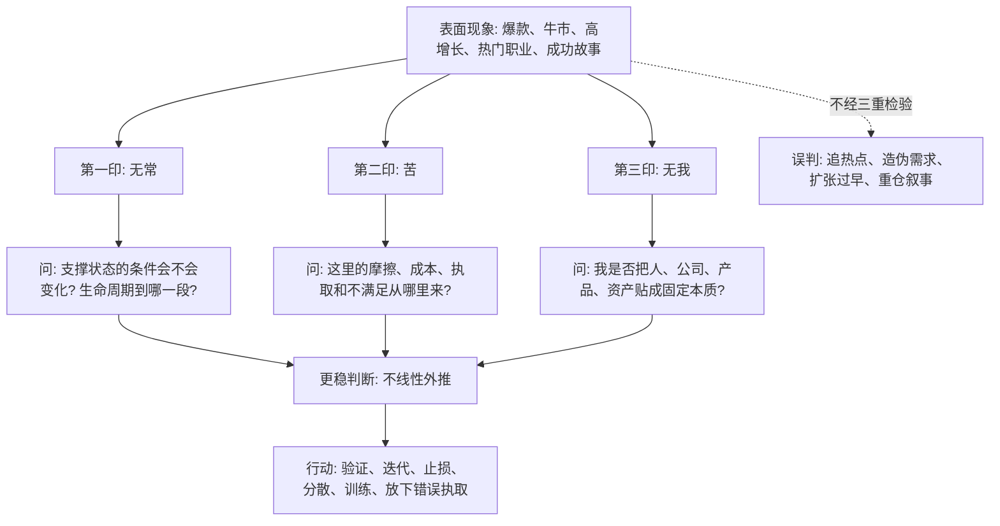

## 佛学思维筑基课: 三法印: 判断真伪和预测未来的三重检验

### 作者
digoal

### 日期
2026-05-18

### 标签
三法印 , 无常 , 苦 , 无我 , 三重检验 , 真实性判断 , 反幻觉 , 产品验证 , 创业风险 , 投资审查

----

## 背景

> 面向对象: 大学生、产品经理、运营经理、有投资需求的人  
> 核心问题: 世界表面变化太快, 热点、故事、增长曲线、融资叙事、股价涨跌不断切换。如果只看表象, 很容易把短期状态当长期规律, 把标签当本质, 把摩擦当偶然。  
> 先说结论: 三法印可以被理解为一套底层真实性检验: 用“无常”检查状态是否会变, 用“苦”检查摩擦和不满足如何生成, 用“无我”检查我们是否把复杂条件误认为固定本质。它不是消极哲学, 而是反表象、反幻觉、反过度外推的判断工具。

说明: 佛学中的三法印通常指“诸行无常、诸法无我、涅槃寂静”; 有些传统也用“无常、苦、无我”作为三相或三法印的教学表达。本文采用面向现实决策的版本: 无常、苦、无我, 用来服务生活、产品、运营、创业和投资判断。

## 一张图先看懂



## 求真讲法

### 它到底说了什么

三法印原本是佛学中判断一种见解是否贴近佛法核心的标记。迁移到现代决策里, 它可以变成三道检查题:

| 法印 | 一句话 | 决策问题 |
|---|---|---|
| 无常 | 由条件维持的状态都会变化 | 我是不是把当下状态线性外推了? |
| 苦 | 执著无常、不可控之物会产生不满足和摩擦 | 这里的痛苦、成本、失控从哪里生成? |
| 无我 | 复合对象没有固定、独立、永恒本质 | 我是不是把标签、品牌、身份、故事当成本质? |

如果一个判断同时违背这三点, 它大概率很危险。

例如“这家公司过去十年都优秀, 所以任何价格都值得买”:

- 违背无常: 行业、竞争、利率、管理层、增长阶段都会变化。
- 忽略苦: 高估值、拥挤交易、增长压力会制造回报摩擦。
- 违背无我: 把“好公司”当成脱离价格和条件的固定本质。

### 它是怎么来的

三法印可以从“缘起”这条总公理展开:

```text
缘起: 现象依条件而生
  ↓
无常: 条件会变, 所以现象不会永久固定
  ↓
苦: 若执著变化之物必须按我期待存在, 就会产生不满足
  ↓
无我: 既然现象依条件而成, 就没有独立、永恒、完全主宰的固定本质
```

这套推理不是为了制造悲观情绪, 而是为了拆掉三个常见幻觉:

| 幻觉 | 三法印如何拆解 |
|---|---|
| 永久幻觉 | 无常提醒你: 状态由条件维持, 条件会变 |
| 满足幻觉 | 苦提醒你: 执著不可控对象会制造摩擦 |
| 本质幻觉 | 无我提醒你: 人、组织、产品、资产都是复合过程 |

### 它依赖哪些假设

第一, 现实对象大多是复合过程。人、产品、公司、市场价格、组织能力都不是单一实体, 而是由多重条件暂时组合出来的。

第二, 条件会变化。技术替代、竞争进入、用户疲劳、利率变化、组织老化、个人精力波动都会改变结果。

第三, 人类会执著和过度外推。我们会把上涨看成会继续上涨, 把成功者看成天生成功, 把当前痛苦看成永远痛苦。

第四, 观察这些规律能改善判断, 但不能消除不确定性。三法印不是预测水晶球, 而是减少幻觉的过滤器。

### 常见误解

误解一: 三法印就是悲观世界观。  
不对。它让你承认变化、摩擦和非固定本质, 目的是更清醒地行动。

误解二: 无常意味着不要长期投入。  
不对。真正的长期投入必须理解变化, 保持迭代能力和安全余地。

误解三: 苦意味着有欲望就错。  
不对。问题不是目标本身, 而是把目标变成失去边界、证据和成本意识的执取。

误解四: 无我意味着没有责任。  
不对。无我否定固定本质, 不否定行为后果、法律责任和组织责任。

## 求存讲法

### 它有什么用

三法印最大的用处, 是把复杂判断变成三重审查。

| 场景 | 无常问法 | 苦问法 | 无我问法 |
|---|---|---|---|
| 学习 | 当前成绩靠什么维持? | 焦虑来自目标还是比较? | 我是否把一次失败当成身份? |
| 产品 | 增长条件会不会衰减? | 用户摩擦和团队返工从哪来? | 我是否把功能当成产品本质? |
| 运营 | 玩法是否进入疲劳期? | 指标压力是否制造低质增长? | 我是否把一次爆款当成固定能力? |
| 创业 | 机会窗口是否会关闭? | 愿景是否压过现金流? | 我是否把创始人光环当成公司能力? |
| 投资 | 增长、利率、估值是否会反转? | 回本执取是否放大亏损? | 我是否把好公司当成永远好资产? |

它不是替你做决定, 而是逼你把决定背后的幻觉拿出来检查。

### 它怎么迁移到熟悉领域

#### 生活

一个大学生考研失败, 可能立刻得出结论: “我不行。”

三法印会这样拆:

- 无常: 失败是当前条件下的结果, 不是永久状态。
- 苦: 痛苦来自目标落空, 也来自把失败解释成身份崩塌。
- 无我: “我不行”是标签, 不是结构分析; 方法、时间、反馈、心理状态都能拆。

于是问题从“我是不是废了”变成“哪些条件要调整, 哪些目标要重设, 哪些执取要放下”。

#### 产品

一个功能上线后短期数据好, 团队准备全面推广。

三法印会问:

```text
无常: 这个数据是否来自新鲜感、渠道红利或补贴?
苦: 用户后续是否出现复杂度、学习成本、维护成本?
无我: 我们是否把一个功能的短期表现当成产品长期价值?
```

这样可以避免“短期兴奋 -> 大规模投入 -> 长期留存差”的常见错误。

#### 运营

一个裂变活动第一次很成功。团队以为找到了增长公式。

三法印会提醒:

- 无常: 用户新鲜感会衰减, 平台规则会变化, 模仿者会进入。
- 苦: 高补贴可能带来低质量用户、毛利下降和品牌损伤。
- 无我: 成功不是活动模板的固定本质, 而是当时用户、渠道、奖励、竞争条件的组合。

运营经理因此会从“复制活动”升级到“追踪条件”。

#### 创业

一个赛道很热, 投资人愿意听故事。创业者容易把“融资兴趣”误认为“客户需求”。

三法印会拆:

| 法印 | 创业检查 |
|---|---|
| 无常 | 资本热度、政策窗口、渠道成本会不会变化? |
| 苦 | 客户是否真的为痛点付费, 还是只是试用热情? |
| 无我 | 团队是否把“我们是风口公司”当成真实组织能力? |

创业不是拒绝趋势, 而是不要把趋势当成商业模式。

#### 投融资

三法印对投资尤其有用, 因为市场最会制造幻觉。

```text
无常检查: 当前利润、估值、流动性、情绪是否可持续?
苦检查: 我是否因贪婪、恐惧、回本执取而放大仓位?
无我检查: 我是否把公司标签、行业叙事、历史业绩当成固定本质?
```

一个更清醒的投资结论不是“这家公司好不好”, 而是:

```text
在当前价格、周期、竞争、现金流、管理层和仓位条件下,
它是否仍然提供足够风险补偿?
```

### 它的适用范围和边界

三法印适合处理复杂现实判断: 个人选择、学习训练、产品验证、运营增长、创业机会、投资风险。

但它有边界。

第一, 三法印不是具体行业知识的替代品。投资仍要读财报, 产品仍要看用户, 创业仍要算现金流。

第二, 三法印不是让人怀疑一切。它反对幻觉, 不反对行动。

第三, 三法印不能被用来压迫别人。“无常”“无我”“苦”不能成为要求别人忍受剥削、疾病或不公的理由。

第四, 三法印不能消除随机性。它提高判断质量, 但不保证每次预测都正确。

### 正例: 怎么用它提升能力

假设一个运营经理看到某渠道新增用户成本很低, 准备扩大预算。

他用三法印做检查:

1. 无常: 这个低成本是否来自平台临时红利? 竞争进入后成本会不会上升?
2. 苦: 这些用户留存、转化、毛利怎样? 是否制造客服、退款和品牌压力?
3. 无我: 我是否把“这个渠道好”当成固定本质, 而没看人群、素材、承诺和产品匹配?

检查后他发现: 新用户便宜, 但 7 日留存低, 客诉高, 毛利差。于是他没有盲目扩预算, 而是先缩小人群、改承诺、分层看长期价值。短期新增变少, 但有效增长更稳。

### 反例: 前提不成立会怎样

某投资者在热门行业高点买入一家“龙头公司”。他的理由是: 龙头公司、有技术壁垒、行业空间大、过去涨得好。

他没有做三法印检查:

- 忽略无常: 行业增速已经放缓, 利率上行, 估值体系切换。
- 忽略苦: 高估值需要持续超预期, 一旦增长低于预期, 回撤很大。
- 忽略无我: “龙头”不是永恒本质; 管理层、竞争、现金流、价格都会改变回报。

后来股价大跌。他的问题不是看错了行业长期方向, 而是把标签当判断, 把趋势当永恒, 把价格风险当短期波动。

## 思考

三法印可以变成一个每天都能用的判断清单:

| 检查 | 问题 |
|---|---|
| 无常 | 这个状态靠什么条件维持? 哪个条件最可能变化? |
| 苦 | 我或系统的摩擦在哪里? 哪些执取正在放大成本? |
| 无我 | 我是否把标签、身份、品牌、历史业绩当成固定本质? |
| 行动 | 哪个条件能验证? 哪个风险要限制? 哪个执取要放下? |

它也能训练一种更成熟的预测方式:

```text
不是预测一个绝对结论:
  这个行业一定赢 / 这个人一定失败 / 这只股票一定涨

而是预测条件链:
  如果关键条件继续成立, 结果更可能延续;
  如果关键条件反转, 原判断必须更新。
```

三法印不是让人远离生活、商业和投资, 而是让人少被表象驱动。它要求你在行动前多问三句话:

1. 它会不会变?
2. 它的摩擦在哪里?
3. 我是不是把过程当成本质?

## 最后记住

1. 三法印是三重检验: 无常检验线性外推, 苦检验摩擦和执取, 无我检验固定本质幻觉。
2. 表面越热闹, 越要用三法印拆条件、看成本、破标签。
3. 它不是消极哲学, 而是现实判断的防错机制。
4. 产品、运营、创业、投资里的大错, 常来自忽略变化、成本和结构。
5. 真正的预测不是猜口号, 而是追踪关键条件是否延续或反转。

## 参考资料

- Encyclopaedia Britannica, “Anicca”: https://www.britannica.com/topic/anicca
- Encyclopaedia Britannica, “Anatta”: https://www.britannica.com/topic/anatta
- Encyclopaedia Britannica, “Dukkha”: https://www.britannica.com/topic/dukkha
- Access to Insight, “The Three Basic Facts of Existence”: https://www.accesstoinsight.org/lib/authors/various/wheel186.html
- SuttaCentral, Buddhist texts and translations: https://suttacentral.net/
  
#### [PostgreSQL 解决方案集合](../201706/20170601_02.md "40cff096e9ed7122c512b35d8561d9c8")
  
  
#### [德哥 / digoal's Github - 公益是一辈子的事.](https://github.com/digoal/blog/blob/master/README.md "22709685feb7cab07d30f30387f0a9ae")
  
  
#### [About 德哥](https://github.com/digoal/blog/blob/master/me/readme.md "a37735981e7704886ffd590565582dd0")
  
  

  
