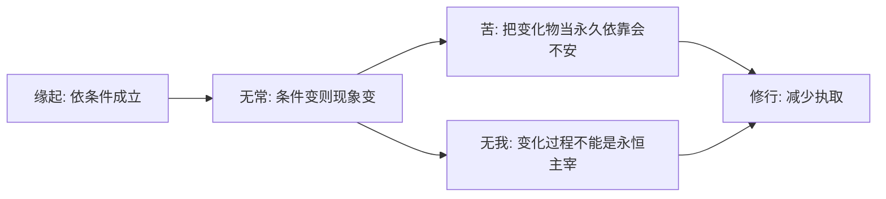

## 佛学思维筑基课: 上层定律01: 三法印

### 作者
digoal

### 日期
2026-05-18

### 标签
佛学 , 三法印 , 无常 , 苦 , 无我 , 缘起 , 法印 , 正见 , 执著 , 修行

----

## 背景

> 面向对象: 高中生到普通读者  
> 核心问题: 为什么“无常、苦、无我”能成为判断佛法核心的印记?  
> 先说结论: 三法印是由缘起、无常、无我和苦的机制展开出的世界观: 凡依条件而成的现象都无常; 对无常现象执著会苦; 在这些过程中找不到永恒主宰的实体我。

## 一张图先看懂

## 求真讲法

### 它到底说了什么

三法印通常指诸行无常、诸受/诸行是苦、诸法无我。它们不是三句孤立口号, 而是一条推理链: 因为诸法依条件成立, 所以会变化; 因为变化而不能被绝对占有, 执著它就会不安; 因为它们变化且不受绝对主宰, 所以不能被认作永恒实体我。

### 它是怎么来的

三法印可视为佛学对经验世界的三个检查点。一个教法如果把有为法说成永恒不变, 把执著说成最终安稳, 把五蕴说成绝对自我, 就偏离了佛学的核心诊断。

它们的底层支撑是公理02 缘起、公理03 无常、公理04 无我、公理05 苦的机制。

### 它依赖哪些假设

| 前提 | 推出 |
|---|---|
| 现象依条件生灭 | 诸行无常 |
| 人想从变化物中获得绝对安全 | 执著导致苦 |
| 身心过程无绝对主宰 | 诸法无我 |
| 人可观察这些性质 | 三法印能成为修行检查工具 |

### 常见误解

误解一: 三法印是悲观三连。错。它们是解除错误期待的诊断工具。

误解二: 苦印否定一切快乐。错。它指出有条件的快乐不能提供永久安全。

误解三: 无我印否定伦理责任。错。伦理责任依缘起因果成立, 不依赖永恒实体我。

## 求存讲法

### 它有什么用

三法印像三把尺子: 看一个欲望、关系、身份、目标时, 问它是否无常, 是否可被绝对占有, 是否能作为永恒自我。这样可以减少盲目抓取。

### 它怎么迁移到熟悉领域

职业身份无常, 所以要持续学习; 成就不能作为永恒自我, 所以不必用一次失败否定整个人; 快乐会变, 所以要珍惜但不占有。

### 它的适用范围和边界

三法印适合做存在与修行层面的分析, 不是用来取消日常承诺。合同、责任、亲情、社会角色仍有现实效力。

### 正例: 怎么用它提升能力

一个人升职后用三法印提醒自己: 职位无常, 不能保证永久安全; 若把职位当“我”的本质, 就会害怕失去; 更稳妥的是把它当服务和训练的平台。

### 反例: 前提不成立会怎样

若把三法印误读成“反正一切都苦, 什么都别做”, 就落入虚无。失败点在于忽略了佛学还有道谛: 看见三法印是为了正确行动, 不是放弃行动。

## 思考

三法印让人问一个尖锐问题: 我现在抓住的东西, 是不是正在变化? 如果它正在变化, 我为什么要求它承担永恒安全感?

## 最后记住

1. 三法印是无常、苦、无我的综合判断。
2. 它们从缘起推导出来。
3. 它们不是悲观, 而是减少错认。
4. 看见三法印后, 修行方向是少执取、多清醒。

## 参考资料

- Encyclopaedia Britannica, “Buddhism”: https://www.britannica.com/topic/Buddhism
- SN 22.59, *The Five / Anattalakkhana Sutta*: https://www.dhammatalks.org/suttas/SN/SN22_59.html
- 《杂阿含经》, CBETA 电子佛典集成: https://tripitaka.cbeta.org/T02n0099_012
  
#### [PostgreSQL 解决方案集合](../201706/20170601_02.md "40cff096e9ed7122c512b35d8561d9c8")
  
  
#### [德哥 / digoal's Github - 公益是一辈子的事.](https://github.com/digoal/blog/blob/master/README.md "22709685feb7cab07d30f30387f0a9ae")
  
  
#### [About 德哥](https://github.com/digoal/blog/blob/master/me/readme.md "a37735981e7704886ffd590565582dd0")
  
  

  
