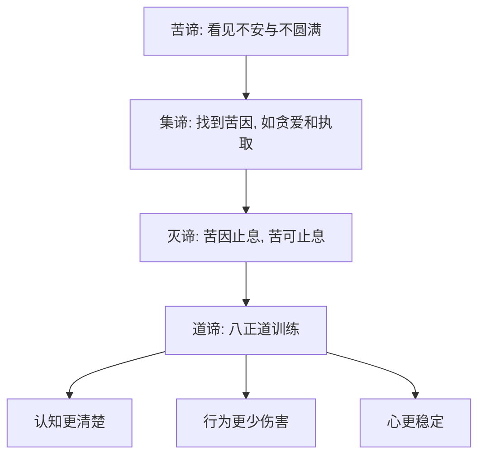

## 佛学思维筑基课: 上层定律02: 四圣谛

### 作者
digoal

### 日期
2026-05-18

### 标签
佛学 , 四圣谛 , 苦谛 , 集谛 , 灭谛 , 道谛 , 八正道 , 诊断模型 , 贪爱 , 解脱

----

## 背景

> 面向对象: 高中生到普通读者  
> 核心问题: 四圣谛为什么被称为佛学最基本的诊断框架?  
> 先说结论: 四圣谛把人生问题组织成“症状、病因、康复可能、治疗路径”: 苦、集、灭、道。它不是悲观论, 而是一套解苦方法论。

## 一张图先看懂

## 求真讲法

### 它到底说了什么

四圣谛是: 苦谛、集谛、灭谛、道谛。苦谛承认生命中有不安、失控和不圆满; 集谛指出苦的生成条件, 尤其是贪爱和执取; 灭谛指出这些条件可以止息; 道谛指出通往止息的训练路径。

### 它是怎么来的

《转法轮经》(SN 56.11) 把四圣谛作为佛陀初转法轮的核心内容。它与医学诊断结构很像: 先承认病, 再找病因, 再说明康复可能, 最后给出治疗方案。

底层公理上, 四圣谛依赖苦的机制公理和可修正公理: 若苦没有机制, 就无从诊断; 若苦不可修正, 就没有道谛。

### 它依赖哪些假设

| 四谛 | 依赖的假设 |
|---|---|
| 苦谛 | 苦可被诚实观察 |
| 集谛 | 苦有条件, 不是纯随机 |
| 灭谛 | 条件消失时结果可消失 |
| 道谛 | 人能通过训练改变条件 |

### 常见误解

误解一: 四圣谛说人生全是苦。错。它说有条件的存在带有不安稳性, 并给出解决路径。

误解二: 集谛说欲望都坏。错。关键是贪爱和执取, 不是所有愿望和行动。

误解三: 灭谛就是死亡。错。灭指苦因止息, 不是简单消灭生命。

## 求存讲法

### 它有什么用

四圣谛让人处理问题时不跳步。很多人一痛苦就找方法, 却没看清苦是什么、原因是什么。四圣谛要求先诊断, 再行动。

### 它怎么迁移到熟悉领域

学习焦虑可以按四圣谛拆解: 苦是焦虑和逃避; 集是目标过大、比较、睡眠差、反馈少; 灭是焦虑可降低; 道是拆小任务、稳定作息、练习复盘。

### 它的适用范围和边界

四圣谛不是万能心理治疗公式。严重心理疾病、创伤、经济困境、暴力伤害需要专业和社会支持。四圣谛提供的是结构化理解, 不是替代所有手段。

### 正例: 怎么用它提升能力

一个团队项目延期。用四圣谛看: 苦是延期和焦虑; 集是需求不清、责任不明、反馈太晚; 灭是流程可改善; 道是明确范围、每日同步、提前验收。

### 反例: 前提不成立会怎样

如果团队只喊“大家努力一点”, 没有分析集谛, 下次还会延期。失败点在于跳过病因, 把治疗误作鼓劲。

## 思考

四圣谛训练的是一种不逃避的理性: 先承认问题, 再找条件, 再确认可能性, 最后选择路径。它既不美化痛苦, 也不崇拜痛苦。

## 最后记住

1. 四圣谛是苦、集、灭、道。
2. 它是诊断模型, 不是悲观口号。
3. 集谛找条件, 道谛改条件。
4. 没有四圣谛, 佛学容易变成零散修辞。

## 参考资料

- SN 56.11, *Setting in Motion the Wheel of the Dhamma*: https://dhammatalks.net/suttacentral/sc2016/sc/en/sn56.11.html
- Encyclopaedia Britannica, “Four Noble Truths”: https://www.britannica.com/topic/Four-Noble-Truths
- Encyclopaedia Britannica, “Buddhism - The Four Noble Truths”: https://www.britannica.com/topic/Buddhism/The-Four-Noble-Truths
  
#### [PostgreSQL 解决方案集合](../201706/20170601_02.md "40cff096e9ed7122c512b35d8561d9c8")
  
  
#### [德哥 / digoal's Github - 公益是一辈子的事.](https://github.com/digoal/blog/blob/master/README.md "22709685feb7cab07d30f30387f0a9ae")
  
  
#### [About 德哥](https://github.com/digoal/blog/blob/master/me/readme.md "a37735981e7704886ffd590565582dd0")
  
  

  
