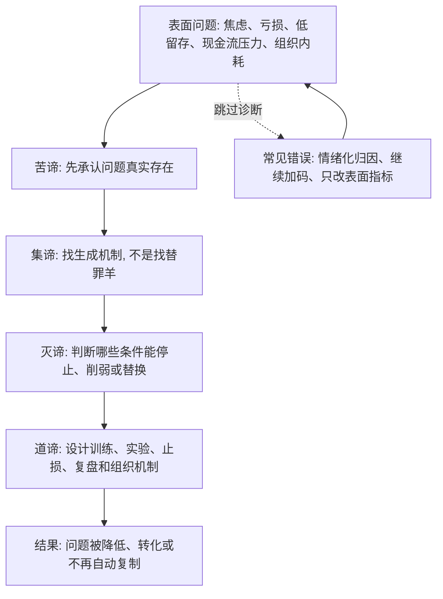

## 佛学思维筑基课: 四圣谛: 把混乱问题变成可诊断、可修正、可行动的路径

### 作者
digoal

### 日期
2026-05-18

### 标签
四圣谛 , 苦谛 , 集谛 , 灭谛 , 道谛 , 问题诊断 , 溯因分析 , 止损路径 , 产品复盘 , 创业现金流

----

## 背景

> 面向对象: 大学生、产品经理、运营经理、有投资需求的人  
> 核心问题: 世界表面变化太快, 人们看到焦虑、亏损、增长停滞、创业失败、用户流失时, 常常只停留在情绪和归因: “我不行”“市场坏”“用户不懂”“再坚持一下”。这样无法判断真伪, 更无法预测未来。  
> 先说结论: 四圣谛可以被理解为一套底层问题诊断框架: 苦谛让你承认问题, 集谛让你找到生成机制, 灭谛让你判断问题能否被停止或削弱, 道谛让你设计训练和行动路径。它不是悲观哲学, 而是把痛苦从混乱感受转化为可处理系统。

说明: 佛学中的四圣谛是苦、集、灭、道。传统上它说明苦的存在、苦的原因、苦的止息和通向止息的道路。本文把它抽象成跨生活、产品、运营、创业、投资的“诊断-溯因-止损-路径”模型。

## 一张图先看懂



## 求真讲法

### 它到底说了什么

四圣谛不是说“人生很苦, 所以算了”。它更像一套医生看病的流程:

| 四圣谛 | 医学类比 | 现代决策语言 |
|---|---|---|
| 苦谛 | 识别症状 | 问题真实存在, 不要粉饰 |
| 集谛 | 查找病因 | 问题由哪些条件生成 |
| 灭谛 | 判断能否康复 | 哪些条件停止后, 问题会降低或消失 |
| 道谛 | 制定治疗方案 | 用训练、实验、制度和行动改变条件 |

这套框架的厉害之处在于: 它不允许你只停留在情绪, 也不允许你跳到方案。

很多现实错误, 都来自跳步:

- 跳过苦谛: 明明用户流失, 还说“数据波动而已”。
- 跳过集谛: 不查原因, 直接怪团队不努力。
- 跳过灭谛: 不判断问题能否止息, 盲目继续投入。
- 跳过道谛: 知道原因, 但没有训练、机制和行动路径。

### 它是怎么来的

四圣谛建立在前面的底层公理上:

```text
缘起: 问题依条件生成
无常: 条件会变, 问题不必永久存在
无我: 人和组织不是固定本质, 反应方式可训练
苦的机制: 执取、误判、资源错配会制造不满足
苦可修正: 改变关键条件, 痛苦循环可以被削弱
  ↓
四圣谛: 承认问题 -> 找原因 -> 看止息可能 -> 走修正路径
```

它本质上是一套“反逃避、反甩锅、反盲动”的框架。

```text
不是: 出问题了 -> 找个解释 -> 继续原动作
而是: 出问题了 -> 承认症状 -> 找条件链 -> 找可停止条件 -> 建立路径
```

### 它依赖哪些假设

第一, 问题是真实反馈。痛苦、亏损、低留存、现金流紧张、团队内耗都不是只靠口号能消失的信号。

第二, 问题有生成机制。它不是凭空出现, 也不应简单归因于某个人“差”或“懒”。

第三, 不是所有问题都能完全解决, 但很多问题能被削弱、转化、隔离或停止复制。

第四, 修正需要路径。知道原因还不够, 还要把改变落实到行为、指标、组织机制、训练节奏和风险控制上。

第五, 路径必须接受反馈。道谛不是一次性方案, 而是持续训练和校正。

### 常见误解

误解一: 四圣谛是悲观主义。  
不对。它先承认苦, 是为了停止自欺; 它同时讲灭和道, 说明改变可能。

误解二: 集谛就是找一个原因。  
不对。集谛更接近找条件链: 认知、欲望、行为、资源、环境、反馈如何共同生成问题。

误解三: 灭谛就是把问题彻底清零。  
不一定。现实决策里, 灭可能是降低、隔离、止损、减少复制, 不一定是完全消灭。

误解四: 道谛就是知道道理。  
不对。道是训练路径。没有练习、机制和复盘, 知道道理不会自动改变系统。

## 求存讲法

### 它有什么用

四圣谛能把复杂问题变成四张表。

| 场景 | 苦: 症状 | 集: 机制 | 灭: 可停止条件 | 道: 路径 |
|---|---|---|---|---|
| 学习 | 焦虑、成绩差 | 方法错、反馈少、目标过载 | 减少噪声, 修正方法 | 固定训练、错题复盘、阶段测试 |
| 产品 | 留存低 | 伪需求、交互重、价值不清 | 砍功能、改场景、改人群 | 小实验、访谈、数据分层 |
| 运营 | 新增高但质量差 | 补贴驱动、渠道错配 | 停止低质渠道 | LTV/CAC 复盘、分层投放 |
| 创业 | 现金流紧张 | 扩张早于验证 | 停止烧钱动作 | 验证付费、缩团队、控成本 |
| 投资 | 亏损扩大 | 估值高、仓位重、拒绝认错 | 降仓或退出错误假设 | 买入清单、止损规则、复盘 |

它的价值不是让人冷静一点, 而是让人按顺序处理问题。

### 它怎么迁移到熟悉领域

#### 生活

一个大学生长期焦虑, 如果只说“我压力大”, 问题仍然混乱。

四圣谛会这样拆:

- 苦: 焦虑、睡眠差、效率低、注意力碎片化。
- 集: 同时准备太多目标, 过度比较, 缺少反馈, 作息失控。
- 灭: 减少信息噪声, 聚焦一个主目标, 恢复睡眠, 建立反馈。
- 道: 每周复盘, 固定学习块, 运动, 限制短视频, 必要时寻求专业帮助。

这不是“想开点”, 而是把焦虑变成可处理系统。

#### 产品

一个产品功能上线后使用率低。团队如果直接说“用户不懂”, 就跳过了集谛。

四圣谛会问:

```text
苦: 使用率低, 用户路径中断
集: 入口不明显? 需求不高频? 价值表达不清? 成本大于收益?
灭: 哪个条件改变后, 使用率会提升或我们应停止投入?
道: 访谈、漏斗分析、A/B 实验、砍掉低价值路径
```

产品经理因此不会把方案当尊严, 而会把方案当假设。

#### 运营

运营增长最怕只看“新增”。四圣谛会让运营经理追问:

- 苦: 新增上升, 但留存、复购、毛利下降。
- 集: 活动承诺过度, 渠道人群低质, 补贴吸引短期用户。
- 灭: 停止低质量渠道, 降低补贴依赖, 修改承诺。
- 道: 以有效用户、长期价值、毛利和投诉率作为复盘指标。

这会把运营从“制造数字”拉回“制造有效增长”。

#### 创业

创业公司最常见的痛苦是: 很忙, 很热闹, 但现金流越来越差。

四圣谛会拆:

| 步骤 | 创业问题 |
|---|---|
| 苦 | 现金流紧张, 团队疲惫, 客户试用多但付费少 |
| 集 | 客户痛点不强, 买单人不清, 定制成本高, 获客成本高 |
| 灭 | 停止无效销售, 缩小目标客户, 砍掉高定制需求 |
| 道 | 找强痛点客户, 验证付费, 标准化交付, 以现金流节奏扩张 |

创业不是不能有愿景, 而是愿景必须通过四圣谛接受现实诊断。

#### 投融资

投资亏损后, 人最容易跳过四圣谛:

- 不承认苦: “浮亏不是亏”。
- 不查集: “市场错杀我”。
- 不看灭: “总会涨回来”。
- 不走道: 没有仓位、估值、止损、复盘规则。

四圣谛式投资复盘会问:

```text
苦: 我亏了多少? 仓位是否影响生活和判断?
集: 买入理由是什么? 哪些条件没有兑现? 是估值错、基本面错、周期错, 还是仓位错?
灭: 如果卖出、降仓、对冲、等待, 哪种能停止风险复制?
道: 以后买入前需要哪些清单、价格纪律和反证条件?
```

这不是要求频繁交易, 而是要求长期主义也要有诊断纪律。

### 它的适用范围和边界

四圣谛适合处理可观察、可复盘、可部分修正的问题: 学习、职业、产品、运营、创业、投资、组织管理。

但它有边界。

第一, 四圣谛不是万能模板。它不能替代专业医学、法律、财务审计、行业研究和工程分析。

第二, 不能把所有问题都归因于个人执取。很多痛苦来自制度、疾病、贫困、暴力、市场结构和组织权力。

第三, 不能把“道”简化成一句建议。真正的路径需要资源、时间、约束和反馈。

第四, 不能把“灭”理解为立刻消灭。现实中很多问题只能降低概率、减少损害、切断复制, 而不是完全清零。

### 正例: 怎么用它提升能力

一个创业团队发现销售线索很多, 但成交很少。过去他们会说“销售不够努力”, 然后加招聘和 KPI。

用四圣谛处理:

1. 苦: 线索多但成交少, 销售周期长, 现金流承压。
2. 集: 线索来自泛流量, 目标客户不准; 产品没有打进核心流程; 买单人和使用人分离。
3. 灭: 停止泛流量获客, 聚焦有预算和强痛点的客户; 放弃低价值定制。
4. 道: 重做客户画像, 改销售话术, 做付费试点, 用成交率和回款周期替代线索数。

结果是线索数量下降, 但成交率、回款质量和团队精力改善。问题没有靠口号解决, 而是靠条件修正解决。

### 反例: 前提不成立会怎样

某运营团队发现新增用户下降, 没做诊断, 直接加大补贴。短期新增回升, 但 30 日留存更差, 投诉更多, 毛利转负。

失败原因是四圣谛被跳过:

- 没有认真看苦: 问题不只是新增下降, 还有留存和毛利恶化。
- 没有追集: 真实原因是目标人群错配和产品价值不足。
- 没有判断灭: 补贴并不能停止问题, 只会掩盖问题。
- 没有建立道: 缺少分渠道复盘、用户分层和长期价值指标。

这里失效的前提是: “只要新增恢复, 问题就解决了。”四圣谛提醒我们, 症状缓解不等于机制修正。

## 思考

四圣谛可以变成任何复杂问题的复盘模板:

| 问题 | 对应圣谛 |
|---|---|
| 真实问题是什么? 有没有被粉饰? | 苦 |
| 它由哪些条件生成? 哪些是关键条件? | 集 |
| 哪些条件停止后, 问题会下降? 哪些投入该止损? | 灭 |
| 我们用什么训练、制度、指标和复盘来改变条件? | 道 |

它也能防止三种常见管理错误:

```text
只看症状: 头痛医头, 脚痛医脚
只找罪人: 把系统问题归咎于个人
只喊方案: 没有路径、指标和反馈
```

对个人, 四圣谛让焦虑可拆。  
对产品经理, 四圣谛让失败功能可复盘。  
对运营经理, 四圣谛让数字压力回到增长质量。  
对创业者, 四圣谛让愿景接受现金流和客户验证。  
对投资者, 四圣谛让亏损从自尊问题变成风险管理问题。

## 最后记住

1. 四圣谛不是悲观哲学, 而是问题处理框架: 承认问题、寻找机制、判断止息、建立路径。
2. 苦谛防止自欺, 集谛防止甩锅, 灭谛防止无限加码, 道谛防止空谈道理。
3. 产品、运营、创业、投资中的很多失败, 都是跳过诊断直接行动。
4. 真正的路径必须包含训练、制度、指标和复盘, 不能只是一句建议。
5. 判断未来不是靠情绪喊话, 而是看问题生成条件是否仍在延续。

## 参考资料

- Encyclopaedia Britannica, “The Four Noble Truths”: https://www.britannica.com/topic/Four-Noble-Truths
- Encyclopaedia Britannica, “Buddhism - The Four Noble Truths”: https://www.britannica.com/topic/Buddhism/The-Four-Noble-Truths
- Encyclopaedia Britannica, “Eightfold Path”: https://www.britannica.com/topic/Eightfold-Path
- SuttaCentral/Dhammatalks, “SN 56.11: Setting in Motion the Wheel of the Dhamma”: https://dhammatalks.net/suttacentral/sc2016/sc/en/sn56.11.html
- Access to Insight, “The Four Noble Truths”: https://www.accesstoinsight.org/lib/study/truths.html
  
#### [PostgreSQL 解决方案集合](../201706/20170601_02.md "40cff096e9ed7122c512b35d8561d9c8")
  
  
#### [德哥 / digoal's Github - 公益是一辈子的事.](https://github.com/digoal/blog/blob/master/README.md "22709685feb7cab07d30f30387f0a9ae")
  
  
#### [About 德哥](https://github.com/digoal/blog/blob/master/me/readme.md "a37735981e7704886ffd590565582dd0")
  
  

  
