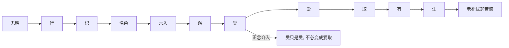

## 佛学思维筑基课: 上层定律03: 十二缘起

### 作者
digoal

### 日期
2026-05-18

### 标签
佛学 , 十二缘起 , 缘起 , 无明 , 爱取 , 生死流转 , 正念 , 条件链 , 苦 , 修行

----

## 背景

> 面向对象: 高中生到普通读者  
> 核心问题: 十二缘起为什么要把苦拆成十二个环节?  
> 先说结论: 十二缘起把苦的形成过程细化为一条条件链: 无明、行、识、名色、六入、触、受、爱、取、有、生、老死。它的价值是指出苦不是一下子发生的, 中间有可观察和可转化的节点。

## 一张图先看懂

## 求真讲法

### 它到底说了什么

十二缘起是缘起公理在苦的生成机制上的细化。不同传统对十二支有不同解释, 这里采用学习用的心理-存在双重读法: 无明导致有倾向性的造作, 造作影响意识和身心结构, 身心通过六根接触世界, 接触生感受, 感受若被无明推动就生贪爱, 贪爱加强执取, 执取形成存在模式, 最后带来生老病死和忧悲苦恼。

### 它是怎么来的

缘起说“此有故彼有”, 十二缘起说明在生命和心理经验中“此”与“彼”如何连续。SN 12.20 等经文把十二支作为特定条件性的表达。

它的底层支撑是缘起公理和苦的机制公理。

### 它依赖哪些假设

| 假设 | 含义 |
|---|---|
| 苦有链条 | 苦不是单点事件 |
| 链条可观察 | 尤其从触、受、爱、取处观察 |
| 链条可中断 | 正念和智慧能阻止受发展成爱取 |
| 无明是深层条件 | 看错现实会推动后续造作 |

### 常见误解

误解一: 十二缘起只是来世轮回图。错。它可以作三世解释, 也可作当下心理链条解释。

误解二: 十二缘起是线性机械链。错。实际经验中多个环节会循环强化。

误解三: 看到感受就要压制感受。错。关键不是消灭受, 而是不让受自动变成爱和取。

## 求存讲法

### 它有什么用

十二缘起提供“慢动作回放”。当你暴怒、贪恋、焦虑时, 它让你看到情绪不是突然爆炸, 而是经过接触、感受、解释、渴求、执取逐步加码。

### 它怎么迁移到熟悉领域

手机成瘾可这样看: 看到通知是触; 感到兴奋或空虚是受; 想继续刷是爱; “我必须马上看”是取; 形成夜里刷手机的人格模式是有。

### 它的适用范围和边界

十二缘起是深层教义, 不能简单化成心理学模型后就认为完全等同。它在佛教传统中还涉及生死流转和解脱问题。

### 正例: 怎么用它提升能力

一个人被批评后先感觉胸口紧。若他能在“受”的阶段停一下, 只是觉察难受, 不立刻进入“他瞧不起我”的执取, 冲突就不会升级。

### 反例: 前提不成立会怎样

若他把难受立刻解释成“对方攻击我”, 再执取“我必须反击”, 就从受滑向爱取和有。失败点在于没有看见链条, 把中间环节压缩成自动反应。

## 思考

十二缘起最实用的节点是“受”。很多人生改变, 不是从宏大信念开始, 而是从一个感受升起时多停一秒开始。

## 最后记住

1. 十二缘起是苦的条件链。
2. 它从无明开始, 在爱和取处加重。
3. 触、受、爱、取是日常最容易观察的节点。
4. 正念不是压制感受, 而是不让感受自动变成执著。

## 参考资料

- SN 12.20, *Conditions*: https://dhammatalks.net/suttacentral/sc2016/sc/en/sn12.20.html
- Encyclopaedia Britannica, “Indian philosophy - Early Buddhist developments”: https://www.britannica.com/topic/Indian-philosophy/Early-Buddhist-developments
- 《杂阿含经》, CBETA 电子佛典集成: https://tripitaka.cbeta.org/T02n0099_012
  
#### [PostgreSQL 解决方案集合](../201706/20170601_02.md "40cff096e9ed7122c512b35d8561d9c8")
  
  
#### [德哥 / digoal's Github - 公益是一辈子的事.](https://github.com/digoal/blog/blob/master/README.md "22709685feb7cab07d30f30387f0a9ae")
  
  
#### [About 德哥](https://github.com/digoal/blog/blob/master/me/readme.md "a37735981e7704886ffd590565582dd0")
  
  

  
