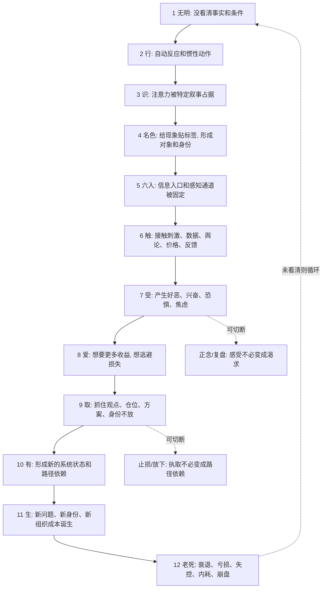

## 佛学思维筑基课: 十二缘起: 看懂问题如何从一个误判滚成一整套困局

### 作者
digoal

### 日期
2026-05-18

### 标签
十二缘起 , 无明 , 受爱取 , 问题生成链 , 错误循环 , 切断执取 , 产品伪需求 , 运营指标 , 创业扩张 , 投资亏损

----

## 背景

> 面向对象: 大学生、产品经理、运营经理、有投资需求的人  
> 核心问题: 世界表面变化太快, 很多失败不是突然发生的。焦虑、亏损、伪增长、创业现金流断裂, 往往是一条链一步步滚出来的。如果只看最后结果, 就无法判断真伪, 也无法预判风险。  
> 先说结论: 十二缘起可以被理解为一套“问题生成链”模型: 无明导致错误反应, 错误反应塑造注意力和身份, 再经过接触、感受、渴求、执取、强化, 最后生成新的困局和损失。真正的能力, 是在链条前段识别误判, 在中段切断执取, 在后段停止继续喂养系统。

说明: 佛学中的十二缘起是缘起思想的经典展开, 常见十二支为: 无明、行、识、名色、六入、触、受、爱、取、有、生、老死。传统语境中它解释苦和轮回如何依条件生起, 也解释苦如何依条件止息。本文把它抽象为生活、产品、运营、创业、投资中的“错误循环生成模型”。

## 一张图先看懂



## 求真讲法

### 它到底说了什么

十二缘起不是一串玄学名词, 而是一条非常细的因果链。它回答的问题是:

> 一个痛苦结果, 是怎样从最初的看不清, 一步步发展成稳定困局的?

十二支可以先用现代语言翻译如下:

| 十二支 | 通俗解释 | 现代迁移 |
|---|---|---|
| 无明 | 看不清真实条件 | 误判需求、周期、风险、自己能力 |
| 行 | 基于误判的惯性反应 | 冲动决策、自动加码、照旧执行 |
| 识 | 注意力和识别框架形成 | 只看支持自己观点的信息 |
| 名色 | 给经验贴标签并形成对象 | “好公司”“风口”“我不行”“用户不懂” |
| 六入 | 感知入口固定 | 信息源、指标、渠道、社群、K 线 |
| 触 | 接触刺激 | 看到涨跌、评论、数据、用户反馈 |
| 受 | 产生感受 | 兴奋、恐惧、焦虑、厌恶、贪婪 |
| 爱 | 渴求或抗拒 | 想抓住收益, 想逃避亏损 |
| 取 | 执取 | 抓住仓位、方案、身份、叙事不放 |
| 有 | 形成存在状态 | 路径依赖、组织扩张、重仓结构 |
| 生 | 新问题出生 | 新债务、新 KPI、新身份、新承诺 |
| 老死 | 走向衰败和苦果 | 亏损、崩盘、内耗、关系破裂 |

这条链的重点不是“每次都机械经历十二步”, 而是提醒你: 大问题通常不是突然来的, 它是很多微小误判不断加固后的结果。

### 它是怎么来的

十二缘起是缘起公理对“苦如何生成”的细化。

```text
缘起总公式:
  此有故彼有, 此生故彼生;
  此无故彼无, 此灭故彼灭。

十二缘起顺观:
  无明 -> 行 -> 识 -> 名色 -> 六入 -> 触 -> 受 -> 爱 -> 取 -> 有 -> 生 -> 老死

十二缘起逆观:
  无明灭则行灭;
  行灭则识灭;
  ...
  生灭则老死忧悲苦恼灭。
```

现代化理解时, 不必把它看成一条只能单向发生的直线。更准确地说, 它像一个会自我强化的循环: 误判制造行动, 行动制造身份和环境, 环境又反过来喂养原来的误判。

例如投资里的亏损循环:

```text
无明: 没看清估值和周期
行: 追高买入
识: 注意力只盯利好消息
名色: 给自己贴上“长期价值投资者”
六入: 只看多头社群和乐观研报
触: 股价下跌、财报低于预期
受: 焦虑和不甘
爱: 渴望回本
取: 拒绝止损, 继续加仓
有: 仓位越来越重, 生活被亏损绑架
生: 新的债务、家庭压力、决策失真出现
老死: 资产大幅缩水, 信心崩塌
```

### 它依赖哪些假设

第一, 痛苦和失败有过程。它们不是一个孤立瞬间, 而是由认知、感受、欲望、行动和环境互相推动。

第二, 人会自动化反应。没有训练时, 感受很容易直接变成渴求或抗拒, 渴求又会变成执取。

第三, 信息入口会塑造世界感。你看什么数据、听什么人、进入什么社群, 会决定你接触什么刺激, 也会影响你的感受和判断。

第四, 执取会形成结构。一次不认错只是心理状态, 但反复不认错会变成仓位结构、组织结构、债务结构、关系结构。

第五, 链条可以被切断。十二缘起不只是解释苦如何生起, 也说明苦可以在不同环节被削弱或止息。

### 常见误解

误解一: 十二缘起只是讲前世今生。  
不完整。传统上确实有轮回解释, 但它也能解释当下经验中苦如何从接触、感受、渴求、执取逐步生成。

误解二: 十二缘起是宿命链。  
不对。它恰恰说明条件链可观察、可改变。能在“受到爱”“爱到取”“取到有”等环节切断。

误解三: 每个问题都必须严格套十二步。  
不对。十二支是教学模型, 不是机械表格。现实中某些环节会压缩、并行或循环强化。

误解四: 只要看懂链条, 问题就会消失。  
不对。看懂只是正见, 还需要训练、制度、止损、复盘和环境调整。

## 求存讲法

### 它有什么用

十二缘起最大的现实价值, 是让你不只看结果, 而是看问题如何一步步生成。

| 场景 | 只看结果 | 十二缘起看法 |
|---|---|---|
| 学习 | 我挂科了 | 从目标误判、拖延惯性、焦虑逃避到反馈缺失的链条 |
| 产品 | 功能失败了 | 从伪需求、方案执取、错误指标到用户流失的链条 |
| 运营 | 活动亏钱了 | 从增长执取、补贴刺激、低质用户到毛利恶化的链条 |
| 创业 | 现金流断了 | 从赛道误判、融资兴奋、扩张执取到成本结构失控 |
| 投资 | 亏损扩大了 | 从估值无明、追涨、回本执取到仓位崩坏 |

它把“为什么突然这样”改成“这条链从哪里开始, 在哪里本可以停下”。

### 它怎么迁移到熟悉领域

#### 生活

一个学生陷入拖延和焦虑, 可以用十二缘起拆:

```text
无明: 低估考试难度, 高估临时突击能力
行: 继续刷手机, 用短期快乐逃避压力
识: 注意力习惯性寻找轻松刺激
名色: 给自己贴上“我就是拖延症”
六入: 信息入口全是娱乐内容
触: 一看到学习任务就接触压力信号
受: 焦虑、厌烦
爱: 想逃离焦虑, 想继续轻松
取: 抓住“晚点再学”的叙事
有: 形成拖延生活结构
生: 新的积压任务和自责出现
老死: 考试失败、信心下降
```

切断点不一定在最后, 而是在前面: 改信息入口、缩小任务、建立反馈、降低启动成本。

#### 产品

产品团队做伪需求, 也有链条:

- 无明: 没看清用户真实场景。
- 行: 听到大客户一句话就排期。
- 识: 团队注意力被“客户说想要”占据。
- 名色: 把它命名为“战略功能”。
- 六入: 只收集支持该功能的反馈。
- 触: 每次高层问进度, 团队压力上升。
- 受: 焦虑, 怕被认为不重视客户。
- 爱: 渴望证明团队响应快。
- 取: 不愿砍功能, 即使数据不好。
- 有: 形成复杂产品架构和维护成本。
- 生: 新 bug、新培训、新客服压力出现。
- 老死: 用户更迷茫, 核心体验下降。

切断点: 在“触 -> 受 -> 爱”之间停下, 把客户声音转化成可验证假设, 而不是立刻变成排期。

#### 运营

运营团队最常见的十二缘起是“指标执取链”:

```text
无明: 以为新增就是增长
行: 加补贴、加推送、加活动
识: 注意力只盯新增曲线
名色: 把活动包装成增长飞轮
六入: 会议只看新增报表
触: 新增下降
受: 恐慌
爱: 想马上把数字拉回来
取: 抓住补贴打法不放
有: 用户结构越来越低质
生: 客诉、退款、毛利压力出现
老死: 增长模型崩坏
```

切断点: 把新增指标换成有效用户、留存、复购、毛利和投诉率, 改变“六入”, 整条链就会变。

#### 创业

创业里的十二缘起常常从“赛道无明”开始:

| 十二支 | 创业表现 |
|---|---|
| 无明 | 把融资热度误认为客户需求 |
| 行 | 快速招人、租办公室、做大系统 |
| 识 | 注意力放在融资、媒体、竞品声量 |
| 名色 | 给自己贴“平台型公司”“行业基础设施” |
| 六入 | 只接触投资人、同行、媒体反馈 |
| 触 | 客户试用多但付费少 |
| 受 | 焦虑和不甘 |
| 爱 | 渴望证明愿景正确 |
| 取 | 继续扩张, 拒绝缩小场景 |
| 有 | 固定成本、组织规模、产品复杂度上升 |
| 生 | 新债务、新 KPI、新管理层级 |
| 老死 | 现金流断裂, 团队解散 |

切断点: 在“客户试用多但付费少”时承认反馈, 回到强痛点、明确买单人、标准化交付和现金流。

#### 投融资

投资里, 十二缘起尤其适合看亏损放大的过程。

```text
无明: 没看清风险收益比
行: 被价格上涨驱动买入
识: 注意力只看利好
名色: 给它贴“伟大公司”“时代机会”
六入: 只看看多研报和多头社群
触: 股价下跌、业绩不及预期
受: 痛苦、不甘、恐惧
爱: 想回本, 想证明自己对
取: 加仓摊平, 不愿承认买入理由变化
有: 仓位过重, 流动性变差
生: 新压力、新借贷、新家庭冲突
老死: 大亏、被迫卖出、长期信心受损
```

切断点: 买入前写清反证条件; 下跌后先检查买入理由, 再决定加仓、持有、降仓或退出。

### 它的适用范围和边界

十二缘起适合分析“问题如何一步步变大”的场景: 情绪失控、产品失败、运营亏损、创业扩张失控、投资亏损扩大、组织内耗。

但它有边界。

第一, 它不是用来事后编故事。每一环都要尽量对应可观察事实: 数据、行为、会议记录、现金流、用户反馈、仓位变化。

第二, 它不是线性机械决定论。现实系统会有并行反馈、外部冲击和随机性。

第三, 它不能替代专业分析。投资要看财报和估值, 产品要看用户研究, 心理问题要看专业支持。

第四, 它不能用来责怪受害者。很多苦来自外部结构性伤害, 不是个人无明就能解释完。

### 正例: 怎么用它提升能力

一个产品经理发现团队陷入“做了很多功能但留存下降”的困局。他用十二缘起复盘:

1. 无明: 没区分真实需求和客户声音。
2. 行: 只要有人提需求就排期。
3. 识: 团队注意力被功能数量占据。
4. 名色: 把复杂度包装成“平台能力”。
5. 六入: 周会只看交付数量, 不看留存和使用深度。
6. 触: 用户反馈“越来越难用”。
7. 受: 团队焦虑。
8. 爱: 想靠更多功能证明价值。
9. 取: 不愿砍旧功能。
10. 有: 产品架构越来越重。
11. 生: 新 bug、新培训、新客服工单。
12. 老死: 留存下降。

他把切断点放在“六入”: 改周会指标, 从交付数量改为核心任务完成率、留存、客服工单和用户访谈。信息入口变了, 后面的感受、渴求和执取也开始改变。

### 反例: 前提不成立会怎样

某投资者亏损后做了复盘, 但只写一句“我太贪了”。这看似反省, 实际没有用十二缘起。

因为它没有拆链条:

- 贪从哪里来?
- 哪些信息入口喂养了贪?
- 哪个标签让他合理化持仓?
- 哪些触发事件本该让他重新评估?
- 他在哪一步从感受变成执取?
- 仓位结构如何把心理问题变成财务风险?

结果下一次牛市, 他仍然重复同样错误。这里失效的前提是: “只要知道自己贪, 下次就不会贪。”十二缘起提醒我们, 不改变信息入口、反证条件、仓位规则和复盘机制, 贪会以新的故事重新出现。

## 思考

十二缘起最有用的地方, 是让你看到“微小的一念”如何变成“庞大的系统后果”。

一个没看清, 会变成一个自动动作。  
一个自动动作, 会塑造注意力。  
注意力会筛选信息。  
信息会触发感受。  
感受会变成渴求。  
渴求会变成执取。  
执取会变成结构。  
结构会生出新问题。

可以用下面这张表做任何重大错误的复盘:

| 复盘问题 | 对应环节 |
|---|---|
| 最初我没看清什么? | 无明 |
| 我做了什么自动反应? | 行 |
| 我的注意力被什么占据? | 识 |
| 我贴了什么标签? | 名色 |
| 我主要接触哪些信息入口? | 六入 |
| 哪些刺激触发了我? | 触 |
| 我产生了什么感受? | 受 |
| 我渴望什么或抗拒什么? | 爱 |
| 我抓住什么不放? | 取 |
| 它形成了什么结构? | 有 |
| 生出了什么新问题? | 生 |
| 最后造成什么衰败或损失? | 老死 |

十二缘起不是为了让人害怕行动, 而是让人知道: 很多灾难在前几环就有机会停下。

## 最后记住

1. 十二缘起是一条问题生成链: 从无明到执取, 再到结构化困局和苦果。
2. 它的价值不是事后解释, 而是帮助你在链条中段切断自动循环。
3. “受 -> 爱 -> 取”是很多生活、产品、创业、投资错误的关键拐点。
4. 改变信息入口、反证条件、指标体系和仓位规则, 等于改变链条上游。
5. 真正的复盘不是“我错了”, 而是说清楚: 我在哪一环错了, 下次在哪一环切断。

## 参考资料

- Encyclopaedia Britannica, “Paticca-samuppada”: https://www.britannica.com/topic/paticca-samuppada
- Encyclopaedia Britannica, “Buddhism - The Four Noble Truths”: https://www.britannica.com/topic/Buddhism/The-Four-Noble-Truths
- Access to Insight, “Dependent Co-arising”: https://www.accesstoinsight.org/tipitaka/sn/sn12/sn12.002.than.html
- SuttaCentral, “SN 12.2 Vibhaṅgasutta”: https://suttacentral.net/sn12.2/en/sujato
- Encyclopedia of Buddhism, “Pratityasamutpada”: https://encyclopediaofbuddhism.org/wiki/Paticca-samuppada
  
#### [PostgreSQL 解决方案集合](../201706/20170601_02.md "40cff096e9ed7122c512b35d8561d9c8")
  
  
#### [德哥 / digoal's Github - 公益是一辈子的事.](https://github.com/digoal/blog/blob/master/README.md "22709685feb7cab07d30f30387f0a9ae")
  
  
#### [About 德哥](https://github.com/digoal/blog/blob/master/me/readme.md "a37735981e7704886ffd590565582dd0")
  
  

  
