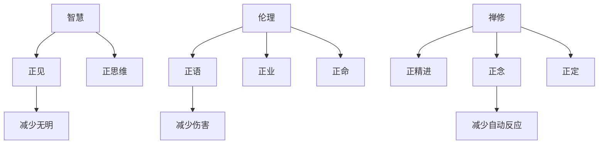

## 佛学思维筑基课: 上层定律04: 八正道

### 作者
digoal

### 日期
2026-05-18

### 标签
佛学 , 八正道 , 正见 , 正语 , 正业 , 正念 , 正定 , 戒定慧 , 道谛 , 修行

----

## 背景

> 面向对象: 高中生到普通读者  
> 核心问题: 如果苦有原因, 具体应该怎么训练?  
> 先说结论: 八正道是佛学的训练系统, 包括正见、正思维、正语、正业、正命、正精进、正念、正定。它把智慧、伦理和禅修合成一条可实践的路径。

## 一张图先看懂

## 求真讲法

### 它到底说了什么

八正道不是八个孤立步骤, 更像八个互相支持的训练维度。正见让人理解四圣谛和缘起; 正思维调整动机; 正语、正业、正命减少外在伤害; 正精进、正念、正定训练心的方向、觉察和稳定。

### 它是怎么来的

在四圣谛中, 第四谛“道谛”具体指向八正道。《转法轮经》把八正道列为通向苦灭的道路。它依赖可修正公理: 如果认知、行为、注意力能够训练, 就需要一套路径。

### 它依赖哪些假设

| 路径部分 | 依赖假设 |
|---|---|
| 正见、正思维 | 错误理解会制造苦, 正确认知能减少苦 |
| 正语、正业、正命 | 行为会反过来塑造心和关系 |
| 正精进、正念、正定 | 注意力和心理习惯可训练 |

### 常见误解

误解一: 八正道是线性通关。错。它们常常同时训练、互相增强。

误解二: 只要打坐就够了。错。没有伦理和正见, 禅定可能服务于执著。

误解三: 正语就是永远说好听话。错。正语要求真实、适时、有益、少伤害, 不是讨好。

## 求存讲法

### 它有什么用

八正道把“改变自己”拆成可训练模块。你不必抽象地要求自己变好, 可以具体训练今天说话是否少伤害、注意力是否更稳定、动机是否更清楚。

### 它怎么迁移到熟悉领域

学习中: 正见是理解问题结构, 正精进是持续练习, 正念是发现走神, 正定是保持专注。工作中: 正语是清楚诚实沟通, 正业是负责任执行, 正命是选择不伤害人的谋生方式。

### 它的适用范围和边界

八正道是修行路径, 不是绩效工具包。迁移到现代生活时, 要保留其减苦、少害、增慧的核心, 不要把它变成单纯提高竞争力的技术。

### 正例: 怎么用它提升能力

一个人想减少争吵, 可以从正语开始: 不撒谎, 不挑拨, 不用羞辱性语言, 在情绪过高时延迟回应。配合正念观察怒意升起, 冲突会显著减少。

### 反例: 前提不成立会怎样

若一个人只练专注, 但继续用尖刻语言伤人, 他的心仍被嗔恨塑造。失败点在于把八正道拆坏了, 只取正定而丢掉伦理和正见。

## 思考

八正道提醒我们: 心不是只在脑子里修。你怎样说话、赚钱、行动, 都在塑造你的心。

## 最后记住

1. 八正道是道谛的具体内容。
2. 它由智慧、伦理、禅修三类训练组成。
3. 八个维度互相支持, 不是孤立清单。
4. 真训练一定会落实到语言、行为和注意力。

## 参考资料

- Encyclopaedia Britannica, “Eightfold Path”: https://www.britannica.com/topic/Eightfold-Path
- SN 56.11, *Setting in Motion the Wheel of the Dhamma*: https://dhammatalks.net/suttacentral/sc2016/sc/en/sn56.11.html
- 《南传转法轮经》, CBETA 电子佛典集成: https://tripitaka.cbeta.org/B07n0010_001
  
#### [PostgreSQL 解决方案集合](../201706/20170601_02.md "40cff096e9ed7122c512b35d8561d9c8")
  
  
#### [德哥 / digoal's Github - 公益是一辈子的事.](https://github.com/digoal/blog/blob/master/README.md "22709685feb7cab07d30f30387f0a9ae")
  
  
#### [About 德哥](https://github.com/digoal/blog/blob/master/me/readme.md "a37735981e7704886ffd590565582dd0")
  
  

  
