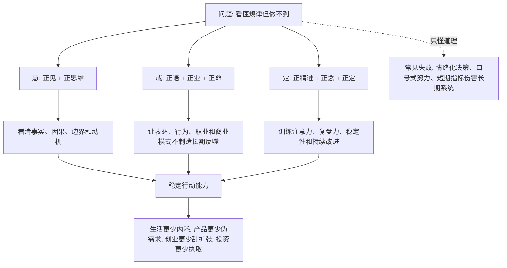

## 佛学思维筑基课: 八正道: 把底层规律变成稳定行动能力的八项训练

### 作者
digoal

### 日期
2026-05-18

### 标签
八正道 , 正见 , 正思维 , 正语 , 正业 , 正命 , 正精进 , 正念 , 正定 , 行动训练

----

## 背景

> 面向对象: 大学生、产品经理、运营经理、有投资需求的人  
> 核心问题: 只知道“无常、缘起、无我、苦的机制”还不够。现实里, 人还是会被情绪、舆论、指标、亏损、增长压力和自尊绑架。知道底层规律, 不等于能稳定做对。  
> 先说结论: 八正道可以被理解为一套从认知到行动的训练系统: 正见校准世界观, 正思维校准动机, 正语校准表达, 正业校准行为, 正命校准生存方式, 正精进校准努力方向, 正念校准注意力, 正定校准稳定性。它不是道德口号, 而是把清醒判断落到日常决策的操作路径。

说明: 佛学中的八正道是四圣谛里“道谛”的核心内容, 通常包括正见、正思维、正语、正业、正命、正精进、正念、正定。传统上也可归入三学: 慧、戒、定。本文把它迁移成生活、产品、运营、创业、投资中的训练框架。

## 一张图先看懂



## 求真讲法

### 它到底说了什么

八正道不是八条孤立规矩, 而是一套训练链。

| 八正道 | 通俗解释 | 现代迁移 |
|---|---|---|
| 正见 | 正确理解现实规律 | 看事实、因果、周期、风险, 不被表象骗 |
| 正思维 | 正确动机和意向 | 少被贪婪、恐惧、自尊和报复驱动 |
| 正语 | 正确表达 | 不撒谎、不夸大、不制造误导叙事 |
| 正业 | 正确行为 | 行动不伤害长期系统和他人信任 |
| 正命 | 正确谋生方式 | 生存模式不建立在欺骗、伤害和不可持续上 |
| 正精进 | 正确努力 | 把力气用在能改变条件的地方 |
| 正念 | 正确觉察 | 看见当下事实、感受、执取和反馈 |
| 正定 | 正确稳定性 | 让注意力、判断和行动不被噪声拖走 |

如果用一句话概括:

> 八正道是把“知道什么是对的”训练成“在压力下仍然能做对”的路径。

### 它是怎么来的

八正道来自四圣谛中的道谛。前面三谛说明:

```text
苦谛: 问题真实存在
集谛: 问题有生成机制
灭谛: 机制可被削弱或停止
道谛: 需要一条训练路径来改变机制
```

八正道就是这条路径的展开。

它可以分成三类训练:

| 三学 | 包含内容 | 解决什么 |
|---|---|---|
| 慧 | 正见、正思维 | 解决看不清、想偏了 |
| 戒 | 正语、正业、正命 | 解决行为伤害系统、信任和长期结果 |
| 定 | 正精进、正念、正定 | 解决做不到、守不住、被噪声拉走 |

这很重要。很多人以为失败是因为“不够努力”, 但八正道会问:

- 你看的事实对吗?
- 你的动机干净吗?
- 你的表达有没有夸大?
- 你的行为会不会反噬?
- 你的赚钱方式是否可持续?
- 你的努力方向是否正确?
- 你能不能觉察情绪和执取?
- 你是否有足够稳定性穿越波动?

### 它依赖哪些假设

第一, 人的判断和行为可以训练。习惯、注意力、表达方式、努力方向、决策纪律不是固定命运。

第二, 问题不是只靠理解解决。理解只是开端, 行为、环境、制度、反馈和重复练习才会改变系统。

第三, 手段会塑造结果。用欺骗、夸大、短期刺激、过度杠杆获得的增长, 会在长期制造信任、现金流、品牌和心理反噬。

第四, 稳定能力比短期聪明更重要。生活、创业、投资真正考验的是压力下的持续清醒。

### 常见误解

误解一: 八正道是道德说教。  
不对。它当然有伦理维度, 但更是一套防止错误循环复制的训练系统。

误解二: 正见就是知道一些道理。  
不对。正见必须能影响你的判断、指标、仓位、沟通和行动。

误解三: 正精进就是更努力。  
不对。正精进是把努力用在减少错误条件、增加有效条件上。错误方向上的勤奋会放大问题。

误解四: 正念就是放松。  
不对。正念是清楚知道当下发生了什么: 事实、感受、欲望、执取、风险、反馈。

## 求存讲法

### 它有什么用

八正道能把抽象规律转成实践清单。

| 场景 | 八正道问法 |
|---|---|
| 学习 | 我看清目标和反馈了吗? 我的努力在关键薄弱点上吗? |
| 产品 | 我是否夸大用户需求? 是否用真实行为验证? |
| 运营 | 我是否为了短期指标伤害长期用户质量? |
| 创业 | 我的商业模式是否靠真实价值生存, 还是靠叙事和融资续命? |
| 投资 | 我是否因贪婪、恐惧、回本执取而破坏纪律? |
| 管理 | 我的表达、激励和制度是否制造内耗? |

它的价值在于: 不是只问“我该不该做”, 而是问“我用什么认知、动机、语言、行为、职业模式、努力方式、注意力和稳定性去做”。

### 它怎么迁移到熟悉领域

#### 生活

一个大学生想提升能力, 八正道可以这样落地:

- 正见: 承认能力来自训练、反馈和时间, 不是天赋标签。
- 正思维: 不是为了证明自己碾压别人, 而是为了真实成长。
- 正语: 不用“我不行”“我天生差”这类语言固定自己。
- 正业: 每天完成关键训练, 而不是只收藏资料。
- 正命: 选择不长期损害健康和价值观的生存路径。
- 正精进: 把努力放在薄弱点和高反馈任务上。
- 正念: 看到自己逃避、比较和焦虑的瞬间。
- 正定: 建立固定深度学习时段, 不被碎片信息拖走。

#### 产品

产品经理的八正道:

| 八正道 | 产品实践 |
|---|---|
| 正见 | 需求要看行为、成本、留存和付费, 不只听声音 |
| 正思维 | 不是证明自己方案聪明, 而是解决用户真实问题 |
| 正语 | 不用夸大叙事包装伪需求 |
| 正业 | 小实验验证, 少做无证据的大功能 |
| 正命 | 产品商业模式不建立在欺骗、成瘾和过度诱导上 |
| 正精进 | 优先解决关键路径和核心摩擦 |
| 正念 | 觉察团队是否被高层偏好、竞品焦虑、KPI 绑架 |
| 正定 | 在数据波动和舆论压力下保持产品判断 |

#### 运营

运营最容易被短期数字绑架。八正道会提醒:

- 正见: 新增不是增长, 有效用户和长期价值才是增长。
- 正思维: 不为漂亮报表牺牲用户质量。
- 正语: 不把短期活动包装成长期飞轮。
- 正业: 不用骚扰、虚假承诺、过度补贴换数字。
- 正命: 增长方式不能长期伤害品牌和信任。
- 正精进: 把力气放在渠道质量、留存、复购、毛利上。
- 正念: 看到自己对 KPI 的恐惧和执取。
- 正定: 不因某天数据波动就乱改策略。

#### 创业

创业里的八正道, 不是让创始人变温和, 而是让公司少被幻觉带偏。

```text
正见: 客户付费和现金流比融资热度更硬
正思维: 创业不是证明自我伟大, 而是创造可持续价值
正语: 对客户、员工、投资人不夸大承诺
正业: 先验证, 再扩张; 先交付, 再讲平台
正命: 商业模式不靠割韭菜、骗补贴、制造成瘾
正精进: 把资源投向最关键假设
正念: 觉察愿景、恐惧、面子如何影响决策
正定: 在融资、竞品、媒体噪声中维持节奏
```

#### 投融资

投资里的八正道可以变成投资纪律:

| 八正道 | 投资纪律 |
|---|---|
| 正见 | 理解企业、估值、周期、仓位和风险补偿 |
| 正思维 | 不因贪婪、恐惧、攀比、回本执取交易 |
| 正语 | 不传播自己没有验证的投资叙事 |
| 正业 | 按清单买入、按规则复盘、尊重风险 |
| 正命 | 不靠欺骗他人接盘、内幕和操纵获利 |
| 正精进 | 研究真正能提高胜率的变量 |
| 正念 | 觉察上涨兴奋、下跌恐惧、亏损不甘 |
| 正定 | 不被短期波动破坏长期纪律 |

投资不是只看聪明程度, 更看训练程度。没有正念和正定, 正见很容易在波动中失效。

### 它的适用范围和边界

八正道适合用于需要长期训练和反复决策的领域: 学习、职业、产品、运营、创业、投资、管理。

但它有边界。

第一, 它不是行业知识替代品。产品仍要做用户研究, 投资仍要做财务分析, 创业仍要验证商业模式。

第二, 它不是要求人没有欲望。它要求目标和欲望接受事实、伦理、成本和长期后果的校准。

第三, 它不是一套立刻见效的技巧。八正道是训练系统, 不是速成工具。

第四, 它不能替代专业支持。严重心理问题、法律问题、财务危机需要专业介入。

### 正例: 怎么用它提升能力

一个投资者过去总在上涨时兴奋买入、下跌时恐慌卖出。他决定用八正道重建投资纪律:

1. 正见: 写清企业质量、估值、周期、仓位和风险补偿。
2. 正思维: 承认自己不是为了证明聪明, 而是为了长期稳健回报。
3. 正语: 不在社群里夸大自己持仓, 避免被面子绑架。
4. 正业: 买入前写反证条件, 触发后必须复盘。
5. 正命: 不参与自己看不懂、靠接盘和误导获利的机会。
6. 正精进: 每周研究财报、行业和错误案例, 不刷情绪化观点。
7. 正念: 记录每次想追涨或死扛时的身体感受和念头。
8. 正定: 固定月度复盘, 不因日内波动改变长期计划。

结果不保证每笔都赚钱, 但他的错误循环被明显削弱: 少追高, 少重仓叙事, 少为了回本而加码。

### 反例: 前提不成立会怎样

某创业团队很懂“用户价值”“长期主义”“现金流”, 但实际行动完全相反:

- 对投资人夸大进展。
- 对客户承诺尚未具备的能力。
- 为了增长做高补贴。
- 团队天天救火, 没有复盘节奏。
- 创始人被竞品融资消息牵着走。

他们有概念上的“正见”, 但缺少正语、正业、正命、正念和正定。最后现金流恶化, 客户信任下降, 团队内耗加重。

这里失效的前提是: “知道正确概念就等于走在正确道路上。”八正道提醒我们, 正见如果不落实为表达、行为、谋生方式、努力和注意力训练, 很快会被现实压力冲垮。

## 思考

八正道可以变成一个日常复盘模板:

| 复盘问题 | 对应训练 |
|---|---|
| 我是否看清事实、因果和边界? | 正见 |
| 我的动机是否被贪婪、恐惧、自尊驱动? | 正思维 |
| 我的表达是否真实、克制、不误导? | 正语 |
| 我的行动是否伤害长期系统? | 正业 |
| 我的赚钱方式或增长方式是否可持续? | 正命 |
| 我的努力是否用在关键条件上? | 正精进 |
| 我是否觉察到当下感受和执取? | 正念 |
| 我是否能在波动中保持稳定? | 正定 |

从这个角度看, 八正道不是“修行人的规矩”, 而是复杂世界里的行动工程。它解决的问题是: 为什么人明明懂道理, 却还是反复做错?

答案是: 因为正确认知如果没有被训练成表达、行为、环境、注意力和稳定性, 就只是脑中的概念。

## 最后记住

1. 八正道是把底层规律转化为稳定行动能力的训练系统。
2. 正见和正思维解决“怎么看、为什么做”; 正语、正业、正命解决“怎么做才不反噬”; 正精进、正念、正定解决“如何持续做对”。
3. 产品、运营、创业、投资中的很多错误, 不是不知道道理, 而是没有训练出压力下的执行纪律。
4. 正精进不是更努力, 而是在正确方向上持续减少错误条件、增加有效条件。
5. 真正的修行不是离开现实, 而是在现实决策中减少误判、伤害、执取和内耗。

## 参考资料

- Encyclopaedia Britannica, “Eightfold Path”: https://www.britannica.com/topic/Eightfold-Path
- Encyclopaedia Britannica, “Buddhism - The Four Noble Truths”: https://www.britannica.com/topic/Buddhism/The-Four-Noble-Truths
- SuttaCentral/Dhammatalks, “SN 56.11: Setting in Motion the Wheel of the Dhamma”: https://dhammatalks.net/suttacentral/sc2016/sc/en/sn56.11.html
- Bhikkhu Bodhi, “The Noble Eightfold Path: The Way to the End of Suffering”: https://www.accesstoinsight.org/lib/authors/bodhi/waytoend.html
- Encyclopaedia Britannica, “Sīla”: https://www.britannica.com/topic/sila-Buddhism
  
#### [PostgreSQL 解决方案集合](../201706/20170601_02.md "40cff096e9ed7122c512b35d8561d9c8")
  
  
#### [德哥 / digoal's Github - 公益是一辈子的事.](https://github.com/digoal/blog/blob/master/README.md "22709685feb7cab07d30f30387f0a9ae")
  
  
#### [About 德哥](https://github.com/digoal/blog/blob/master/me/readme.md "a37735981e7704886ffd590565582dd0")
  
  

  
