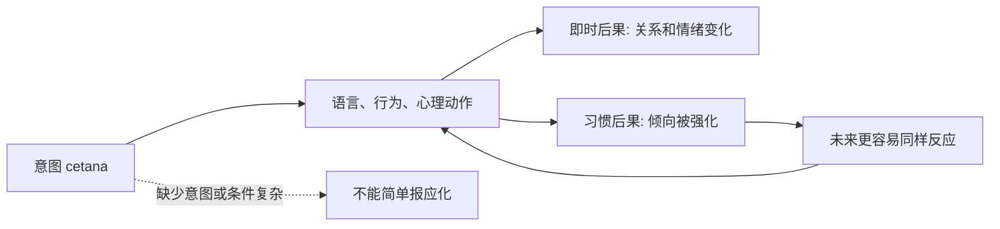

## 佛学思维筑基课: 上层定律05: 业力与意图

### 作者
digoal

### 日期
2026-05-18

### 标签
佛学 , 业力 , 意图 , 因果 , 行为 , 习惯 , 伦理 , 身口意 , 责任 , 修行

----

## 背景

> 面向对象: 高中生到普通读者  
> 核心问题: 业力是不是“善有善报、恶有恶报”的简单报应论?  
> 先说结论: 佛学中的业力核心是有意图的身口意行为会形成后果和倾向。它不是宿命论, 而是说明动机、行为、习惯如何塑造未来经验。

## 一张图先看懂

## 求真讲法

### 它到底说了什么

业力不是神秘账本, 也不是所有遭遇都由个人前世决定。早期佛教中, 业与意图关系密切。AN 6.63 中有著名说法: 佛陀把“意图”称为业; 有了意图, 人通过身、语、意行动。

这意味着业力首先是心理-伦理因果: 你反复用愤怒说话, 愤怒就更熟练; 你反复诚实负责, 诚实负责也会成为倾向。

### 它是怎么来的

业力法则由缘起公理展开: 行为不是消失在空气里, 它会改变外部关系, 也会改变内部习惯。它也连接无我: 即使没有永恒实体我, 因果连续仍能成立。

### 它依赖哪些假设

| 假设 | 说明 |
|---|---|
| 意图能塑造行为 | 行动不是纯机械反射 |
| 行为有后果 | 身口意会影响自己和他人 |
| 习惯可累积 | 重复反应会形成倾向 |
| 因果复杂 | 不能把所有遭遇都粗暴归因于个人业 |

### 常见误解

误解一: 业力就是命中注定。错。若是命定, 修行就无意义。

误解二: 受苦者一定做错了什么。错。佛学因果很复杂, 不能用业力责怪受害者。

误解三: 只要心好, 行为伤害就没关系。错。意图重要, 但行为后果也要承担。

## 求存讲法

### 它有什么用

业力让人重视微小行为的累积。一次恶语可能只是一次, 但反复恶语会塑造关系和人格; 一次正念停顿也许很小, 但反复停顿会改变反应模式。

### 它怎么迁移到熟悉领域

在学习中, 每天逃避十分钟会训练逃避; 每天开始五分钟会训练启动能力。在工作中, 每次甩锅会训练防卫人格; 每次复盘会训练负责能力。

### 它的适用范围和边界

业力适合解释意图行为的伦理和心理后果, 不应替代医学、法律、社会科学。面对灾难和疾病, 不能简单说“这是业报”。

### 正例: 怎么用它提升能力

一个人想改变暴躁, 他把“发火前停三秒”作为新业。每次停顿都在削弱旧习惯, 强化新路径。几个月后, 他不是靠压抑, 而是反应模式真的变了。

### 反例: 前提不成立会怎样

若有人用业力责怪遭遇欺凌的人, 他说“你一定有业”。这会增加伤害。失败点在于忽略因果复杂性, 把业力简化成道德审判。

## 思考

业力最贴近日常的一面是: 你每天重复的反应, 正在训练未来的你。命运不是一句神秘话, 很多时候是习惯的复利。

## 最后记住

1. 佛学业力核心是意图性行为及其后果。
2. 业力不是宿命论。
3. 行为会塑造外部关系和内部习惯。
4. 不要用业力责怪受苦者。

## 参考资料

- AN 6.63, *Nibbedhika Sutta*, 业与意图相关教义概述: https://encyclopediaofbuddhism.org/wiki/Karma
- Encyclopaedia Britannica, “Buddhism”: https://www.britannica.com/topic/Buddhism
- Encyclopaedia of Buddhism, “Karma”: https://encyclopediaofbuddhism.org/wiki/Karma
  
#### [PostgreSQL 解决方案集合](../201706/20170601_02.md "40cff096e9ed7122c512b35d8561d9c8")
  
  
#### [德哥 / digoal's Github - 公益是一辈子的事.](https://github.com/digoal/blog/blob/master/README.md "22709685feb7cab07d30f30387f0a9ae")
  
  
#### [About 德哥](https://github.com/digoal/blog/blob/master/me/readme.md "a37735981e7704886ffd590565582dd0")
  
  

  
