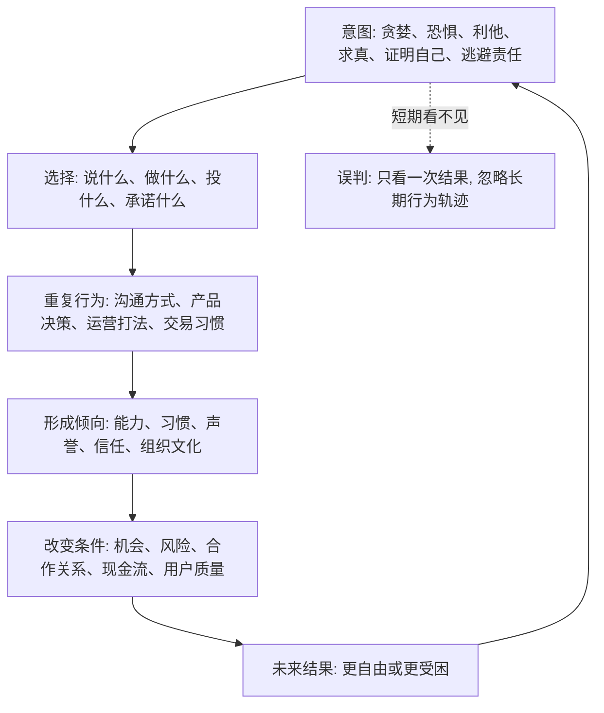

## 佛学思维筑基课: 业力与意图: 你的动机会把未来条件一点点改写

### 作者
digoal

### 日期
2026-05-18

### 标签
业力 , 意图 , 行为后果 , 习惯塑造 , 信任资产 , 组织文化 , 产品伦理 , 运营质量 , 创业承诺 , 投资人格

----

## 背景

> 面向对象: 大学生、产品经理、运营经理、有投资需求的人  
> 核心问题: 世界表面变化太快, 人们常把结果看成运气、风口、行情或别人评价, 却忽略长期更稳定的底层规律: 有意图的行为会塑造习惯、能力、信任、声誉、组织路径和风险暴露。只看短期结果, 就会误判未来。  
> 先说结论: 业力不是神秘报应, 更不是简单的“善有善报、恶有恶报”。在可迁移的现实意义上, 业力是“意图驱动的行为会形成后果和倾向”: 你反复用什么动机行动, 就会训练出什么人格、组织、关系、市场位置和投资纪律。

说明: 佛学中“业”对应巴利语 *kamma*、梵语 *karma*, 基本含义是行动。早期佛教特别强调“意图”在业中的核心地位。本文不讨论超验轮回证明, 而是把“业力与意图”抽象成跨生活、产品、运营、创业、投资的长期因果规律。

## 一张图先看懂



## 求真讲法

### 它到底说了什么

业力最容易被误解成“命中注定的报应”。这个理解过于粗糙。

更精确地说, 在佛学语境中, 业不是普通动作本身, 而是带有意图的身、口、意行为。迁移到现代生活里, 它可以理解为:

> 你带着什么动机反复行动, 就会制造什么样的未来条件。

意图很重要, 因为同样的外在动作, 背后的因果方向可能不同:

| 外在动作 | 不同意图 | 可能后果 |
|---|---|---|
| 给用户降价 | 验证价格敏感度 | 获得真实需求信息 |
| 给用户降价 | 只为冲短期 KPI | 吸引低质量用户, 伤害价格心智 |
| 长期持有股票 | 基于价值和估值纪律 | 有机会穿越波动 |
| 长期持有股票 | 不愿承认买错 | 亏损扩大, 机会成本上升 |
| 创业融资 | 加速已验证模型 | 放大有效系统 |
| 创业融资 | 逃避商业模式验证 | 放大错误成本 |

所以, 业力不是只看“做了什么”, 还要看“为什么做、怎样重复、形成了什么倾向、改变了什么条件”。

### 它是怎么来的

业力与意图可以从缘起和十二缘起理解:

```text
意图 -> 身口意行为 -> 习惯与倾向 -> 环境反馈 -> 未来选择空间
```

在十二缘起里,“行”可以理解为在无明影响下形成的造作、反应和行为倾向。反复的意图和行为, 会塑造后续的注意力、身份、信息入口和结果。

例如一个投资者:

```text
意图: 想快速证明自己聪明
行为: 追热点、重仓、频繁交易
倾向: 对波动高度敏感, 对反证不耐烦
条件: 手续费、税费、亏损、情绪压力增加
未来: 更容易在恐惧和贪婪中做错
```

再看另一种:

```text
意图: 长期保护本金并获得合理回报
行为: 研究企业、控制仓位、写反证条件
倾向: 形成耐心、纪律和风险意识
条件: 犯大错概率下降, 复盘质量提高
未来: 更有机会在波动中保持自由
```

差别不是一次买卖, 而是意图长期塑造了系统。

### 它依赖哪些假设

第一, 意图会影响选择。人不是只被外部刺激推动, 也会被内在动机、目标和价值排序影响。

第二, 重复行为会形成倾向。一次夸大可能只是策略, 反复夸大会形成组织文化; 一次追涨只是交易, 反复追涨会形成投资人格。

第三, 倾向会改变环境。诚信会改变别人愿不愿意与你合作; 过度承诺会改变客户和团队对你的信任; 高杠杆会改变你面对波动的自由度。

第四, 后果不一定立刻显现。业力更像长期复利或长期腐蚀, 不一定在当天给出奖惩。

第五, 因果不是单线条。一个结果通常由多重条件生成, 业力只是其中一类重要条件, 不是解释一切的万能钥匙。

### 常见误解

误解一: 业力就是宿命。  
不对。宿命论说未来已经注定; 业力强调行为会改变未来条件。既然行动能改变条件, 就不是宿命。

误解二: 业力就是宇宙奖惩系统。  
不精确。更现实的理解是: 意图和行为会塑造习惯、关系、信任、能力、组织和风险暴露, 后果常通过这些路径显现。

误解三: 只要动机好, 结果就一定好。  
不对。好意图也需要正见、能力、方法和边界。善良但无知, 也可能造成伤害。

误解四: 遭遇痛苦一定是自己过去造业。  
这是危险误用。疾病、贫困、暴力、歧视、市场崩盘、制度问题都有复杂条件, 不能用业力责备受害者。

## 求存讲法

### 它有什么用

业力与意图最大的现实价值, 是让你把短期行为放回长期轨道里看。

| 场景 | 短期看法 | 业力视角 |
|---|---|---|
| 学习 | 今天偷懒没事 | 重复逃避会训练出逃避倾向 |
| 产品 | 夸大功能能拿到客户 | 反复夸大会损害信任和交付系统 |
| 运营 | 骗点击能冲数据 | 用户质量、品牌信任和平台惩罚会反噬 |
| 创业 | 先把故事讲大 | 叙事超前会制造组织成本和信誉债 |
| 投资 | 这次追热点赚了 | 可能训练出危险的成功错觉 |
| 管理 | 用恐惧压团队有效 | 短期服从, 长期低信任和低主动性 |

它提醒你: 不要只问“这次有没有赢”, 还要问“这次行动训练了我什么, 改变了什么长期条件”。

### 它怎么迁移到熟悉领域

#### 生活

一个大学生每次焦虑就刷短视频。短期看, 他获得放松; 长期看, 他训练出一条业力链:

```text
意图: 逃避不适
行为: 刷短视频
倾向: 一遇压力就找即时刺激
条件: 注意力变碎, 任务积压
结果: 焦虑更强, 更想逃避
```

改变也要从意图开始: 不是“我必须立刻变优秀”, 而是“我愿意面对一点不适, 用小任务恢复控制感”。

#### 产品

产品经理的意图会塑造产品命运。

如果意图是“证明我的方案厉害”, 行为可能是选择性听反馈、包装指标、拒绝砍功能。  
如果意图是“真实解决用户问题”, 行为会变成访谈、实验、复盘、删减、承认假设错误。

产品的业力不是抽象的, 它会沉淀成:

- 产品复杂度。
- 用户信任。
- 团队是否敢说真话。
- 指标是否反映真实价值。
- 组织是否能持续学习。

#### 运营

运营的业力最容易体现在“增长质量”上。

```text
意图: 做真实增长
行为: 找目标用户、看留存、看复购、控制承诺
结果: 增长慢一些, 但系统更稳

意图: 做漂亮数字
行为: 标题党、强刺激、虚假承诺、高补贴
结果: 数字短期好, 用户质量和信任长期坏
```

运营经理要问: 我的每个动作是在积累用户资产, 还是在透支用户信任?

#### 创业

创业者的意图会变成公司文化。

如果创始人的底层意图是“证明我伟大”, 公司容易出现:

- 对投资人讲过度故事。
- 对客户承诺超出交付能力。
- 对员工制造使命绑架。
- 对坏消息不耐烦。
- 为了增长牺牲现金流纪律。

如果底层意图是“创造可持续价值”, 公司更可能形成:

- 尊重客户真实付费。
- 允许暴露问题。
- 控制承诺。
- 复盘现金流。
- 先跑通小模型再扩张。

公司的业力, 就是创始人意图反复落实成制度、招聘、激励和叙事后的结果。

#### 投融资

投资中的业力, 不是“今天买了什么票”, 而是“你在训练什么交易人格”。

| 意图 | 行为 | 长期业力 |
|---|---|---|
| 快速暴富 | 追涨、杠杆、听消息 | 情绪依赖、亏损放大 |
| 证明自己对 | 死扛、拒绝反证 | 机会成本和自尊绑定 |
| 稳健复利 | 估值纪律、仓位管理、复盘 | 错误可控, 判断可改进 |
| 跟别人比较 | 频繁换策略 | 风格漂移, 心态失衡 |

投资者要特别警惕“赚错的钱”。一次靠冲动赚到的钱, 可能训练出下一次重亏的行为模式。

### 它的适用范围和边界

业力与意图适合分析长期累积型问题: 习惯、能力、信任、声誉、组织文化、品牌、投资纪律、合作关系。

但它有边界。

第一, 业力不能替代具体因果分析。投资亏损要看估值、现金流和周期; 产品失败要看需求、交互和渠道。

第二, 业力不能用来责怪受害者。很多痛苦来自外部伤害和结构性条件, 不能说“都是你自己的业”。

第三, 好意图不能抵消坏方法。善意的产品也可能难用, 善意的创业也可能烧光现金。

第四, 后果不是即时结算。不要因为一次坏行为没出事, 就以为没有后果; 也不要因为一次好行为没回报, 就否定长期积累。

### 正例: 怎么用它提升能力

一个运营经理原来习惯用夸张标题拉点击。短期数据不错, 但用户投诉越来越多, 留存越来越差。

他用“业力与意图”重构工作:

1. 承认旧意图: 我在追短期数据和上级认可。
2. 调整新意图: 我要积累目标用户的长期信任。
3. 改行为: 标题必须真实表达价值, 活动承诺必须可兑现。
4. 改指标: 不只看点击, 还看留存、复购、投诉率和毛利。
5. 改复盘: 每次活动问“我们积累了信任, 还是透支了信任?”

短期点击可能下降, 但长期用户质量、品牌信任和团队判断会变好。

### 反例: 前提不成立会怎样

某创业者对投资人不断夸大客户数、收入和产品能力。他认为“创业都要讲故事, 融到钱再说”。

短期看, 他可能拿到融资。但这条业力链已经开始形成:

- 团队学会迎合故事, 不敢暴露真实问题。
- 销售向客户过度承诺, 交付压力上升。
- 产品路线被融资叙事绑架, 偏离真实需求。
- 财务为了匹配故事提前扩张。
- 一旦数据不达预期, 信任迅速塌陷。

失败的前提是: “只要短期结果好, 动机和手段不重要。”业力视角提醒我们, 错误意图会通过组织文化和承诺结构延迟爆炸。

## 思考

业力与意图最值得迁移的一点是: 未来不是只由外部环境决定, 也由你今天反复训练的倾向决定。

你每次说真话, 都在训练信任系统。  
你每次夸大, 也在训练欺骗系统。  
你每次按纪律复盘, 都在训练判断系统。  
你每次为了回本死扛, 也在训练执取系统。  
你每次小成本验证, 都在训练学习系统。  
你每次用故事逃避验证, 也在训练幻觉系统。

可以用下面的表做复盘:

| 问题 | 目的 |
|---|---|
| 我这次行动的真实意图是什么? | 看见驱动力 |
| 这个意图会训练出什么习惯? | 看见长期倾向 |
| 如果团队都复制这种行为, 组织会变成什么样? | 看见文化后果 |
| 如果连续做三年, 我的能力和声誉会怎样? | 看见复利或腐蚀 |
| 这次短期收益是否在制造长期债务? | 看见隐性成本 |
| 我能否换一种意图和行为, 同时更真实、更可持续? | 找到修正入口 |

对个人来说, 业力让你重视日常小选择。  
对产品经理来说, 业力让你少为方案自尊服务, 多为用户事实服务。  
对运营经理来说, 业力让你少透支信任, 多积累用户资产。  
对创业者来说, 业力让你看到创始人意图会变成组织文化。  
对投资者来说, 业力让你意识到每次交易都在训练下一次交易。

## 最后记住

1. 业力不是宿命报应, 而是意图驱动的行为会塑造未来条件。
2. 意图重要, 因为它决定你会反复选择什么, 最终形成习惯、信任、能力、组织文化和风险暴露。
3. 短期赢不等于业力好; 有些胜利会训练出长期失败的模式。
4. 好意图也需要正见、能力和边界, 否则仍会造成坏结果。
5. 不要用业力责备受害者; 现实结果由多重条件生成, 个人意图只是其中一类重要条件。

## 参考资料

- Encyclopaedia Britannica, “Karma”: https://www.britannica.com/topic/karma
- Encyclopaedia Britannica, “Karma summary”: https://www.britannica.com/summary/karma
- Encyclopedia of Buddhism, “Karma”: https://encyclopediaofbuddhism.org/wiki/Karma
- Access to Insight, “Nibbedhika Sutta: Penetrative (AN 6.63)”: https://www.accesstoinsight.org/index-sutta.html
- Encyclopaedia Britannica primary source excerpt, “Intentional action”: https://cdn.britannica.com/primary_source/gutenberg/PGCC_classics/ptf/kamma.html
  
#### [PostgreSQL 解决方案集合](../201706/20170601_02.md "40cff096e9ed7122c512b35d8561d9c8")
  
  
#### [德哥 / digoal's Github - 公益是一辈子的事.](https://github.com/digoal/blog/blob/master/README.md "22709685feb7cab07d30f30387f0a9ae")
  
  
#### [About 德哥](https://github.com/digoal/blog/blob/master/me/readme.md "a37735981e7704886ffd590565582dd0")
  
  

  
