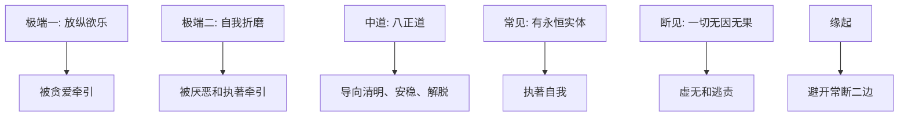

## 佛学思维筑基课: 上层定律06: 中道

### 作者
digoal

### 日期
2026-05-18

### 标签
佛学 , 中道 , 八正道 , 两边 , 常见 , 断见 , 缘起 , 修行 , 平衡 , 正见

----

## 背景

> 面向对象: 高中生到普通读者  
> 核心问题: 中道是不是简单的“折中”和“各退一步”?  
> 先说结论: 中道不是平庸折中, 而是避开会制造苦的极端。早期佛教中, 它避开感官放纵和自我折磨; 在思想上, 它也避开常见和断见等极端。

## 一张图先看懂

## 求真讲法

### 它到底说了什么

中道至少有两层意思。实践层面, 它不是沉迷感官, 也不是虐待身体, 而是八正道。见地层面, 它不是执著永恒实体, 也不是落入虚无断灭, 而是用缘起来理解现象。

因此, 中道不是“两个极端各取一半”, 而是找到不被极端问题框架困住的道路。

### 它是怎么来的

《转法轮经》中, 佛陀开篇提到不应追随两种极端: 感官欲乐的沉溺和自我苦行的折磨。避开两者后, 中道被表达为八正道。

它依赖经验优先公理和可修正公理: 通过观察可知, 两种极端都不能真正止苦; 所以需要一条能训练智慧、伦理和禅定的道路。

### 它依赖哪些假设

| 假设 | 说明 |
|---|---|
| 极端会制造盲点 | 极端不是深刻, 可能只是执著 |
| 身心需要可持续训练 | 自我摧残不等于解脱 |
| 欲乐不能提供终极安稳 | 放纵会加强贪爱 |
| 缘起能避开常断 | 既不永恒实体化, 也不虚无化 |

### 常见误解

误解一: 中道就是妥协。错。中道可能很坚定, 只是它不被错误二分绑架。

误解二: 中道就是舒服一点。错。中道不等于享乐主义, 它仍要求训练。

误解三: 中道就是没有立场。错。八正道本身就是清楚立场。

## 求存讲法

### 它有什么用

中道帮助人识别“用力过猛”和“彻底放任”两种常见失败。很多改变失败, 不是因为不努力, 而是从一个极端跳到另一个极端。

### 它怎么迁移到熟悉领域

学习中, 极端一是完全摆烂, 极端二是熬夜透支。中道是稳定作息、持续练习、及时反馈。健身中, 极端一是不动, 极端二是过度训练到受伤。中道是可持续负荷。

### 它的适用范围和边界

中道不是在所有道德问题上取中间值。面对伤害和不公, 中道可能要求清楚制止, 而不是在伤害者和受害者之间“各打五十大板”。

### 正例: 怎么用它提升能力

一个人想戒手机, 不再选择“彻底不用手机”这种不可持续方案, 也不继续无限刷。他设定固定查看时段、关闭通知、睡前放远手机。这是可持续中道。

### 反例: 前提不成立会怎样

若有人把中道理解成“什么都别太认真”, 他会逃避必要努力。失败点在于把中道误读成懒散折中, 忽略八正道的训练强度。

## 思考

很多极端都伪装成清醒: “我就彻底放弃”或“我必须拼到崩溃”。中道问的是: 这条路能不能长期减少苦, 还是只是在服务另一种执著?

## 最后记住

1. 中道不是平庸折中。
2. 早期中道避开欲乐放纵和自我折磨。
3. 见地上的中道避开常见和断见。
4. 八正道是中道的具体表达。

## 参考资料

- SN 56.11, *Setting in Motion the Wheel of the Dhamma*: https://dhammatalks.net/suttacentral/sc2016/sc/en/sn56.11.html
- Encyclopaedia Britannica, “Eightfold Path”: https://www.britannica.com/topic/Eightfold-Path
- Middle Way 条目概述: https://en.wikipedia.org/wiki/Middle_Way
  
#### [PostgreSQL 解决方案集合](../201706/20170601_02.md "40cff096e9ed7122c512b35d8561d9c8")
  
  
#### [德哥 / digoal's Github - 公益是一辈子的事.](https://github.com/digoal/blog/blob/master/README.md "22709685feb7cab07d30f30387f0a9ae")
  
  
#### [About 德哥](https://github.com/digoal/blog/blob/master/me/readme.md "a37735981e7704886ffd590565582dd0")
  
  

  
