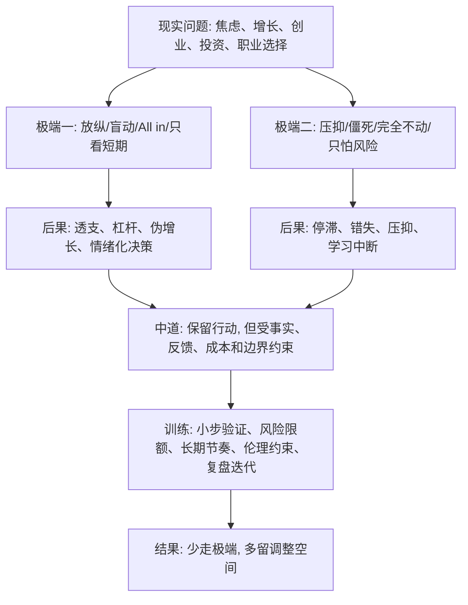

## 佛学思维筑基课: 中道: 在两个极端之间找到能持续验证和减少反噬的路径

### 作者
digoal

### 日期
2026-05-18

### 标签
中道 , 反极端 , 风险边界 , 小成本验证 , 反馈机制 , 可持续性 , 产品取舍 , 运营增长 , 创业扩张 , 投资仓位

----

## 背景

> 面向对象: 大学生、产品经理、运营经理、有投资需求的人  
> 核心问题: 世界表面变化太快, 人很容易在极端之间摆动: 要么躺平, 要么透支; 要么盲目乐观, 要么彻底悲观; 要么 All in, 要么完全不行动。极端看起来有力量, 但常常让生活、产品、创业和投资付出巨大代价。  
> 先说结论: 中道不是折中主义, 不是各打五十大板, 也不是不做选择。中道是一种反极端决策能力: 避免会制造长期痛苦的两端, 在事实、反馈、成本、伦理和可持续性之间找到可训练、可验证、可调整的路径。

说明: 佛学中的中道在早期经典中首先指避开两个极端: 感官放纵和自我折磨; 其具体道路就是八正道。后来中道也被用于哲学层面, 避免“常见”和“断见”等极端观点。本文主要采用现实决策版本: 中道是避免两种会让系统失真的极端, 并保留反馈和修正能力。

## 一张图先看懂



## 求真讲法

### 它到底说了什么

中道最常见的误解是“取中间值”。这不对。

如果一个人说“欺骗用户”和“完全不卖产品”之间取中间, 变成“少骗一点”, 这不是中道。  
如果一个投资者在“满仓杠杆”和“永远不投资”之间取中间, 变成“半仓杠杆”, 也不一定是中道。

中道真正说的是:

> 不被两个极端绑架, 而是根据事实、因果、目标、成本和长期后果, 找到能减少痛苦、保留反馈、持续修正的路径。

可以把中道看成一张反极端检查表:

| 极端一 | 极端二 | 中道不是 | 中道更像 |
|---|---|---|---|
| 放纵欲望 | 压死欲望 | 两边平均 | 让欲望接受事实、边界和训练 |
| 盲目乐观 | 彻底悲观 | 情绪平衡术 | 基于条件的概率判断 |
| All in | 完全不行动 | 半仓就好 | 用仓位和验证控制不可逆风险 |
| 只看增长 | 只怕成本 | KPI 折中 | 看有效增长和长期价值 |
| 只讲愿景 | 只守现金 | 愿景缩水 | 用现金流验证愿景 |
| 自我膨胀 | 自我否定 | 自信一点 | 基于反馈建立能力感 |

### 它是怎么来的

中道来自对两个极端的观察。

早期佛教中, 一个极端是感官放纵: 只追逐即时快乐, 结果被欲望牵引。另一个极端是自我折磨: 以为压垮身体和生活就能获得解脱, 结果同样被执著牵引。

迁移到现代决策, 许多错误也来自两个极端:

```text
极端 A: 我想要, 所以马上做
极端 B: 我害怕, 所以永远不做
中道: 我先看条件, 小成本验证, 控制下行, 根据反馈调整
```

所以, 中道不是“弱”, 而是比极端更难。极端只需要情绪, 中道需要观察、判断、纪律和持续复盘。

### 它依赖哪些假设

第一, 极端通常来自执取。盲动来自贪求, 僵死来自恐惧, 自我折磨来自对控制的执著。

第二, 现实有反馈。行动要接受用户、市场、身体、现金流、关系、数据和时间的反馈。

第三, 可持续比一次爆发更重要。生活、创业、投资都是长期系统, 不能只追一次漂亮结果。

第四, 不确定性需要保留调整空间。中道不是不冒险, 而是不把自己放进不可修正的位置。

第五, 中道需要伦理边界。不是只要有效就做; 如果手段会长期伤害信任、他人和系统, 它就不是中道。

### 常见误解

误解一: 中道就是折中。  
不对。中道不是数学平均, 而是避开会制造痛苦和失真的极端。

误解二: 中道就是保守。  
不对。中道可以很进取, 但会控制不可逆风险, 保留学习反馈。

误解三: 中道就是不表态。  
不对。中道经常要求更清楚地表态: 哪些条件成立就行动, 哪些条件不成立就停止。

误解四: 中道就是谁都不得罪。  
不对。中道不是社交圆滑, 而是因果清醒。必要时它会要求止损、拒绝、裁剪和承担代价。

## 求存讲法

### 它有什么用

中道最大的现实价值, 是防止人在压力下从一个极端跳到另一个极端。

| 场景 | 极端一 | 极端二 | 中道 |
|---|---|---|---|
| 学习 | 熬夜苦学到崩溃 | 完全躺平逃避 | 稳定节奏、高反馈训练 |
| 产品 | 用户说什么都做 | 完全不听用户 | 区分声音、行为、付费和留存 |
| 运营 | 为新增疯狂补贴 | 因怕亏损不做增长 | 用 LTV/CAC 和留存约束增长 |
| 创业 | 融到钱就扩张 | 因怕失败不验证 | 小模型跑通后再放大 |
| 投资 | 满仓追热点 | 永远空仓等确定 | 估值纪律、分散、仓位上限 |
| 管理 | 高压控制 | 完全放任 | 明确目标、边界和反馈机制 |

它让你不被“必须马上赢”和“千万不能输”两种情绪控制。

### 它怎么迁移到熟悉领域

#### 生活

很多大学生在两端摆动:

```text
焦虑时: 我要从今天开始每天学 14 小时
崩溃后: 我完了, 什么都不想做
```

中道不是“每天学 7 小时就行”, 而是:

- 先承认身体和注意力有上限。
- 找到关键薄弱点。
- 设计可持续训练量。
- 用反馈调整计划。
- 留出睡眠、运动和恢复。

它的目标不是让你看起来拼, 而是让能力真的积累。

#### 产品

产品决策的两个极端:

- 用户说什么都做: 产品变成需求垃圾场。
- 产品经理完全自嗨: 产品脱离真实用户。

中道是:

```text
听用户声音 -> 看真实行为 -> 判断场景频率和付费意愿 -> 小实验验证 -> 决定做、改或不做
```

它既不崇拜用户原话, 也不崇拜产品经理直觉。

#### 运营

运营增长的两个极端:

- 用补贴、标题党、强推送冲短期数据。
- 因为怕伤害品牌, 什么增长动作都不敢做。

中道是设计有约束的增长:

- 新增要看人群质量。
- 活动要看留存和复购。
- 补贴要看毛利和长期价值。
- 文案要真实, 不透支信任。
- 实验要小步快跑, 不一次性押满。

#### 创业

创业最需要中道, 因为它天然夹在两个极端之间:

| 极端 | 问题 |
|---|---|
| 愿景至上 | 容易忽略现金流、客户验证和交付成本 |
| 现金至上 | 容易只做外包和短期项目, 永远长不出产品 |

中道不是放弃愿景, 而是让愿景接受现金流验证:

```text
大方向可以远, 当前动作必须小;
故事可以大, 本周验证必须具体;
融资可以用, 但不能替代商业模式;
扩张可以做, 但必须晚于单位经济模型成立。
```

#### 投融资

投资里的两个极端:

- 贪婪端: 满仓、杠杆、追热点、相信这次不一样。
- 恐惧端: 永远等待确定性, 现金长期闲置, 错过复利。

中道不是永远半仓, 而是:

- 承认不确定性。
- 只投自己能理解的资产。
- 价格要有安全边际。
- 仓位要允许自己犯错。
- 分散要防止单点毁灭。
- 反证条件要提前写好。

投资中道的核心是: 既不把未来当确定, 也不因为未来不确定就放弃行动。

### 它的适用范围和边界

中道适合用于存在两种危险极端的领域: 学习节奏、职业选择、产品取舍、运营增长、创业扩张、投资仓位、组织管理。

但它有边界。

第一, 中道不是价值中立。面对欺骗、伤害、违法和剥削, 不能用“中道”包装妥协。

第二, 中道不是永远慢。条件成熟时, 中道也可以快速行动; 关键是行动前有事实、边界和风险控制。

第三, 中道不是逃避冲突。有时为了长期系统健康, 必须砍项目、止损、拒绝客户、降低仓位。

第四, 中道不是用来否定强烈目标。它不是让人没有野心, 而是让野心不破坏身体、信任、现金流和判断。

### 正例: 怎么用它提升能力

一个创业团队做 AI 工具, 拿到一笔融资。团队内部出现两个声音:

- 一派主张马上大规模招人, 抢占市场。
- 一派主张钱先存着, 什么都不要动。

中道处理方式:

1. 明确关键假设: 谁会持续付费? 获客成本多少? 交付成本能否下降?
2. 设定试验预算: 用一小部分资金验证 2 到 3 个客户群。
3. 设定止损线: 如果三个月没有复购和有效留存, 不扩团队。
4. 设定放大条件: 如果某人群 LTV/CAC 成立, 再加销售和交付资源。
5. 保留现金 runway: 不让一次判断错误导致公司死亡。

这样既没有错过机会, 也没有把公司押到不可修正的位置。

### 反例: 前提不成立会怎样

某投资者经历一次大亏后, 从一个极端跳到另一个极端: 以前满仓追热点, 后来永远空仓。他说自己“终于理性了”。

但这不是中道。因为他只是从贪婪执取变成恐惧执取:

- 没有建立估值框架。
- 没有仓位规则。
- 没有资产分散。
- 没有反证条件。
- 没有复盘错误来源。

结果几年后市场出现合理机会, 他仍然不敢行动, 只能继续用“风险太大”解释。这里失效的前提是: “从激进变成保守就是中道。”中道不是反向极端, 而是建立能承受不确定性的行动系统。

## 思考

中道最值得训练的地方, 是把“情绪二选一”改成“条件判断”。

不要只问:

- 我要不要 All in?
- 我要不要放弃?
- 我要不要完全相信这个人?
- 我要不要永远持有?

更好的问题是:

| 问题 | 作用 |
|---|---|
| 两个极端分别会制造什么痛苦? | 看清代价 |
| 我真正想解决的问题是什么? | 防止被情绪带跑 |
| 哪些条件成立时可以行动? | 建立行动标准 |
| 哪些条件不成立时必须停止? | 建立止损标准 |
| 我能否小成本验证? | 保留反馈 |
| 如果错了, 系统是否还能活下来? | 控制不可逆风险 |

中道不是“温和一点”, 而是“更精确一点”。  
它让生活不被自虐和放纵控制, 让产品不被用户原话和自嗨控制, 让创业不被愿景和恐惧控制, 让投资不被贪婪和恐惧控制。

## 最后记住

1. 中道不是折中, 而是避开会制造长期痛苦和系统失真的极端。
2. 中道不是保守, 它允许进取, 但要求事实、反馈、成本、伦理和风险边界。
3. 产品、运营、创业、投资中, 很多大错都来自从一个极端跳到另一个极端。
4. 真正的中道要能说清: 何时行动, 何时加码, 何时停止, 何时转向。
5. 中道的核心能力是: 在不确定中行动, 但不把自己放进不可修正的位置。

## 参考资料

- Encyclopaedia Britannica, “Middle Way”: https://www.britannica.com/topic/Middle-Way
- Encyclopaedia Britannica, “Eightfold Path”: https://www.britannica.com/topic/Eightfold-Path
- SuttaCentral/Dhammatalks, “SN 56.11: Setting in Motion the Wheel of the Dhamma”: https://dhammatalks.net/suttacentral/sc2016/sc/en/sn56.11.html
- Access to Insight, “Dhammacakkappavattana Sutta: Setting Rolling the Wheel of Truth”: https://www.accesstoinsight.org/tipitaka/sn/sn56/sn56.011.nymo.html
- Encyclopedia of Buddhism, “Middle Way”: https://encyclopediaofbuddhism.org/wiki/Middle_way
  
#### [PostgreSQL 解决方案集合](../201706/20170601_02.md "40cff096e9ed7122c512b35d8561d9c8")
  
  
#### [德哥 / digoal's Github - 公益是一辈子的事.](https://github.com/digoal/blog/blob/master/README.md "22709685feb7cab07d30f30387f0a9ae")
  
  
#### [About 德哥](https://github.com/digoal/blog/blob/master/me/readme.md "a37735981e7704886ffd590565582dd0")
  
  

  
