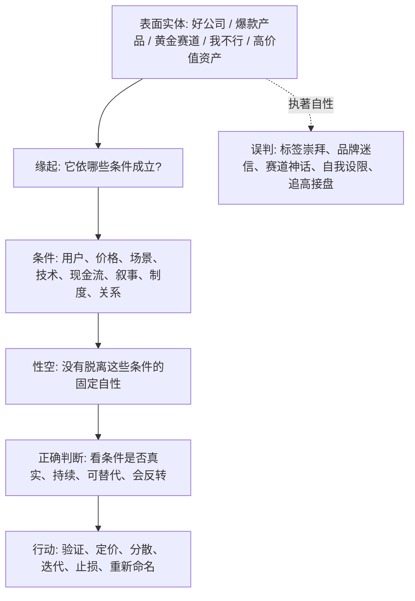

## 佛学思维筑基课: 缘起性空: 看穿“固定本质”的最高级反表象工具

### 作者
digoal

### 日期
2026-05-18

### 标签
缘起性空 , 无自性 , 反本质化 , 条件网络 , 标签崇拜 , 中观 , 产品价值 , 创业赛道 , 公司质量 , 资产估值

----

## 背景

> 面向对象: 大学生、产品经理、运营经理、有投资需求的人  
> 核心问题: 世界表面变化太快, 但人总想抓住一个固定答案: “我是这种人”“这是好公司”“这个赛道永远赚钱”“这个产品天然有价值”。这些判断看似稳定, 实际常把条件关系误认成固定本质。  
> 先说结论: 缘起性空不是说“什么都没有”, 而是说“凡是依条件成立的东西, 都没有脱离条件、独立不变的自性”。它能帮助我们看穿标签、品牌、估值、身份、赛道、产品故事背后的条件网络, 从而减少误判和执著。

说明: “缘起性空”是大乘佛教尤其是中观思想中的核心表达。本文采用现实决策版本: 事物不是虚无, 但也不是独立自足的固定实体; 它们在条件、关系、命名、功能和反馈中暂时成立。

## 一张图先看懂



## 求真讲法

### 它到底说了什么

缘起性空可以拆成两半:

| 词 | 通俗解释 |
|---|---|
| 缘起 | 事物依赖条件、关系和过程而成立 |
| 性空 | 事物没有脱离条件、独立不变、自己就如此的固定本质 |

所以,“空”不是没有, 而是“无自性”。  
桌子不是不存在, 但“桌子”依赖木材、结构、用途、命名、使用场景而成立。  
公司不是不存在, 但“好公司”依赖行业结构、管理层、现金流、竞争、估值、资本配置而成立。  
产品不是不存在, 但“好产品”依赖用户场景、真实痛点、交互成本、渠道、替代方案和付费意愿而成立。

用现代决策语言说:

> 不要把关系网络中的暂时成立, 误认为对象内部永恒不变的本质。

### 它是怎么来的

缘起性空从缘起推出:

```text
前提 1: 一个现象依条件而成立
前提 2: 依条件成立的东西, 条件变了就会变
前提 3: 如果它有独立不变的自性, 就不应依赖条件变化
结论: 依条件成立的东西没有独立不变的自性
```

这不是否认现实, 而是否认“脱离条件的固定本质”。

中观思想常用这个逻辑拆解两种极端:

| 极端 | 错在哪里 |
|---|---|
| 实有论 | 以为事物有独立不变的固定本质 |
| 虚无论 | 以为什么都不存在、因果也无意义 |

缘起性空避开这两个极端:

```text
因为缘起, 所以不是虚无;
因为性空, 所以不是固定实体。
```

这句话迁移到现实里很有用:

```text
因为公司有现金流、客户和组织, 所以不是没有价值;
因为这些价值依赖条件, 所以不能说它永远好。
```

### 它依赖哪些假设

第一, 我们讨论的是复合对象。人、公司、产品、行业、资产、品牌、职业身份都是由多重条件组成的, 不是单一实体。

第二, 条件和关系决定功能。一个东西有没有价值, 取决于它在什么场景、对谁、以什么成本、解决什么问题。

第三, 命名会影响判断。我们给东西贴上“好公司”“风口”“高端用户”“失败者”等标签后, 容易忘记标签只是暂时概括, 不是本质。

第四, 条件会变化。技术、竞争、政策、利率、用户偏好、组织能力、个人状态都会改变事物的实际意义。

第五, 空不是否定因果。正因为事物依条件成立, 因果和行动才重要。

### 常见误解

误解一: 空就是什么都没有。  
不对。空是无自性, 不是虚无。产品、公司、现金流、亏损、责任都真实发生, 只是它们依条件成立。

误解二: 既然空, 就不用努力。  
不对。正因为没有固定本质, 条件改变才可能带来结果改变。努力、训练、制度和选择都仍然重要。

误解三: 空就是看淡一切。  
不对。空不是情绪麻木, 而是认知精确: 不把暂时标签当成永久本质。

误解四: 缘起性空可以随便解释一切。  
不对。条件必须具体、可观察、可验证。不能用“都是空”逃避事实和责任。

## 求存讲法

### 它有什么用

缘起性空最大的现实价值, 是防止“本质化”和“标签崇拜”。

| 场景 | 本质化判断 | 缘起性空判断 |
|---|---|---|
| 学习 | 我就是不适合数学 | 当前基础、方法、反馈和情绪条件不匹配 |
| 产品 | 这个功能天然有价值 | 它只在特定场景、用户和成本下有价值 |
| 运营 | 这个渠道就是好渠道 | 渠道价值依赖人群、素材、承诺、成本和留存 |
| 创业 | 这是黄金赛道 | 赛道价值依赖付费、供给、政策、竞争、时机 |
| 投资 | 这是永远的好公司 | 公司价值依赖现金流、护城河、管理、估值和周期 |
| 管理 | 这个人就是不行 | 表现依赖角色、激励、训练、授权和反馈 |

它让你从“是什么”转向“在什么条件下成立”。

### 它怎么迁移到熟悉领域

#### 生活

一个学生说“我不适合公开表达”。缘起性空会追问:

- 是完全不适合, 还是缺少练习?
- 是所有场景都不行, 还是大场合紧张?
- 是表达能力差, 还是结构没准备?
- 是性格问题, 还是反馈太少?

“我不适合表达”这个标签不是虚无, 它描述了某些经验; 但它也不是固定本质。它依赖场景、训练、心理状态和反馈。

#### 产品

产品经理说“这个功能很有价值”。缘起性空会问:

```text
对谁有价值?
在什么场景有价值?
用户现在用什么替代方案?
价值是否大于学习成本?
它是否提高留存、付费或效率?
如果渠道、价格、用户分层变化, 价值还成立吗?
```

功能不是天然有价值。功能的价值在用户任务和条件网络里成立。

#### 运营

运营里常见一句话: “这个渠道很优质。”

缘起性空会把它拆开:

- 哪类用户优质?
- 什么素材带来的?
- 什么承诺吸引的?
- CAC 是否可持续?
- 留存和复购怎样?
- 竞争进入后成本会不会上升?

渠道不是自带“优质本质”。渠道价值依赖人群、内容、平台规则、竞争密度和产品匹配。

#### 创业

创业者最容易相信“赛道本质”。比如“AI 教育是黄金赛道”。

缘起性空会说:

| 条件 | 需要验证 |
|---|---|
| 需求 | 家长、学生或学校是否有强痛点? |
| 支付 | 谁付钱? 预算来自哪里? |
| 效果 | 学习结果是否可验证? |
| 交付 | AI 是否降低边际成本? |
| 信任 | 用户是否信任机器参与教育? |
| 政策 | 合规边界是否清楚? |
| 竞争 | 巨头和学校系统是否会替代你? |

赛道不是黄金, 赛道是在一组条件下可能成立的机会窗口。

#### 投融资

投资中,“好资产”最容易被实体化。

缘起性空会把“好资产”拆成:

```text
资产价值 = 现金流质量 + 增长空间 + 竞争格局 + 管理层 + 资本配置 + 估值 + 利率环境 + 仓位条件
```

所以:

- 好公司高估值买入, 可能是差投资。
- 普通公司在低估值和周期修复下, 可能有阶段性机会。
- 行业龙头也可能因技术替代和管理失误失去优势。
- 历史业绩不是固定自性, 只是过去条件下的结果。

缘起性空不是让你不投资, 而是让你不崇拜标签。

### 它的适用范围和边界

缘起性空适合处理所有容易被“固定本质”误导的判断: 自我认知、产品价值、用户画像、渠道质量、创业赛道、公司质量、资产价格、组织能力。

但它有边界。

第一, 空不是否定现实。亏损是真的, 欺骗是真的, 现金流断裂是真的, 法律责任也是真的。

第二, 空不是相对主义。不能说“反正都是空, 所以怎么说都行”。判断仍然要看事实、因果、证据和后果。

第三, 空不是不行动。看见无自性后, 更应该改变条件、验证条件、保护条件。

第四, 空不是无差别。不同条件组合会产生真实差异, 好产品和坏产品、好管理和坏管理不是一样的。

### 正例: 怎么用它提升能力

一个投资者准备买入一家被市场称为“永远的消费龙头”的公司。他没有直接相信标签, 而是用缘起性空拆解:

1. 品牌优势是否仍能带来定价权?
2. 渠道结构是否发生变化?
3. 年轻用户是否仍然认同品牌?
4. 成本和毛利率是否稳定?
5. 管理层资本配置是否理性?
6. 当前估值是否已经透支未来?
7. 如果增长下降, 安全边际在哪里?

他最后可能仍然买入, 但买入的是“在这些条件仍成立且价格合适时的资产”, 不是买入“永远好公司”这个标签。

### 反例: 前提不成立会怎样

某创业者相信“AI + 医疗是天然大机会”, 因此快速融资、招人、做复杂平台。但他没有拆条件:

- 医生是否真的愿意改变工作流?
- 医院采购流程是否支持?
- 数据合规能否解决?
- 结果责任谁承担?
- 患者是否信任?
- 单院交付是否可复制?

结果产品演示很好看, 但销售周期长、合规成本高、交付难以标准化。失败的前提是: “热门概念自带商业价值。”缘起性空提醒我们, 概念没有独立价值; 价值只在具体条件中成立。

## 思考

缘起性空训练的是一种高级拆解能力。

当你听到一个判断时:

- 这是好公司。
- 这是坏行业。
- 这个人不行。
- 这个渠道优质。
- 这个赛道巨大。
- 这个产品有价值。

不要立刻相信, 也不要立刻否定。先问:

| 问题 | 目的 |
|---|---|
| 它依哪些条件成立? | 找到缘起 |
| 哪些条件变了, 判断就不成立? | 找到边界 |
| 这个标签掩盖了哪些差异? | 防止本质化 |
| 它在什么场景下有价值? | 防止脱离语境 |
| 有没有可观察证据? | 防止空泛叙事 |
| 如果我错了, 哪个条件最先暴露? | 建立反证 |

缘起性空的现实意义不是“万物皆空所以无所谓”, 而是:

```text
万物皆依条件成立,
所以不要崇拜标签;
万物没有固定自性,
所以可以改变条件;
因果仍然有效,
所以行动仍然负责。
```

## 最后记住

1. 缘起性空不是虚无论, 而是无自性: 事物没有脱离条件的固定本质。
2. 因为缘起, 所以现实和因果有效; 因为性空, 所以标签和本质幻觉不可靠。
3. 产品、公司、行业、资产、身份都要放回条件网络里判断。
4. 空不是不行动, 而是让行动更精确: 改变条件、验证条件、保护条件。
5. 判断未来时, 不要问“它本质上是什么”, 要问“它在什么条件下成立, 条件会怎样变化”。

## 参考资料

- Stanford Encyclopedia of Philosophy, “Nāgārjuna”: https://plato.stanford.edu/entries/nagarjuna/
- Encyclopaedia Britannica, “Śūnyatā”: https://www.britannica.com/topic/sunyata
- Internet Encyclopedia of Philosophy, “Nāgārjuna”: https://iep.utm.edu/nagarjun/
- Encyclopedia of Buddhism, “Śūnyatā”: https://encyclopediaofbuddhism.org/wiki/Sunyata
- Encyclopedia of Buddhism, “Pratītyasamutpāda”: https://encyclopediaofbuddhism.org/wiki/Pratityasamutpada
  
#### [PostgreSQL 解决方案集合](../201706/20170601_02.md "40cff096e9ed7122c512b35d8561d9c8")
  
  
#### [德哥 / digoal's Github - 公益是一辈子的事.](https://github.com/digoal/blog/blob/master/README.md "22709685feb7cab07d30f30387f0a9ae")
  
  
#### [About 德哥](https://github.com/digoal/blog/blob/master/me/readme.md "a37735981e7704886ffd590565582dd0")
  
  

  
