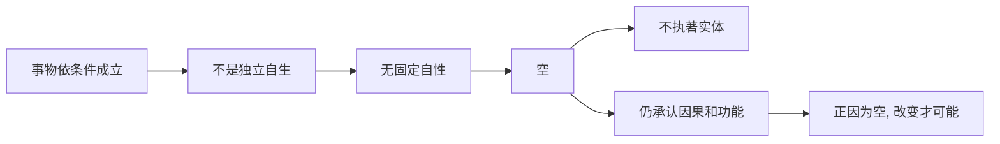

## 佛学思维筑基课: 上层定律07: 缘起性空

### 作者
digoal

### 日期
2026-05-18

### 标签
佛学 , 空性 , 缘起性空 , 中观 , 龙树 , 无自性 , 因果 , 无我 , 大乘 , 修行

----

## 背景

> 面向对象: 高中生到普通读者  
> 核心问题: “空”是不是说一切都不存在、都没有意义?  
> 先说结论: 缘起性空说, 事物因为依条件成立, 所以没有独立、固定、自足的自性。空不是虚无, 而是反实体化的智慧。

## 一张图先看懂

## 求真讲法

### 它到底说了什么

“空”不是“没有”。一张桌子不是没有, 但它不是独立自足地存在: 它依木材、工人、工具、用途、语言命名、使用场景成立。离开这些条件, 找不到一个永恒固定的“桌子自性”。

大乘中观把缘起推到更深处: 凡依条件成立者, 就没有自性; 正因为无自性, 才能生灭变化、发挥功能。

### 它是怎么来的

缘起性空是缘起公理和无我公理的上层展开。早期佛教已经用无我分析五蕴, 大乘尤其是龙树中观进一步把“无自性”推广为理解诸法的核心。

Stanford Encyclopedia of Philosophy 对龙树的介绍中指出, 龙树哲学的核心围绕空性展开, 并与缘起密切相关。

### 它依赖哪些假设

| 假设 | 说明 |
|---|---|
| 现象依条件成立 | 空性从缘起推出 |
| 自性指独立固定本质 | 空否定的是这种自性 |
| 名言层面仍有效 | 空不取消日常功能 |
| 执著自性会制造苦 | 把人和事物钉死为本质, 会加重执著 |

### 常见误解

误解一: 空就是什么都没有。错。空是否定自性, 不是否定现象和因果。

误解二: 空就是什么都可以。错。因果仍成立, 行为仍有后果。

误解三: 空是玄学概念, 和生活无关。错。每当你把“我就是这样的人”钉死时, 空性都能松动这个本质化判断。

## 求存讲法

### 它有什么用

空性帮助人减少本质化。不要把一次失败看成本质失败, 不要把一个人一次过错看成永久本性, 不要把一个制度当成永恒不可变。

### 它怎么迁移到熟悉领域

一个学生说“我天生不擅长表达”。空性视角会问: 表达能力依哪些条件成立? 词汇、练习、反馈、场景、安全感、结构模板。这些条件改变, 表达能力也会改变。

### 它的适用范围和边界

空性是深奥教义, 初学时容易落入虚无主义。实践中要同时抓住两点: 胜义上无自性, 世俗上因果和责任仍成立。

### 正例: 怎么用它提升能力

团队中某人曾经犯错。若大家把他定义为“永远不靠谱”, 他也难以改变。若用空性看, “不靠谱”是条件结果, 可以通过明确流程、反馈和承诺机制改变。

### 反例: 前提不成立会怎样

有人说“既然一切皆空, 承诺也空, 所以可以失信”。这是虚无主义。失败点在于只拿空否定责任, 却忘了缘起: 失信会破坏信任条件, 造成真实后果。

## 思考

空性最有力量的地方, 是让你不再把任何东西看死: 不把痛苦看死, 不把自己看死, 不把别人看死。但它同时要求你更尊重因果, 因为一切都在互相影响。

## 最后记住

1. 空不是没有, 而是无自性。
2. 缘起和空性是一体两面。
3. 空性不否定因果, 反而以因果为基础。
4. 正因为无固定本质, 改变才可能。

## 参考资料

- Stanford Encyclopedia of Philosophy, “Nāgārjuna”: https://plato.stanford.edu/entries/nagarjuna/
- Encyclopaedia Britannica, “Buddhism”: https://www.britannica.com/topic/Buddhism
- 《杂阿含经》, CBETA 电子佛典集成, 缘起与无我相关经文: https://tripitaka.cbeta.org/T02n0099_012
  
#### [PostgreSQL 解决方案集合](../201706/20170601_02.md "40cff096e9ed7122c512b35d8561d9c8")
  
  
#### [德哥 / digoal's Github - 公益是一辈子的事.](https://github.com/digoal/blog/blob/master/README.md "22709685feb7cab07d30f30387f0a9ae")
  
  
#### [About 德哥](https://github.com/digoal/blog/blob/master/me/readme.md "a37735981e7704886ffd590565582dd0")
  
  

  
