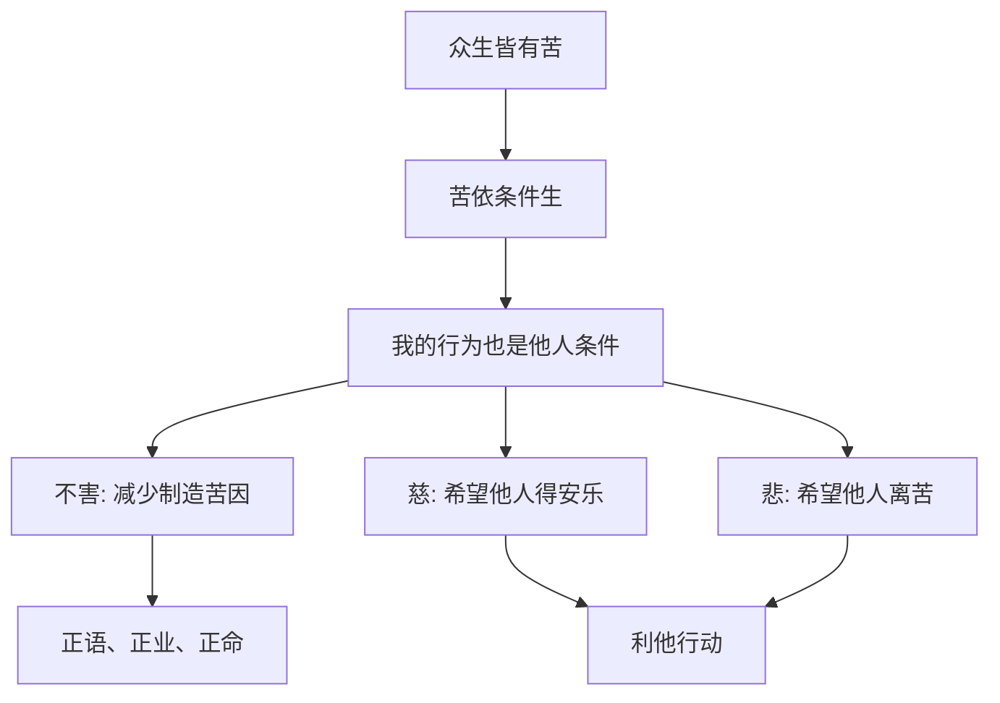

## 佛学思维筑基课: 上层定律08: 慈悲与不害

### 作者
digoal

### 日期
2026-05-18

### 标签
佛学 , 慈悲 , 不害 , 利他 , 伦理 , 正语 , 正业 , 缘起 , 无我 , 菩萨道

----

## 背景

> 面向对象: 高中生到普通读者  
> 核心问题: 佛学为什么会从无我、缘起走向慈悲, 而不是走向冷漠?  
> 先说结论: 慈悲与不害是缘起、无我和苦的机制在伦理上的展开。既然众生都在条件链中受苦, 修行就不能只求自己舒服, 还要减少自己制造的伤害。

## 一张图先看懂

## 求真讲法

### 它到底说了什么

慈是愿众生得乐, 悲是愿众生离苦。不害是最基础的伦理底线: 尽量不通过语言、行为、谋生方式给他人增加苦。

从佛学底层看, 这不是额外道德装饰。缘起说明我的行为会成为他人的条件; 无我削弱“只有我最重要”的执著; 苦的机制让人看见众生都被无明、贪爱、恐惧推动。因此, 慈悲是智慧的自然方向。

### 它是怎么来的

八正道中的正语、正业、正命已经体现不害原则。大乘传统进一步强调菩萨道, 把自利与利他结合起来。即使只从早期佛教看, 减少贪嗔痴也必然减少对他人的伤害。

### 它依赖哪些假设

| 假设 | 说明 |
|---|---|
| 他人也会苦 | 不是只有自己的痛苦真实 |
| 行为互为条件 | 我的身口意会影响他人 |
| 我执会制造隔离 | 过度自我中心削弱共情 |
| 慈悲需要智慧 | 没有边界的讨好不等于慈悲 |

### 常见误解

误解一: 慈悲就是软弱。错。慈悲可以很坚定, 包括制止伤害。

误解二: 不害就是不行动。错。有时不制止伤害, 反而纵容苦因。

误解三: 利他就是牺牲自己到崩溃。错。若自我耗尽导致更多混乱, 也不符合缘起智慧。

## 求存讲法

### 它有什么用

慈悲与不害让修行离开自我陶醉。一个人若打坐很久, 但说话尖刻、做事只顾自己, 他的训练并没有真正减少贪嗔痴。

### 它怎么迁移到熟悉领域

家庭中, 不害表现为不把情绪随意倾倒给亲近的人。工作中, 不害表现为不甩锅、不欺骗、不用信息优势压榨别人。社会中, 慈悲表现为看见弱者处境背后的条件, 而不是简单责怪。

### 它的适用范围和边界

慈悲不是取消边界。面对操控、暴力、长期伤害, 慈悲可以表现为远离、求助、报警、建立规则。佛学的不害包括不伤害自己。

### 正例: 怎么用它提升能力

一个团队负责人发现成员犯错。他不羞辱对方, 而是指出事实、分析条件、设定改进节点。这样既不放任错误, 也不制造额外羞耻和对抗。

### 反例: 前提不成立会怎样

有人把慈悲理解成“永远满足别人”。结果他长期透支, 最后怨恨爆发。失败点在于缺少智慧和边界, 把慈悲误读成讨好。

## 思考

如果缘起是真的, 那么你从来不是一个孤立的人。你的一句话、一个决定、一个沉默, 都可能成为别人痛苦或安稳的条件。慈悲不是高尚姿态, 是看懂互相依存之后的清醒行动。

## 最后记住

1. 慈悲与不害是佛学伦理的核心展开。
2. 缘起说明我的行为会成为他人的条件。
3. 无我削弱自我中心, 但不取消边界。
4. 真慈悲要有智慧, 不是软弱和讨好。

## 参考资料

- Encyclopaedia Britannica, “Buddhism”: https://www.britannica.com/topic/Buddhism
- Encyclopaedia Britannica, “Eightfold Path”: https://www.britannica.com/topic/Eightfold-Path
- SN 56.11, *Setting in Motion the Wheel of the Dhamma*: https://dhammatalks.net/suttacentral/sc2016/sc/en/sn56.11.html
  
#### [PostgreSQL 解决方案集合](../201706/20170601_02.md "40cff096e9ed7122c512b35d8561d9c8")
  
  
#### [德哥 / digoal's Github - 公益是一辈子的事.](https://github.com/digoal/blog/blob/master/README.md "22709685feb7cab07d30f30387f0a9ae")
  
  
#### [About 德哥](https://github.com/digoal/blog/blob/master/me/readme.md "a37735981e7704886ffd590565582dd0")
  
  

  
