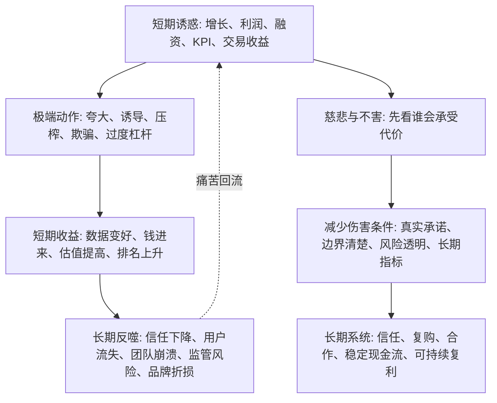

## 佛学思维筑基课: 慈悲与不害: 在复杂系统里减少长期反噬的底层原则

### 作者
digoal

### 日期
2026-05-18

### 标签
慈悲 , 不害 , 长期信任 , 系统反噬 , 产品伦理 , 运营信任 , 创业承诺 , 投资风险 , 管理边界 , 商业伦理

----

## 背景

> 面向对象: 大学生、产品经理、运营经理、有投资需求的人  
> 核心问题: 世界表面变化太快, 很多人为了短期成绩、增长、融资、利润、投资收益, 会合理化伤害: 欺骗用户、透支团队、诱导成瘾、夸大承诺、割裂信任。短期看似赢了, 长期却制造反噬。  
> 先说结论: 慈悲与不害不是软弱、讨好或放弃竞争, 而是一条复杂系统中的长期原则: 看见自己和他人都处在条件链中, 主动减少不必要的伤害, 不为了短期收益破坏信任、健康、现金流、生态和未来选择空间。

说明: 佛学中的慈悲常被解释为“予乐拔苦”: 慈是愿众生得乐, 悲是愿众生离苦; 不害则是不主动制造伤害。本文把它抽象为生活、产品、运营、创业、投资中的长期系统原则: 减少伤害条件, 保护信任网络, 避免短期动作制造长期代价。

## 一张图先看懂



## 求真讲法

### 它到底说了什么

慈悲与不害不是一句“要善良”的空话。它真正说的是:

> 在一个相互依赖的世界里, 你制造的伤害不会消失, 它会通过信任、关系、品牌、制度、现金流、心理压力和风险结构回到系统中。

从佛学底层公理看:

| 底层规律 | 推出什么 |
|---|---|
| 缘起 | 我和他人的结果相互依赖, 没有孤立收益 |
| 无常 | 短期优势会变化, 不能只靠一次掠夺 |
| 无我 | 自我不是孤立实体, 组织和关系会塑造未来 |
| 苦的机制 | 贪婪、恐惧、执取会制造伤害和反噬 |
| 业力与意图 | 反复伤害会形成习惯、文化和风险暴露 |

所以慈悲与不害不是道德装饰, 而是因果清醒: 如果你靠制造痛苦获得收益, 你也在制造未来的不稳定条件。

### 它是怎么来的

如果承认“众生都在苦的条件链中”, 慈悲就不是额外附加的美德, 而是自然推论。

```text
看见缘起: 他人的处境不是孤立的
看见无我: 我与他人的边界不是绝对切断的
看见苦: 伤害会制造新的痛苦循环
看见业力: 意图和行为会塑造未来系统
  ↓
慈悲与不害: 尽量减少不必要的苦, 不主动制造长期反噬
```

迁移到现实中, 这条原则要求我们问:

- 我的增长是否建立在用户误解上?
- 我的盈利是否来自对方信息不对称和无法承受的风险?
- 我的管理是否靠恐惧维持短期服从?
- 我的投资收益是否依赖误导他人接盘?
- 我的创业叙事是否把风险转嫁给员工、客户或投资人?

### 它依赖哪些假设

第一, 人和组织处在关系网络中。用户、员工、客户、投资人、家庭、平台、监管、社区不是彼此隔绝的孤岛。

第二, 伤害会留下后果。它可能不立刻显现, 但会沉淀为不信任、投诉、离职、监管、品牌折损、法律风险和心理内耗。

第三, 长期价值依赖信任。产品复购、组织协作、融资信用、投资复利和个人声誉都需要信任作为底层资产。

第四, 不害不是不竞争。竞争可以存在, 但竞争不必建立在欺骗、剥削、成瘾诱导和风险转嫁上。

第五, 慈悲需要智慧。没有边界的“好心”可能纵容坏行为, 也可能让自己被消耗。

### 常见误解

误解一: 慈悲就是软弱。  
不对。慈悲不是不拒绝、不止损、不竞争。真正的慈悲包含边界, 也包含阻止伤害继续发生。

误解二: 不害就是不产生任何负面结果。  
不现实。产品取舍、管理调整、投资止损都可能让一些人不舒服。不害指的是不主动制造不必要、不可告知、不可承受或可避免的伤害。

误解三: 慈悲就是牺牲自己。  
不对。长期自我压榨也会制造伤害。慈悲包括对自己、团队和系统的保护。

误解四: 商业和投资不需要慈悲。  
不对。商业和投资最依赖信任、契约、声誉和长期合作。忽视不害原则, 常常是在透支未来。

## 求存讲法

### 它有什么用

慈悲与不害最大的现实价值, 是让你看见短期收益背后的长期伤害账。

| 场景 | 短期诱惑 | 慈悲与不害的检查 |
|---|---|---|
| 学习 | 为成绩透支身体 | 这套节奏是否长期伤害健康和注意力? |
| 产品 | 用诱导设计提高点击 | 用户是否被误导、成瘾或承担隐性成本? |
| 运营 | 标题党和虚假承诺 | 是否透支用户信任和品牌资产? |
| 创业 | 对投资人和员工夸大进展 | 风险是否被诚实告知? 承诺是否可交付? |
| 投资 | 推票、带单、制造叙事 | 是否让别人承担自己不愿承担的风险? |
| 管理 | 高压压榨团队 | 短期产出是否换来长期离职和低信任? |

它把“能不能做”升级为“这样做会把痛苦转嫁给谁, 会在未来以什么形式回来”。

### 它怎么迁移到熟悉领域

#### 生活

对大学生来说, 慈悲不是只对别人温柔, 也包括不伤害自己的身体和未来。

长期熬夜、过度比较、用自我羞辱驱动学习, 可能短期有效, 但会训练出焦虑、厌学和低自尊。更好的方式是: 高标准, 低羞辱; 有训练, 有恢复; 看见差距, 但不把差距变成身份攻击。

#### 产品

产品中的不害原则尤其重要。

一个产品可以用红点、倒计时、默认勾选、复杂取消流程提高短期转化。但这会制造:

- 用户被诱导。
- 投诉和退款上升。
- 品牌信任下降。
- 团队习惯用操控替代价值。

慈悲不是不增长, 而是要求增长来自真实价值、清楚承诺和可持续关系。

#### 运营

运营中的慈悲与不害, 不是让文案没吸引力, 而是不把用户当作可收割对象。

```text
伤害式运营: 制造焦虑 -> 夸大承诺 -> 诱导购买 -> 售后崩盘
不害式运营: 呈现真实问题 -> 清楚边界 -> 匹配用户 -> 长期复购
```

前者像透支信用卡, 后者像积累信用记录。

#### 创业

创业者最容易用“公司还小”“先活下来”“行业都这样”合理化伤害。

慈悲与不害要求创始人至少守住几条底线:

| 对象 | 不害底线 |
|---|---|
| 客户 | 不承诺交付不了的能力 |
| 员工 | 不用使命包装长期无边界压榨 |
| 投资人 | 不用选择性数据制造虚假进展 |
| 用户 | 不把风险和成本藏在复杂条款里 |
| 自己 | 不用自我燃烧替代商业模式验证 |

这不是“做慢公司”, 而是避免公司从一开始就把信任债越滚越大。

#### 投融资

投资中的慈悲与不害有两个层面。

第一, 对自己不害: 不用超出承受能力的仓位、杠杆和借贷去追求收益。  
第二, 对他人不害: 不传播未验证信息, 不诱导别人接盘, 不把复杂风险包装成确定机会。

投资是风险交换。成熟的人要清楚: 自己能承受的风险, 别人未必能承受; 自己理解的波动, 别人未必理解。

### 它的适用范围和边界

慈悲与不害适合用于所有涉及他人利益、长期信任和系统后果的决策: 产品设计、运营增长、创业承诺、投资传播、团队管理、职业选择。

但它有边界。

第一, 不害不是无代价决策。裁剪产品、拒绝客户、止损投资、调整团队都可能带来痛苦, 但有时是为了避免更大的长期伤害。

第二, 慈悲不是纵容。面对欺骗、伤害和不负责任的人, 清晰边界和必要制止也是慈悲。

第三, 慈悲不能替代专业能力。好心但不专业, 仍然可能造成坏结果。

第四, 不害不是不承担风险。创业和投资天然有风险, 关键是风险是否透明、可承受、被合理分配。

### 正例: 怎么用它提升能力

一个产品经理发现“默认勾选续费”能显著提高短期收入, 但用户经常投诉不知情扣费。

他用慈悲与不害原则复盘:

1. 谁在承担隐性成本? 用户。
2. 短期收益来自真实价值, 还是来自信息不对称? 后者。
3. 长期后果是什么? 投诉、退款、监管风险、品牌不信任。
4. 可替代方案是什么? 清晰展示续费规则, 提供提前提醒, 用真实价值提高续费。

短期收入可能下降, 但用户信任、品牌资产和长期复购更稳。这不是“道德牺牲业务”, 而是把业务从诱导收入转向信任收入。

### 反例: 前提不成立会怎样

某创业公司为了融资, 对外宣称已有大量付费客户, 实际只是免费试用。创始人认为“先融到钱, 后面再补上”。

短期看, 公司估值提高。但伤害链已经形成:

- 投资人基于错误信息决策。
- 员工基于虚假增长加班和扩张。
- 客户被承诺尚不存在的能力。
- 团队开始习惯包装数据。
- 后续融资和交付压力越来越大。

失败的前提是: “只要最后做成, 过程中的误导就不重要。”慈悲与不害提醒我们, 误导不是中性工具, 它会改变组织人格和信任结构。

## 思考

慈悲与不害不是让人离开竞争, 而是让竞争不变成系统性伤害。

可以把它变成六个复盘问题:

| 问题 | 目的 |
|---|---|
| 这个决策会让谁承担成本? | 看见被转嫁的痛苦 |
| 对方是否知道并能承受这些风险? | 检查透明度和承受力 |
| 这个收益来自真实价值, 还是来自误导和信息不对称? | 区分价值和收割 |
| 如果所有人都这样做, 系统会变好还是变坏? | 检查可普遍化后果 |
| 这会训练团队什么习惯? | 看见组织业力 |
| 有没有伤害更小、长期更稳的替代方案? | 找到中道 |

对个人来说, 慈悲是不用羞辱自己驱动成长。  
对产品经理来说, 慈悲是不把用户弱点当作收割入口。  
对运营经理来说, 慈悲是不为短期数字透支长期信任。  
对创业者来说, 慈悲是不把风险藏给员工、客户和投资人。  
对投资者来说, 慈悲是不让贪婪和叙事伤害自己或他人。

## 最后记住

1. 慈悲与不害不是软弱, 而是复杂系统中的长期因果清醒。
2. 伤害不会凭空消失, 它会通过信任、品牌、组织、监管、现金流和心理压力回流。
3. 不害不是不竞争, 而是不靠欺骗、压榨、成瘾诱导和风险转嫁获利。
4. 慈悲需要边界; 没有边界的好心, 也可能制造新的痛苦。
5. 判断一个决策, 不只看短期收益, 还要看它会训练什么人、什么组织、什么市场。

## 参考资料

- Encyclopaedia Britannica, “Karuna”: https://www.britannica.com/topic/karuna
- Encyclopaedia Britannica, “Ahimsa”: https://www.britannica.com/topic/ahimsa
- Access to Insight, “Kakacupama Sutta: The Simile of the Saw”: https://www.accesstoinsight.org/tipitaka/mn/mn.021x.than.html
- SuttaCentral, “Karaṇīyamettā Sutta”: https://suttacentral.net/kp9/en/sujato
- Encyclopedia of Buddhism, “Brahmavihara”: https://encyclopediaofbuddhism.org/wiki/Brahmavihara
  
#### [PostgreSQL 解决方案集合](../201706/20170601_02.md "40cff096e9ed7122c512b35d8561d9c8")
  
  
#### [德哥 / digoal's Github - 公益是一辈子的事.](https://github.com/digoal/blog/blob/master/README.md "22709685feb7cab07d30f30387f0a9ae")
  
  
#### [About 德哥](https://github.com/digoal/blog/blob/master/me/readme.md "a37735981e7704886ffd590565582dd0")
  
  

  
