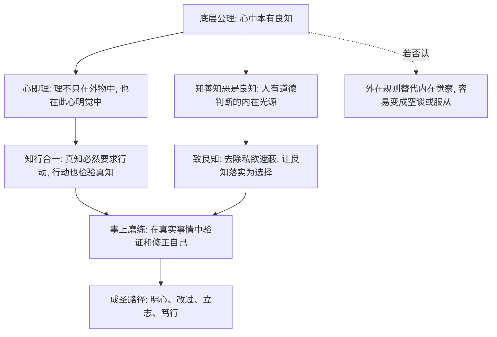
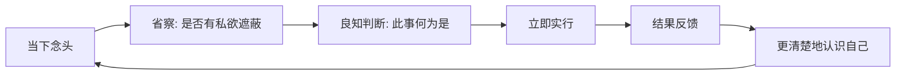

## 王阳明思维筑基课: 王阳明心学: 从底层公理到上层定律

### 作者
digoal

### 日期
2026-05-18

### 标签
王阳明 , 心学 , 良知 , 知行合一 , 心即理 , 致良知 , 事上磨练 , 立志 , 儒家思想 , 思维模型

----

## 背景

> 面向对象: 高中生及初学者  
> 核心问题: 王阳明思想为什么能从“心”推出一整套做人、学习、做事的方法？  
> 先说结论: 王阳明心学的底层公理可以概括为“人心本具判断善恶与成就道德行动的根源”。由此推出的经典上层定律，就是“心即理”“知行合一”“致良知”“事上磨练”等行动法则。

## 一张图先看懂



## 求真讲法

### 它到底说了什么

王阳明心学不是一句“跟着感觉走”。它关心的是一个更严肃的问题:

人为什么知道自己有些事“不该做”，却还是会做？人又怎样把“知道”变成真正的“做到”？

它的核心回答是:

1. 人心中本有一种能分辨是非善恶的能力，王阳明称为“良知”。
2. 真正的道理不只是外在书本和制度里的条文，也体现在人当下明白是非、愿意负责的心上。
3. 如果一个人只是嘴上知道，却没有行动，那还不是真知。
4. 修养不是逃离生活，而是在每一件具体事情中把良知做出来。

为了讲清楚，可以把王阳明心学拆成两层。

第一层是“底层公理”，也就是整套思想默认成立的根基。

第二层是“上层定律”，也就是从这些根基推出的做人和做事规则。

### 底层公理

这里的“公理”不是数学意义上的严格公理，而是解释王阳明思想时可以抽象出来的底层前提。它们不能都在心学内部被完全证明，更多是王阳明用来理解人、修养和社会秩序的根本选择。

| 层级 | 公理 | 白话解释 | 它支撑了什么 |
|---|---|---|---|
| 公理 1 | 心具良知 | 人内心本有分辨是非善恶的能力 | 致良知、改过、自我负责 |
| 公理 2 | 心与理不二 | 道理不是只在外部对象中，人的明觉之心也能呈现天理 | 心即理、反求诸己 |
| 公理 3 | 真知必含行动倾向 | 真正知道一件善事，就会推动自己去做；真正知道一件恶事，就会推动自己避开 | 知行合一 |
| 公理 4 | 私欲会遮蔽良知 | 人不是没有良知，而是常被利益、恐惧、名声、懒惰遮住 | 克己、省察、事上磨练 |
| 公理 5 | 圣凡同具此心 | 圣人与普通人的根本差别，不是有没有良知，而是良知是否被充分呈现 | 人人可学、人人可成德 |

最底层的是公理 1:

> 人心本具良知。

这句话可以理解为: 当你作弊、撒谎、欺负弱者、逃避责任时，心里通常并不是完全不知道问题在哪里。你可能会找理由，但内心深处有一个判断在提醒你。

王阳明把这个判断能力看得很重。他不是说人天然就完美，而是说人有一个可以回到正道的内在根据。

### 它是怎么来的

王阳明处在儒学传统中。他继承了孟子“人有恻隐、羞恶、辞让、是非之心”的方向，也回应了宋明理学中“理在哪里”的问题。

在朱熹一系的理解中，学习常被概括为“格物致知”，也就是通过考察事物来穷究其中之理。王阳明早年也曾试图向外穷理，后来逐渐转向一个判断:

如果只把“理”当作外在对象里的东西，人可能读很多书、讲很多道理，却不能解决自己当下的私欲和行动问题。

于是他强调:

理不只是外在知识，更要在人的心上被体认和实行。

这就形成了心学的关键转向:

```text
只向外找理:
书本/制度/名言 -> 我知道了很多道理 -> 但遇事仍可能做不到

回到此心:
当下的是非感 -> 省察私欲遮蔽 -> 在事情中实行 -> 知道变成做到
```

### 经典上层定律

#### 定律一: 心即理

“心即理”不是说“我怎么想都是真理”。它更准确的意思是:

当心没有被私欲遮蔽时，心中呈现的是非判断，就是天理在人身上的显现。

所以它反对两种偏差。

一种偏差是只向外找标准，结果变成背书和服从，却没有真实自省。

另一种偏差是把个人欲望当真理，结果变成任性。

“心即理”的难点在于“心”不是随便的情绪，而是经过省察、去私欲之后的良知之心。

#### 定律二: 知行合一

“知行合一”常被误解为“知道之后要去做”。但王阳明说得更狠:

如果你没有做到，就说明你的“知道”还不够真。

比如，一个人说“我知道熬夜伤身体”，但每天仍然毫无节制地熬夜。王阳明不会把这看成“知而不行”，而会说: 你只是听过这个道理，还没有真正把它知道到心里。

真知不是信息存储，而是会改变行动的明白。

#### 定律三: 致良知

“致”可以理解为“推到极处、落实出来”。“致良知”不是发明一个新的良知，而是把原本已有的良知从遮蔽中释放出来，并落实到具体选择里。

它包含三步:

1. 觉察: 我此刻的念头有没有被私欲带偏？
2. 分辨: 良知真正知道的应当是什么？
3. 实行: 在这件事上立刻做出符合良知的行动。

#### 定律四: 事上磨练

王阳明不主张把修养变成空想。一个人是否真的有良知，要在真实事情里看。

考试时是否诚实，和同学相处时是否公平，面对利益时是否守信，遇到压力时是否负责，这些都是“事上磨练”。

没有事情，良知就容易停留在口号里。有事情，良知才会被检验。

#### 定律五: 立志为本

王阳明很重视“立志”。这里的志，不只是“我想成功”，而是“我想成为什么样的人”。

没有志，良知容易被短期利益牵走。立志相当于给人生设置一个高阶目标，让每次选择有方向。

### 它依赖哪些假设

王阳明心学依赖几个重要假设:

1. 人不是纯粹由外部奖惩驱动的动物，人有内在道德觉察。
2. 善恶不是完全相对的，人可以在具体情境中辨认更合宜的选择。
3. 认知和行动不是两套完全分离的系统，真正的理解会改变行为。
4. 人的错误常常不是因为完全无知，而是因为私欲遮蔽、意志软弱、习惯失控。
5. 修养必须进入真实生活，不可能只靠语言、概念和仪式完成。

如果这些假设不成立，心学的力量会下降。比如，一个人完全没有羞耻感，也完全不承认有任何共同的是非标准，那么“致良知”就很难启动。

### 常见误解

| 误解 | 为什么不对 | 更准确的理解 |
|---|---|---|
| 心即理就是我想怎样就怎样 | 王阳明说的“心”不是私欲和情绪 | 心要去私欲，良知才显现 |
| 知行合一就是先学完再行动 | 这仍把知和行分成两截 | 行动本身就是理解的一部分 |
| 致良知就是凭直觉 | 直觉可能被利益和情绪污染 | 要省察、辨别、落实 |
| 事上磨练就是吃苦 | 吃苦本身不等于修养 | 在具体事情中校准良知和行动 |
| 人人可成圣就是人人很容易成功 | 王阳明说的是道德可能性，不是现实轻松性 | 人人有根基，但仍需长期工夫 |

## 求存讲法

### 它有什么用

王阳明心学最有用的地方，不是让人会背几句古文，而是解决三类问题。

第一，解决“知道很多却做不到”的问题。

第二，解决“总想从外部找答案，却不愿面对自己”的问题。

第三，解决“人在复杂处境里如何保持判断力”的问题。

它把学习、修身、管理、带兵、做事统一到一个核心动作:

回到当下这一念，辨认良知，马上实行。

### 它怎么迁移到熟悉领域

#### 学习

学生常说“我知道要复习”，但真正的知行合一会问:

你是否已经把“复习有必要”落实成今天的 30 分钟行动？

如果没有，说明你还停留在“听过”层面。

#### 工作

一个团队开会时都说“用户第一”，但上线前发现明显问题却没人负责。按心学看，这不是不知道用户重要，而是名声、进度、责任规避遮蔽了良知。

#### 管理

管理者不能只靠制度压人。制度当然重要，但如果员工完全没有内在责任感，只会最低限度服从。心学提醒管理者: 好组织要同时建设外部规则和内部责任。

#### 技术

工程师知道代码有隐患，却因为赶进度装作没看见。这就是“知道”没有进入行动。知行合一要求把风险说出来，并用合适的方式处理。

### 它的适用范围和边界

王阳明心学适合处理人的自我修养、责任判断、行动一致性和价值选择。

但它不能替代所有外部知识。

例如，医生不能只凭“良知”做手术，还必须学习解剖学、药理学和临床证据。工程师不能只凭“此心光明”写系统，还必须理解架构、协议、测试和安全。

所以更准确的边界是:

```text
心学解决: 我为什么做、该不该做、是否诚实负责、如何把知道变成做到
专业知识解决: 怎么做才有效、有哪些事实、技术路径是否可行
制度规则解决: 多人协作时如何约束、分工、审计、纠偏
```

心学强在“主体修养”，弱在“替代专业知识”。把它用错，就会从深刻变成空泛。

### 正例: 怎么用它提升能力

假设你准备考试，经常拖延。

普通说法是: “我要更自律。”

心学式做法会更具体:

1. 觉察: 我现在刷手机，是因为累，还是因为逃避难题？
2. 分辨: 我的良知知道此刻该先完成哪一件事？
3. 行动: 先做 20 分钟最难的一题，不等情绪准备好。
4. 复盘: 做完后观察，刚才的逃避理由是否真实？

这个过程不是骂自己，而是把“知道该学习”变成一个可执行的动作。

### 反例: 前提不成立会怎样

一个公司喊“诚信第一”，但销售团队被设置了极端短期的业绩考核。员工明知道夸大承诺不对，却会因为奖金和排名压力继续这么做。

这里失败的不是“诚信”这句话，而是心学的前提被破坏了:

1. 私欲遮蔽太强: 短期利益压过良知判断。
2. 事上磨练缺失: 组织没有在真实业务中保护诚实行为。
3. 知行合一断裂: 价值观停留在墙上，没有进入激励机制。

所以只讲“致良知”不够。真实世界里，还需要制度、流程和评价方式支持良知落地。

## 思考

王阳明心学最值得追问的地方，是它既相信人心中有光，又不天真地认为人自然会发光。

它真正的问题意识不是“人是不是善良”，而是:

当我已经隐约知道什么是对的，为什么还会不做？

这个问题放到今天仍然尖锐。

我们知道沉迷短视频会浪费时间，知道拖延会积累风险，知道欺骗会破坏信任，知道逃避沟通会让问题变大。可是知道并不自动改变行为。

王阳明的答案是: 那些还不是真知。真知必须进入行动，行动也会反过来照见你到底知不知道。

可以把心学理解成一个行动闭环:



如果把这套思想迁移到现代生活，它提醒我们:

真正改变人的，不是多知道一个概念，而是在下一件具体事情里做出不同选择。

## 最后记住

1. 王阳明心学的底层公理是“人心本具良知”，不是“个人欲望就是真理”。
2. “心即理”强调道理必须回到人的真实省察中，但前提是去除私欲遮蔽。
3. “知行合一”不是知道后再行动，而是真知本身就包含行动要求。
4. “致良知”是把内在是非判断落实到具体事情中。
5. “事上磨练”说明修养不能停在书本和口号里，必须在真实处境中接受检验。

## 参考资料

1. 王守仁: 《传习录》。
2. 王守仁: 《大学问》。
3. 《孟子》。
4. 陈来: 《有无之境: 王阳明哲学的精神》。
5. 牟宗三: 《从陆象山到刘蕺山》。
6. 钱穆: 《阳明学述要》。
  
#### [PostgreSQL 解决方案集合](../201706/20170601_02.md "40cff096e9ed7122c512b35d8561d9c8")
  
  
#### [德哥 / digoal's Github - 公益是一辈子的事.](https://github.com/digoal/blog/blob/master/README.md "22709685feb7cab07d30f30387f0a9ae")
  
  
#### [About 德哥](https://github.com/digoal/blog/blob/master/me/readme.md "a37735981e7704886ffd590565582dd0")
  
  

  
