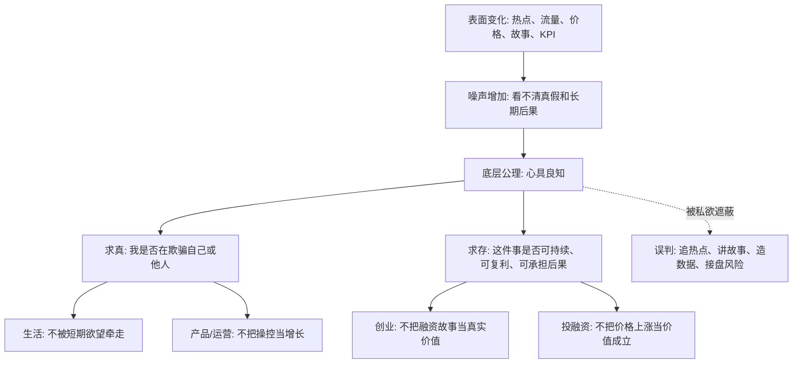

## 王阳明思维筑基课: 心具良知: 在变化太快的世界里，如何抓住不变的判断底座

### 作者
digoal

### 日期
2026-05-18

### 标签
王阳明 , 心学 , 良知 , 底层规律 , 判断力 , 自欺 , 产品经理 , 运营经理 , 投融资 , 创业

----

## 背景

> 面向对象: 大学生、产品经理、运营经理、有投资需求的人  
> 核心问题: 世界表面变化太快，热点、技术、商业模式、资产价格天天变，普通人怎样不被现象牵着走？  
> 先说结论: “心具良知”不是一句道德口号，而是一个判断底座: 人在复杂利益、噪声和压力中，仍然有能力分辨什么更真实、更正当、更可持续。它不能替代专业知识，但能帮助我们识别伪需求、伪增长、伪价值和伪成功。

## 一张图先看懂



## 求真讲法

### 它到底说了什么

“心具良知”来自王阳明心学，可以先用一句白话理解:

> 人心里本来就有一种分辨是非、真假、善恶、可不可持续的能力，只是它常常被利益、恐惧、虚荣、短期压力遮住。

这里的“良知”不是情绪，也不是“我喜欢什么就是什么”。它更像一个内在的校验器。

当你为了完成 KPI 想做一个诱导用户误点的按钮时，心里通常知道这不太对。

当你看到一个项目只有故事、没有现金流、没有真实用户，却因为身边人都在买而想冲进去时，心里通常知道这里有风险。

当创业者把“用户增长”包装得很好看，但增长来自补贴、刷量、夸大口径，内心通常也知道这不是健康增长。

这就是“心具良知”的现实意义: 在表象快速变化时，它提醒你先问一个不变的问题:

> 我是不是在用复杂概念掩盖一个简单事实？

### 它是怎么来的

王阳明讨论“良知”，是在儒家修身传统里回答一个老问题:

为什么人明明知道很多道理，却仍然做不到？

他的答案不是“你学得还不够多”，而是:

很多时候，人不是完全不知道，而是不愿意面对自己已经知道的判断。

所以，“心具良知”不是靠外部证明推出的数学定理，而是一条修身和判断系统中的底层公理。它的作用是给人一个起点:

1. 人不是只能被环境、激励和欲望推动。
2. 人有能力对自己的动机做二次判断。
3. 人能分辨短期有利和长期正当之间的差别。
4. 人能在无人监督时知道自己是否越界。

它解决的不是“我掌握了多少信息”，而是“我是否愿意面对信息背后的真实含义”。

### 它依赖哪些假设

把“心具良知”当成底层公理，需要承认几个前提。

| 假设 | 含义 | 如果不成立会怎样 |
|---|---|---|
| 人有内在判断力 | 人不只是奖惩机器，也能反省自己的动机 | 所有判断只能交给外部规则、算法或权威 |
| 善恶真假不是完全相对 | 在具体场景中，人能分辨更诚实、更公平、更可持续的选择 | 一切都变成“谁赢谁有理” |
| 私欲会遮蔽判断 | 利益、恐惧、面子、从众会让人假装不知道 | 人会把短期收益包装成长期正确 |
| 行动会暴露真知 | 你真正相信什么，最终会体现在选择上 | 语言、PPT、价值观口号无法被检验 |
| 长期后果不可逃避 | 欺骗用户、欺骗市场、欺骗自己，迟早会反映到信任和现金流上 | 短期套利会被误当成真正能力 |

这几个假设放到现代社会，就是一个判断模型:

```text
信息更多 != 判断更好
工具更强 != 动机更正
增长更快 != 价值更真
价格更高 != 风险更低
故事更大 != 事实更硬
```

“心具良知”的作用，是把人从表面指标拉回到底层事实。

### 常见误解

| 误解 | 为什么不对 | 更准确的理解 |
|---|---|---|
| 良知就是善良 | 善良可能只是情绪，良知还包括真实、责任和边界 | 良知是对真假、善恶、后果的综合判断 |
| 良知可以替代专业知识 | 投资、产品、创业都需要专业方法 | 良知负责校准动机和底线，专业知识负责解决事实和技术问题 |
| 凭良知就一定不会错 | 人会被私欲遮蔽，也会因信息不足而误判 | 良知需要事实、反馈和行动检验 |
| 商业世界只讲利益 | 短期可以只讲利益，长期仍然受信任、契约和复利约束 | 商业不是反道德，而是把道德后果延迟结算 |
| 投资只看收益率 | 收益率背后有风险、期限、杠杆、流动性和诚信 | 看不见风险的收益率，往往不是收益，是诱饵 |

## 求存讲法

### 它有什么用

表面变化快，会制造三种麻烦。

第一，真伪难辨。一个产品看起来用户很多，可能是补贴堆出来的；一家公司看起来增长很快，可能是透支未来；一个投资机会看起来确定性很高，可能只是叙事拥挤。

第二，未来难判。只看现象，你看到的是价格、榜单、热搜、融资新闻；看底层，你才会问需求是否真实、成本是否下降、信任是否增加、现金流是否改善。

第三，行动容易变形。人在压力下会把“我知道不对”改写成“大家都这样”“这只是行业惯例”“先活下来再说”。

“心具良知”的用处，是给你一个反欺骗机制。它先不问复杂模型，而问四个朴素问题:

1. 我是否知道这里有不诚实的地方？
2. 我是否在用短期指标掩盖长期代价？
3. 如果所有细节公开，我还愿意这样做吗？
4. 如果后果回到自己身上，我还认为它合理吗？

这四个问题很简单，但足以拆掉很多漂亮包装。

### 它怎么迁移到生活、产品、运营、创业和投资

#### 生活: 从“想要”回到“应当”

表面现象是: 我想买、我想玩、我想赢、我想被看见。

底层问题是: 这个选择会让我更自由，还是更被欲望控制？

“心具良知”不是压抑欲望，而是让你看清欲望的真实价格。你真正要判断的不是“爽不爽”，而是“这个爽是否值得我付出注意力、信用、健康和时间”。

#### 产品经理: 从“用户点击”回到“用户价值”

产品世界里，最常见的表象是点击率、转化率、留存率。

这些指标有用，但也容易被操控。一个弹窗可以提高点击，一个复杂取消流程可以提高留存，一个夸张标题可以提高打开率。

良知在这里不是抽象道德，而是产品判断:

> 用户完成了自己的目标，还是被我设计进了我的目标？

如果增长来自误导、焦虑、沉没成本和信息不对称，这种增长不是资产，而是信任负债。

#### 运营经理: 从“热闹”回到“关系质量”

运营最容易被表面热闹骗: 群很活跃、活动很多、数据好看、声量很高。

但真正的底层问题是:

1. 用户是否因为真实价值留下？
2. 内容是否提高了用户判断力？
3. 激励是否吸引了正确的人？
4. 社群是否积累了信任，而不是消耗了信任？

良知要求运营者承认一个事实: 低质量刺激可以换来短期活跃，但会消耗长期关系。

#### 创业者: 从“融资故事”回到“价值创造”

创业最迷人的表象，是宏大叙事、高速增长、资本认可、媒体报道。

但“心具良知”会把问题压回最朴素的一层:

> 如果没有补贴、没有包装、没有融资新闻，客户还愿意持续付费吗？

创业不是证明自己聪明，而是持续解决真实问题。凡是靠遮蔽真实成本、夸大市场需求、延迟暴露风险来维持的商业模式，都会在某个时刻向现金流、口碑或监管还债。

#### 投融资: 从“价格上涨”回到“价值成立”

投资者最容易被表面价格教育。涨了，就觉得逻辑成立；跌了，就觉得逻辑破产。

但价格是现象，价值才是底层。

“心具良知”在投资中不是让你凭感觉买卖，而是逼你诚实回答:

1. 我懂这个资产如何创造现金流或效用吗？
2. 我是在判断价值，还是害怕错过？
3. 我的收益假设是否依赖下一个人用更高价格接盘？
4. 如果价格短期腰斩，我是否还能说清楚持有理由？
5. 这里有没有我明知存在、却故意忽略的风险？

投资中最大的欺骗，往往不是别人骗你，而是你配合一个好故事骗自己。

### 它的适用范围和边界

“心具良知”适合解决三类问题:

1. 动机问题: 我为什么要做这件事？
2. 边界问题: 这件事有没有欺骗、伤害、透支和不可承担后果？
3. 长期问题: 它是否能积累信任、能力、现金流和复利？

但它不能替代三类东西:

1. 事实调查: 市场规模、用户需求、财务数据、技术可行性仍要验证。
2. 专业模型: 投资要看估值、现金流、资产负债表、竞争格局和周期。
3. 制度约束: 组织不能只靠个人良知，还要有流程、审计、权限和激励设计。

可以用一张表区分:

| 问题 | 良知能解决什么 | 良知不能替代什么 |
|---|---|---|
| 生活选择 | 判断是否自欺、是否透支长期自由 | 医学、法律、心理咨询等专业帮助 |
| 产品增长 | 判断是否误导用户、是否消耗信任 | 用户研究、数据分析、工程实现 |
| 运营活动 | 判断是否制造低质刺激、是否伤害关系 | 渠道策略、内容生产、活动机制 |
| 创业决策 | 判断是否创造真实价值、是否靠故事续命 | 商业模型、现金流管理、组织能力 |
| 投融资 | 判断是否被贪婪和恐惧遮蔽 | 财务分析、行业研究、风险控制 |

### 正例: 怎么用它提升能力

假设你是一个产品经理，发现一个新弹窗能让付费转化率提升 15%。团队很兴奋，但你心里知道这个弹窗的文案有明显诱导性，会让一部分用户误以为“不买就会失去已有权益”。

按“心具良知”的方法，不是简单说“我觉得不好”，而是做四步:

1. 说清事实: 这个方案提高了短期转化，但依赖用户误解。
2. 说清代价: 它可能带来投诉、退款、差评和品牌信任下降。
3. 设计替代: 保留清晰权益说明，用真实价值而不是恐惧推动购买。
4. 设定检验: 不只看转化率，也看退款率、投诉率、复购率和 NPS。

这里的良知不是阻碍增长，而是把“坏增长”改造成“可持续增长”。

### 反例: 前提不成立会怎样

假设一个创业项目靠“AI 改变一切”的故事融资，但真实情况是:

1. 产品没有稳定复购。
2. 用户主要来自补贴。
3. 收入确认口径模糊。
4. 团队内部知道数据质量有问题，但对外只讲高增长。
5. 投资者因为害怕错过，没有追问现金流和留存。

这时，“心具良知”的前提被三种私欲遮蔽了。

| 遮蔽 | 表现 | 后果 |
|---|---|---|
| 创业者的名利心 | 用故事遮蔽真实经营质量 | 融资后增长无法兑现 |
| 投资者的贪婪和 FOMO | 把共识热度当成事实验证 | 高位进入，承担估值回撤 |
| 组织的短期激励 | 谁讲真话谁破坏气氛 | 风险越滚越大 |

失败不是因为“他们完全不知道”，而是因为他们不愿意承认自己已经知道的问题。

这就是“心具良知”最锋利的地方: 它不让你躲在复杂世界背后。

## 思考

很多人以为，世界越复杂，就越需要更复杂的模型。

这只对了一半。

复杂模型当然重要，但复杂模型也可能成为遮羞布。一个人可以用一堆专业词汇包装一个简单的事实: 这个业务没有真实需求，这个增长不可持续，这个投资只是击鼓传花，这个选择只是我在逃避。

所以，越是复杂环境，越需要底层公理。

“心具良知”的现代价值，不是让人变成道德说教者，而是训练一种穿透力:

```text
看见热闹 -> 追问真实需求
看见增长 -> 追问增长质量
看见收益 -> 追问风险来源
看见共识 -> 追问谁在承担后果
看见成功 -> 追问是否可持续复利
```

这套追问会让你慢下来，但不会让你变慢。它减少的是错误加速。

一个大学生如果能早一点理解这件事，就不会把短期认可误认为长期能力。

一个产品经理如果能理解这件事，就不会把操控用户误认为创造价值。

一个运营经理如果能理解这件事，就不会把热闹误认为关系资产。

一个创业者如果能理解这件事，就不会把融资能力误认为商业成立。

一个投资者如果能理解这件事，就不会把价格上涨误认为价值无风险。

最后可以问自己一个很硬的问题:

> 如果我把所有包装词拿掉，只保留事实、动机、后果和长期复利，这件事还站得住吗？

如果站得住，继续深入研究。

如果站不住，越热闹越要警惕。

## 最后记住

1. “心具良知”不是凭感觉做判断，而是承认人有能力识别自欺、欺人和长期后果。
2. 表面变化越快，越要回到底层问题: 真实需求、真实价值、真实风险、真实责任。
3. 良知不能替代专业知识，但能防止专业知识被私欲拿去包装错误。
4. 产品、运营、创业、投资中最危险的误判，常常不是不知道，而是不愿承认自己知道。
5. 判断一件事能否长期成立，要看它是否积累信任、能力、现金流和复利，而不是只看短期热度。

## 参考资料

1. 王守仁: 《传习录》。
2. 王守仁: 《大学问》。
3. 《孟子》。
4. 陈来: 《有无之境: 王阳明哲学的精神》。
5. 钱穆: 《阳明学述要》。
6. 参考本地文章: `/Users/digoal/blog/202605/20260518_72.md`。

  
#### [PostgreSQL 解决方案集合](../201706/20170601_02.md "40cff096e9ed7122c512b35d8561d9c8")
  
  
#### [德哥 / digoal's Github - 公益是一辈子的事.](https://github.com/digoal/blog/blob/master/README.md "22709685feb7cab07d30f30387f0a9ae")
  
  
#### [About 德哥](https://github.com/digoal/blog/blob/master/me/readme.md "a37735981e7704886ffd590565582dd0")
  
  

  
