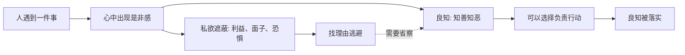

## 王阳明思维筑基课: 公理一: 心具良知

### 作者
digoal

### 日期
2026-05-18

### 标签
王阳明 , 心学 , 公理 , 良知 , 是非判断 , 道德觉察 , 自我反省 , 私欲遮蔽 , 儒家 , 修身

----

## 背景

> 面向对象: 高中生及初学者  
> 核心问题: 王阳明为什么说人不是从外面才学会善恶，而是心中本来就有判断善恶的能力？  
> 先说结论: “心具良知”是王阳明心学最底层的公理。它不是说人天生不会犯错，而是说人心中本有一种知道是非善恶的明觉，只是常被私欲、恐惧和习惯遮蔽。

## 一张图先看懂

## 求真讲法

### 它到底说了什么

“心具良知”的意思是: 人心里原本就有一种知道善恶、是非、轻重的能力。

比如你看到同学被故意羞辱，心里会觉得“不太对”；你考试作弊后，即使没人发现，心里也会有不安。这种“不安”和“觉得不对”，不是老师现场给你的规则，而是你心中已经有判断。

这里要注意，王阳明不是说人天然完美。人会犯错，会自私，会欺骗自己。但他认为，人犯错时往往不是完全不知道，而是知道却被私欲遮住。

### 它是怎么来的

这个公理继承了孟子“恻隐之心、羞恶之心、辞让之心、是非之心”的传统。王阳明把它推进为“良知”概念，强调道德判断不只是外部教条，而是此心本有的明觉。

它解决的问题是: 如果人完全没有内在道德根基，那么修养只能靠外部命令和惩罚；但如果人心中本有良知，教育和修养就可以变成“唤醒”和“落实”。

### 它依赖哪些假设

| 假设 | 含义 | 如果不成立 |
|---|---|---|
| 人有基本是非感 | 人不是纯粹被奖惩推动 | 道德教育只能靠强制 |
| 良知可能被遮蔽 | 犯错不等于没有良知 | 修养就只剩惩罚 |
| 良知需要落实 | 知道善恶还要做出来 | 良知会停留在口号 |

### 常见误解

“心具良知”不是“我觉得怎样就是对的”。个人情绪、冲动和欲望不等于良知。

“心具良知”也不是“人不用学习”。人需要学习事实、知识、制度和经验，但这些外部知识要回到内心判断中被承担。

## 求存讲法

### 它有什么用

它让人从“别人没管我就可以乱来”，转向“我自己知道这件事是否对得起人”。这是一种内在责任感。

### 它怎么迁移到熟悉领域

学习上，良知表现为你知道自己是否真的用心。工作上，良知表现为你知道自己有没有故意糊弄。关系中，良知表现为你知道一句话是否伤人。

### 它的适用范围和边界

它适合处理自我反省、道德判断和责任选择。但它不能替代专业知识。医生需要医学，工程师需要技术，学生需要训练；良知决定“要负责”，知识决定“怎么负责”。

### 正例: 怎么用它提升能力

写作业时，你发现自己想直接抄答案。按“心具良知”的方法，不是先骂自己，而是停一下问: 我心里其实知不知道这不是真学习？然后先做一道自己能做的题，把良知变成行动。

### 反例: 前提不成立会怎样

如果一个班级只看分数，不管作弊，学生的短期利益会持续遮蔽良知。问题不是大家不知道作弊不对，而是制度和环境鼓励他们压低内心的不安。

## 思考

“心具良知”最锋利的地方在于: 它把人从借口里拉出来。很多时候我们不是不知道，而是不愿意承认自己知道。

如果你今天做一件小事时，心里已经知道它不对，你会把这个声音当作麻烦，还是当作自我改变的起点？

## 最后记住

1. 良知是心中本有的是非明觉。
2. 犯错常常不是没有良知，而是良知被遮蔽。
3. 良知不是情绪和欲望。
4. 修养的第一步是承认自己其实知道什么是更对的。

## 参考资料

1. 王守仁: 《传习录》。
2. 王守仁: 《大学问》。
3. 《孟子》。
4. 钱穆: 《阳明学述要》。
  
#### [PostgreSQL 解决方案集合](../201706/20170601_02.md "40cff096e9ed7122c512b35d8561d9c8")
  
  
#### [德哥 / digoal's Github - 公益是一辈子的事.](https://github.com/digoal/blog/blob/master/README.md "22709685feb7cab07d30f30387f0a9ae")
  
  
#### [About 德哥](https://github.com/digoal/blog/blob/master/me/readme.md "a37735981e7704886ffd590565582dd0")
  
  

  
