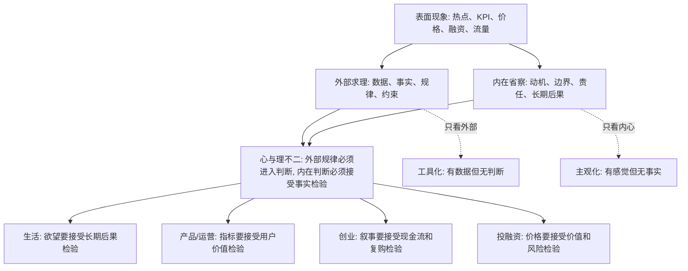

## 王阳明思维筑基课: 心与理不二: 在复杂世界里，如何把外部规律和内在判断接起来

### 作者
digoal

### 日期
2026-05-18

### 标签
王阳明 , 心学 , 心与理不二 , 判断力 , 外部规律 , 内在省察 , 产品 , 运营 , 创业 , 投资

----

## 背景

> 面向对象: 大学生、产品经理、运营经理、有投资需求的人  
> 核心问题: 世界表面变化太快，信息、技术、价格、叙事不断翻新，我们如何判断什么是真规律、真价值、真机会？  
> 先说结论: “心与理不二”不是说“我觉得对就对”，而是说真正的道理既不只在外部数据里，也不只在主观感觉里；它必须在客观规律、真实后果和人的清明判断中同时站得住。只看外部现象会被噪声骗，只看内心偏好会被欲望骗。

## 一张图先看懂



## 求真讲法

### 它到底说了什么

“心与理不二”可以拆开理解。

“心”不是随便的情绪，而是人的判断、觉察、责任感和价值取向。

“理”不是空洞口号，而是事物运行的规律、边界、因果、结构和后果。

“不二”不是说心和理完全没有区别，而是说真正可靠的判断不能把二者割裂。

换成现代语言:

> 真实判断 = 外部事实和规律 + 内在清明和责任。

只看外部事实，容易变成“数据看起来对，所以就对”。但数据口径可能被设计，指标可能被操控，短期结果可能透支长期。

只看内在感觉，容易变成“我相信，所以就对”。但信念可能来自欲望、恐惧、面子和从众。

“心与理不二”要解决的，就是这两种误判。

### 它是怎么来的

在儒家和宋明理学传统中，“理”常被理解为万事万物背后的秩序和应然规则。朱熹一系强调向外格物穷理，通过研究事物来理解道理。

王阳明不否认事物中有理，但他反对把“理”完全放到心外，好像人只要不断向外搜集知识，就自然能做出正确选择。

他的问题意识是:

一个人读了很多书、掌握很多规则、看了很多数据，为什么仍然可能自欺、作恶、逃避责任？

王阳明的回答是: 因为“理”必须回到此心，被真实体认，并落实到行动中。否则，道理只是外在信息，不会变成判断力。

所以，“心与理不二”可以理解为一条底层公理:

> 真正的理，不是脱离人的清明判断而存在的死规则；真正的心，也不是脱离事实规律而任意漂浮的主观感觉。

它不是数学定理，不能在心学内部被形式化证明。它更像一种判断系统的起点: 人既要敬畏客观规律，也要对自己的动机和选择负责。

### 它依赖哪些假设

| 假设 | 含义 | 如果不成立会怎样 |
|---|---|---|
| 世界有可认识的规律 | 现象背后存在因果、结构、边界和约束 | 判断只能追随热点和情绪 |
| 人有内在判断能力 | 人不只是接收信息，还能省察动机和后果 | 数据和权威会替人完成所有判断 |
| 事实与价值不能长期割裂 | 不真实、不负责任的选择会在长期产生代价 | 短期漂亮会被误认为长期正确 |
| 外部指标可能失真 | 数据、榜单、估值、KPI 都可能被口径和激励扭曲 | 人会把表面结果误当作规律本身 |
| 内在感受可能被私欲污染 | 喜欢、恐惧、贪婪、从众会伪装成判断 | 人会把愿望误当作洞察 |

这几个假设放到生活和商业里，可以变成一个判断公式:

```text
可靠判断 = 事实证据 x 因果理解 x 内在诚实 x 长期后果
```

任何一项接近 0，判断质量都会大幅下降。

### 常见误解

| 误解 | 为什么不对 | 更准确的理解 |
|---|---|---|
| 心与理不二就是主观唯心 | 它不是说外部世界由我决定 | 它说外部规律必须被人的真实判断体认和实行 |
| 心里觉得对就是真理 | 感觉可能被欲望和恐惧污染 | 内在判断必须接受事实和后果检验 |
| 有数据就等于有理 | 数据可能口径错误、样本偏差、激励扭曲 | 数据要放回因果链和真实场景中解释 |
| 只要符合规则就没有问题 | 规则可能滞后，也可能被钻空子 | 合规之外还要看责任、后果和长期信任 |
| 做商业不能讲心 | 商业长期依赖信任、契约、复购和声誉 | 心不是软弱，而是长期风险控制的一部分 |

## 求存讲法

### 它有什么用

表面变化快时，人最容易犯两类错误。

第一类是“外部迷信”: 热点说什么就信什么，数据涨了就以为价值成立，价格涨了就以为风险降低，融资多了就以为商业模式成立。

第二类是“内部迷信”: 我喜欢这个方向，所以它一定有未来；我害怕错过，所以现在必须买；我相信这个团队，所以不用看财务；我讨厌某个行业，所以它一定没有价值。

“心与理不二”的用处，是让判断同时经过两道门。

第一道门是外部规律:

事实是否成立？因果是否成立？成本是否成立？现金流是否成立？用户价值是否成立？

第二道门是内在省察:

我是否在自欺？我是否被贪婪或恐惧推动？我是否把短期好处包装成长期正确？我是否愿意承担后果？

两道门都过，判断才更可靠。

### 它怎么迁移到熟悉领域

#### 生活: 不把欲望当理由

生活中的表面现象是: 想买、想玩、想赢、想被认可。

外部的“理”会问: 这个选择对时间、健康、信用、关系有什么后果？

内在的“心”会问: 我是真的需要，还是在用消费、娱乐、炫耀缓解焦虑？

“心与理不二”要求你既不压抑真实需要，也不纵容短期欲望。

#### 产品经理: 不把指标当真理

产品经理每天面对点击率、转化率、留存率、时长、付费率。

这些指标是外部“理”的一部分，但不是全部。指标上涨可能来自真实价值，也可能来自误导、上瘾机制、默认勾选、复杂取消流程。

内在的“心”要追问:

> 这个指标上涨，是用户更成功了，还是用户更难退出了？

一个产品判断如果只赢了指标，却输了用户信任，就不是“理”，只是短期技巧。

#### 运营经理: 不把热闹当关系

运营容易看到群活跃、转发量、活动人数、话题热度。

外部“理”要求看真实转化、复购、留存、用户质量、获客成本。

内在“心”要求看活动有没有透支信任，有没有制造低质刺激，有没有把用户当工具。

真正的运营不是制造热闹，而是让关系资产变厚。

#### 创业者: 不把叙事当商业模式

创业需要讲故事，但故事不能替代商业成立。

外部“理”会问:

1. 需求是否真实高频？
2. 客户是否愿意持续付费？
3. 单位经济模型是否成立？
4. 规模扩大后成本是否下降？
5. 现金流能否支撑组织活下去？

内在“心”会问:

1. 我是否知道某些关键数据被包装了？
2. 我是否把融资当成产品成功？
3. 我是否为了估值故意延迟暴露问题？
4. 我是否愿意对员工、客户、投资人承担真实后果？

这两组问题合在一起，才接近真实创业判断。

#### 投融资: 不把价格当规律

投资中最危险的表象，是价格。

价格上涨会制造“它一定对”的错觉，价格下跌会制造“它一定错”的错觉。

外部“理”要求研究资产质量、现金流、竞争格局、周期位置、估值、杠杆、流动性。

内在“心”要求识别自己的贪婪、恐惧、从众、确认偏误和不愿认错。

“心与理不二”在投资中的一句话版本是:

> 既不能用信念替代研究，也不能用模型掩盖贪婪。

### 它的适用范围和边界

“心与理不二”适合处理复杂判断，特别是事实、价值、动机、长期后果交织在一起的问题。

它适合:

1. 判断一个产品增长是否健康。
2. 判断一次运营活动是否在积累信任。
3. 判断一个创业项目是否真的创造价值。
4. 判断一个投资机会是价值发现还是叙事泡沫。
5. 判断一个人生选择是长期自由还是短期麻醉。

它不适合被滥用成:

1. 拒绝专业知识: “我心里觉得对，所以不用研究。”
2. 拒绝数据证据: “数据不重要，初心最重要。”
3. 道德绑架别人: “我代表理，你不听就是错。”
4. 事后合理化: “结果不好只是你境界不够。”

更稳妥的用法是:

| 场景 | 先看外部的理 | 再看内在的心 | 综合判断 |
|---|---|---|---|
| 产品 | 用户任务、数据口径、留存复购 | 是否误导、是否尊重用户 | 增长是否可持续 |
| 运营 | 转化、成本、用户质量 | 是否透支关系、是否制造低质刺激 | 热闹是否变成资产 |
| 创业 | 需求、现金流、单位经济模型 | 是否包装数据、是否逃避问题 | 商业是否真成立 |
| 投资 | 估值、资产质量、周期、风险 | 是否贪婪、恐惧、从众 | 买入理由是否经得起下跌 |
| 生活 | 时间、健康、关系、机会成本 | 是否自欺、逃避、虚荣 | 选择是否增加长期自由 |

### 正例: 怎么用它提升能力

假设你是运营经理，准备做一场拉新活动。方案 A 的数据预测很好: 通过高额奖励和夸张标题，短期注册人数会大幅上升。

如果只看外部指标，你会选 A。

但用“心与理不二”来判断，要多问两层。

外部的理:

1. 这些用户是否会留存？
2. 获客成本是否高于用户生命周期价值？
3. 奖励停止后是否还有自然使用？
4. 注册增长是否能转化为真实收入？

内在的心:

1. 标题是否让用户误解？
2. 奖励是否吸引了错误用户？
3. 我是否为了短期 KPI 消耗品牌信任？
4. 如果用户知道完整规则，还会认为这个活动公平吗？

最后你可能改成方案 B: 奖励少一点，规则清晰一点，目标用户窄一点，但留存、复购和口碑更好。

这不是保守，而是把“外部规律”和“内在判断”接起来。

### 反例: 前提不成立会怎样

假设一个投资者看到某个热门资产一年涨了 300%，周围人都在讨论，媒体都在报道。他也做了一个模型，但模型里的增长率、利润率、退出估值都来自乐观假设。

外部的“理”已经失真:

1. 价格上涨被误认为价值增长。
2. 历史涨幅被误认为未来规律。
3. 乐观假设被误认为客观模型。

内在的“心”也被遮蔽:

1. 害怕错过，所以降低研究标准。
2. 想快速赚钱，所以忽略风险。
3. 不愿承认自己不懂，所以复制别人的观点。

结果是，他以为自己在“理性投资”，其实是在用模型给贪婪背书。

这里失败的关键，不是他没有数据，而是数据没有进入真实因果；也不是他没有判断，而是判断被欲望劫持。

## 思考

现代社会有一个危险倾向: 越来越多人把判断外包给指标、榜单、模型、平台、专家和市场价格。

这些工具有价值，但它们不能替你承担后果。

你买错资产，亏的是你的钱。

你做错产品，流失的是你的用户。

你用错运营手段，消耗的是你的信任。

你选错人生方向，失去的是你的时间。

所以，“心与理不二”不是古代哲学里的抽象命题，而是一个现代人的认知防线。

它让你在任何复杂问题面前做一个双重校验:

```text
外部校验:
事实是什么? 因果是什么? 约束是什么? 长期后果是什么?

内部校验:
我是否诚实? 我是否自欺? 我是否被短期利益带偏? 我是否愿意承担结果?
```

如果外部校验过不了，那是事实问题。

如果内部校验过不了，那是动机问题。

如果两者都过不了，再漂亮的包装也不值得相信。

反过来，如果一个选择既符合事实规律，又经得起内在诚实的追问，它大概率更能穿越变化。

表面世界每天都在变，但底层判断一直很朴素:

真需求会留下来。

真价值会复利。

真信任会降低交易成本。

真风险不会因为大家兴奋就消失。

真正站得住的机会，既要合乎外部之理，也要过得了此心之关。

## 最后记住

1. “心与理不二”不是主观任性，而是要求外部规律和内在判断互相校验。
2. 只看数据、价格、KPI、融资和热度，容易被表面现象骗；只看感觉和信念，容易被欲望骗。
3. 产品、运营、创业、投资中的可靠判断，都要同时通过事实检验和动机检验。
4. “理”让你尊重因果和约束，“心”让你识别自欺和越界；缺一边，判断都会变形。
5. 能穿越周期的机会，通常既创造真实价值，也经得起长期后果的追问。

## 参考资料

1. 王守仁: 《传习录》。
2. 王守仁: 《大学问》。
3. 《孟子》。
4. 陈来: 《有无之境: 王阳明哲学的精神》。
5. 钱穆: 《阳明学述要》。
6. 参考本地文章: `/Users/digoal/blog/202605/20260518_72.md`。

  
#### [PostgreSQL 解决方案集合](../201706/20170601_02.md "40cff096e9ed7122c512b35d8561d9c8")
  
  
#### [德哥 / digoal's Github - 公益是一辈子的事.](https://github.com/digoal/blog/blob/master/README.md "22709685feb7cab07d30f30387f0a9ae")
  
  
#### [About 德哥](https://github.com/digoal/blog/blob/master/me/readme.md "a37735981e7704886ffd590565582dd0")
  
  

  
