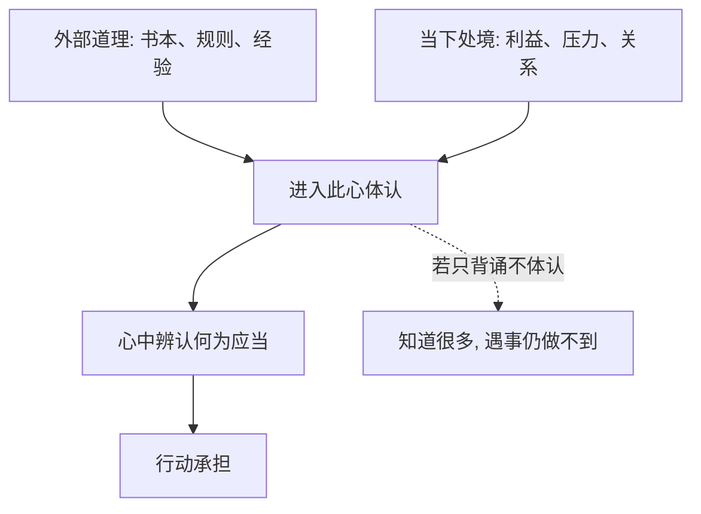

## 王阳明思维筑基课: 公理二: 心与理不二

### 作者
digoal

### 日期
2026-05-18

### 标签
王阳明 , 心学 , 心与理不二 , 心即理 , 天理 , 良知 , 主体承担 , 格物致知 , 反求诸己 , 儒学

----

## 背景

> 面向对象: 高中生及初学者  
> 核心问题: 王阳明为什么不把“道理”只放在书本、制度和外物里？  
> 先说结论: “心与理不二”是说真正的道理必须在人的明觉之心中被体认和承担。它不是否定外部知识，而是反对把道理变成与自己无关的空话。

## 一张图先看懂

## 求真讲法

### 它到底说了什么

“心与理不二”可以这样理解: 道理不是贴在墙上的标语，也不是只存在于书本里的句子。真正的理，必须被人的心明白、承认、承担，并在事情中表现出来。

比如“诚实”是一个外部规则。但只有当你在可能作弊时，内心真的承认“不该骗”，这个理才不是空的。

### 它是怎么来的

宋明理学长期讨论“理”在哪里。王阳明关心的是，如果一个人向外读了很多道理，却不能处理自己当下的贪念、恐惧和逃避，那么这种求理是不完整的。

所以他把重心转回“心”。这不是说外物没有规律，而是说做人做事的道理，不能离开人的主体承担。

### 它依赖哪些假设

| 假设 | 含义 | 风险 |
|---|---|---|
| 人心能体认道理 | 人不是只能被动接受命令 | 可能把私欲误认成道理 |
| 道理需要主体承担 | 只背规则不够 | 可能轻视外部知识 |
| 心要去私欲 | 清明之心才接近理 | 不省察会滑向任性 |

### 常见误解

最大误解是把“心与理不二”理解成“我想什么都对”。王阳明说的心，不是情绪化的私心，而是去除私欲遮蔽后的良知之心。

另一个误解是认为它排斥读书。其实它反对的是死读书，不是反对学习。

## 求存讲法

### 它有什么用

它让人从“我听过道理”走向“我是否真的承认这个道理”。这能减少空谈。

### 它怎么迁移到熟悉领域

在团队中，所有人都知道“质量重要”。但如果上线前发现问题没人说，说明“质量之理”没有进入承担责任的心。

### 它的适用范围和边界

它适合处理价值判断和自我修养。边界是: 外部事实仍要调查。不能因为“我心里觉得”就替代数据、证据和专业训练。

### 正例: 怎么用它提升能力

你读到“时间管理很重要”，不要只摘抄金句。马上问: 今天我最该守住哪一段时间？然后在那一小时里关掉干扰。道理进入行动，才算回到心上。

### 反例: 前提不成立会怎样

如果一个人把“我喜欢”当成“我有理”，就破坏了“去私欲”的前提。结果会把任性包装成真诚，把冲动包装成天理。

## 思考

外在规则能提醒人，但不能替人承担。心与理不二提醒我们: 真正难的不是知道规则，而是在利益冲突中承认规则和自己有关。

你最近一次“知道道理却不想承认”发生在什么事情上？

## 最后记住

1. 理不能离开心的体认和承担。
2. 心不是私欲，而是能明辨是非的良知之心。
3. 外部学习仍然重要，但要回到真实行动。
4. 只背道理不改变选择，就是理还没有入心。

## 参考资料

1. 王守仁: 《传习录》。
2. 王守仁: 《大学问》。
3. 陈来: 《有无之境: 王阳明哲学的精神》。
4. 钱穆: 《阳明学述要》。
  
#### [PostgreSQL 解决方案集合](../201706/20170601_02.md "40cff096e9ed7122c512b35d8561d9c8")
  
  
#### [德哥 / digoal's Github - 公益是一辈子的事.](https://github.com/digoal/blog/blob/master/README.md "22709685feb7cab07d30f30387f0a9ae")
  
  
#### [About 德哥](https://github.com/digoal/blog/blob/master/me/readme.md "a37735981e7704886ffd590565582dd0")
  
  

  
