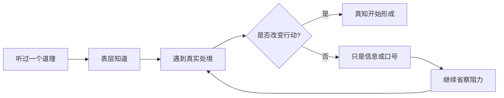

## 王阳明思维筑基课: 公理三: 真知必含行动倾向

### 作者
digoal

### 日期
2026-05-18

### 标签
王阳明 , 心学 , 真知 , 行动 , 知行合一 , 学习方法 , 实践检验 , 行为改变 , 自我管理 , 修养

----

## 背景

> 面向对象: 高中生及初学者  
> 核心问题: 为什么王阳明认为“知道但做不到”还不算真正知道？  
> 先说结论: 真知不是脑子里存了一条信息，而是已经进入判断、情感、意志和行动的理解。真正知道一件事该做，就会产生去做的力量。

## 一张图先看懂

## 求真讲法

### 它到底说了什么

这个公理说: 真正的知道一定带有行动方向。

例如，一个人说“我知道诚信重要”，但为了好处反复撒谎。王阳明会认为，他对诚信的“知”还停留在语言层面，没有成为真知。

这不是苛刻，而是把“知道”定义得更深。真知不是背下来，而是能在选择时发挥作用。

### 它是怎么来的

王阳明反对把“知”和“行”分成两件互不相干的事。他观察到，很多人会用“我知道，只是还没做”来安慰自己。于是他把问题推进一步: 如果它没有改变你的行动，它到底算不算你真正知道？

### 它依赖哪些假设

| 假设 | 含义 | 如果不成立 |
|---|---|---|
| 理解会影响意志 | 真懂会推动选择 | 知行合一难成立 |
| 行动能检验理解 | 做不到暴露理解不深 | 学习会变成背诵 |
| 阻力可以被省察 | 拖延、恐惧、利益都有来源 | 人会把失败归为天性 |

### 常见误解

它不是说“只要知道就一定立刻完美做到”。人的行动会受习惯、环境和情绪影响。它强调的是: 如果长期做不到，就要反省自己的“知道”是否还只是表层。

## 求存讲法

### 它有什么用

它把学习从“我懂了”推进到“我能做出来”。这对考试、工作、沟通、修身都重要。

### 它怎么迁移到熟悉领域

学数学时，看懂例题不等于会解题。你能独立做出题，才说明理解开始变成真知。

### 它的适用范围和边界

它适合处理价值实践和能力训练。边界是: 有些事做不到可能是资源不足或技能不足，不一定都是道德问题。要区分“不愿做”和“暂时不会做”。

### 正例: 怎么用它提升能力

你说自己知道“错题要复盘”。今天就选一道错题，写下错因、正确方法和相似题。这个行动会检验你是不是真的理解复盘的价值。

### 反例: 前提不成立会怎样

一个人说“我知道要尊重别人”，但每次讨论都打断同学。这里失败的前提是“理解会影响行动”。他可能只知道词语，却没有在真实互动中承认对方的感受。

## 思考

如果把“知道”降格成“听过”，人会拥有很多正确废话。王阳明提醒我们: 生活不看你收藏了多少道理，而看你在下一次选择中被什么力量推动。

你最常说“我知道但做不到”的事情是什么？它背后的阻力是懒、怕、贪，还是没有真正看见后果？

## 最后记住

1. 真知会改变行动方向。
2. 做不到时，要反查自己的知是否只是表层。
3. 行动不是知的附属品，而是知的检验场。
4. 要区分“不愿做”和“暂时不会做”。

## 参考资料

1. 王守仁: 《传习录》。
2. 王守仁: 《大学问》。
3. 牟宗三: 《从陆象山到刘蕺山》。
4. 钱穆: 《阳明学述要》。
  
#### [PostgreSQL 解决方案集合](../201706/20170601_02.md "40cff096e9ed7122c512b35d8561d9c8")
  
  
#### [德哥 / digoal's Github - 公益是一辈子的事.](https://github.com/digoal/blog/blob/master/README.md "22709685feb7cab07d30f30387f0a9ae")
  
  
#### [About 德哥](https://github.com/digoal/blog/blob/master/me/readme.md "a37735981e7704886ffd590565582dd0")
  
  

  
