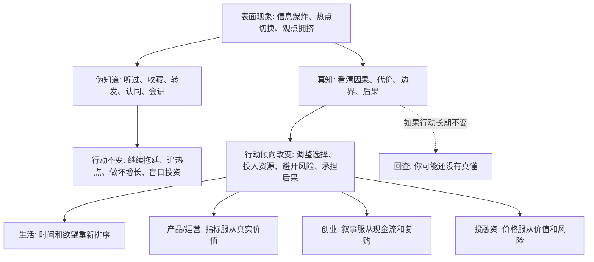

## 王阳明思维筑基课: 真知必含行动倾向: 看懂世界的人，行动会发生改变

### 作者
digoal

### 日期
2026-05-18

### 标签
王阳明 , 心学 , 真知 , 行动倾向 , 知行合一 , 认知检验 , 产品经理 , 运营经理 , 创业 , 投资

----

## 背景

> 面向对象: 大学生、产品经理、运营经理、有投资需求的人  
> 核心问题: 信息越来越多，观点越来越多，课程、报告、研报、播客、短视频都在告诉我们“应该怎么做”，为什么很多人仍然判断不了真伪，也改变不了生活、创业和投资结果？  
> 先说结论: “真知必含行动倾向”不是说想到就必须冲动行动，而是说真正理解一件事，会自然改变你的选择、资源分配、风险控制和行为优先级。不能改变行动的“知道”，多数只是听过、记住、赞同或装懂。

## 一张图先看懂



## 求真讲法

### 它到底说了什么

“真知必含行动倾向”可以用一句话说明:

> 如果你真的知道一件事重要、真实、有风险或有价值，你的行动方向一定会被它改变。

这里有两个关键词。

第一个是“真知”。真知不是听过一个概念，也不是能复述一套理论，而是你真正看清了它的因果、边界、代价和后果。

第二个是“行动倾向”。行动倾向不是立刻做大动作，而是你的选择会开始倾斜: 时间怎么花，钱投向哪里，风险如何控制，项目优先级怎么排，哪些诱惑要拒绝。

例如，一个人说“我知道健康很重要”，但长期熬夜、久坐、暴饮暴食，且没有任何修正动作。按这条规律看，他不是“知道但做不到”，而是还没有真正知道健康损害会怎样改变自己的未来。

一个投资者说“我知道估值很重要”，但每次只要资产上涨就追进去，从不看现金流、周期、杠杆和安全边际。那他真正知道的不是估值，而是价格刺激。

一个产品经理说“我知道用户价值最重要”，但每次决策都选择诱导点击、复杂取消、夸张文案。那他真正相信的不是用户价值，而是短期指标。

### 它是怎么来的

这条规律可以放在王阳明“知行合一”的思想中理解。

王阳明反对把“知”和“行”切成两段: 先在头脑里知道，之后再决定做不做。他认为真正的知，本身就已经包含行的方向。

这不是否认行动需要条件，也不是说人永远不会软弱。它强调的是:

如果一个人长期没有任何行动倾向改变，就要怀疑那个“知”是否真的进入了判断系统。

现代人尤其需要这条规律，因为今天最便宜的东西就是“知道”。

你可以一天听十个播客，收藏二十篇文章，看完三份研报，转发五个深度观点。但如果这些信息没有改变你的时间分配、项目选择、风险控制和交易纪律，它们只是认知装饰。

“真知必含行动倾向”不是数学定理，不能在心学内部被形式化证明。它是一条关于人如何形成判断、如何把判断转化为选择的底层公理。它的价值在于提供一个检验标准:

> 不要问我是否会讲这个道理，要问这个道理是否改变了我的下一步行动。

### 它依赖哪些假设

| 假设 | 含义 | 如果不成立会怎样 |
|---|---|---|
| 真知会改变权重 | 真正理解会改变你对时间、金钱、风险和机会的排序 | 知识只剩谈资，不改变选择 |
| 行动暴露真实信念 | 人最终用行动显示自己真正相信什么 | 口号和实际选择可以长期脱节 |
| 人会自欺 | 人常把听过、收藏、会讲误认为真懂 | 认知越多，越容易包装拖延 |
| 行动需要条件但仍有方向 | 真知不一定马上产生大行动，但会产生小调整和准备动作 | 人会用“条件不成熟”无限期逃避 |
| 后果会反馈理解质量 | 行动结果能检验你是不是真懂了因果和边界 | 错误观点无法被现实修正 |

可以把它写成一个判断公式:

```text
真知程度 ~= 行动变化量 + 资源重新分配 + 风险控制改善 + 复盘修正能力
```

如果这些都为零，那所谓“知道”很可能只是信息摄入。

### 常见误解

| 误解 | 为什么不对 | 更准确的理解 |
|---|---|---|
| 真知必含行动倾向就是想到就做 | 冲动行动可能只是情绪，不是真知 | 真知会带来更合适的行动节奏和优先级 |
| 没行动就是这个人懒 | 有时是资源、时机、能力不足 | 但真知至少会带来准备、拒绝、调整或风险控制 |
| 会讲就代表懂 | 会讲可能只是记忆和表达能力 | 是否懂，要看是否能改变判断和选择 |
| 行动了就代表真知 | 盲动、跟风、赌博也会行动 | 真知的行动有因果理解、边界意识和复盘能力 |
| 投资中相信就要重仓 | 重仓可能是贪婪，不是理解 | 真知也可能让你轻仓、等待、放弃或对冲 |

## 求存讲法

### 它有什么用

表面变化太快时，人最容易把三种东西误认为真知。

第一，把信息当真知。知道一个新技术、新政策、新趋势，就以为自己懂了未来。

第二，把情绪当真知。看见别人赚钱，就觉得机会确定；看见市场下跌，就觉得逻辑崩了。

第三，把表达当真知。能讲清楚一个概念，就以为自己已经掌握它。

“真知必含行动倾向”的用处，是让你用行动反查认知质量。

它会逼你问:

1. 如果我真的懂这个规律，我今天会停止做什么？
2. 如果我真的相信这个风险，我会怎样改变仓位、合同、流程或预算？
3. 如果我真的看见这个机会，我会投入哪些不可逆资源？
4. 如果我只是觉得它有道理，为什么行动没有任何变化？

这些问题能过滤大量“看起来很懂”的幻觉。

### 它怎么迁移到熟悉领域

#### 生活: 真懂时间有限，就会改变时间分配

很多人说“我知道时间宝贵”，但每天把最清醒的时间交给短视频、低质量社交和无目标浏览。

如果真懂时间有限，行动倾向至少会变化:

1. 把高价值任务放到精力最好的时段。
2. 减少低质量输入。
3. 给运动、睡眠、学习设置硬边界。
4. 拒绝一部分不重要的请求。

不是说人不能娱乐，而是娱乐不应吞掉真正重要的事。

#### 产品经理: 真懂用户价值，就会改变指标设计

一个产品经理如果真的懂“用户价值”而不是只会喊口号，他的行动会变:

1. 不只看点击率，也看任务完成率。
2. 不只看转化，也看退款、投诉、复购。
3. 不只看停留时长，也看用户是否更高效。
4. 不只看新用户，也看老用户是否持续信任。

真知会改变指标体系。指标体系不变，说明价值观还没有进入决策。

#### 运营经理: 真懂信任资产，就会减少透支型运营

运营经理常常知道“信任很重要”，但还是用标题党、夸张承诺、复杂规则、强刺激活动换短期数据。

如果真懂信任是资产，行动倾向会改变:

1. 活动规则写得更清楚。
2. 减少误导性话术。
3. 不用劣质奖励吸引错误用户。
4. 把复购、留存、口碑纳入目标。

真知不是说不追增长，而是知道坏增长会把未来卖掉。

#### 创业者: 真懂现金流，就不会只迷恋融资故事

创业者都知道现金流重要，但很多人真正行动时仍然只盯融资、估值、发布会和媒体报道。

如果真懂现金流，行动会变:

1. 更早验证客户是否愿意付费。
2. 更严格控制固定成本。
3. 更关注回款周期和毛利结构。
4. 不把融资到账误认为商业模式成立。
5. 在增长前先验证单位经济模型。

真知会让创业者少讲一点故事，多看一点账。

#### 投融资: 真懂风险，就会改变仓位和纪律

投资者常说“我知道风险”，但真正上涨时满仓追高，真正下跌时恐慌卖出。

如果真懂风险，行动倾向会体现在:

1. 买入前写清楚假设。
2. 控制单一资产仓位。
3. 不用短期资金承受长期波动。
4. 不用杠杆放大自己不懂的东西。
5. 价格越涨，越重新检查安全边际，而不是越兴奋。

风险不是写在免责声明里的词，而是会改变仓位和纪律的东西。

### 它的适用范围和边界

这条规律适合判断“一个人、团队或组织是否真的理解了某个规律”。

它适合:

1. 检验学习是否有效。
2. 检验组织价值观是否真实。
3. 检验产品团队是否真重视用户。
4. 检验创业者是否真重视现金流。
5. 检验投资者是否真理解风险。

但它不能被滥用。

| 边界 | 说明 | 正确用法 |
|---|---|---|
| 真知不等于立刻大行动 | 有些行动需要资源、时机、授权 | 看是否有准备、调整、拒绝、试点 |
| 行动不等于真知 | 跟风和冲动也会行动 | 看行动是否有因果、边界和复盘 |
| 沉默不等于无知 | 有些人理解很深但表达少 | 看长期选择，而不是看话多不多 |
| 失败不等于不懂 | 外部环境可能变化，概率事件也会发生 | 看决策过程是否合理，复盘是否进步 |
| 小行动也有意义 | 真知常先表现为微调 | 看方向是否持续，而不是只看规模 |

### 正例: 怎么用它提升能力

假设你是一个大学生，听完一门关于 AI 的课，觉得“AI 会改变很多行业”。

如果这只是伪知道，你可能会:

1. 收藏课程。
2. 转发观点。
3. 和同学讨论趋势。
4. 继续用原来的方式学习和找实习。

如果它变成真知，行动倾向会改变:

1. 选一个具体行业，研究 AI 正在替代哪些任务。
2. 每周用 AI 工具完成一个真实项目。
3. 把简历从“我听过 AI”改成“我用 AI 解决过什么问题”。
4. 找实习时优先选择能积累行业数据、流程理解和自动化能力的岗位。
5. 每月复盘一次: 哪些能力正在贬值，哪些能力正在升值？

这就是从“知道趋势”变成“被趋势改变行动”。

### 反例: 前提不成立会怎样

假设一个投资者连续听了很多价值投资课程，也能熟练说出“安全边际”“现金流折现”“能力圈”“长期主义”。

但他的实际行动是:

1. 买入前不读财报。
2. 看到热点就追。
3. 下跌 10% 就恐慌卖出。
4. 上涨 30% 就觉得自己看懂了。
5. 每次亏损都怪市场，不复盘自己的假设。

这里失败的不是价值投资理论，而是“真知必含行动倾向”这个前提没有成立。

他掌握的是术语，不是判断。

他认同的是形象，不是纪律。

他追求的是正确感，不是长期结果。

这种状态最危险，因为它比完全无知更难修正。完全无知的人知道自己要学，伪真知的人会用概念保护自己的错误。

## 思考

今天很多人的问题不是“不知道”，而是“知道得太轻”。

轻到什么程度？

看一篇文章就觉得自己懂了行业。

听一场分享就觉得自己懂了创业。

读一份研报就觉得自己懂了投资。

收藏一个方法论就觉得自己会改变人生。

但是世界不会因为你收藏过一个观点，就把结果交给你。

真正的知识一定会要求代价:

```text
知道时间宝贵 -> 你要减少低质量消耗
知道用户重要 -> 你要放弃一部分伤害用户的增长
知道现金流重要 -> 你要控制成本、验证付费、管理回款
知道风险存在 -> 你要控制仓位、拒绝杠杆、接受错过
知道能力会贬值 -> 你要持续训练新能力
```

所以，判断自己是否真懂，不要问“我是否同意”，而要问:

> 这个认知正在让我付出什么代价、改变什么选择、放弃什么诱惑？

如果没有代价，可能还不是真知。

如果没有行动倾向，可能只是信息经过了大脑，没有进入生命。

这条规律也能帮助判断别人。

不要只听一个创业者讲长期主义，要看他如何处理现金流、客户投诉和员工承诺。

不要只听一个产品经理讲用户价值，要看他是否愿意放弃误导性增长。

不要只听一个投资者讲风险控制，要看他在狂热行情里是否还能控制仓位。

不要只听一个人讲自律，要看他的时间表。

真实的知，最后都会留下行动痕迹。

## 最后记住

1. “真知必含行动倾向”不是要求冲动行动，而是要求真正的理解会改变选择、优先级和资源分配。
2. 听过、会讲、收藏、认同都不等于真知；行动是否变化，才是更硬的检验。
3. 产品、运营、创业、投资中的伪认知，常常表现为口号很正确，指标、流程、仓位和预算完全不变。
4. 真知也可能表现为不行动: 不追热点、不做坏增长、不盲目扩张、不买看不懂的资产。
5. 判断一个人或组织真正相信什么，不要只看他说什么，要看他在压力和诱惑下持续做什么。

## 参考资料

1. 王守仁: 《传习录》。
2. 王守仁: 《大学问》。
3. 《孟子》。
4. 陈来: 《有无之境: 王阳明哲学的精神》。
5. 钱穆: 《阳明学述要》。
6. 参考本地文章: `/Users/digoal/blog/202605/20260518_72.md`。

  
#### [PostgreSQL 解决方案集合](../201706/20170601_02.md "40cff096e9ed7122c512b35d8561d9c8")
  
  
#### [德哥 / digoal's Github - 公益是一辈子的事.](https://github.com/digoal/blog/blob/master/README.md "22709685feb7cab07d30f30387f0a9ae")
  
  
#### [About 德哥](https://github.com/digoal/blog/blob/master/me/readme.md "a37735981e7704886ffd590565582dd0")
  
  

  
