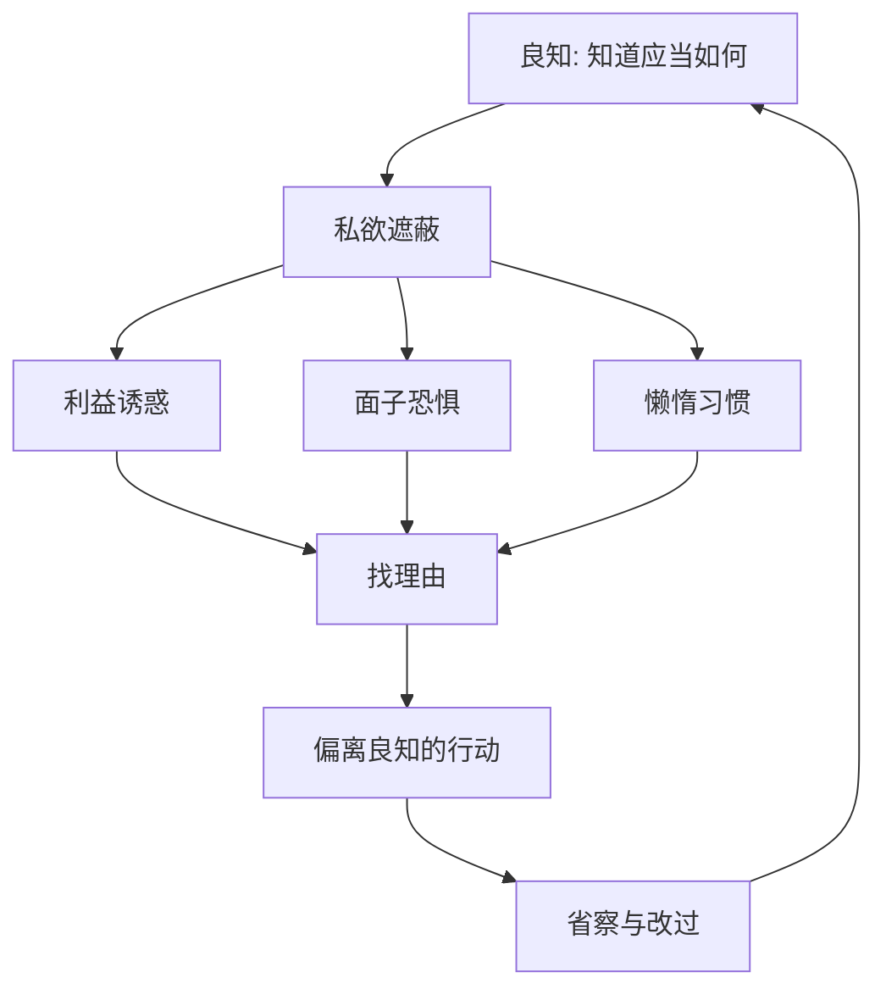

## 王阳明思维筑基课: 公理四: 私欲会遮蔽良知

### 作者
digoal

### 日期
2026-05-18

### 标签
王阳明 , 心学 , 私欲 , 良知遮蔽 , 自欺 , 省察 , 改过 , 修身 , 道德心理 , 致良知

----

## 背景

> 面向对象: 高中生及初学者  
> 核心问题: 如果人心本有良知，为什么人还会做错事？  
> 先说结论: 王阳明并不认为人只要有良知就自然正确。他认为良知常被私欲遮蔽，所以修养的关键不是制造良知，而是发现遮蔽、去除遮蔽、落实良知。

## 一张图先看懂

## 求真讲法

### 它到底说了什么

“私欲会遮蔽良知”解释了一个矛盾: 人明明知道对错，为什么还是犯错？

王阳明的回答是: 错不一定来自完全无知，常常来自遮蔽。所谓私欲，包括贪利益、怕丢脸、想偷懒、求掌控、逃避责任等。

### 它是怎么来的

如果只讲“心具良知”，容易让人误以为人自然会正确。王阳明很清楚，人会自欺。所以他强调“去人欲，存天理”的工夫，只是他的重点不是向外寻理，而是在心上省察念头。

### 它依赖哪些假设

| 假设 | 含义 | 如果不成立 |
|---|---|---|
| 人会自欺 | 会把私欲包装成理由 | 修养会过于天真 |
| 遮蔽能被发现 | 省察有意义 | 人只能被外力控制 |
| 改过可以恢复明觉 | 犯错不是终局 | 道德成长失去可能 |

### 常见误解

私欲不是所有欲望。吃饭、休息、追求进步不是问题。问题在于欲望失去分寸，压倒良知。

去私欲也不是压抑情感，而是让情感回到合宜位置。

## 求存讲法

### 它有什么用

它让人更诚实地分析失败原因。很多时候我们说“没办法”，其实是“不想付代价”。

### 它怎么迁移到熟悉领域

拖延作业时，遮蔽可能是怕面对难题。工作中隐瞒问题时，遮蔽可能是怕被责备。关系中冷暴力时，遮蔽可能是面子和控制欲。

### 它的适用范围和边界

它适合解释自欺、逃避和道德偏差。边界是: 不能把所有失败都归咎于私欲。有些问题确实来自资源不足、信息不足或外部压迫。

### 正例: 怎么用它提升能力

你不想向朋友道歉。先问: 我是真的认为自己没错，还是怕丢面子？如果是后者，遮蔽被看见了。下一步就是用一句具体道歉恢复关系。

### 反例: 前提不成立会怎样

如果一个老师把学生不会做题都解释成“懒”，就误用了这个公理。这里可能不是私欲遮蔽，而是基础知识缺失。前提错了，判断就会伤人。

## 思考

王阳明心学不怕承认人会犯错，它怕的是人把错误合理化。遮蔽最危险的地方，不是欲望本身，而是它会假装成道理。

你最近一次“很有道理的借口”，背后可能藏着什么欲望？

## 最后记住

1. 人会犯错，是因为良知常被私欲遮蔽。
2. 私欲不是所有欲望，而是失去分寸、压倒良知的欲望。
3. 省察不是自责，而是看清遮蔽。
4. 不能把所有失败都粗暴归因于私欲。

## 参考资料

1. 王守仁: 《传习录》。
2. 《孟子》。
3. 陈来: 《有无之境: 王阳明哲学的精神》。
4. 钱穆: 《阳明学述要》。
  
#### [PostgreSQL 解决方案集合](../201706/20170601_02.md "40cff096e9ed7122c512b35d8561d9c8")
  
  
#### [德哥 / digoal's Github - 公益是一辈子的事.](https://github.com/digoal/blog/blob/master/README.md "22709685feb7cab07d30f30387f0a9ae")
  
  
#### [About 德哥](https://github.com/digoal/blog/blob/master/me/readme.md "a37735981e7704886ffd590565582dd0")
  
  

  
