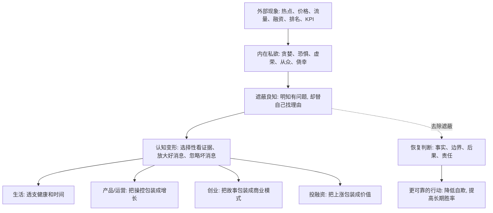

## 王阳明思维筑基课: 私欲会遮蔽良知: 为什么人常常不是不知道，而是不愿意知道

### 作者
digoal

### 日期
2026-05-18

### 标签
王阳明 , 心学 , 私欲 , 良知 , 自欺 , 决策偏误 , 产品增长 , 运营 , 创业 , 投资

----

## 背景

> 面向对象: 大学生、产品经理、运营经理、有投资需求的人  
> 核心问题: 世界表面变化太快，信息、价格、流量、技术和叙事不断变化，为什么很多人明明隐约知道风险和问题，却仍然做出错误选择？  
> 先说结论: “私欲会遮蔽良知”揭示的是一种底层误判机制: 人不是没有判断力，而是利益、恐惧、虚荣、从众、KPI 和短期收益会让人主动忽略自己已经知道的事实。看不见未来，很多时候不是因为世界太复杂，而是因为欲望把眼睛遮住了。

## 一张图先看懂



## 求真讲法

### 它到底说了什么

“私欲会遮蔽良知”来自王阳明心学。用现代语言说，就是:

> 人的判断系统本来能感到哪里不对，但当短期利益、恐惧、虚荣、面子和从众压力太强时，人会把这个提醒压下去，并编出一套看似合理的解释。

这里的“私欲”不是所有欲望。人想活得更好、想赚钱、想被认可、想实现目标，本身不是问题。

问题在于，某些欲望会让人扭曲事实。

比如:

1. 明知熬夜伤身体，却说“我只是最近忙”。
2. 明知产品文案误导用户，却说“行业都这样”。
3. 明知增长靠补贴和刷量，却说“先把规模做起来”。
4. 明知投资标的看不懂，却说“错过这波就没机会了”。
5. 明知创业项目没有复购，却说“等融资到账再优化商业模式”。

这些场景里，人并不是完全无知。相反，人常常知道问题在哪里，只是不愿意承认。

所以这条规律的关键不是“如何获得更多信息”，而是:

> 如何识别自己正在逃避哪些已经知道的信息。

### 它是怎么来的

王阳明认为，人心本具良知。良知能分辨是非善恶，但良知会被“私欲”遮蔽。

这不是一个可以在心学内部形式化证明的数学定理，而是一个关于人性的底层公理。它解释了一个普遍现象:

为什么一个人读了很多书、学了很多道理、看了很多案例，遇到利益和压力时仍然会误判？

因为知识进入头脑，不等于欲望退出判断系统。

现代心理学和行为经济学也能从侧面帮助理解这个现象。确认偏误会让人只找支持自己想法的证据；损失厌恶会让人不愿承认错误；从众心理会让人把热闹误认为正确；过度自信会让人低估风险。

这些概念不等于王阳明的原意，但它们能帮助现代人理解“遮蔽”是怎样发生的。

### 它依赖哪些假设

| 假设 | 含义 | 如果不成立会怎样 |
|---|---|---|
| 人有基本判断力 | 很多时候人不是完全不知道，而是隐约知道问题 | 错误只能归因于信息不足 |
| 欲望会改变证据权重 | 人会放大自己想看的证据，缩小不想看的证据 | 人会误以为自己一直理性客观 |
| 短期收益会压过长期后果 | 眼前利益越强，越容易忽略未来代价 | 坏增长、坏投资、坏习惯会被包装成策略 |
| 自欺比无知更危险 | 无知的人可能愿意学习，自欺的人会保护错误 | 越聪明的人越会给错误找理由 |
| 行动结果会暴露遮蔽 | 长期行为会显示一个人真正被什么驱动 | 口号、价值观和 PPT 无法长期伪装 |

可以把这条规律压缩成一个判断公式:

```text
误判风险 = 欲望强度 x 利益相关度 x 证据选择性 x 后果延迟程度
```

当收益马上到手、代价很久以后才出现时，私欲最容易遮蔽良知。

### 常见误解

| 误解 | 为什么不对 | 更准确的理解 |
|---|---|---|
| 私欲就是所有欲望 | 正常欲望是生命动力 | 遮蔽良知的是扭曲事实、逃避后果的欲望 |
| 有私欲就一定坏 | 人都有利益和偏好 | 关键是能不能识别偏好对判断的污染 |
| 道德好的人就不会被遮蔽 | 任何人都可能在压力和利益下自欺 | 越有权力和资源，越需要反遮蔽机制 |
| 多学知识就能避免遮蔽 | 知识也可能被用来包装错误 | 还需要复盘、反证、制度和他人监督 |
| 商业世界不需要良知 | 短期可以忽略，长期会反映到信任、监管和现金流 | 良知是长期风险管理的一部分 |

## 求存讲法

### 它有什么用

在变化太快的世界里，人们常以为最大的风险是“看不懂新东西”。

这只对了一半。

更大的风险是:

> 你其实看见了问题，但因为你想要某个结果，所以选择不看见。

这条规律能帮助你识别四类伪判断。

第一，伪需求。产品没人真正需要，但团队想要增长故事，于是把补贴用户、薅羊毛用户、误点用户都算成需求。

第二，伪增长。运营数据很好看，但增长来自刺激、诱导、刷量、透支信任。

第三，伪商业。创业公司融资顺利、故事漂亮，但没有复购、毛利和现金流。

第四，伪价值。资产价格上涨，大家都在讨论，于是投资者把热度误认为价值。

“私欲会遮蔽良知”提醒你: 判断真伪时，不只要问“证据是什么”，还要问“我为什么愿意相信这套证据”。

### 它怎么迁移到熟悉领域

#### 生活: 欲望会把短期舒服包装成合理选择

很多生活问题不是不知道，而是不愿意承认。

你知道睡眠重要，但继续熬夜。

你知道要学习，但一直刷短视频。

你知道关系需要沟通，但选择冷处理。

背后的私欲可能是即时快乐、逃避压力、害怕冲突、维护面子。

真正的改进，不是再听一遍道理，而是识别:

> 我正在用什么理由保护一个短期欲望？

#### 产品经理: 私欲会把操控包装成体验优化

产品经理的私欲不一定是个人贪婪，也可能是指标压力、晋升压力、团队比较、季度目标。

于是一些动作会被包装得很好听:

1. 诱导点击叫“提升转化效率”。
2. 复杂取消叫“减少用户流失”。
3. 夸张标题叫“优化内容吸引力”。
4. 默认勾选叫“降低用户决策成本”。

这些话术最大的问题，是把用户的损失隐藏在产品指标背后。

如果一个产品方案让用户更困惑、更焦虑、更难退出，它很可能不是增长，而是信任透支。

#### 运营经理: 私欲会把热闹包装成价值

运营常被活跃度、转发量、拉新数、活动 GMV 诱惑。

当团队只盯短期数据时，就容易:

1. 用低质奖励吸引错误用户。
2. 用夸张承诺拉高报名。
3. 用复杂规则降低兑现成本。
4. 用群内刷屏制造繁荣感。

短期看，热闹起来了。

长期看，用户学会了不信你。

运营的良知不是“不做增长”，而是知道哪些增长会消耗关系资产。

#### 创业者: 私欲会把融资能力包装成商业成立

创业者最容易被三种私欲遮蔽。

第一，证明自己正确。为了证明方向没错，不愿看留存、复购和毛利。

第二，维持估值叙事。为了下一轮融资，只讲好看的增长，不讲真实成本。

第三，逃避组织压力。为了不打击团队，不愿承认战略需要调整。

真正的创业判断必须敢问:

1. 如果没有补贴，用户还来吗？
2. 如果没有融资，公司还能活多久？
3. 如果按真实口径计算，单位经济模型成立吗？
4. 如果客户知道全部事实，还愿意持续付费吗？

这些问题刺耳，但能救命。

#### 投融资: 私欲会把贪婪包装成洞察

投资里最常见的遮蔽，是把“我想赚钱”包装成“我看懂了趋势”。

表现包括:

1. 只读看多报告，不读反方观点。
2. 价格越涨，越觉得逻辑更强。
3. 朋友赚钱后，突然觉得资产更有价值。
4. 明知自己不懂商业模式，却说“小仓位试试”，最后越跌越补。
5. 把没有卖出纪律，解释成长期主义。

投资判断最需要问:

> 如果我现在没有持仓、没有错过焦虑、没有赚钱冲动，我还会得出同样结论吗？

这个问题能拆掉很多自欺。

### 它的适用范围和边界

“私欲会遮蔽良知”适合用来检查人和组织在压力、利益、诱惑下的判断质量。

它适合:

1. 检查自己是否在为坏习惯找理由。
2. 检查产品增长是否伤害用户。
3. 检查运营数据是否透支信任。
4. 检查创业叙事是否掩盖现金流问题。
5. 检查投资决策是否被贪婪和恐惧污染。

但它不能被滥用成道德审判工具。

| 边界 | 说明 | 正确用法 |
|---|---|---|
| 不是所有错误都来自私欲 | 有些错误来自信息不足、能力不足、环境变化 | 先查事实，再查动机 |
| 不是所有利益都是坏事 | 利益是行动的重要动力 | 重点看利益是否扭曲事实和后果 |
| 不能替代专业分析 | 投资、创业、产品仍需数据和模型 | 用它识别分析中的动机污染 |
| 不能只审判别人 | 最难识别的是自己的遮蔽 | 先用在自查，再用在组织机制 |
| 不能靠意志力解决全部问题 | 人会反复自欺 | 需要反证机制、复盘机制和制度约束 |

### 正例: 怎么用它提升能力

假设你是一个投资者，看中一家公司。它最近涨了很多，身边朋友也赚了钱。你读了几篇看多文章，觉得逻辑很顺。

这时用“私欲会遮蔽良知”做一次反遮蔽检查:

1. 写下买入理由，再写下三个能推翻它的证据。
2. 问自己: 我是在研究公司，还是在害怕错过？
3. 假设价格明天跌 30%，我的持有理由是否仍成立？
4. 找一份反方观点，检查自己是否只选择了看多证据。
5. 把仓位限制在自己看错也能承受的范围内。

这个过程不是让你不投资，而是让投资从欲望驱动变成证据驱动。

### 反例: 前提不成立会怎样

假设一个产品团队发现，某个默认勾选的会员续费选项能显著提高收入。团队内部其实知道，很多用户没有意识到自己被勾选了。

但他们开始这样解释:

1. “用户可以自己取消，责任不在我们。”
2. “同行都这么做，我们不做就吃亏。”
3. “先完成季度目标，后面再优化。”
4. “数据证明用户接受度不错。”

这里的问题不是团队完全不知道，而是 KPI 和收入压力遮蔽了良知。

短期结果可能是收入增加。

长期结果可能是投诉、退款、监管风险、品牌信任下降、用户流失。

这就是私欲遮蔽的典型路径:

```text
短期压力 -> 找合理化语言 -> 忽略用户损失 -> 数据变好 -> 遮蔽加深 -> 长期反噬
```

真正的失败，不是那一个默认勾选，而是组织学会了用漂亮词汇掩盖自己已经知道的不诚实。

## 思考

很多人以为判断未来，最重要的是掌握更多信息。

信息当然重要，但如果欲望正在污染判断，信息越多，可能只是给自欺提供更多材料。

一个聪明人可以用十个模型证明自己想买的资产值得买。

一个团队可以用一套数据证明伤害用户的增长是合理的。

一个创业者可以用宏大叙事证明现金流问题只是暂时的。

一个学生可以用“我需要放松”证明自己继续拖延是合理的。

这就是私欲遮蔽良知最危险的地方: 它不是让你变笨，而是让你把聪明用来保护错误。

所以，面对变化太快的世界，真正高质量的判断不只是“我看到了什么”，还包括:

```text
我为什么只看这些?
我不愿意看什么?
谁从我的判断中获益?
代价由谁承担?
如果结果公开, 我是否仍然认可?
如果价格、流量、掌声消失, 这件事是否还成立?
```

这些问题能把你从表面现象拉回底层规律。

未来不是靠愿望预言的，而是靠因果、约束、激励和人性推演出来的。

私欲会让人高估眼前收益，低估长期代价；高估自己能力，低估系统风险；高估好消息，低估坏消息。

能识别遮蔽的人，不一定每次都对，但会更少犯那种“其实早就知道不对”的错误。

## 最后记住

1. “私欲会遮蔽良知”不是反对欲望，而是提醒欲望会污染事实判断和后果判断。
2. 很多错误不是因为完全不知道，而是因为人不愿意承认自己已经知道的问题。
3. 产品、运营、创业、投资中的伪增长、伪商业、伪价值，常常来自短期利益对良知的遮蔽。
4. 反遮蔽的关键动作是主动寻找反证、公开真实口径、检查谁受益谁承担代价。
5. 越聪明、越有资源、越有压力的人，越需要机制防止自己用复杂理由保护错误。

## 参考资料

1. 王守仁: 《传习录》。
2. 王守仁: 《大学问》。
3. 《孟子》。
4. 陈来: 《有无之境: 王阳明哲学的精神》。
5. 钱穆: 《阳明学述要》。
6. 丹尼尔·卡尼曼: 《思考，快与慢》。
7. 参考本地文章: `/Users/digoal/blog/202605/20260518_72.md`。

  
#### [PostgreSQL 解决方案集合](../201706/20170601_02.md "40cff096e9ed7122c512b35d8561d9c8")
  
  
#### [德哥 / digoal's Github - 公益是一辈子的事.](https://github.com/digoal/blog/blob/master/README.md "22709685feb7cab07d30f30387f0a9ae")
  
  
#### [About 德哥](https://github.com/digoal/blog/blob/master/me/readme.md "a37735981e7704886ffd590565582dd0")
  
  

  
