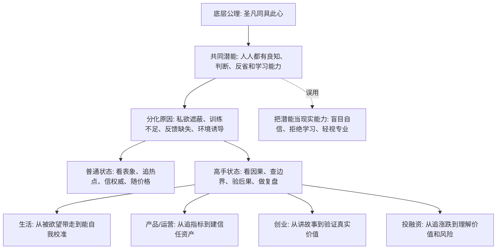

## 王阳明思维筑基课: 圣凡同具此心: 普通人也能训练出穿透表象的判断力

### 作者
digoal

### 日期
2026-05-18

### 标签
王阳明 , 心学 , 圣凡同具此心 , 判断潜能 , 训练 , 复盘 , 产品经理 , 运营经理 , 创业 , 投资

----

## 背景

> 面向对象: 大学生、产品经理、运营经理、有投资需求的人  
> 核心问题: 世界表面变化太快，普通人是否只能依赖专家、平台、市场价格和外部权威来判断真伪、预判未来？  
> 先说结论: “圣凡同具此心”不是说人人天然都是高手，而是说高手和普通人共享同一种底层判断潜能。差别不在“有没有心”，而在是否愿意去蔽、训练、复盘，并在真实生活、产品、运营、创业和投资中反复校准。

## 一张图先看懂



## 求真讲法

### 它到底说了什么

“圣凡同具此心”可以先翻译成一句现代话:

> 高手和普通人并不是拥有两套完全不同的心智硬件；普通人也有分辨是非、感知风险、理解因果、反省自欺的潜能。真正的差别，是这种潜能有没有被训练出来、有没有被私欲遮住、有没有经受真实反馈。

这里的“圣”不是神秘人物，可以理解为在道德、判断、行动上高度成熟的人。

这里的“凡”也不是低劣的人，而是未经充分训练、容易被环境和欲望带走的普通状态。

这条规律的重点，不是“人人已经一样厉害”，而是:

1. 不要把自己看得注定无能。
2. 不要把高手看得不可学习。
3. 不要把外部权威当成唯一判断来源。
4. 不要把潜能误认为已经完成的能力。

在现代世界里，很多人面对金融、技术、创业和产品判断时，会自动放弃自己的判断:

“专家都这么说。”

“市场价格已经证明了。”

“大厂都这么做。”

“投资机构都进了。”

“大家都在追这个热点。”

“圣凡同具此心”提醒你: 外部信号可以参考，但你不能把自己的判断能力完全交出去。

### 它是怎么来的

王阳明心学认为，人心本具良知。圣人与普通人的根本差别，不是圣人有良知、普通人没有良知，而是圣人能让良知充分显现，普通人常被私欲、习气和环境遮蔽。

这不是一个在心学内部被形式化证明的数学定理，而是一个关于修养和成长的底层公理。它提供了一种非常重要的人性假设:

> 人可以通过去蔽、立志、事上磨练和知行合一，使自己的判断与行动逐渐接近更清明的状态。

换成现代语言，就是:

底层判断能力不是少数人的专利，它可以通过真实问题、反馈、复盘、反证、专业训练和长期行动被激活。

这条公理解决了两个极端。

一个极端是宿命论: 普通人没有资格判断复杂问题，只能跟随权威、平台和价格。

另一个极端是自大论: 既然人人都有此心，那我凭直觉就能判断一切，不需要学习专业知识。

“圣凡同具此心”既反宿命，也反自大。它说的是潜能平等，不是能力自动平等。

### 它依赖哪些假设

| 假设 | 含义 | 如果不成立会怎样 |
|---|---|---|
| 人有可训练的判断潜能 | 普通人也能学习因果、边界、风险和责任 | 普通人只能永远依赖外部权威 |
| 能力差异来自训练和遮蔽 | 高手不是天生全知，而是长期校准更好 | 人会迷信天才或迷信身份 |
| 真实反馈能提升判断 | 行动结果、市场反馈、用户反馈、复盘能修正认知 | 错误会被口号和自尊保护起来 |
| 专业知识仍然必要 | 潜能需要事实、模型和方法来发挥 | 人会把直觉误认为洞察 |
| 私欲会制造分化 | 贪婪、恐惧、虚荣、从众会遮蔽共同潜能 | 明明有判断力，也会做出低级误判 |

可以把这条规律写成一个成长公式:

```text
现实判断力 = 共同潜能 x 专业训练 x 真实反馈 x 去蔽程度 x 行动复盘
```

共同潜能人人都有，但后面四项差异巨大，所以结果差异也会巨大。

### 常见误解

| 误解 | 为什么不对 | 更准确的理解 |
|---|---|---|
| 圣凡同具此心就是人人一样强 | 潜能相近不代表能力相同 | 能力取决于训练、反馈、去蔽和长期实践 |
| 普通人可以不听专家 | 复杂领域需要专业知识 | 不盲从专家，也不轻视专业 |
| 凭直觉就能判断未来 | 直觉可能来自经验，也可能来自欲望 | 直觉要接受事实、反证和结果检验 |
| 高手不可学习 | 高手的方法、纪律和复盘可以拆解 | 不迷信人设，要研究可复制过程 |
| 有潜能就一定会成功 | 潜能只是起点 | 没有行动、反馈和约束，潜能会长期沉睡 |

## 求存讲法

### 它有什么用

表面变化太快时，普通人最容易陷入两种麻烦。

第一，过度依赖外部权威。看到专家、机构、大厂、平台、KOL、市场价格，就停止自己的判断。

第二，过度迷信自己。看到一个概念、听一场课、读一份研报，就以为自己已经能判断复杂系统。

“圣凡同具此心”的用处，是给你一个更稳的中间路线:

1. 我有判断潜能，所以不能放弃思考。
2. 我不是天然高手，所以必须训练和验证。
3. 我可以学习高手，但不能迷信高手。
4. 我可以参考市场，但不能把价格当真理。
5. 我可以相信自己，但必须让判断接受事实检验。

这条规律能让人从“追随者心态”转向“可训练心态”。

### 它怎么迁移到熟悉领域

#### 生活: 普通人也能训练自我校准

很多人以为自律、判断力、长期主义是少数人的天赋。

但“圣凡同具此心”会说: 普通人也有自我校准能力，只是常被即时欲望、环境刺激和低质量反馈带走。

训练方法并不神秘:

1. 每天记录最重要的一个选择。
2. 写下当时的动机和预期后果。
3. 一周后复盘结果是否符合预期。
4. 识别自己最常见的自欺理由。
5. 下次在同类场景中提前设置边界。

这就是把潜能变成现实能力。

#### 产品经理: 不迷信大厂，也不迷信自己

产品经理常见的两种错误:

一种是“大厂这么做，所以我们也这么做”。

另一种是“我觉得用户会喜欢，所以就这么做”。

“圣凡同具此心”要求产品经理相信自己有判断用户价值的潜能，但也必须经过用户研究、数据验证、可用性测试和长期指标检验。

真正成熟的产品判断不是模仿，也不是拍脑袋，而是:

```text
观察用户 -> 提出假设 -> 小范围验证 -> 看真实行为 -> 复盘假设 -> 调整方案
```

这个过程普通产品经理也能做，差别在于是否愿意长期做。

#### 运营经理: 运营能力不是制造热闹的天赋

运营高手看起来很会抓热点、做活动、带社群。

但底层能力不是神秘感觉，而是可训练的判断:

1. 哪类用户值得获取？
2. 哪种激励会吸引错误人群？
3. 哪种内容能积累信任？
4. 哪些热闹只是噪声？
5. 哪些短期增长会伤害长期关系？

普通运营经理不是不能学，而是要从“追活动形式”转向“研究关系质量”。

高手和普通人的差别，常常不是有没有灵感，而是有没有复盘每次活动背后的用户质量、信任变化和长期转化。

#### 创业者: 不把成功者神化，也不把自己神化

创业世界很容易制造神话: 某个创始人眼光独到、某个公司踩中风口、某个赛道突然爆发。

“圣凡同具此心”提醒创业者:

不要只看神话，要拆解过程。

1. 他看见了什么真实需求？
2. 他比别人更早验证了什么？
3. 他承担了什么成本和风险？
4. 他如何修正错误假设？
5. 哪些成功来自能力，哪些来自周期和运气？

同时，也不要把自己神化。创始人的自信必须接受客户付费、复购、毛利、现金流和组织执行力检验。

#### 投融资: 普通投资者能进步，但不能跳过训练

投资里常见两种危险心理。

一种是“我不是专业机构，所以我只能跟着别人买”。

另一种是“机构也会错，所以我凭感觉就行”。

“圣凡同具此心”的投资版本是:

> 普通投资者也能建立判断力，但必须承认能力圈、信息差、估值方法、风险控制和情绪管理需要长期训练。

可训练的动作包括:

1. 买入前写清楚投资假设。
2. 区分价格上涨和价值增长。
3. 建立不懂不买的边界。
4. 用仓位承认自己可能错。
5. 复盘每一次亏损是事实错、逻辑错、估值错，还是情绪错。

普通人可以变强，但不能假装自己已经很强。

### 它的适用范围和边界

“圣凡同具此心”适合用于成长、学习、组织训练、投资能力建设和复杂判断能力培养。

它适合:

1. 帮助大学生建立可训练心态。
2. 帮助产品经理从模仿走向验证。
3. 帮助运营经理从热闹走向关系资产。
4. 帮助创业者拆解成功，而不是迷信成功。
5. 帮助投资者建立能力圈和复盘机制。

但它不能被滥用成盲目自信。

| 边界 | 说明 | 正确用法 |
|---|---|---|
| 潜能不等于能力 | 人人有判断潜能，但训练差异巨大 | 把它当成长起点，不当成能力证明 |
| 平等不等于同质 | 人的经验、资源、知识结构不同 | 学高手的方法，不复制高手的结论 |
| 自信不等于正确 | 内在判断可能被私欲污染 | 用反证、反馈和复盘校验 |
| 不迷信权威不等于反权威 | 专家有专业积累 | 尊重专业，但保留独立判断 |
| 可训练不等于速成 | 判断力需要长期真实场景 | 用小决策持续训练，不用大赌局证明自己 |

### 正例: 怎么用它提升能力

假设你是一个大学生，想进入 AI 产品方向。你看到很多专家都在讲 AI，也看到很多公司融资和裁员同时发生。表面现象很乱。

如果你相信“圣凡同具此心”，你的行动不是盲从，也不是自大，而是建立训练闭环:

1. 选一个具体行业，比如教育、客服、数据分析或设计。
2. 研究这个行业中哪些任务重复、昂贵、标准化。
3. 用 AI 工具做一个小项目，验证能否真的提升效率。
4. 找真实用户试用，记录他们哪里愿意付费、哪里只是觉得新鲜。
5. 每两周复盘一次: 我的判断哪些被证实，哪些被推翻？

这个过程说明: 普通人也能训练判断力，但训练必须进入真实任务和真实反馈。

### 反例: 前提不成立会怎样

假设一个投资者听到“普通人也能投资成功”，于是认为自己不需要财务知识、不需要估值方法、不需要风险控制。他看了几个短视频，就开始重仓热门股票或加密资产。

他的逻辑是:

1. 机构也会错，所以我不必研究。
2. 高手也是人，所以我和高手差不多。
3. 我有独立判断，所以不用听反方观点。
4. 价格已经上涨，所以我的判断被证明了。

这里的问题是把“圣凡同具此心”误解成“圣凡已经同等能力”。

结果往往是:

1. 牛市里把运气当能力。
2. 下跌时没有仓位纪律。
3. 看不懂财报和现金流。
4. 用信念替代估值。
5. 亏损后怪市场，而不是复盘自己。

这个反例说明: 潜能平等如果没有训练和约束，会变成盲目自信。

## 思考

现代社会一边制造权威，一边制造自大。

平台告诉你: 算法会替你推荐最好的内容。

市场告诉你: 价格已经包含所有信息。

专家告诉你: 复杂问题普通人不必判断。

短视频又告诉你: 三分钟就能学会一个行业。

这两边都危险。

完全依赖外部权威，人会失去自己的判断肌肉。

完全迷信自己，人会把浅层信息误当深度洞察。

“圣凡同具此心”真正有力量的地方，是它给普通人一种严肃的尊严:

你不是只能被动接受结论的人。

你可以学习，可以验证，可以复盘，可以去蔽，可以逐步建立判断力。

但它同时给普通人一种严肃的限制:

你不能因为“我也有此心”，就跳过事实、专业、训练和反馈。

可以把这条规律变成一个现代判断训练表:

```text
遇到热点 -> 不急着站队, 先拆因果
看到权威 -> 不盲从, 追问证据和边界
形成观点 -> 不自满, 主动找反证
做出行动 -> 不赌命, 用小成本验证
得到结果 -> 不护短, 复盘判断质量
```

如果一个人长期这样训练，他和高手的差距会缩小。

如果一个组织长期这样训练，它就不容易被流量、融资、排名和短期 KPI 带偏。

如果一个投资者长期这样训练，他不一定每次都赢，但会逐渐减少“因为无知和自欺导致的大错”。

这就是“圣凡同具此心”在现代世界里的价值: 它让人既不跪着看世界，也不闭眼冲世界。

## 最后记住

1. “圣凡同具此心”说的是人人有底层判断潜能，不是人人天然拥有同等能力。
2. 高手和普通人的差别，常常在训练、反馈、去蔽、复盘和真实场景中的长期校准。
3. 生活、产品、运营、创业、投资中的判断力都可以训练，但不能跳过事实和专业方法。
4. 不迷信权威，也不迷信自己；尊重专业，同时保留独立校验。
5. 普通人穿透表象的路径不是玄学，而是小成本验证、主动找反证、持续复盘和承担后果。

## 参考资料

1. 王守仁: 《传习录》。
2. 王守仁: 《大学问》。
3. 《孟子》。
4. 陈来: 《有无之境: 王阳明哲学的精神》。
5. 钱穆: 《阳明学述要》。
6. 参考本地文章: `/Users/digoal/blog/202605/20260518_72.md`。

  
#### [PostgreSQL 解决方案集合](../201706/20170601_02.md "40cff096e9ed7122c512b35d8561d9c8")
  
  
#### [德哥 / digoal's Github - 公益是一辈子的事.](https://github.com/digoal/blog/blob/master/README.md "22709685feb7cab07d30f30387f0a9ae")
  
  
#### [About 德哥](https://github.com/digoal/blog/blob/master/me/readme.md "a37735981e7704886ffd590565582dd0")
  
  

  
