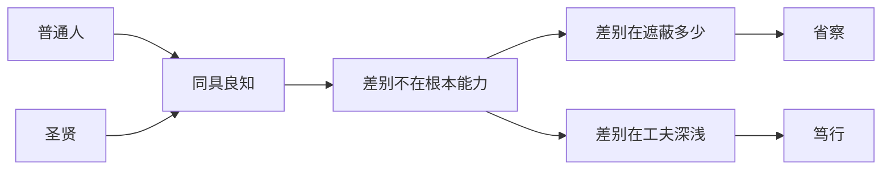

## 王阳明思维筑基课: 公理五: 圣凡同具此心

### 作者
digoal

### 日期
2026-05-18

### 标签
王阳明 , 心学 , 圣凡同具 , 良知 , 人人可学 , 成德 , 修养工夫 , 儒家 , 道德成长 , 自我提升

----

## 背景

> 面向对象: 高中生及初学者  
> 核心问题: 王阳明为什么认为普通人也有成为更好之人的根基？  
> 先说结论: “圣凡同具此心”是说圣人与普通人的根本差别，不是有没有良知，而是良知是否充分显现并持续落实。

## 一张图先看懂

## 求真讲法

### 它到底说了什么

“圣凡同具此心”不是说普通人已经等于圣人，而是说两者在根本处都有良知。圣人不是另一个物种，而是把人人本有的良知显现得更充分。

这给修养提供了可能性: 我不是因为天生低一等才不能进步，而是因为遮蔽未去、工夫未到。

### 它是怎么来的

这个公理继承儒家“人皆可以为尧舜”的精神。王阳明把它放到良知论中: 人人都有良知，所以人人都有成德的根据。

它要解决的是自卑和旁观问题。人不能说“圣贤和我无关”，因为修养的起点就在自己心里。

### 它依赖哪些假设

| 假设 | 含义 | 如果不成立 |
|---|---|---|
| 人人有良知 | 道德成长有共同起点 | 修养变成少数人特权 |
| 差别来自工夫 | 成长可以努力 | 容易宿命论 |
| 工夫必须持续 | 一次觉悟不够 | 容易自满 |

### 常见误解

它不是“人人已经是圣人”，也不是“努力就能拥有同样成就”。它讲的是道德根基的平等，不是现实能力、资源和结果完全相同。

## 求存讲法

### 它有什么用

它让人对自己负责。既然我也有良知，就不能把所有问题推给天赋、环境或别人。

### 它怎么迁移到熟悉领域

学习中，不要把优秀同学神化。可以问: 他在哪些具体习惯上做到了我还没做到的事？这会把差距从“天生不同”变成“工夫不同”。

### 它的适用范围和边界

它适合鼓励道德成长和能力训练。边界是: 不要用它否认现实差异。家庭条件、健康、资源和环境确实影响人。

### 正例: 怎么用它提升能力

看到别人自律，不要只说“他天生厉害”。拆解他的工夫: 固定时间、减少诱惑、及时复盘。然后复制一个最小动作。

### 反例: 前提不成立会怎样

如果老师用“人人都能做到”来责备所有学生，就可能忽略资源和基础差异。这里误用了公理，把“有成长根基”偷换成“现实条件完全一样”。

## 思考

这个公理的力量在于，它同时反对自卑和自满。你不能说“我没资格变好”，也不能说“我本来就好，所以不用修”。

如果你把差距看成“工夫差异”而不是“身份差异”，今天最值得补的一点工夫是什么？

## 最后记住

1. 圣人与普通人同具良知。
2. 差别主要在遮蔽多少和工夫深浅。
3. 这讲的是道德根基，不是现实条件完全相同。
4. 它要求人既不自卑，也不自满。

## 参考资料

1. 王守仁: 《传习录》。
2. 《孟子》。
3. 钱穆: 《阳明学述要》。
4. 牟宗三: 《从陆象山到刘蕺山》。
  
#### [PostgreSQL 解决方案集合](../201706/20170601_02.md "40cff096e9ed7122c512b35d8561d9c8")
  
  
#### [德哥 / digoal's Github - 公益是一辈子的事.](https://github.com/digoal/blog/blob/master/README.md "22709685feb7cab07d30f30387f0a9ae")
  
  
#### [About 德哥](https://github.com/digoal/blog/blob/master/me/readme.md "a37735981e7704886ffd590565582dd0")
  
  

  
