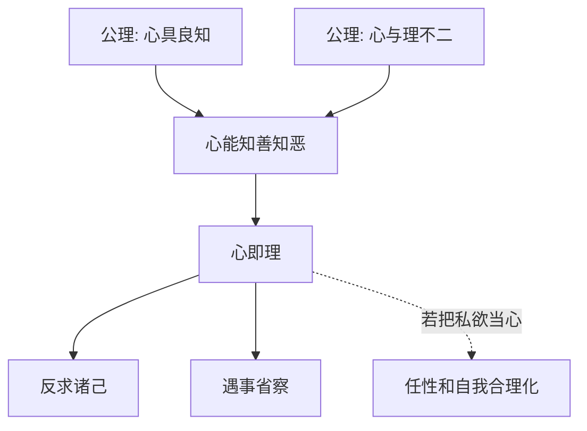

## 王阳明思维筑基课: 上层定律一: 心即理

### 作者
digoal

### 日期
2026-05-18

### 标签
王阳明 , 心学 , 心即理 , 良知 , 天理 , 去私欲 , 反求诸己 , 主体性 , 道德判断 , 儒学

----

## 背景

> 面向对象: 高中生及初学者  
> 核心问题: “心即理”是不是说我想什么都是真理？  
> 先说结论: “心即理”不是任性，而是说去除私欲遮蔽后的良知之心，能够呈现做人做事的应然之理。它从“心具良知”和“心与理不二”两个公理推出。

## 一张图先看懂

## 求真讲法

### 它到底说了什么

“心即理”是王阳明心学最有名也最容易被误解的话。

它不是说“我心里想什么都是对的”。它说的是: 当人的心去除了私欲遮蔽，显现出良知时，这个心所明白的是非善恶，就是做人做事的理。

### 它是怎么来的

它的推导链很短:

| 前提 | 推出 |
|---|---|
| 人心本具良知 | 心能知善知恶 |
| 理不能离开心的承担 | 道理要在心上体认 |
| 私欲会遮蔽良知 | 必须省察去私欲 |
| 因此 | 去私欲后的良知之心可以呈现理 |

所以“心即理”不是放纵自我，而是要求更严格地检查自己。

### 它依赖哪些假设

它依赖三个条件: 人心有良知；良知能被遮蔽也能被澄清；道德之理必须在主体实践中呈现。

如果其中“去私欲”被拿掉，心即理就会被误读成“欲即理”。

### 常见误解

第一，把心即理理解为主观主义。第二，把它理解为反对读书。第三，把它理解为只要内心真诚就不用看事实。

这些都不对。心即理要求真诚，也要求省察；它重视内在承担，但不否认事实和知识。

## 求存讲法

### 它有什么用

它让人遇事先反省: 我是在按良知判断，还是在按利益、面子和情绪判断？

### 它怎么迁移到熟悉领域

当你和同学争论时，不要只急着证明自己对。先问: 我是在追求事实，还是在维护面子？这个问题就是心即理的实际入口。

### 它的适用范围和边界

适合价值判断、责任承担、自我反省。边界是不能替代事实调查。比如判断一道物理题，不能只靠内心感觉。

### 正例: 怎么用它提升能力

你发现自己犯错后想甩锅。此时用“心即理”问: 去掉怕丢脸之后，我心里知道谁该负责？如果答案是自己，就承认并修正。

### 反例: 前提不成立会怎样

一个人说“我心里觉得这个项目一定成功”，就拒绝看数据。这是把情绪当成理，破坏了“良知澄清”和“尊重事实”的前提。

## 思考

心即理把人带回自己心上，但不是让人沉迷自己。它真正要求的是: 你能否把私欲剥开，看到那个不想承认却其实知道的判断？

## 最后记住

1. 心即理不是我想即理。
2. 它说的是良知之心呈现应然之理。
3. 去私欲是理解心即理的关键。
4. 它不能替代事实和专业知识。

## 参考资料

1. 王守仁: 《传习录》。
2. 王守仁: 《大学问》。
3. 陈来: 《有无之境: 王阳明哲学的精神》。
4. 钱穆: 《阳明学述要》。
  
#### [PostgreSQL 解决方案集合](../201706/20170601_02.md "40cff096e9ed7122c512b35d8561d9c8")
  
  
#### [德哥 / digoal's Github - 公益是一辈子的事.](https://github.com/digoal/blog/blob/master/README.md "22709685feb7cab07d30f30387f0a9ae")
  
  
#### [About 德哥](https://github.com/digoal/blog/blob/master/me/readme.md "a37735981e7704886ffd590565582dd0")
  
  

  
