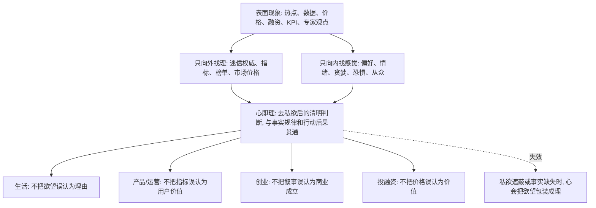

## 王阳明思维筑基课: 心即理: 真规律不是外在口号，而要进入你的判断和行动

### 作者
digoal

### 日期
2026-05-18

### 标签
王阳明 , 心学 , 心即理 , 判断力 , 事实检验 , 行动后果 , 产品 , 运营 , 创业 , 投资

----

## 背景

> 面向对象: 大学生、产品经理、运营经理、有投资需求的人  
> 核心问题: 世界表面变化太快，数据、价格、流量、专家观点和商业叙事层出不穷，普通人怎样判断什么是真规律、真价值、真机会？  
> 先说结论: “心即理”不是“我觉得对就对”，而是说真正的道理不能只停留在外部权威、模型和指标里，它必须在人的清明判断中被体认，并在行动后果中站得住。只向外找理会变成盲从，只向内找感觉会变成任性。

## 一张图先看懂



## 求真讲法

### 它到底说了什么

“心即理”是王阳明心学中最容易被误解、也最有穿透力的命题之一。

它不是说:

> 我心里怎么想，世界就应该怎样。

它更接近于说:

> 真正的道理不能只作为外在知识被背诵，也不能只作为客观规则被服从；它必须在人的清明之心中被看见、被承认、被实行。

这里的“心”不是随便的情绪、欲望、偏见和冲动，而是去除私欲遮蔽后，对事实、是非、后果和责任的清明判断。

这里的“理”不是抽象口号，而是事物运行的因果、边界、秩序和应当。

所以，“心即理”真正要反对两种错误。

第一种错误，是把理完全放在外部。比如专家说了、数据涨了、价格涨了、公司融资了、同行都做了，所以我就不再思考。

第二种错误，是把心误认为私欲。比如我喜欢、我害怕错过、我想赢、我想证明自己，所以我把这些感觉包装成判断。

“心即理”的现代版本可以这样理解:

```text
真正的理 = 经得起事实检验 + 经得起内心诚实追问 + 经得起长期后果验证
```

### 它是怎么来的

在宋明理学中，一个核心问题是: “理”在哪里？

朱熹一系强调“格物穷理”，重视通过研究外物、经典和制度来理解道理。王阳明早年也曾向外求理，后来逐渐转向“心即理”。

他面对的问题不是“外部世界有没有规律”，而是:

为什么人知道很多外部道理，却仍然不能做出正确选择？

为什么一个人读了书、懂了规则、看了案例，遇到利益、恐惧和压力时仍然会自欺？

王阳明的回答是: 如果道理没有进入此心，没有变成真实判断和行动，它就仍然只是外在信息。

因此，“心即理”不是取消外部事实，而是要求外部事实必须回到人的判断主体中，被真正体认和实行。

这不是数学定理，不能在心学内部被形式化证明。它更像一条修身和判断系统的底层公理:

> 人不能把判断责任完全交给外部权威，也不能把个人欲望冒充为真理；真正可靠的理，必须在清明之心中被确认，并由现实后果继续校验。

### 它依赖哪些假设

| 假设 | 含义 | 如果不成立会怎样 |
|---|---|---|
| 人有内在判断能力 | 人不只是规则和数据的接收器，也能反省动机与后果 | 所有判断只能外包给权威、算法和市场 |
| 外部知识必须被主体吸收 | 书本、数据、模型只有进入判断系统才有用 | 人会“知道很多道理，却过不好这一生” |
| 私欲会冒充真理 | 贪婪、恐惧、虚荣、从众会把感觉包装成理 | “我觉得”会取代事实和责任 |
| 事实和后果能校验判断 | 真正的理不能长期违背因果和结果 | 口号、叙事、模型会脱离现实 |
| 道理必须落实为行动 | 没有行动承担，道理只是语言 | 价值观、战略和认知都会停留在表演层面 |

这几个假设可以压缩成一个判断模型:

```text
心即理的判断闭环:
外部事实 -> 内在诚实 -> 清明判断 -> 具体行动 -> 后果反馈 -> 修正判断
```

只要少了其中一环，就容易变形。

### 常见误解

| 误解 | 为什么不对 | 更准确的理解 |
|---|---|---|
| 心即理就是主观唯心 | 它不是说外部事实不存在 | 它强调道理必须被清明之心体认和实行 |
| 我觉得对就是理 | 感觉可能是私欲、恐惧、从众 | 要去私欲，并接受事实和后果检验 |
| 不需要学习外部知识 | 王阳明反对空谈，不反对真实用功 | 专业知识是理进入判断的重要材料 |
| 有数据就代表有理 | 数据可能被口径、样本和激励扭曲 | 数据要进入因果理解和责任判断 |
| 讲初心就够了 | 初心可能是真诚，也可能是自我包装 | 初心要接受用户、现金流、风险和长期结果检验 |

## 求存讲法

### 它有什么用

在变化很快的世界里，人们常用外部符号替代判断:

1. 价格涨了，所以资产有价值。
2. 用户多了，所以产品有需求。
3. 融资多了，所以公司有前途。
4. 专家说了，所以结论可靠。
5. KPI 达成了，所以事情做对了。

这些外部信号有参考价值，但它们不是最终的“理”。

“心即理”的用处，是把人从外部符号拉回判断主体:

> 这些信号背后的因果是否成立？我是否真的理解？我是否在自欺？如果后果由我承担，我还会这样判断吗？

它不是让人拒绝数据和专家，而是让人不把数据和专家当作逃避判断的借口。

### 它怎么迁移到熟悉领域

#### 生活: 不把外部评价当人生之理

大学生很容易被绩点、排名、证书、薪资、别人眼光牵着走。

这些东西不是没用，但它们只是外部信号。

“心即理”会追问:

1. 这个目标是否真的增强我的能力？
2. 这个选择是否符合我的长期方向？
3. 我是在成长，还是在追求被认可？
4. 如果没有人点赞，我还愿意做吗？

生活中的“理”不是别人说你成功，而是你的选择能否让能力、信用、健康和自由长期增加。

#### 产品经理: 不把指标当用户价值之理

产品经理最容易把指标当理。

点击率上涨、停留时长增加、付费转化变高，看起来都像好事。

但“心即理”会问:

> 用户是否真的完成了自己的任务，还是被设计困住、被焦虑推动、被信息不对称诱导？

如果一个产品让指标变好，却让用户更难退出、更难判断、更容易误买，那它不是真正的产品之理，而是指标技巧。

真正的理必须同时站得住:

1. 用户价值站得住。
2. 数据口径站得住。
3. 长期信任站得住。
4. 团队内心诚实站得住。

#### 运营经理: 不把热闹当关系之理

运营工作常被活动人数、社群活跃、转发量、GMV 刺激。

但热闹可能只是短期噪声。

“心即理”要求运营经理回到关系本质:

1. 用户为什么来？
2. 用户为什么留下？
3. 用户是否更信任我们？
4. 激励停止后关系是否还在？
5. 规则公开后用户是否仍觉得公平？

真正的运营之理，不是把人拉进来，而是让信任和关系资产变厚。

#### 创业者: 不把融资叙事当商业之理

创业者很容易被宏大叙事、投资人认可、媒体报道和估值牵动。

这些都不是商业成立的最终依据。

“心即理”会把问题压回基本面:

1. 客户是否真实痛苦？
2. 解决方案是否真实有效？
3. 客户是否愿意持续付费？
4. 毛利和现金流是否支持扩张？
5. 团队是否愿意承认坏消息？

如果创始人内心知道复购差、毛利差、交付成本高，却继续用故事包装增长，那不是“心即理”，而是“私欲冒充理”。

#### 投融资: 不把市场价格当价值之理

投资中，价格最容易伪装成理。

涨了，人们会说“市场已经证明”；跌了，人们会说“逻辑已经破产”。

但价格只是交易结果，不一定等于价值。

“心即理”要求投资者同时追问外部和内在:

1. 资产如何创造现金流或效用？
2. 当前价格隐含了什么增长假设？
3. 我是否理解主要风险？
4. 我是在研究价值，还是害怕错过？
5. 如果价格短期下跌，我的判断是否仍能成立？

投资的理，不在上涨本身，而在你是否真正理解价值、风险、周期和自己的情绪。

### 它的适用范围和边界

“心即理”适合处理事实、价值、动机、责任和行动交织的问题。

它适合:

1. 判断外部权威是否值得相信。
2. 判断产品增长是否真有用户价值。
3. 判断运营热闹是否积累关系资产。
4. 判断创业故事是否对应真实商业。
5. 判断投资价格是否对应长期价值。

但它不能被滥用成主观任性。

| 边界 | 说明 | 正确用法 |
|---|---|---|
| 心不是情绪 | 喜欢、害怕、兴奋都可能误导判断 | 先去私欲，再谈心 |
| 理不是口号 | 愿景、使命、价值观可能只是包装 | 看事实、因果和后果 |
| 不能拒绝专业 | 复杂领域需要知识、模型和经验 | 把专业知识吸收到判断中 |
| 不能拒绝反馈 | 自认为清明也可能错 | 用用户、市场、现金流和复盘校验 |
| 不能替代制度 | 组织不能只靠个人良知 | 用流程、审计、权限和激励防止自欺 |

### 正例: 怎么用它提升能力

假设你是一个产品经理，团队发现一个功能可以显著提升付费转化: 在取消订阅时增加多层确认和模糊按钮，让用户更难退出。

如果只看外部指标，这个方案很有效。

但用“心即理”判断，要同时做四层检查:

1. 事实层: 转化提升是否来自真实价值，还是来自退出阻力？
2. 用户层: 用户是否清楚自己正在做什么选择？
3. 内心层: 团队是否知道这个设计在利用用户困惑？
4. 后果层: 投诉、退款、差评、监管和品牌信任会怎样变化？

如果四层检查都显示这是信任透支，那么真正的“理”不是提高转化，而是重新设计清晰、诚实、可持续的付费路径。

这不是道德洁癖，而是长期产品判断。

### 反例: 前提不成立会怎样

假设一个创业者认为“市场教育还没完成”，所以短期没有复购、没有毛利、没有现金流都可以接受。他不断用“长期主义”“生态布局”“战略投入”解释所有坏数据。

这里的问题是，“心即理”的前提被破坏了。

1. 外部事实没有被诚实接收: 坏数据被叙事消化掉。
2. 内在判断被私欲污染: 创始人想证明自己方向正确。
3. 行动后果没有进入修正: 亏损、低复购、高交付成本没有改变策略。
4. 理变成口号: 长期主义被用来掩盖短期经营失败。

最终可能出现:

```text
宏大叙事 -> 忽略坏数据 -> 继续融资扩张 -> 现金流紧张 -> 团队失去信任 -> 商业失败
```

这个反例说明: 如果心不是清明之心，而是被欲望和面子遮蔽的心，“心即理”就会被误用成“我想要的就是理”。

## 思考

现代社会最常见的判断外包，是把“理”交给外部符号。

平台说热门，你就觉得重要。

市场说上涨，你就觉得有价值。

专家说乐观，你就觉得确定。

公司说战略，你就觉得合理。

数据说增长，你就觉得成功。

但外部符号不能替你承担后果。

你选错专业，浪费的是自己的时间。

你做坏产品，损失的是用户信任。

你做伪运营，消耗的是关系资产。

你创错业，烧掉的是现金流和团队信心。

你投错资，承担的是自己的回撤。

所以，“心即理”的现代意义，是把判断权和责任重新拿回来。

它不是让你孤立地相信自己，而是让你建立一个更完整的判断闭环:

```text
看见外部信号 -> 追问真实因果
产生内在判断 -> 检查私欲遮蔽
形成行动方案 -> 小成本验证
得到现实反馈 -> 修正认知
再次判断 -> 更接近真实之理
```

真正的不变规律，不会只停留在口号里。

它会表现为更少的自欺、更好的行动、更真实的反馈、更能穿越周期的结果。

如果一个“理”只能在 PPT、研报、热搜、价格上涨时成立，一到用户反馈、现金流、风险暴露、长期后果面前就站不住，它就不是真理，只是表面现象的一部分。

真正的“心即理”，是让你在变化很快的世界里，既不盲从外部，也不放纵主观，而是用清明之心把事实、因果、责任和行动连起来。

## 最后记住

1. “心即理”不是“我觉得对就对”，而是清明之心与事实规律、行动后果相贯通。
2. 只向外找理，容易迷信数据、权威、价格和 KPI；只向内找理，容易把欲望冒充判断。
3. 产品、运营、创业、投资中的真规律，必须同时经得起事实、内心诚实和长期结果检验。
4. 心不是情绪，理不是口号；心要去私欲，理要落到因果和行动。
5. 在变化太快的世界里，最重要的能力不是追逐每个现象，而是把外部信号转化为自己的清明判断。

## 参考资料

1. 王守仁: 《传习录》。
2. 王守仁: 《大学问》。
3. 《孟子》。
4. 陈来: 《有无之境: 王阳明哲学的精神》。
5. 钱穆: 《阳明学述要》。
6. 参考本地文章: `/Users/digoal/blog/202605/20260518_72.md`。

  
#### [PostgreSQL 解决方案集合](../201706/20170601_02.md "40cff096e9ed7122c512b35d8561d9c8")
  
  
#### [德哥 / digoal's Github - 公益是一辈子的事.](https://github.com/digoal/blog/blob/master/README.md "22709685feb7cab07d30f30387f0a9ae")
  
  
#### [About 德哥](https://github.com/digoal/blog/blob/master/me/readme.md "a37735981e7704886ffd590565582dd0")
  
  

  
