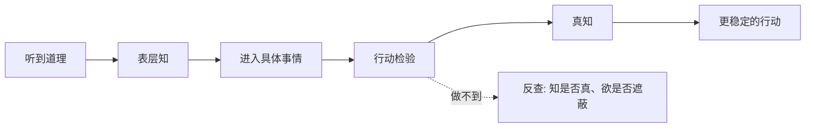

## 王阳明思维筑基课: 上层定律二: 知行合一

### 作者
digoal

### 日期
2026-05-18

### 标签
王阳明 , 心学 , 知行合一 , 真知 , 实践 , 行动检验 , 学习转化 , 自我管理 , 修身 , 方法论

----

## 背景

> 面向对象: 高中生及初学者  
> 核心问题: “知行合一”为什么不是一句普通的励志口号？  
> 先说结论: 知行合一的核心是: 真正的知已经包含行动方向，真实的行也会检验知是否成立。它从“真知必含行动倾向”推出。

## 一张图先看懂

## 求真讲法

### 它到底说了什么

知行合一不是“先知道，再去做”这么简单。王阳明的意思更深: 知和行本来就是同一个过程的两个面。

知道孝顺，不只是会解释“孝顺”这个词，而是在父母需要你承担时能做出相应行动。知道诚信，不只是会背诚信重要，而是在利益诱惑前不欺骗。

### 它是怎么来的

它来自公理“真知必含行动倾向”。如果真知会推动行动，那么“知而不行”就说明这个知还不真、不深、不完整。

| 层次 | 表现 | 王阳明式判断 |
|---|---|---|
| 听过 | 能复述概念 | 还不是充分的知 |
| 理解 | 能说明道理 | 接近知，但未受检验 |
| 实行 | 遇事能做 | 知开始成真 |
| 稳定实行 | 多次处境中能守住 | 知行更合一 |

### 它依赖哪些假设

它假设理解会影响行动，行动能反过来检验理解，人能够通过省察和练习减少知行断裂。

### 常见误解

不要把知行合一理解成“想到就做”。冲动行动不是知行合一。知行合一强调的是良知和理性判断进入行动。

也不要把它理解成“做了就懂”。盲目行动也可能只是乱试。

## 求存讲法

### 它有什么用

它能治疗“道理收藏癖”。如果一个道理没有改变你的下一次行动，就先不要急着收藏下一个道理。

### 它怎么迁移到熟悉领域

学习英语时，知道单词不等于会用。你能在句子中正确说出、写出，才说明知进入了行。

### 它的适用范围和边界

适合能力训练和品格实践。边界是: 有些复杂技能需要阶段性学习，不能要求人“知道一点就马上全做到”。

### 正例: 怎么用它提升能力

你知道“复盘很重要”。今天就用 10 分钟写下: 做了什么、哪里错、下次怎么改。这个动作让知开始合于行。

### 反例: 前提不成立会怎样

一个创业团队知道“用户反馈重要”，但半年不访谈用户。这里不是缺少口号，而是真知没有形成；他们的行动说明自己更在意想象中的产品，而不是真实用户。

## 思考

知行合一最难听的一层意思是: 你的行动正在揭示你真正相信什么。

你说你重视健康、学习、关系、诚信。今天的行动能证明哪一个？又揭穿哪一个？

## 最后记住

1. 知行合一不是先知后行，而是真知含行。
2. 行动检验理解是否真实。
3. 冲动不是知行合一，盲动也不是。
4. 改变从一个具体行动开始。

## 参考资料

1. 王守仁: 《传习录》。
2. 王守仁: 《大学问》。
3. 牟宗三: 《从陆象山到刘蕺山》。
4. 钱穆: 《阳明学述要》。
  
#### [PostgreSQL 解决方案集合](../201706/20170601_02.md "40cff096e9ed7122c512b35d8561d9c8")
  
  
#### [德哥 / digoal's Github - 公益是一辈子的事.](https://github.com/digoal/blog/blob/master/README.md "22709685feb7cab07d30f30387f0a9ae")
  
  
#### [About 德哥](https://github.com/digoal/blog/blob/master/me/readme.md "a37735981e7704886ffd590565582dd0")
  
  

  
