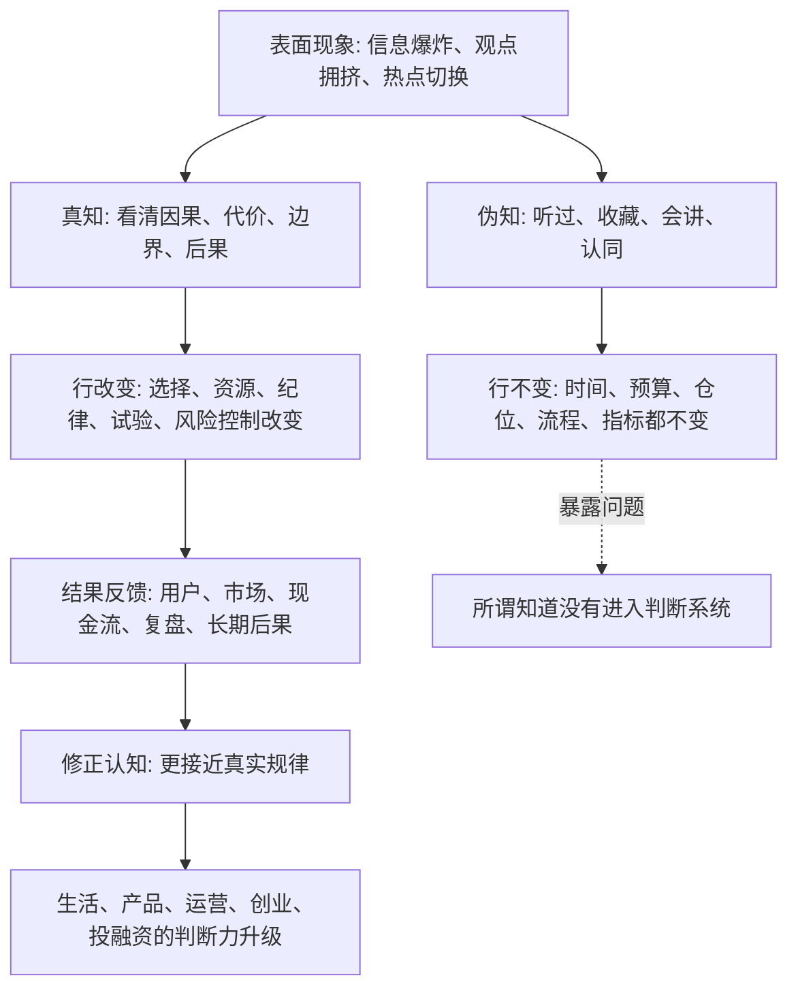

## 王阳明思维筑基课: 知行合一: 真正看懂一件事，行动和结果都会留下痕迹

### 作者
digoal

### 日期
2026-05-18

### 标签
王阳明 , 心学 , 知行合一 , 真知 , 行动反馈 , 复盘 , 产品经理 , 运营经理 , 创业 , 投资

----

## 背景

> 面向对象: 大学生、产品经理、运营经理、有投资需求的人  
> 核心问题: 世界表面变化太快，观点、课程、研报、热点和方法论越来越多，为什么很多人知道很多，却仍然判断不了真伪、预言不了未来、改变不了结果？  
> 先说结论: “知行合一”不是“知道之后赶紧去做”，而是说真正的知本身就包含行动方向，行动又会反过来检验你是否真知。不能进入行动、不能接受结果反馈的“知道”，多数只是信息、口号、谈资或自我安慰。

## 一张图先看懂



## 求真讲法

### 它到底说了什么

“知行合一”常被简单理解为“知道了就要去做”。这个理解只对了一小部分。

更准确地说:

> 真正的知，不是头脑里多了一个观点，而是你的判断、选择、行动倾向和复盘方式被改变；真正的行，也不是盲目执行，而是在现实中检验、修正和深化你的知。

所以，知和行不是两件先后分开的事。

伪知是这样的:

```text
听过一个道理 -> 感觉很有道理 -> 收藏转发 -> 行动照旧
```

真知更像这样:

```text
看清一个规律 -> 调整选择和资源 -> 小规模行动验证 -> 接受反馈 -> 修正理解
```

例如，一个人说“我知道时间很重要”，但每天最好的精力仍然交给短视频和低质量社交，这不是“知而不行”，而是还没有真正知道时间的不可逆。

一个产品经理说“我知道用户价值重要”，但所有决策仍然只围绕点击率和转化率，不看投诉、退款、复购和信任，这也不是“知而不行”，而是还没有真正知道用户价值。

一个投资者说“我知道风险重要”，但上涨时满仓追高，下跌时恐慌割肉，从不写投资假设和止损边界。他真正知道的不是风险，而是价格刺激。

### 它是怎么来的

“知行合一”是王阳明心学中的核心命题。它回应的是一个非常现实的问题:

为什么人明明知道道理，却仍然做不到？

王阳明的回答不是简单责备人“不够努力”，而是重新定义“知”:

如果一个所谓的知完全不影响行动，那它还不是真知。

这条命题不是数学定理，不能在心学内部形式化证明。它更像一条关于人如何理解、判断和行动的底层公理:

> 判断是否真实，要看它是否进入行动；行动是否正确，要看它是否经得起反馈。

放到现代社会，它尤其重要。因为今天的信息获取太容易，很多人把“看过很多”误认为“理解很深”，把“会讲很多”误认为“判断很强”，把“认同一个理念”误认为“已经拥有这种能力”。

“知行合一”拆穿的就是这种幻觉。

### 它依赖哪些假设

| 假设 | 含义 | 如果不成立会怎样 |
|---|---|---|
| 真知会改变行动倾向 | 真正理解会改变选择、资源、纪律和优先级 | 知识会退化成谈资和装饰 |
| 行动能检验认知 | 现实反馈能暴露理解中的漏洞 | 人会长期活在自洽叙事里 |
| 人会把伪知误认为真知 | 收藏、转发、会讲会制造懂了的幻觉 | 学习越多，可能越会包装不行动 |
| 行动不是盲动 | 真行需要因果理解、边界意识和复盘 | 冲动、跟风、赌博会被误认为实践 |
| 反馈必须被诚实接收 | 结果不好时要修正假设，而不是保护自尊 | 错误会在口号中反复发生 |

可以把它压缩成一个判断公式:

```text
知行合一 = 认知假设 -> 行动选择 -> 现实反馈 -> 复盘修正 -> 新的认知假设
```

没有行动，认知无法落地。

没有复盘，行动无法变成认知。

### 常见误解

| 误解 | 为什么不对 | 更准确的理解 |
|---|---|---|
| 知行合一就是马上行动 | 马上行动可能只是冲动 | 真行要有边界、节奏和反馈 |
| 做了就代表懂了 | 跟风和赌博也是行动 | 真行要能说明因果、成本和后果 |
| 没做就是懒 | 有时是资源、能力、权限不足 | 但真知至少会带来准备、拒绝、调整或试验 |
| 知行合一反对学习理论 | 没有理论，行动容易乱撞 | 理论要进入行动，行动要反哺理论 |
| 成功了就说明知对了 | 短期成功可能来自运气和周期 | 要看过程、可重复性和长期后果 |

## 求存讲法

### 它有什么用

表面变化越快，人越容易掉进“认知消费”的陷阱。

看行业报告，觉得自己懂了行业。

听创业播客，觉得自己懂了创业。

读投资文章，觉得自己懂了市场。

收藏方法论，觉得自己快要改变人生。

但如果行动没有变化，这些内容大多只是心理安慰。

“知行合一”的用处，是给你一个判断真伪的硬标准:

1. 这个认知有没有改变我的时间分配？
2. 这个判断有没有改变我的产品指标？
3. 这个原则有没有改变我的运营动作？
4. 这个战略有没有改变我的现金流管理？
5. 这个风险认知有没有改变我的仓位和纪律？

如果答案都是否定的，说明它还没有成为你的知。

### 它怎么迁移到熟悉领域

#### 生活: 知道时间宝贵，就会改变时间表

一个大学生说“我知道能力很重要”，但每天的时间仍然被娱乐、拖延和碎片信息切碎。

按“知行合一”看，真正知道能力重要，至少会带来行动变化:

1. 固定一段深度学习时间。
2. 减少低质量输入。
3. 用作品、项目、实习验证能力。
4. 每周复盘时间到底去了哪里。

不是说不能休息，而是休息不能吞掉最重要的成长资源。

#### 产品经理: 知道用户价值，就会改变指标系统

如果产品经理真的知道用户价值重要，就不会只盯点击率、转化率和在线时长。

行动会变成:

1. 增加任务完成率、复购率、投诉率、退款率等指标。
2. 访谈真实用户，而不是只看漏斗图。
3. 对诱导、误导、复杂取消流程保持警惕。
4. 把长期信任纳入产品决策。

价值观如果不改变指标系统，就还只是墙上的字。

#### 运营经理: 知道信任重要，就会改变活动设计

运营经理常说“用户信任最重要”，但活动设计仍然充满夸张承诺、复杂规则、短期刺激和低质奖励。

真知会改变行动:

1. 活动规则更透明。
2. 奖励机制吸引目标用户，而不是薅羊毛用户。
3. 不用标题党制造虚假期待。
4. 把留存、复购、口碑和用户质量放进复盘。

信任不是口号，它必须体现在每一次触达和规则设计里。

#### 创业者: 知道现金流重要，就会改变战略节奏

创业者都知道现金流重要，但很多团队仍然把融资、估值、发布会和媒体报道当成主要胜利。

如果真懂现金流，行动会变:

1. 更早验证客户是否愿意付费。
2. 控制固定成本和回款周期。
3. 不把融资到账当商业模式成立。
4. 在扩张前验证单位经济模型。
5. 坏数据出现时及时调整，而不是用叙事解释。

创业中的知行合一，就是让战略回到客户、收入、成本和组织执行。

#### 投融资: 知道风险重要，就会改变仓位和交易纪律

投资中最典型的伪知，是嘴上说风险，行动上追涨。

真知道风险，会体现在:

1. 买入前写清投资假设。
2. 控制单一资产仓位。
3. 区分短期资金和长期资金。
4. 不用杠杆放大不懂的资产。
5. 下跌时检查假设，而不是只检查情绪。

风险认知如果不改变仓位，就还没有进入身体。

### 它的适用范围和边界

“知行合一”适合处理学习、成长、产品、运营、创业、投资中“知道很多但结果不变”的问题。

它适合:

1. 检验学习是否真的有效。
2. 检验团队价值观是否真实。
3. 检验战略是否进入资源分配。
4. 检验投资纪律是否真实存在。
5. 检验个人是否在用知识包装拖延。

但它不能被滥用。

| 边界 | 说明 | 正确用法 |
|---|---|---|
| 行动不等于鲁莽 | 复杂问题需要准备和试验 | 用小步验证，而不是冲动下注 |
| 暂时不行动也可能是行动 | 放弃、等待、拒绝、观察也是选择 | 看是否基于清晰判断，而不是逃避 |
| 失败不等于无知 | 概率事件和外部环境会影响结果 | 看决策过程和复盘质量 |
| 成功不等于真知 | 运气、周期、资源也会带来成功 | 看能否解释、复制和穿越周期 |
| 行动需要条件 | 资源、权限、能力会限制动作 | 看是否有准备动作和边界设置 |

### 正例: 怎么用它提升能力

假设你是一个产品经理，团队一直说“用户价值第一”，但最近发现付费转化增长主要来自一个容易让用户误解的页面设计。

如果只是口号层面的知，团队会说:

1. 数据证明有效。
2. 用户可以自己看清楚。
3. 先完成季度目标再优化。

如果是知行合一，团队会采取行动:

1. 明确区分真实价值转化和误导转化。
2. 调整页面文案，让用户清楚知道权益、价格和取消方式。
3. 同时观察转化率、退款率、投诉率、复购率。
4. 在复盘中讨论短期收入和长期信任的关系。

这时，“用户价值第一”不再是口号，而是进入了指标、设计、实验和复盘。

### 反例: 前提不成立会怎样

假设一个投资者读了很多价值投资资料，也能讲安全边际、能力圈、长期主义。

但实际行动是:

1. 从不读财报。
2. 买入只看朋友推荐和短期涨幅。
3. 下跌时没有复盘，只怪市场情绪。
4. 上涨时加杠杆，认为自己判断正确。
5. 持仓理由每天跟着价格变化。

这里的问题不是价值投资理论无效，而是“知行合一”的前提没有成立。

他的“知”没有进入行动。

他的“行”没有接受复盘。

他的语言在讲长期主义，身体在做短期赌博。

最终结果往往是:

```text
学会术语 -> 获得正确感 -> 追逐价格 -> 用术语解释亏损 -> 重复错误
```

这比完全无知更危险，因为概念会变成保护错误的外衣。

## 思考

一个人真正相信什么，不要只看他说什么，要看他在压力和诱惑下持续做什么。

一个公司真正相信用户价值，不是看官网愿景，而是看它如何处理退款、投诉、取消订阅和灰色增长。

一个创业者真正相信现金流，不是看他是否会讲商业模式，而是看他如何安排成本、回款、扩张和融资节奏。

一个投资者真正相信风险控制，不是看他是否会说安全边际，而是看他在牛市中如何控制仓位，在熊市中如何复盘假设。

“知行合一”之所以能帮助判断未来，是因为未来不是从口号里长出来的，而是从持续行动和反馈中长出来的。

如果一个团队口口声声说长期主义，但每个季度都牺牲用户信任换数据，你不需要等三年才知道它的长期会有问题。

如果一个创业公司说市场巨大，但客户不复购、毛利不成立、回款很慢，你不需要等下一轮融资才知道风险正在积累。

如果一个投资者说自己理性，但仓位完全由情绪决定，你不需要等市场崩盘才知道他的风险控制是假的。

知行合一给我们的预判方法是:

```text
听他说什么 -> 看他做什么 -> 看资源投向哪里 -> 看结果如何反馈 -> 看是否修正
```

真正的规律会进入行动，真正的行动会接受反馈，真正的反馈会修正认知。

如果一个系统只有口号，没有行动；只有行动，没有反馈；只有反馈，没有修正，它很难穿越变化。

## 最后记住

1. “知行合一”不是冲动执行，而是真知会改变行动，行动会反过来检验真知。
2. 听过、收藏、会讲、认同都不等于知道；时间、预算、仓位、流程和指标是否改变，才是硬检验。
3. 产品、运营、创业、投资中的真认知，必须进入指标、资源、纪律和复盘。
4. 不行动有时也是行动，但必须基于清晰判断，而不是拖延、恐惧或逃避。
5. 预判一个人或组织的未来，不只看它讲什么，更要看它持续做什么、如何接受反馈、是否愿意修正。

## 参考资料

1. 王守仁: 《传习录》。
2. 王守仁: 《大学问》。
3. 《孟子》。
4. 陈来: 《有无之境: 王阳明哲学的精神》。
5. 钱穆: 《阳明学述要》。
6. 参考本地文章: `/Users/digoal/blog/202605/20260518_72.md`。

  
#### [PostgreSQL 解决方案集合](../201706/20170601_02.md "40cff096e9ed7122c512b35d8561d9c8")
  
  
#### [德哥 / digoal's Github - 公益是一辈子的事.](https://github.com/digoal/blog/blob/master/README.md "22709685feb7cab07d30f30387f0a9ae")
  
  
#### [About 德哥](https://github.com/digoal/blog/blob/master/me/readme.md "a37735981e7704886ffd590565582dd0")
  
  

  
