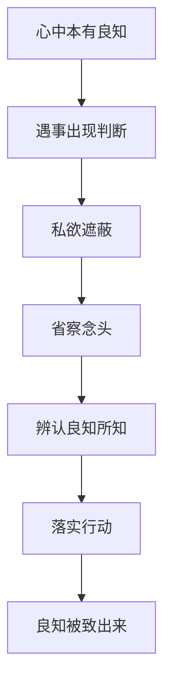

## 王阳明思维筑基课: 上层定律三: 致良知

### 作者
digoal

### 日期
2026-05-18

### 标签
王阳明 , 心学 , 致良知 , 良知 , 省察 , 私欲 , 道德实践 , 知行合一 , 修身 , 行动

----

## 背景

> 面向对象: 高中生及初学者  
> 核心问题: “致良知”到底是在培养良知，还是在发现良知？  
> 先说结论: 致良知不是凭空制造良知，而是把心中本有的良知推到现实行动里。它从“心具良知”和“私欲会遮蔽良知”推出。

## 一张图先看懂

## 求真讲法

### 它到底说了什么

“致”有推致、扩充、落实的意思。致良知就是把本来就有的良知，从模糊处推到清楚处，从内心判断推到外在行动。

比如你知道自己答应过同学要还书，但拖着不还。致良知不是再学习一遍“守信重要”，而是看见拖延背后的懒惰，然后今天把书还掉。

### 它是怎么来的

致良知由两条公理推出来:

| 公理 | 推出的问题 | 致良知的回答 |
|---|---|---|
| 心具良知 | 人心已有是非明觉 | 不必向外寻找全部根据 |
| 私欲会遮蔽良知 | 为什么知道却不做 | 省察遮蔽并落实行动 |

### 它依赖哪些假设

它依赖人有良知、良知可被省察发现、行动能让良知更清楚。若完全否认内在是非感，致良知就会失去起点。

### 常见误解

致良知不是随心所欲，不是情绪宣泄，也不是只在心里想清楚。它必须落实在具体事情上。

## 求存讲法

### 它有什么用

它提供了一个简单但严格的行动法: 遇事省察，辨认良知，马上做出更对的选择。

### 它怎么迁移到熟悉领域

在学习中，致良知就是承认自己到底有没有认真。在工作中，就是承认问题是否被自己故意忽略。在亲密关系中，就是承认自己是否用沉默惩罚别人。

### 它的适用范围和边界

适合处理自我欺骗、责任逃避、价值选择。边界是: 复杂问题还需要知识、讨论和制度，不能只靠个人内省解决。

### 正例: 怎么用它提升能力

你发现自己想抄作业。第一步不急着找借口，而是承认: 我的良知知道这不是学习。第二步做最小正确行动: 先独立完成一道题，不会的标出来请教。

### 反例: 前提不成立会怎样

如果一个人把“我良知告诉我”当成拒绝听取反馈的理由，就破坏了致良知的省察要求。真正致良知会更诚实，不会更封闭。

## 思考

致良知把人生的改造压缩到每个当下。不是等我变成更好的人再行动，而是在这一件事上把更好的判断做出来。

今天哪一件小事最适合用来“致良知”？

## 最后记住

1. 致良知是落实本有良知，不是制造良知。
2. 它需要省察私欲遮蔽。
3. 它必须进入具体行动。
4. 它不能替代知识、讨论和制度。

## 参考资料

1. 王守仁: 《传习录》。
2. 王守仁: 《大学问》。
3. 陈来: 《有无之境: 王阳明哲学的精神》。
4. 钱穆: 《阳明学述要》。
  
#### [PostgreSQL 解决方案集合](../201706/20170601_02.md "40cff096e9ed7122c512b35d8561d9c8")
  
  
#### [德哥 / digoal's Github - 公益是一辈子的事.](https://github.com/digoal/blog/blob/master/README.md "22709685feb7cab07d30f30387f0a9ae")
  
  
#### [About 德哥](https://github.com/digoal/blog/blob/master/me/readme.md "a37735981e7704886ffd590565582dd0")
  
  

  
