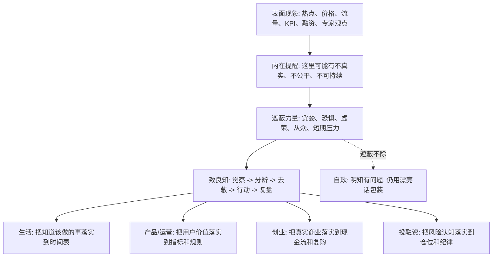

## 王阳明思维筑基课: 致良知: 把你已经知道的真实，推进到具体行动里

### 作者
digoal

### 日期
2026-05-18

### 标签
王阳明 , 心学 , 致良知 , 良知 , 去蔽 , 行动闭环 , 产品 , 运营 , 创业 , 投资

----

## 背景

> 面向对象: 大学生、产品经理、运营经理、有投资需求的人  
> 核心问题: 世界表面变化太快，信息、技术、价格、流量、融资和舆论不断变化，普通人怎样在复杂环境里判断真伪、预判后果，并做出不自欺的选择？  
> 先说结论: “致良知”不是喊一句“凭良心”，而是一个判断和行动流程: 觉察自己已知的问题，识别私欲遮蔽，回到事实、边界和责任，然后把正确判断落实到具体行动。它的核心不是知道良知，而是把良知做出来。

## 一张图先看懂



## 求真讲法

### 它到底说了什么

“致良知”是王阳明心学的核心工夫。

“良知”可以理解为人心中对是非、真假、善恶、责任和后果的基本判断能力。

“致”不是发明良知，也不是嘴上承认良知，而是把良知推到具体事情上，让它变成真实选择。

用现代语言说:

> 致良知 = 把自己隐约知道但不愿面对的真实问题，推进到可执行的判断、行动和复盘中。

这句话的锋利之处在于: 很多时候，人不是不知道，而是不愿意把知道的东西落实。

你知道熬夜伤身体，但继续熬夜。

你知道用户被误导了，但继续看转化率。

你知道增长来自补贴和刷量，但继续讲规模故事。

你知道一个资产看不懂，但因为价格上涨继续买。

这时，问题不是缺少信息，而是良知没有被“致”出来。

### 它是怎么来的

王阳明认为，人心本具良知。但良知会被私欲、习气、恐惧和外部诱惑遮蔽。

所以修养不是从外面安装一个道德系统，而是把原本已经有的良知从遮蔽中释放出来，并让它落实到每一个具体情境里。

“致良知”不是一个数学定理，不能在心学内部被形式化证明。它更像一条行动公理:

> 人要真正变好，不是因为多知道一个道理，而是因为把已经知道的正当判断落实到了事情上。

放到现代生活和商业中，它尤其重要。因为今天的外部信息太多，人人都可以讲价值观、长期主义、用户第一、风险控制、现金流、复利。

但“致良知”问的是:

这些词进入你的预算了吗？

进入你的产品设计了吗？

进入你的运营规则了吗？

进入你的仓位了吗？

进入你今天的时间表了吗？

没有进入具体事情，就还只是语言。

### 它依赖哪些假设

| 假设 | 含义 | 如果不成立会怎样 |
|---|---|---|
| 人有良知 | 人能隐约分辨不真实、不正当、不可持续的地方 | 所有判断只能依赖外部奖惩 |
| 良知会被遮蔽 | 利益、恐惧、虚荣、从众会让人假装看不见 | 人会误以为自己一直客观理性 |
| 行动能显明良知 | 是否真有良知，要看具体事情上的选择 | 道德感会停留在口号和人设 |
| 具体事情才是检验场 | 抽象认同不够，真实压力下的选择才算数 | 人会在安全距离上显得很正确 |
| 复盘能继续去蔽 | 行动后要看后果，修正自欺和盲点 | 错误会被漂亮理由反复保护 |

可以把“致良知”压缩成一个现代流程:

```text
当下事情 -> 内心提醒 -> 识别遮蔽 -> 查清事实 -> 承担选择 -> 行动落地 -> 复盘后果
```

它不是情绪化的“凭感觉”，而是一个不断减少自欺的行动闭环。

### 常见误解

| 误解 | 为什么不对 | 更准确的理解 |
|---|---|---|
| 致良知就是凭良心 | “凭良心”容易停在主观感受 | 致良知要进入事实、行动和后果 |
| 良知可以替代专业知识 | 投资、产品、创业都需要专业方法 | 良知校准动机和边界，专业知识解决事实和路径 |
| 有道德感就算致良知 | 道德感可能只是情绪和自我形象 | 要看具体事情上是否改变选择 |
| 致良知就是做好人 | 它不只是善良，还包括真实、负责、可持续 | 好心若无事实和能力，也可能造成坏结果 |
| 只要初心好就够了 | 初心可能被私欲污染，也可能能力不足 | 初心要接受用户、现金流、风险和长期结果检验 |

## 求存讲法

### 它有什么用

在变化太快的世界里，人最容易被表面现象带走。

价格上涨，让人忘记风险。

流量增长，让人忘记用户价值。

融资成功，让人忘记现金流。

KPI 达成，让人忘记长期信任。

舆论热闹，让人忘记事实核验。

“致良知”的用处，是在这些表面刺激前设置一个内在刹车:

1. 我已经知道哪里不对？
2. 我正在用什么理由绕开这个问题？
3. 如果这件事公开，我是否仍然认可？
4. 如果后果由我承担，我是否仍然这样选择？
5. 我现在能做的最小正确行动是什么？

这五个问题能把很多复杂判断拉回底层。

### 它怎么迁移到熟悉领域

#### 生活: 把知道该做的事落实到时间表

大学生常常知道要学习、运动、睡眠、积累作品、减少低质量娱乐。

但知道不等于致良知。

致良知的动作是:

1. 承认自己正在逃避什么。
2. 把最重要的任务放进固定时间。
3. 给手机、游戏、短视频设置边界。
4. 每周复盘时间是否流向长期目标。

良知不是“我知道要努力”，而是今天最好的两个小时给了什么。

#### 产品经理: 把用户价值落实到设计和指标

产品经理常说用户第一，但真正的检验在具体设计里。

一个页面是否清楚？

一个默认选项是否诚实？

一个推荐算法是否放大焦虑？

一个增长实验是否误导用户？

致良知要求产品经理把“用户价值”落实到:

1. 任务完成率。
2. 投诉率和退款率。
3. 复购和长期留存。
4. 清晰的权益说明。
5. 可退出、可理解、可选择的交互。

用户价值如果不能进入指标和设计，就还没有被致出来。

#### 运营经理: 把信任落实到规则和触达

运营最容易被热闹诱惑。

活动人数很多，群里很活跃，GMV 很漂亮，转发量很高。

但致良知会问:

1. 规则是否清楚？
2. 奖励是否真实？
3. 承诺是否能兑现？
4. 用户是否因为价值留下，而不是因为刺激留下？
5. 活动结束后，用户更信任我们还是更警惕我们？

运营的良知，不是“不做增长”，而是让增长不透支关系资产。

#### 创业者: 把真实商业落实到现金流和复购

创业者最容易用叙事保护自己。

“市场还没成熟。”

“用户需要教育。”

“短期亏损是战略投入。”

“融资后就能规模化。”

这些话可能是真的，也可能是自欺。

致良知要求创业者回到具体问题:

1. 没有补贴，用户还会买吗？
2. 客户是否持续复购？
3. 单位经济模型是否成立？
4. 回款周期是否支撑组织活下去？
5. 坏数据是否真的进入战略调整？

创业中的良知，不只是对员工和客户善良，更是对真实商业规律诚实。

#### 投融资: 把风险认知落实到仓位和纪律

投资者几乎都说自己知道风险。

但致良知看的是:

1. 仓位是否承认自己可能错？
2. 买入前是否写清假设？
3. 是否主动找反方证据？
4. 是否区分价格上涨和价值增长？
5. 是否不用短期资金承受长期波动？

如果风险认知没有进入仓位、期限、止损或复盘，它还只是口头上的风险意识。

投资里的致良知，就是不让贪婪、恐惧和从众冒充研究。

### 它的适用范围和边界

“致良知”适合处理价值、责任、动机、长期后果和行动选择交织的问题。

它适合:

1. 检查个人是否在逃避已知问题。
2. 检查产品是否误导用户。
3. 检查运营是否透支信任。
4. 检查创业是否用叙事遮蔽现金流。
5. 检查投资是否用观点包装贪婪和恐惧。

但它不能被滥用。

| 边界 | 说明 | 正确用法 |
|---|---|---|
| 良知不等于专业能力 | 好动机不能保证好结果 | 用良知校准边界，用专业解决路径 |
| 良知不等于情绪 | 愧疚、冲动、感动都可能误导 | 查事实、看后果、做复盘 |
| 致良知不是道德审判别人 | 最难的是看清自己的遮蔽 | 先自查，再设计组织机制 |
| 不等于牺牲所有利益 | 合理利益是持续行动的基础 | 区分正当利益和扭曲事实的私欲 |
| 不能替代制度 | 组织只靠个人觉悟不稳定 | 用流程、审计、权限和激励保护良知 |

### 正例: 怎么用它提升能力

假设你是运营经理，准备做一场拉新活动。方案 A 能带来很高注册量，但需要用夸张文案暗示用户“名额即将永久关闭”。你心里知道，这个说法并不真实。

致良知不是简单否定活动，而是把内在提醒推到行动:

1. 说清事实: 名额不是永久关闭，文案存在误导。
2. 调整方案: 改成真实的限时权益和明确规则。
3. 改指标: 不只看注册数，也看留存、投诉、转化质量。
4. 做复盘: 比较短期注册和长期信任的变化。
5. 建机制: 建立活动文案的真实性审核。

这就是把“我知道这样不对”变成“我把它改到具体流程里”。

### 反例: 前提不成立会怎样

假设一个创业团队发现产品复购很差，但为了下一轮融资，继续只展示新增用户和 GMV。

团队内部其实知道:

1. 用户主要靠补贴进来。
2. 毛利不足以支撑交付。
3. 复购数据不支持长期价值。
4. 回款周期越来越危险。

但他们把这些问题解释成:

1. “现在主要看规模。”
2. “资本市场喜欢增长。”
3. “等融资后再优化。”
4. “竞品也在烧钱。”

这里失败的不是团队没有信息，而是没有致良知。

良知已经提醒他们: 真实商业还没成立。

但私欲和压力让他们选择不把提醒落实到战略调整中。

最终可能出现:

```text
知道问题 -> 包装数据 -> 继续扩张 -> 现金流恶化 -> 信任崩塌 -> 被现实结算
```

这类失败最值得警惕，因为它不是意外，而是长期不愿面对已知事实的结果。

## 思考

为什么“致良知”能帮助我们预判未来？

因为未来往往不是突然发生的。

很多失败，在早期已经有提醒。

坏产品早就有投诉。

坏运营早就有用户不信任。

坏创业早就有现金流和复购问题。

坏投资早就有估值、杠杆和情绪问题。

坏生活状态早就有身体、时间和关系提醒。

区别在于: 有些人把提醒推进行动，有些人把提醒压下去。

所以，判断一个人或组织的未来，不只看它是否知道正确答案，而要看它如何处理内在提醒和坏消息。

```text
出现提醒 -> 是否承认?
承认问题 -> 是否查事实?
查清事实 -> 是否改行动?
改了行动 -> 是否看反馈?
看到反馈 -> 是否继续修正?
```

如果这个链条畅通，系统就有自我修复能力。

如果这个链条断裂，再漂亮的口号、融资、增长、排名、价格上涨，都可能只是问题被延迟暴露。

“致良知”的现代价值，不是让人变成完美的人，而是让人更少自欺、更早纠偏、更愿意承担自己已经知道的事实。

在表面变化很快的世界里，真正不变的不是某个具体答案，而是这个流程:

看见真实，承认真实，行动回应真实。

## 最后记住

1. “致良知”不是喊良心口号，而是把已知的真实、边界和责任落实到具体行动。
2. 很多问题不是不知道，而是不愿意把知道的东西推进到时间表、指标、预算、仓位和流程里。
3. 产品、运营、创业、投资中的良知，要体现在设计、规则、现金流、复购、仓位和复盘中。
4. 良知不能替代专业知识和制度，但能防止专业知识和制度被私欲拿来包装自欺。
5. 预判未来时，重点看一个人或组织如何处理坏消息和内在提醒；能致良知的系统，更可能穿越变化。

## 参考资料

1. 王守仁: 《传习录》。
2. 王守仁: 《大学问》。
3. 《孟子》。
4. 陈来: 《有无之境: 王阳明哲学的精神》。
5. 钱穆: 《阳明学述要》。
6. 参考本地文章: `/Users/digoal/blog/202605/20260518_72.md`。

  
#### [PostgreSQL 解决方案集合](../201706/20170601_02.md "40cff096e9ed7122c512b35d8561d9c8")
  
  
#### [德哥 / digoal's Github - 公益是一辈子的事.](https://github.com/digoal/blog/blob/master/README.md "22709685feb7cab07d30f30387f0a9ae")
  
  
#### [About 德哥](https://github.com/digoal/blog/blob/master/me/readme.md "a37735981e7704886ffd590565582dd0")
  
  

  
