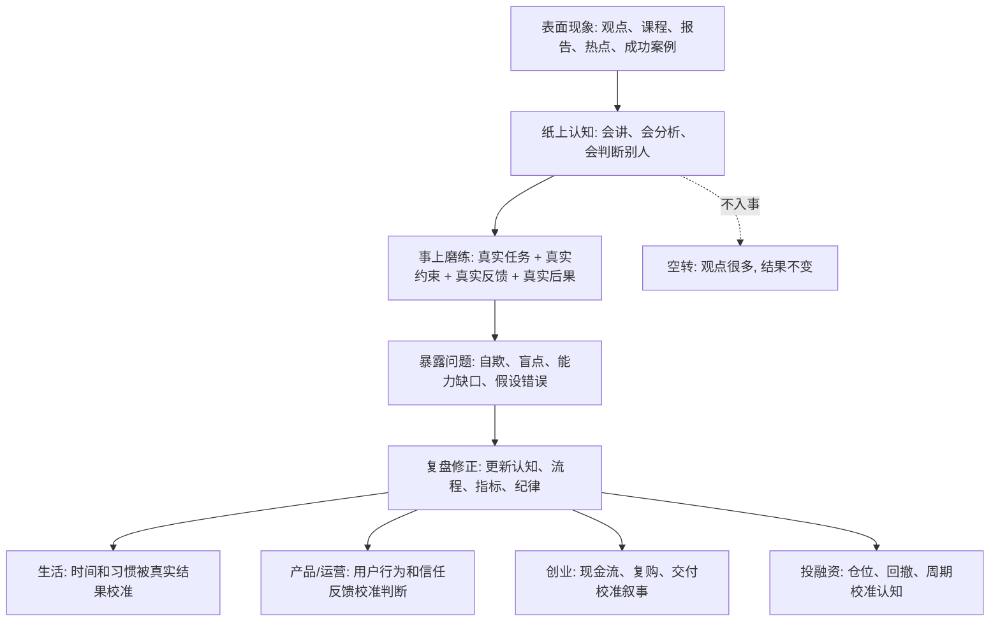

## 王阳明思维筑基课: 事上磨练: 真判断不是想出来的，是在真实事情里校准出来的

### 作者
digoal

### 日期
2026-05-18

### 标签
王阳明 , 心学 , 事上磨练 , 真实反馈 , 判断力训练 , 复盘 , 产品经理 , 运营经理 , 创业 , 投资

----

## 背景

> 面向对象: 大学生、产品经理、运营经理、有投资需求的人  
> 核心问题: 世界表面变化太快，观点、课程、模型、研报和热点层出不穷，普通人怎样把抽象认知变成能判断真伪、预判未来、指导行动的真实能力？  
> 先说结论: “事上磨练”不是吃苦崇拜，而是把认知放进真实事情中接受压力、反馈和后果检验。没有真实任务、真实用户、真实现金流、真实仓位和真实复盘，很多“懂了”只是安全距离上的幻觉。

## 一张图先看懂



## 求真讲法

### 它到底说了什么

“事上磨练”可以先用一句现代话理解:

> 判断力不是在安全距离上形成的，而是在真实事情的压力、反馈和后果中被磨出来的。

这里的“事”，不是泛泛的事情，而是会产生真实约束的事情。

比如:

1. 不是只读产品方法论，而是做一个功能给真实用户用。
2. 不是只讲运营策略，而是设计一次活动并观察用户质量和留存。
3. 不是只听创业故事，而是让客户真的付费、复购、投诉或流失。
4. 不是只看投资研报，而是用真实仓位承受波动并复盘假设。
5. 不是只说要自律，而是在每天的时间表里处理诱惑、疲惫和拖延。

“磨练”的意思也不是故意找苦吃，而是让认知经过现实摩擦。

没有现实摩擦，人很容易高估自己。

你以为你懂用户，直到用户根本不用你的功能。

你以为你懂增长，直到补贴一停用户就走。

你以为你懂商业模式，直到现金流无法覆盖交付成本。

你以为你懂投资风险，直到下跌 30% 才发现仓位超过了承受能力。

### 它是怎么来的

王阳明心学强调“知行合一”和“致良知”，但这些都不能只停留在心里或书本上。

“事上磨练”强调: 修养和判断必须进入具体事情。人只有在真实处境里，才会暴露自己的私欲、恐惧、逃避、盲点和能力缺口。

这不是数学定理，不能在心学内部被形式化证明。它更像一条关于人成长和判断力形成的底层公理:

> 没有真实事情的反馈，认知很难区分真懂和假懂；没有真实后果的压力，人很难看清自己真正相信什么。

现代社会反而更需要这条规律。因为我们获得信息太容易，表达观点太容易，建立“我懂了”的幻觉也太容易。

但真实能力不会因为收藏、转发、听课和复述自动增长。

它必须被事情磨出来。

### 它依赖哪些假设

| 假设 | 含义 | 如果不成立会怎样 |
|---|---|---|
| 真实反馈能暴露认知质量 | 用户、市场、现金流、时间表、仓位会显示判断是否可靠 | 人会长期沉浸在自洽观点里 |
| 压力会暴露真实信念 | 有代价时，人才知道自己真正相信什么 | 口号和价值观无法被检验 |
| 能力需要情境训练 | 复杂判断离不开具体场景和约束 | 学习会变成抽象概念堆积 |
| 复盘能把经历变成经验 | 事情本身不会自动让人成长 | 重复做事也可能重复犯错 |
| 小事能训练大判断 | 真实小任务能低成本暴露盲点 | 人会用大赌局证明自己，风险过高 |

可以把“事上磨练”写成一个训练公式:

```text
判断力 = 真实任务 x 真实反馈 x 后果承担 x 诚实复盘 x 持续迭代
```

只做事不复盘，是忙。

只复盘不行动，是空想。

只在没有后果的地方判断，是旁观者聪明。

### 常见误解

| 误解 | 为什么不对 | 更准确的理解 |
|---|---|---|
| 事上磨练就是吃苦 | 苦本身不产生判断力 | 有反馈、有复盘、有修正的事情才磨人 |
| 只要多做事就会成长 | 重复错误也会固化坏习惯 | 关键是反馈和复盘 |
| 理论没用，直接干就行 | 没有理论，行动容易盲撞 | 理论提供假设，事情检验假设 |
| 失败越多越好 | 失败成本太高会毁掉本金、信任和机会 | 用小成本试错，保护长期能力 |
| 别人经验可以替代自己实践 | 别人经验能降低试错成本 | 但不能完全替代自己的真实反馈 |

## 求存讲法

### 它有什么用

在表面变化太快的世界里，人最容易陷入“旁观者优势”。

看别人创业，觉得自己也能判断战略。

看别人做产品，觉得自己很懂用户。

看别人投资亏钱，觉得自己不会犯同样错误。

看别人运营翻车，觉得自己肯定会设计得更好。

但是一旦自己进入真实事情，约束就来了:

预算有限。

时间有限。

用户不配合。

团队有分歧。

现金流会枯竭。

市场会反向波动。

数据会打脸。

“事上磨练”的用处，是让你不被纸面聪明欺骗。它把判断从“我觉得”拉回“现实如何反馈”。

### 它怎么迁移到熟悉领域

#### 生活: 不在计划里自律，而在时间表里自律

很多大学生做计划时很清醒，执行时就变形。

计划里你很勤奋。

时间表里你才真实。

“事上磨练”的生活版本，是把自我判断放进一天的真实安排里:

1. 早上精力最好时做什么？
2. 累的时候如何处理诱惑？
3. 被打断后能否回到任务？
4. 一周后结果是否支持原计划？
5. 下周是否根据结果调整？

真正的自律不是写在计划里，而是被每天的事情磨出来。

#### 产品经理: 不在会议室里懂用户，而在真实使用中懂用户

产品经理很容易在会议室里“理解用户”。

但用户不会按 PPT 使用产品。

事上磨练要求产品判断进入真实场景:

1. 观察用户怎么完成任务。
2. 看用户在哪里卡住、误解、放弃。
3. 对比点击率和真实任务完成率。
4. 看投诉、退款、复购和长期留存。
5. 用小实验验证假设，而不是用观点压倒争论。

用户行为会打磨产品经理的判断。

#### 运营经理: 不在活动方案里懂增长，而在用户质量里懂增长

运营方案可以写得很漂亮。

但活动结束后，才知道增长质量。

事上磨练要求运营经理看:

1. 拉来的用户是否是目标用户？
2. 奖励停止后是否留下？
3. 用户是否更信任品牌？
4. 活动规则是否造成投诉？
5. GMV、留存、复购、口碑是否一致？

真正的运营能力不是制造热闹，而是通过一次次真实活动理解人群、激励和关系资产。

#### 创业者: 不在商业计划书里懂商业，而在现金流里懂商业

商业计划书可以很完美。

但客户是否付费、是否复购、是否按时回款，才是真实事情。

事上磨练要求创业者把叙事放进现实:

1. 客户是否真的痛？
2. 客户是否愿意付费？
3. 交付成本是否低于收入？
4. 规模扩大后毛利是否改善？
5. 现金流是否支撑团队活下去？

创业不是证明自己会讲故事，而是让真实商业规律不断修正自己的判断。

#### 投融资: 不在研报里懂风险，而在仓位和回撤里懂风险

投资者看研报时通常很理性。

但真正下跌时，才知道自己是否理解风险。

事上磨练要求投资者用真实但可承受的仓位训练:

1. 买入前写清假设。
2. 控制单一标的和行业暴露。
3. 预设什么情况说明自己错了。
4. 下跌时复盘假设，而不是只复盘情绪。
5. 牛市中也检查安全边际，而不是让价格教育自己。

投资能力不是从看对一次涨跌中来，而是从多轮假设、仓位、反馈和复盘中来。

### 它的适用范围和边界

“事上磨练”适合把抽象认知变成真实能力，尤其适合学习、产品、运营、创业、投资这些必须接受反馈的领域。

它适合:

1. 检验自己是否真懂一个道理。
2. 训练产品和运营判断。
3. 验证创业假设和商业模式。
4. 建立投资纪律和风险意识。
5. 把生活规划变成真实习惯。

但它不能被滥用成盲目冒险。

| 边界 | 说明 | 正确用法 |
|---|---|---|
| 事上磨练不是大赌局 | 大成本错误可能毁掉本金和信任 | 用小成本、可逆实验训练 |
| 不是越苦越好 | 苦难没有反馈和复盘就只是消耗 | 选择能暴露问题的事情 |
| 不是只做不想 | 行动后不复盘，经验不会沉淀 | 建立记录和复盘机制 |
| 不是拒绝理论 | 理论能减少低级试错 | 用理论提出假设，用事情检验假设 |
| 不是复制别人经历 | 场景不同，经验会失效 | 学结构，不照搬结论 |

### 正例: 怎么用它提升能力

假设你是一个大学生，想做产品经理。你读了很多产品书，也听了很多课程，但还没有真实作品。

“事上磨练”的做法不是继续收藏方法论，而是做一个小产品:

1. 找一个真实小问题，比如社团活动报名、课程资料整理、实习信息筛选。
2. 访谈 5 个真实用户，记录他们现在怎么解决。
3. 做一个最小可用版本。
4. 让用户真实使用一周。
5. 记录他们哪里不用、哪里误解、哪里愿意继续用。
6. 复盘自己的初始判断错在哪里。

这一次小项目，比听十节课更能暴露你是否真的懂需求、体验、优先级和反馈。

### 反例: 前提不成立会怎样

假设一个创业团队只在融资材料里验证商业模式。

他们做了漂亮的市场规模测算、竞品分析、增长模型和三年财务预测，但没有让客户真实付费，也没有验证交付成本。

他们以为自己已经懂了市场。

但真正上线后发现:

1. 客户觉得问题重要，但不愿付费。
2. 试用用户很多，复购很少。
3. 定制化交付太重，毛利被吃掉。
4. 回款周期很长，现金流紧张。
5. 增长越快，亏损越大。

失败的根源不是他们没有思考，而是思考没有进入真实事情。

他们在 PPT 中完成了论证，却没有在客户、交付、复购和现金流中完成验证。

这就是没有事上磨练的典型风险:

```text
纸面逻辑完整 -> 自信上升 -> 大规模投入 -> 真实反馈迟到 -> 错误成本放大
```

如果早一点用小客户、小订单、小交付去磨，错误会更早、更便宜地暴露。

## 思考

为什么“事上磨练”能帮助我们预判未来？

因为未来不是从观点中长出来的，而是从系统在真实压力下的反应中长出来的。

一个产品在会议室里看起来很有价值，不代表用户会用。

一个运营活动在方案里看起来很热闹，不代表能积累信任。

一个创业项目在路演里看起来很性感，不代表现金流能活。

一个投资逻辑在研报里看起来很完整，不代表下跌时还能成立。

一个人生计划在纸上很理性，不代表疲惫、诱惑和焦虑来时还能执行。

所以，判断一个人或组织的未来，不要只看它的口号和计划，要看它如何进入事情:

```text
有没有真实任务?
有没有真实用户?
有没有真实成本?
有没有真实后果?
有没有真实复盘?
有没有根据反馈改变行动?
```

如果这些都没有，再漂亮的认知也可能是空转。

如果这些都有，哪怕起点很小，也会逐渐形成可靠判断。

事上磨练的价值，在于它把变化太快的表面世界，变成一个可训练、可反馈、可迭代的系统。

不是所有事情都值得磨。

值得磨的是那些能暴露底层规律的事情: 用户是否真实需要，信任是否真实增加，现金流是否真实改善，风险是否真实可承受，能力是否真实增长。

## 最后记住

1. “事上磨练”不是吃苦崇拜，而是在真实任务、真实约束、真实反馈和真实后果中校准判断。
2. 没有真实事情的认知，很容易停留在会讲、会分析、会评价别人的层面。
3. 产品、运营、创业、投资中的真能力，都必须经过用户、数据、现金流、仓位、回撤和复盘检验。
4. 事上磨练要小成本、可复盘、可迭代，不能把盲目冒险包装成实践。
5. 预判未来时，重点看一个人或组织如何处理真实反馈；能被事情持续校准的系统，更可能穿越变化。

## 参考资料

1. 王守仁: 《传习录》。
2. 王守仁: 《大学问》。
3. 《孟子》。
4. 陈来: 《有无之境: 王阳明哲学的精神》。
5. 钱穆: 《阳明学述要》。
6. 参考本地文章: `/Users/digoal/blog/202605/20260518_72.md`。

  
#### [PostgreSQL 解决方案集合](../201706/20170601_02.md "40cff096e9ed7122c512b35d8561d9c8")
  
  
#### [德哥 / digoal's Github - 公益是一辈子的事.](https://github.com/digoal/blog/blob/master/README.md "22709685feb7cab07d30f30387f0a9ae")
  
  
#### [About 德哥](https://github.com/digoal/blog/blob/master/me/readme.md "a37735981e7704886ffd590565582dd0")
  
  

  
