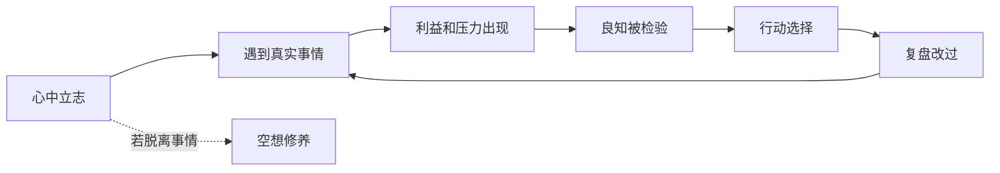

## 王阳明思维筑基课: 上层定律四: 事上磨练

### 作者
digoal

### 日期
2026-05-18

### 标签
王阳明 , 心学 , 事上磨练 , 实践修养 , 良知检验 , 压力场景 , 改过 , 行动学习 , 知行合一 , 成长

----

## 背景

> 面向对象: 高中生及初学者  
> 核心问题: 为什么王阳明不赞成只在安静处谈修养？  
> 先说结论: 事上磨练是说修养必须在真实事情中完成。良知不是只在心里发光，而要在考试、合作、冲突、利益和压力中接受检验。

## 一张图先看懂

## 求真讲法

### 它到底说了什么

事上磨练的意思是: 不要把修养放在没有冲突、没有压力、没有代价的地方。真正的修养，要在事情中磨。

一个人说自己诚实，考试时才知道。一人说自己负责，项目出问题时才知道。一个人说自己宽厚，和别人冲突时才知道。

### 它是怎么来的

它来自“真知必含行动倾向”和“致良知”。如果真知要行动检验，良知要落实，那么真实事情就是最重要的考场。

| 没有事情 | 有真实事情 |
|---|---|
| 容易觉得自己很好 | 遮蔽会暴露 |
| 道理停留在语言 | 道理进入选择 |
| 难以检验工夫 | 能看见实际差距 |

### 它依赖哪些假设

它假设人的真实状态会在具体事情中显现，也假设人可以通过复盘和改过增长工夫。

### 常见误解

事上磨练不是故意找苦吃，也不是把忙碌当修养。关键不是事情多，而是在事情中省察良知、修正行动。

## 求存讲法

### 它有什么用

它让成长不再停留在想象中。你不需要等到环境完美才修养，今天的作业、会议、沟通、冲突就是练习场。

### 它怎么迁移到熟悉领域

学习中，难题就是磨练。工作中，客户投诉就是磨练。关系中，误会和争执就是磨练。真正的进步发生在你想逃避但选择面对的地方。

### 它的适用范围和边界

适合能力训练、品格修养、压力场景。边界是: 不要把不合理压榨说成磨练。磨练应服务于成长，不应美化伤害。

### 正例: 怎么用它提升能力

你害怕公开发言。事上磨练不是空想“我要自信”，而是准备 3 分钟发言、真实讲一次、记录卡住的地方，下次修正。

### 反例: 前提不成立会怎样

如果一个公司长期让员工超负荷加班，却说这是“磨练心性”，就是误用。这里缺少成长反馈和合理边界，只是消耗。

## 思考

事上磨练让人明白: 你真正的样子，不在你安静时的自我评价里，而在事情逼近时的选择里。

你现在最想逃避的一件事，可能正是最能照见自己的地方。

## 最后记住

1. 修养必须进入真实事情。
2. 事情暴露遮蔽，也提供改过机会。
3. 磨练不是忙碌，也不是美化伤害。
4. 每一次具体选择都是良知的考场。

## 参考资料

1. 王守仁: 《传习录》。
2. 王守仁: 《大学问》。
3. 钱穆: 《阳明学述要》。
4. 陈来: 《有无之境: 王阳明哲学的精神》。
  
#### [PostgreSQL 解决方案集合](../201706/20170601_02.md "40cff096e9ed7122c512b35d8561d9c8")
  
  
#### [德哥 / digoal's Github - 公益是一辈子的事.](https://github.com/digoal/blog/blob/master/README.md "22709685feb7cab07d30f30387f0a9ae")
  
  
#### [About 德哥](https://github.com/digoal/blog/blob/master/me/readme.md "a37735981e7704886ffd590565582dd0")
  
  

  
