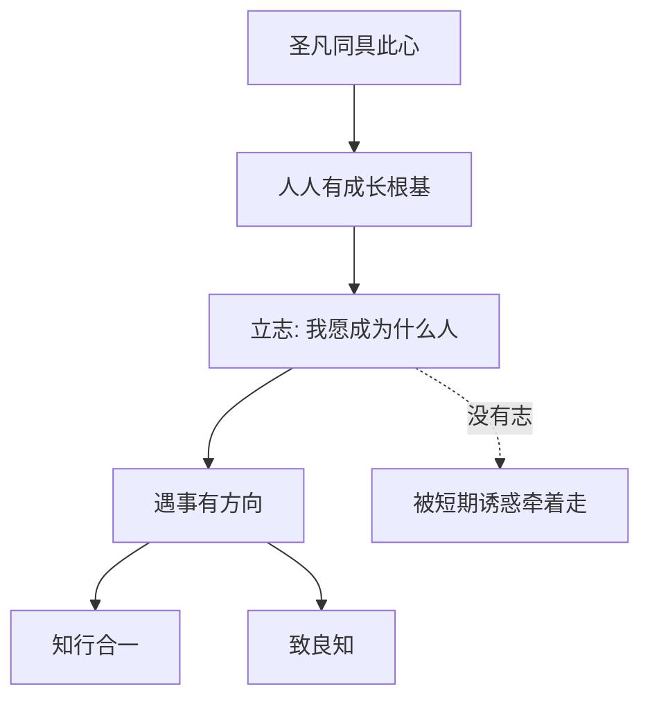

## 王阳明思维筑基课: 上层定律五: 立志为本

### 作者
digoal

### 日期
2026-05-18

### 标签
王阳明 , 心学 , 立志 , 人格方向 , 良知 , 修养 , 自我管理 , 长期主义 , 知行合一 , 成德

----

## 背景

> 面向对象: 高中生及初学者  
> 核心问题: 王阳明为什么把“立志”看成修养和做事的根本？  
> 先说结论: 立志为本是说人要先确定自己愿意成为什么样的人。没有志，良知容易被短期利益牵走；有志，具体行动才有持续方向。

## 一张图先看懂

## 求真讲法

### 它到底说了什么

立志不是普通的“定目标”。目标可以是考多少分、赚多少钱、拿什么名次；志更深，是我想成为什么样的人，我愿意按什么原则生活。

王阳明强调立志，是因为没有一个高阶方向，人很容易被一时的欲望和环境推着走。

### 它是怎么来的

立志为本来自“圣凡同具此心”和“真知必含行动倾向”。既然人人有良知，也有成长可能，就需要一个长期方向把良知组织起来。

| 层次 | 问题 | 立志的作用 |
|---|---|---|
| 良知 | 我知道什么是对的 | 提供判断 |
| 志向 | 我愿成为什么人 | 提供方向 |
| 行动 | 我现在做什么 | 提供落实 |

### 它依赖哪些假设

它假设人能选择长期方向，志向能稳定行动，人可以通过不断实践让志更清楚。

### 常见误解

立志不是喊口号，不是幻想成功，也不是把目标说得越大越好。真正的志要能约束今天的选择。

## 求存讲法

### 它有什么用

它帮助人对抗短期诱惑。没有志的人问“怎样最舒服”，有志的人会多问一句“这是否符合我要成为的人”。

### 它怎么迁移到熟悉领域

学生立志，不只是说“我要考第一”，而是说“我要成为能持续学习、诚实负责的人”。这样即使暂时分数不高，也不会靠作弊解决焦虑。

### 它的适用范围和边界

适合人生规划、学习习惯、品格建设。边界是: 志向不能脱离现实反馈。只立大志、不做小事，会变成空想。

### 正例: 怎么用它提升能力

你立志成为可靠的人。今天别人托付你一件小事，你就按时完成并主动反馈。志不是写在纸上，而是出现在这次履约中。

### 反例: 前提不成立会怎样

一个人说自己立志改变世界，却连答应同学的小事都反复失约。这里的问题是“志”没有约束行动，只是自我想象。

## 思考

立志为本最重要的问题不是“我要得到什么”，而是“我愿意成为什么人”。前者容易随环境变化，后者能决定你如何面对变化。

如果把今天的选择看成对未来人格的一票，你现在正在投给谁？

## 最后记住

1. 立志不是普通目标，而是人格方向。
2. 志能把良知变成持续行动。
3. 大志必须落在小事上。
4. 没有志，人容易被短期诱惑牵走。

## 参考资料

1. 王守仁: 《传习录》。
2. 王守仁: 《大学问》。
3. 钱穆: 《阳明学述要》。
4. 牟宗三: 《从陆象山到刘蕺山》。
  
#### [PostgreSQL 解决方案集合](../201706/20170601_02.md "40cff096e9ed7122c512b35d8561d9c8")
  
  
#### [德哥 / digoal's Github - 公益是一辈子的事.](https://github.com/digoal/blog/blob/master/README.md "22709685feb7cab07d30f30387f0a9ae")
  
  
#### [About 德哥](https://github.com/digoal/blog/blob/master/me/readme.md "a37735981e7704886ffd590565582dd0")
  
  

  
