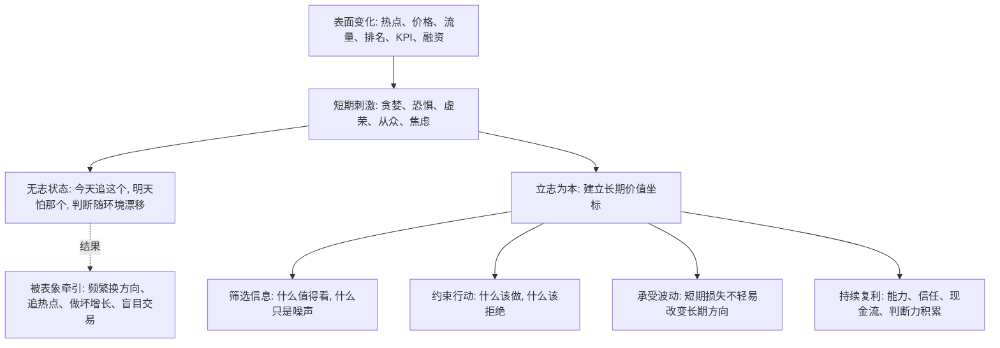

## 王阳明思维筑基课: 立志为本: 没有长期坐标，判断会被表面变化牵着走

### 作者
digoal

### 日期
2026-05-18

### 标签
王阳明 , 心学 , 立志为本 , 长期主义 , 价值坐标 , 复利 , 产品 , 运营 , 创业 , 投资

----

## 背景

> 面向对象: 大学生、产品经理、运营经理、有投资需求的人  
> 核心问题: 世界表面变化太快，热点、流量、价格、KPI、融资和舆论不断切换，普通人怎样避免被短期刺激带偏，建立能判断真伪、预判未来的稳定坐标？  
> 先说结论: “立志为本”不是喊一个宏大目标，而是先确定自己要成为什么样的人、组织要创造什么真实价值、资产要服务什么长期目标。没有志，判断会被短期利益牵走；有志，才能筛选信息、约束欲望、承受波动、持续复利。

## 一张图先看懂



## 求真讲法

### 它到底说了什么

“立志为本”可以先用一句现代话理解:

> 人必须先有一个高于短期欲望的长期坐标，判断和行动才不会被表面变化牵着走。

这里的“志”不是普通目标。

普通目标是: 我要高薪、我要融资、我要增长、我要赚钱、我要赢。

真正的志更深一层:

1. 我想成为怎样的人？
2. 我愿意长期积累什么能力？
3. 我不愿意用什么方式成功？
4. 我希望产品为用户创造什么真实价值？
5. 我投资是为了长期复利，还是为了短期刺激？

所以，“立志为本”不是励志口号，而是一个判断系统的底层设定。

没有志，外部环境一变，人就跟着变。

价格涨了，就觉得机会来了。

流量来了，就愿意牺牲用户信任。

融资来了，就以为商业成立。

别人成功了，就立刻复制别人的路。

有志的人不是不看变化，而是有一个更高的坐标来判断变化。

### 它是怎么来的

王阳明非常重视“立志”。在心学中，立志不是制定一个功利目标，而是确立成圣成德的方向。没有这个方向，良知容易被私欲遮蔽，知行容易断裂，事上磨练也容易变成随波逐流。

放到现代语境，立志就是给判断系统设定长期优化目标。

如果一个人的优化目标只是“眼前舒服”，他的行动会被欲望牵着走。

如果一个产品团队的优化目标只是“本季度转化率”，它就容易伤害用户信任。

如果一个创业公司的优化目标只是“下一轮估值”，它就容易包装数据、透支现金流。

如果一个投资者的优化目标只是“这一波不能错过”，他就容易把价格波动误认为价值判断。

“立志为本”不是数学定理，不能在心学内部被形式化证明。它更像一条关于人和组织如何保持方向稳定的底层公理:

> 没有长期志向，短期刺激会接管判断；有长期志向，信息、行动和资源才有稳定的筛选标准。

### 它依赖哪些假设

| 假设 | 含义 | 如果不成立会怎样 |
|---|---|---|
| 人会被短期刺激牵引 | 贪婪、恐惧、虚荣、从众会改变判断 | 人会误以为自己一直理性 |
| 长期坐标能筛选信息 | 志决定什么重要、什么只是噪声 | 信息越多，越容易焦虑和漂移 |
| 行动需要价值排序 | 资源有限，必须决定先做什么、不做什么 | 每个机会都像机会，最后没有复利 |
| 志需要落到具体行动 | 只喊口号不能形成方向 | 愿景会变成自我感动 |
| 志也需要现实校验 | 长期方向不能脱离事实、能力和反馈 | 志会变成执念或幻想 |

可以把它写成一个判断公式:

```text
稳定判断 = 长期志向 x 事实校验 x 行动纪律 x 复盘修正
```

只有志，没有事实，是空想。

只有事实，没有志，是随波逐流。

### 常见误解

| 误解 | 为什么不对 | 更准确的理解 |
|---|---|---|
| 立志就是定一个大目标 | 大目标可能只是欲望放大 | 志是长期价值坐标和行动约束 |
| 志越宏大越好 | 空泛宏大容易脱离现实 | 志要能进入具体选择和复盘 |
| 有志就不用看变化 | 这是固执，不是有志 | 志定方向，反馈修正路径 |
| 立志就是成功学 | 成功学常强调结果 | 立志更强调成为什么样的人、用什么方式创造价值 |
| 投资不需要志 | 没有长期目标，投资会被价格波动支配 | 投资之志体现为期限、风险承受、能力圈和纪律 |

## 求存讲法

### 它有什么用

表面变化越快，越需要一个稳定坐标。

没有志的人，会被最新的刺激定义自己。

今天看到 AI 火，就转 AI。

明天看到金融赚钱，就转金融。

后天看到别人创业融资，就觉得自己也该创业。

牛市来了，就觉得自己是长期投资者。

熊市来了，又觉得风险太大应该清仓。

“立志为本”的用处，是让你先问:

1. 这件事是否符合我的长期方向？
2. 它是在积累能力、信任、现金流和复利，还是只满足短期刺激？
3. 如果没有外部掌声和短期收益，我还愿意做吗？
4. 我是否为了短期目标牺牲了长期根基？
5. 这件事让我更接近想成为的人，还是更远？

这些问题能帮你从表面现象回到底层坐标。

### 它怎么迁移到熟悉领域

#### 生活: 不把外部评价当人生方向

大学生最容易被外部评价牵着走: 绩点、排名、证书、实习名头、同龄人比较、社交媒体展示。

这些东西不是没用，但不能替代志。

生活中的立志，是明确自己长期要积累什么:

1. 可迁移能力。
2. 真实作品。
3. 健康身体。
4. 可信人格。
5. 能穿越行业变化的学习能力。

有了这个坐标，选择专业、实习、社交、学习内容时，就不会只追当下最热、最体面、最容易获得认可的东西。

#### 产品经理: 不把短期指标当产品方向

产品经理如果没有“产品之志”，就容易被指标牵着走。

本周要点击率，就做标题刺激。

本月要转化率，就做诱导购买。

本季度要留存，就增加退出阻力。

但真正的产品之志，是长期帮助用户更好地完成任务，并积累信任。

它会约束产品经理:

1. 不用误导换转化。
2. 不用成瘾机制换时长。
3. 不用复杂流程阻止退出。
4. 不把用户困惑当增长机会。

有志的产品，不是不追数据，而是不让数据背叛用户价值。

#### 运营经理: 不把热闹当运营方向

运营如果没有志，就会追逐热闹。

哪里有热点，就蹭哪里。

什么话题能涨粉，就说什么。

什么奖励能拉人，就发什么。

短期看，数据会动。

长期看，用户不知道你到底代表什么，也不会信任你。

运营之志可以是:

1. 帮助用户提高判断力。
2. 建立长期可信社群。
3. 让内容和活动持续产生真实价值。
4. 用清晰规则保护关系资产。

有志的运营，知道什么时候该追热点，什么时候该拒绝热点。

#### 创业者: 不把融资和估值当创业方向

创业最容易把外部认可误认为志。

融资成功、估值提升、媒体报道、榜单排名，都很刺激。

但创业之志必须回到:

1. 我们解决什么真实问题？
2. 谁愿意持续付费？
3. 我们用什么方式创造不可替代的价值？
4. 我们不愿意为了增长牺牲什么？
5. 即使融资环境变差，这个业务是否仍有生存逻辑？

有志的创业者不是不会融资，而是不让融资替代商业成立。

#### 投融资: 不把短期收益当投资方向

投资者如果没有志，就会被价格牵着走。

涨了怕错过，跌了怕归零，别人赚钱就焦虑，别人悲观就怀疑。

投资之志不是“我要赚很多钱”这么简单，而是:

1. 我追求什么期限的复利？
2. 我能承受多大回撤？
3. 我的能力圈在哪里？
4. 我靠什么优势获得收益？
5. 我不碰哪些看不懂但很热的机会？

有志的投资者，会把长期目标落实为仓位、研究、纪律和风险边界。

### 它的适用范围和边界

“立志为本”适合处理方向选择、长期复利、资源分配和抗干扰能力。

它适合:

1. 帮助大学生建立长期能力坐标。
2. 帮助产品经理抵抗坏指标诱惑。
3. 帮助运营经理从热闹转向信任资产。
4. 帮助创业者不被融资和估值替代真实商业。
5. 帮助投资者建立期限、能力圈和风险纪律。

但它不能被滥用。

| 边界 | 说明 | 正确用法 |
|---|---|---|
| 志不是执念 | 外部事实变化时，路径需要调整 | 志定方向，反馈修正路线 |
| 志不是口号 | 不能进入时间、预算、指标、仓位的志没有力量 | 把志拆成行动约束 |
| 志不是欲望清单 | 想赢、想富、想出名不等于志 | 追问用什么方式、创造什么价值 |
| 志不能替代能力 | 长期方向需要专业训练和真实反馈 | 用志筛选学习和实践 |
| 志不能脱离现实 | 不看现金流、风险、能力边界会变成幻想 | 用事实检验志的路径 |

### 正例: 怎么用它提升能力

假设你是一个大学生，面对 AI、金融、考研、出国、创业、进大厂等选择，非常焦虑。

如果没有志，你会不断比较:

1. 哪个更热？
2. 哪个更赚钱？
3. 哪个更体面？
4. 哪个别人选得多？

如果用“立志为本”，你先确定长期坐标:

1. 我想成为能解决复杂问题的人，而不是只追热门标签的人。
2. 我需要积累可迁移能力: 逻辑、表达、技术、行业理解、项目交付。
3. 我不把短期体面放在长期能力之前。
4. 我每个选择都要能产出作品、经验或可验证能力。

然后再选择路径:

1. 如果选 AI，就做真实项目，而不是只追概念。
2. 如果进大厂，就关注岗位能否训练核心能力，而不只看名头。
3. 如果考研，就确认研究方向能否支撑长期目标。
4. 如果创业，就先小成本验证客户需求。

这样，外部变化仍然存在，但你的判断不再完全漂移。

### 反例: 前提不成立会怎样

假设一个创业团队没有清晰创业之志，只想“快速做大、融到下一轮”。

于是他们的选择会变成:

1. 哪个指标投资人爱看，就优化哪个。
2. 哪个故事资本市场喜欢，就讲哪个。
3. 哪个渠道拉新最快，就烧哪个。
4. 哪个成本可以延后暴露，就先不讲。
5. 哪个客户愿意付钱，就临时定制，不管产品是否聚焦。

短期看，公司很灵活。

长期看，方向越来越散，交付越来越重，毛利越来越差，团队越来越累，客户越来越不清楚公司到底解决什么问题。

这里失败的根源，不是他们不努力，而是没有“志”来约束机会。

结果很可能是:

```text
没有长期坐标 -> 什么机会都追 -> 资源被摊薄 -> 核心能力不成形 -> 现金流恶化 -> 叙事失效
```

这就是没有立志的组织风险: 机会越多，越容易迷路。

## 思考

为什么“立志为本”能帮助我们预判未来？

因为一个人或组织的未来，往往不是由它今天说什么决定，而是由它长期优化什么决定。

如果一个产品长期优化短期转化，它迟早会面对用户信任问题。

如果一个运营长期优化热闹，它迟早会面对用户质量问题。

如果一个创业公司长期优化估值叙事，它迟早会面对现金流问题。

如果一个投资者长期优化短期收益，他迟早会面对回撤和情绪问题。

如果一个学生长期优化外部评价，他迟早会面对真实能力不足的问题。

所以，判断未来时，可以问:

```text
它真正的志是什么?
它每天优化什么?
它愿意牺牲什么?
它绝不牺牲什么?
它的时间、预算、指标、仓位是否支持它口中的长期方向?
```

志不是写在墙上的愿景，而是藏在资源分配里。

看一个人的志，看他的时间表。

看一个产品团队的志，看它的指标系统。

看一个运营团队的志，看它如何对待用户信任。

看一个创业公司的志，看它如何处理现金流和坏数据。

看一个投资者的志，看他的仓位和纪律。

表面世界会不断变化，但长期结果通常服从这个底层规律:

你持续优化什么，最终就会成为什么。

## 最后记住

1. “立志为本”不是喊大目标，而是建立长期价值坐标，用来筛选信息、约束行动、承受波动。
2. 没有志，人和组织会被热点、KPI、价格、融资、外部评价牵着走。
3. 产品、运营、创业、投资中的志，要体现在指标、规则、现金流、仓位、预算和复盘里。
4. 志不是执念，必须接受事实反馈；但没有志，反馈也会变成噪声。
5. 预判未来时，重点看一个人或组织长期优化什么，因为持续优化的对象会塑造最终结果。

## 参考资料

1. 王守仁: 《传习录》。
2. 王守仁: 《大学问》。
3. 《孟子》。
4. 陈来: 《有无之境: 王阳明哲学的精神》。
5. 钱穆: 《阳明学述要》。
6. 参考本地文章: `/Users/digoal/blog/202605/20260518_72.md`。

  
#### [PostgreSQL 解决方案集合](../201706/20170601_02.md "40cff096e9ed7122c512b35d8561d9c8")
  
  
#### [德哥 / digoal's Github - 公益是一辈子的事.](https://github.com/digoal/blog/blob/master/README.md "22709685feb7cab07d30f30387f0a9ae")
  
  
#### [About 德哥](https://github.com/digoal/blog/blob/master/me/readme.md "a37735981e7704886ffd590565582dd0")
  
  

  
