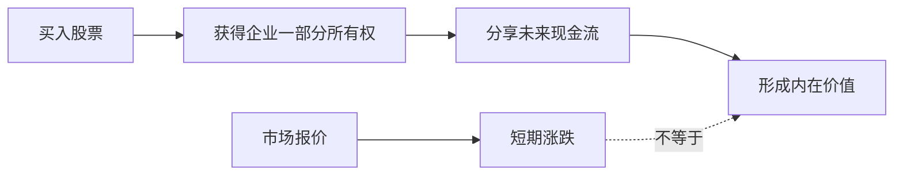

## 巴菲特思维筑基课: 股票不是筹码，是企业所有权

### 作者
digoal

### 日期
2026-05-19

### 标签
所有权 , 股票 , 企业价值 , 现金流 , 长期投资 , 市场价格 , 股东 , 内在价值 , 巴菲特 , 投资基础

----

## 背景

> 面向对象: 高中生
> 核心问题: 为什么巴菲特总说买股票像买企业，而不是猜红绿数字?
> 先说结论: 股票代表一家公司的部分所有权。价格每天变，所有权背后的企业赚钱能力才是价值的来源。

## 一张图先看懂

| 看法 | 关注点 | 容易做出的行为 |
|---|---|---|
| 股票是筹码 | 今天涨跌 | 追涨杀跌 |
| 股票是所有权 | 企业长期赚钱能力 | 像老板一样评估 |

## 求真讲法

### 它到底说了什么

买股票不是买一个会跳动的价格符号，而是买一家公司的一小块。公司以后能赚多少钱、能不能把钱合理分给股东，决定这块所有权值多少钱。

### 它是怎么来的

如果你和同学合开奶茶店，你拥有 10% 股份，那么你关心的不是别人每天给这 10% 报价多少，而是店能不能持续赚钱。这就是股票所有权思想的原型。

### 它依赖哪些假设

- 这家公司真实存在，并且股东拥有剩余收益权。
- 财务数据大体可信，能反映企业经营。
- 投资者有足够时间让企业价值显现。
- 市场价格可能偏离价值，但长期不会永远无视价值。

### 常见误解

误解一: “既然是所有权，就永远不能卖。”不对。所有权质量变差、价格离谱高、管理层失信时，卖出是理性的。

误解二: “我只买一股，算什么老板。”比例很小，但经济性质一样: 你仍然分享企业成果，也承担企业恶化的后果。

## 求存讲法

### 它有什么用

它让投资者把问题从“明天涨不涨”改成“这门生意十年后是否更值钱”。这是长期投资的起点。

### 它怎么迁移到熟悉领域

选社团、选专业、选项目也一样。不要只看今天热不热，要看它背后的能力、资源和长期产出。

### 它的适用范围和边界

适用于分析有真实经营、财务可查、商业模式能理解的公司。不适用于纯投机代币、财务造假公司、或者你完全看不懂的业务。

### 正例: 怎么用它提升能力

你买一家饮料公司前，先问: 它卖什么，客户为什么买，利润从哪里来，十年后还会不会有人买。这样你像企业小股东，而不是行情观众。

### 反例: 前提不成立会怎样

如果一家公司收入靠虚假合同支撑，所有权假设失效。你以为自己买了企业，实际买到的是一份不可靠的故事。

## 思考

如果股市明天关闭五年，你还愿意持有这家公司吗? 这个问题能把“价格游戏”和“所有权判断”分开。

## 最后记住

- 股票的经济本质是企业所有权。
- 价格是别人今天的报价，价值是企业未来的现金流。
- 像老板一样思考，才能减少被市场情绪牵着走。
- 所有权思想不是永不卖，而是先判断企业本身。

## 参考资料

- Warren Buffett, Berkshire Hathaway shareholder letters.
- Benjamin Graham, *The Intelligent Investor*.
- Charlie Munger, public speeches on business ownership and mental models.
  
#### [PostgreSQL 解决方案集合](../201706/20170601_02.md "40cff096e9ed7122c512b35d8561d9c8")
  
  
#### [德哥 / digoal's Github - 公益是一辈子的事.](https://github.com/digoal/blog/blob/master/README.md "22709685feb7cab07d30f30387f0a9ae")
  
  
#### [About 德哥](https://github.com/digoal/blog/blob/master/me/readme.md "a37735981e7704886ffd590565582dd0")
  
  

  
