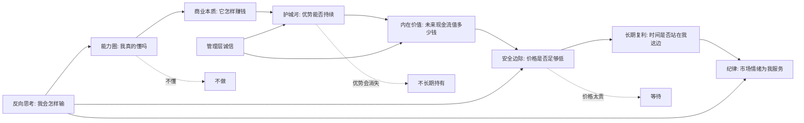

## 巴菲特思维筑基课

### 作者
digoal

### 日期
2026-05-19

### 标签
巴菲特思想 , 底层规律 , 价值投资 , 能力圈 , 复利 , 护城河 , 内在价值 , 安全边际 , 管理层诚信 , 市场先生

----

## 背景

> 面向对象: 高中生、大学生、普通投资者、创业者和想提高判断力的人  
> 核心问题: 世界变化太快，信息真假难辨，怎样用一套稳定的底层规律判断生活、投融资和创业中的机会与风险？  
> 先说结论: 巴菲特思想不是“买股票秘籍”，而是一套在不确定世界里保护判断力的公理系统：只在能力圈内行动，用长期复利看结果，用护城河判断质量，用内在价值和安全边际控制风险，用诚信与纪律避免毁灭性错误。

本文把巴菲特思想简化成适合学习和迁移的七条“公理”。这里的“公理”不是数学里绝对不可证明的真理，而是巴菲特长期实践中反复使用的判断前提。它们可以被证据支持，也有适用边界。

## 一张图先看懂



## 求真讲法

### 它到底说了什么

巴菲特思想可以浓缩成一句话：

> 不要预测世界表面的短期波动；要判断少数你真正理解的对象，在长期里能否持续创造价值，并且只在价格低于价值、风险留有余地时行动。

这句话里有七条底层公理。

| 公理 | 学生版解释 | 投资版解释 | 可迁移问题 |
|---|---|---|---|
| 能力圈 | 不懂的题不要装懂 | 只投能解释清楚的生意 | 我真的理解这个问题吗 |
| 长期复利 | 分数不是一天变好的 | 好企业长期滚动创造价值 | 时间会放大它还是摧毁它 |
| 护城河 | 有些优势别人很难抄 | 品牌、成本、网络、切换成本等保护利润 | 这个优势能持续多久 |
| 内在价值 | 一件东西值多少钱，不等于标价 | 企业未来可取现金流的折现值 | 它真正产生什么价值 |
| 安全边际 | 答案可能错，所以要留余量 | 价格必须明显低于价值 | 错一点会不会死 |
| 管理层诚信 | 和不诚实的人合作很危险 | 坏管理层会毁掉好资产 | 这个人会不会骗自己和别人 |
| 市场先生 | 别人的情绪报价不是事实 | 市场波动提供机会，不提供真理 | 我是在看事实，还是被情绪牵着走 |

### 它是怎么来的

巴菲特思想不是凭空出现的。它主要来自三条线索。

第一条线索是本杰明·格雷厄姆的价值投资：股票不是纸片，而是企业所有权的一部分；投资要看价值和价格的差距；由于人会犯错，必须要有安全边际。

第二条线索是查理·芒格对巴菲特的改造：不要只买“便宜但普通”的东西，而要买“优秀且价格合理”的东西。因为差企业会消耗时间，好企业会让时间成为朋友。

第三条线索是伯克希尔长期实践：几十年里，巴菲特反复强调能力圈、复利、护城河、现金流、管理层诚信、资本配置和避免重大错误。这些原则不是每年都显得最聪明，但在长周期里显著减少了毁灭性错误。

可以把它理解成一个判断算法。

```text
看见机会
  |
  v
我懂不懂？-- 否 --> 放弃
  |
 是
  v
它能长期创造现金吗？-- 否 --> 放弃或只当短期交易
  |
 是
  v
优势能维持吗？-- 否 --> 不给长期估值
  |
 是
  v
人是否诚实、资本配置是否理性？-- 否 --> 放弃
  |
 是
  v
价格是否低于保守价值？-- 否 --> 等待
  |
 是
  v
买入后让复利工作，并持续检查前提
```

### 它依赖哪些假设

巴菲特思想能成立，依赖一些前提。

1. 世界虽然变化快，但某些经济规律相对稳定：人需要消费、企业要赚钱、资本有机会成本、竞争会侵蚀高利润。
2. 少数企业或资产具有持续竞争优势，能在较长时间里创造超额回报。
3. 价格和价值会短期偏离，但长期大概率会被经营结果拉回。
4. 投资者能诚实承认自己的能力边界，而不是每个热点都想参与。
5. 投资者有足够耐心和财务安全，不被短期波动迫使卖出。
6. 规则环境大体稳定，产权、契约和商业信用能够维持。
7. 管理层对所有者诚实，或者至少没有系统性损害股东利益。

这些假设一旦失效，巴菲特思想就不能机械套用。

### 常见误解

误解一：巴菲特思想就是“长期持有”。

不对。长期持有只是结果，不是起点。前提是企业优秀、优势持续、管理层可信、买入价格合理。如果护城河被破坏，长期持有会把小错变成大错。

误解二：价值投资就是买低市盈率股票。

不对。便宜不等于低估。低市盈率可能是市场发现了利润下滑、技术替代、债务风险或管理层问题。真正的低估，是价格低于保守估算的内在价值。

误解三：不预测市场就是不判断。

不对。巴菲特不预测短期市场涨跌，但会判断一项资产是否被高估或低估。前者是猜情绪，后者是估价值。

误解四：能力圈越大越好。

不对。能力圈的边界比大小更重要。知道“我不知道”是一种保护。很多损失不是因为无知，而是因为不知道自己无知。

误解五：集中投资适合所有人。

不对。集中投资只适合真正理解企业、能承受波动、能独立判断的人。普通投资者如果不具备这些能力，宽基指数和分散投资反而更符合巴菲特对“承认限制”的要求。

## 求存讲法

### 它有什么用

巴菲特思想的原生用途是投资决策，但它更深层的价值是训练判断力。

它帮助我们在三类噪音中保持清醒。

| 噪音 | 表面诱惑 | 巴菲特式问题 |
|---|---|---|
| 热点噪音 | 大家都在买、都在转发 | 我是否在能力圈内 |
| 价格噪音 | 涨了就是好，跌了就是坏 | 内在价值变了吗 |
| 故事噪音 | 未来空间巨大 | 现金流、竞争优势和执行者可靠吗 |
| 情绪噪音 | 错过就没机会 | 没有安全边际就等待 |
| 权威噪音 | 专家、机构、朋友都看好 | 数据和推理是否独立成立 |

### 它怎么迁移到熟悉领域

巴菲特思想能迁移到生活、学习、创业和职业选择，因为它本质上是在问四件事：我懂什么、什么能持续、价格是否合理、失败会怎样发生。

| 场景 | 能力圈 | 护城河 | 安全边际 | 复利 |
|---|---|---|---|---|
| 学习 | 我掌握了哪些基础概念 | 方法是否可重复 | 考前是否留出复盘时间 | 每天进步一点 |
| 职业 | 我真正擅长什么 | 技能是否难替代 | 不把现金流押在单一风险上 | 经验和信誉累积 |
| 创业 | 我懂不懂客户痛点 | 用户为什么不离开 | 单位经济模型是否抗波动 | 口碑、数据、网络效应 |
| 投融资 | 我能否解释赚钱逻辑 | 优势是否能挡住竞争 | 估值是否保守 | 利润再投资 |
| 生活决策 | 我是否被情绪催促 | 关系和习惯是否长期增益 | 最坏情况能否承受 | 健康、信用、能力积累 |

### 它的适用范围和边界

巴菲特思想适合以下情况。

1. 你能用常识解释对象的价值创造机制。
2. 结果主要由长期基本面决定，而不是纯随机或短期博弈决定。
3. 对象存在可观察的竞争优势、现金流、信誉或积累效应。
4. 你可以等待，不被短期压力强制行动。
5. 你能承认错误，并在关键假设变化时修正判断。

它不适合以下情况。

1. 完全超出能力圈，却被热点裹挟。
2. 技术、政策、需求正在剧烈变化，未来现金流无法保守估算。
3. 对象没有护城河，只是短期供需错配。
4. 使用高杠杆，导致“长期正确”也可能在短期爆仓。
5. 参与的是零和或负和游戏，例如纯情绪投机、赌博式交易、庞氏结构。

### 正例: 怎么用它提升能力

假设一名学生想选择未来专业，不只看“今年什么热门”，而是用巴菲特思想做判断。

第一步，能力圈：他先问自己，是否真的喜欢并理解这个领域的基本问题。例如人工智能不是“很火”这么简单，而是数学、数据、工程、产品场景的组合。

第二步，护城河：他判断哪些能力不容易被短期工具替代。单纯会用某个软件可能很快过时，但数学建模、工程落地、行业理解、表达协作更容易形成长期优势。

第三步，复利：他选择能持续积累的方向。比如每周写技术笔记、做项目、复盘错误，这些会形成作品、经验和信誉。

第四步，安全边际：他不把所有时间押在一个不确定概念上，而是保留基础能力：数学、英语、写作、编程、行业常识。

这个选择不是因为他“预测了未来”，而是因为他把自己放在更不容易被变化击垮的位置。

### 反例: 前提不成立会怎样

某人看到一个新概念暴涨，听别人说“这是下一个十年机会”，于是重仓买入。

他以为自己在学巴菲特的“长期持有”，但关键假设都不成立。

| 巴菲特前提 | 实际情况 | 结果 |
|---|---|---|
| 在能力圈内 | 只看了几篇文章，不能解释商业模式 | 误把口号当理解 |
| 有护城河 | 产品容易复制，用户没有切换成本 | 竞争一来利润消失 |
| 能估内在价值 | 没有稳定现金流，只能讲远期故事 | 估值没有锚 |
| 有安全边际 | 价格已经包含极高预期 | 好消息也不一定赚钱 |
| 能长期承受波动 | 使用借款或短期资金 | 下跌时被迫卖出 |

失败不是因为“长期持有错了”，而是因为他把巴菲特思想的结论拿走了，却没有满足巴菲特思想的前提。

### 一个更直观的边界图

```text
                 可理解
                   ^
                   |
      等待观察     |     重点研究
                   |
不可持续 ---------+--------- 可持续
                   |
      直接避开     |     便宜也谨慎
                   |
                 不可理解
```

右上角才是巴菲特思想最适合发力的区域：可理解、可持续、能估值、价格合理。

## 思考

如果世界表面变化越来越快，为什么巴菲特思想反而更重要？

因为变化越快，越需要区分“现象”和“结构”。现象是今天哪个概念涨了，哪个产品火了，哪个故事刷屏了。结构是客户是否真的需要，竞争者能否复制，现金流能否持续，管理层是否诚实，价格是否已经透支未来。

还可以反过来想：如果一个机会必须依赖“别人明天出更高价买走”，而不是依赖它自己长期创造价值，那么你买的不是资产，而是情绪接力棒。你可能赚钱，但那不是巴菲特式判断，而是博弈。

巴菲特思想对创业也有启发。创业者常说“增长”，但巴菲特会追问：增长是否带来更强的单位经济模型？用户增长是否形成切换成本或网络效应？融资是否提升长期价值，还是掩盖了商业模式亏损？如果每增长一单就亏更多，那么增长不是复利，而是反复利。

对个人生活也一样。健康、信用、专业能力、人际信任，都是复利资产。虚荣消费、短期刺激、透支信用、频繁跳动没有积累的选择，都是反复利资产。巴菲特思想的底层提醒是：把时间交给能让你变强的系统，不要交给会放大错误的系统。

可以用三个问题做日常检查。

1. 这个判断是在我的能力圈内，还是我只是被热闹吸引？
2. 这个选择会产生长期复利，还是只带来短期兴奋？
3. 如果我错了，安全边际能不能保护我不被一次错误摧毁？

## 最后记住

1. 巴菲特思想的核心不是预测未来，而是识别长期价值和控制错误代价。
2. 能力圈是第一道门槛：不懂不做，知道边界比假装全懂更重要。
3. 护城河决定时间是不是朋友；差资产持有越久，问题越大。
4. 内在价值是锚，安全边际是护栏；没有护栏的正确判断也可能被一次误差击穿。
5. 市场情绪只能给报价，不能给真理；真正的判断来自事实、逻辑和耐心。

## 参考资料

- Warren Buffett, Berkshire Hathaway Shareholder Letters, especially discussions on intrinsic value, margin of safety, owner earnings, market forecasting, concentration, capital allocation, and long-term compounding.
- Benjamin Graham, *The Intelligent Investor*, especially the concepts of Mr. Market and margin of safety.
- Benjamin Graham and David Dodd, *Security Analysis*, especially the idea that stocks should be analyzed as business ownership.
- Charles T. Munger, *Poor Charlie's Almanack*, especially inversion, mental models, and avoiding major errors.
- 本文还参考了本地 `buffett` 技能资料: `01-thinking-frameworks.md`, `02-investment-philosophy.md`, `03-business-moat.md`, `06-valuation-capital.md`。
  
#### [PostgreSQL 解决方案集合](../201706/20170601_02.md "40cff096e9ed7122c512b35d8561d9c8")
  
  
#### [德哥 / digoal's Github - 公益是一辈子的事.](https://github.com/digoal/blog/blob/master/README.md "22709685feb7cab07d30f30387f0a9ae")
  
  
#### [About 德哥](https://github.com/digoal/blog/blob/master/me/readme.md "a37735981e7704886ffd590565582dd0")
  
  

  
