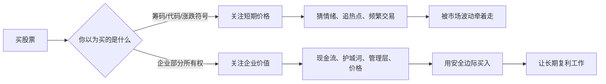

## 巴菲特思维筑基课: 企业所有权: 买股票就是买企业的一部分

### 作者
digoal

### 日期
2026-05-19

### 标签
企业所有权 , 股票本质 , 企业价值 , 现金流 , 股东权益 , 所有者视角 , 长期投资 , 内在价值 , 商业判断 , 投资基础

----

## 背景

> 面向对象: 大学生、产品经理、运营经理、有投资需求的人  
> 核心问题: 为什么同样是买股票，有人像在买筹码，有人像在买企业？这两种视角为什么会导致完全不同的判断和结果？  
> 先说结论: 股票不是一张会跳动的价格票，而是一家企业的部分所有权。把股票看成企业所有权，你就会从“猜别人明天愿意出多少钱”转向“判断这门生意未来能创造多少价值”。

这里把“企业所有权”当作巴菲特体系的起点来讲。它是内在价值、安全边际、护城河、长期复利、管理层诚信和市场先生这些规律的共同地基。如果你不把股票当企业的一部分，后面的所有原则都会变成零散技巧。

## 一张图先看懂



## 求真讲法

### 它到底说了什么

企业所有权的意思是：当你买入一只股票时，你不是在买一个价格曲线，也不是在买一个热门故事，而是在买一家企业的一小部分。

这会立刻改变你的问题。

| 筹码视角 | 所有权视角 |
|---|---|
| 明天会不会涨 | 这门生意长期能不能创造现金 |
| 别人会不会接盘 | 客户为什么付钱 |
| 热点是不是来了 | 护城河是否能保护利润 |
| K 线好不好看 | 价格是否低于内在价值 |
| 消息会不会刺激股价 | 管理层是否诚实、会不会乱用钱 |

如果你买的是企业的一部分，那么你就不能只看价格。你要像一个小老板那样思考：这家企业卖什么、谁付钱、成本是什么、竞争者能不能抢走利润、管理层会不会把钱用好、未来能给所有者带来多少现金。

### 它是怎么来的

这条规律来自一个基本事实：股票代表企业权益。

企业把所有权切成很多份，每一份叫股票。你持有股票，就持有企业的一小部分权益。虽然你不能每天进入公司指挥员工，但你拥有的是企业未来经济成果的一部分。

市场每天给股票报价，这让人很容易忘记它背后的企业。因为价格太容易看见，价值却需要理解；波动每天发生，现金流要多年验证；故事很刺激，生意本质很朴素。

巴菲特的关键转变，就是把股票从“交易品”重新看成“企业所有权”。这样，投资不再是猜市场，而是研究企业。

```text
股票价格 = 市场今天愿意给的报价
企业价值 = 未来可取现金流折现后的估计

短期: 价格可能远离价值
长期: 价值会逐渐约束价格
```

### 它依赖哪些假设

企业所有权视角成立，依赖几个前提。

1. 股票背后是真实企业，而不是纯粹空壳或欺诈结构。
2. 企业未来能产生某种经济成果，比如现金流、资产增值或可分配收益。
3. 股东权益能在法律和治理结构中被保护。
4. 管理层不会系统性侵占或浪费企业成果。
5. 投资者能在能力圈内理解企业的赚钱逻辑。
6. 市场价格虽然短期波动，但长期不会完全脱离企业基本面。

如果这些前提不成立，所有权视角就会被削弱。比如企业财务造假、治理混乱、股东权益无法保护、商业模式没有现金流，买股票就很难说是在分享企业价值。

### 常见误解

误解一：买一股太少了，算不上所有权。

不对。比例小不改变性质。你拥有的份额很小，但它仍然对应企业的一部分经济权益。问题不在于份额小，而在于你是否按所有者方式思考。

误解二：股票能随时卖，所以不是企业所有权。

不对。流动性只是股票的交易便利，不改变它代表企业权益的本质。你可以随时卖掉房子股份，不代表房子不存在。

误解三：股价涨了，企业一定变好了。

不一定。价格上涨可能来自情绪、流动性、估值扩张或短期消息。企业是否变好，要看现金流、竞争优势、管理层和长期回报。

误解四：只要是好企业，任何价格都可以买。

不对。所有权视角不等于无视价格。买企业也要看价格。好企业买贵了，也可能多年回报很差。

误解五：所有权视角只适合长期投资者。

不完全对。即使你不打算持有很久，也应该知道自己交易的东西是什么。否则你只是在猜别人情绪。

## 求存讲法

### 它有什么用

企业所有权的最大用途，是让你从表面价格回到底层价值。

对投资者，它把问题从“涨不涨”变成“值不值”。

对产品经理，它提醒你不要只看功能和数据，而要理解产品背后的商业闭环：用户价值如何转成收入、留存和利润。

对运营经理，它提醒你不要只冲短期指标，而要看活动是否提高了企业长期资产：客户关系、复购、品牌信任、现金流。

对大学生，它提供一种看商业世界的基础框架：公司不是抽象名字，而是一组客户、产品、成本、组织、资本和规则的组合。

### 它怎么迁移到熟悉领域

企业所有权视角可以迁移成“主人翁视角”。

```text
员工视角: 这个任务怎么完成？
产品视角: 这个功能怎么上线？
运营视角: 这个指标怎么提高？
所有者视角: 这件事是否增加长期价值？
```

对产品经理，所有者视角会问：

1. 这个功能是否提高用户长期留存？
2. 它是否增强产品护城河？
3. 它是否带来可持续收入或降低服务成本？
4. 它是否增加维护复杂度，侵蚀未来效率？

对运营经理，所有者视角会问：

1. 这个活动带来的是一次性交易，还是长期客户关系？
2. 补贴是否换来了复购和品牌信任？
3. 获客成本是否低于用户生命周期价值？
4. 指标增长是否透支了未来现金流？

对投资者，所有者视角会问：

1. 如果我买下整家公司，还愿意用这个价格买吗？
2. 如果市场五年不报价，我还愿意拥有它吗？
3. 管理层会不会像替我经营资产一样经营公司？
4. 这家公司未来能给所有者取出多少现金？

### 它的适用范围和边界

企业所有权视角适合用于判断长期投资、创业选择、产品战略、职业选择和经营决策。

它特别适合这些情况。

1. 企业有真实产品和客户。
2. 商业模式可以理解。
3. 现金流或未来现金流能被估计。
4. 股东权益和治理结构大体可信。
5. 投资者有足够时间等待价值兑现。

它也有边界。

1. 如果公司是欺诈或空壳，所有权视角会失去基础。
2. 如果治理结构严重损害小股东，即使企业赚钱，也未必属于你。
3. 如果你完全不懂业务，所有权视角只是一句口号。
4. 如果使用高杠杆，短期波动可能让你等不到企业价值兑现。
5. 如果价格极高，好企业也可能不是好投资。

### 正例: 怎么用它提升能力

假设一个大学生想买一家咖啡连锁公司的股票。筹码视角会问：“最近涨没涨？有没有利好？别人怎么看？”

企业所有权视角会这样拆。

| 问题 | 要看的内容 |
|---|---|
| 谁付钱 | 消费者是否高频购买，客单价是否稳定 |
| 为什么付钱 | 品牌、位置、口味、便利性、社交属性 |
| 成本结构 | 租金、人工、原料、配送、营销 |
| 单店模型 | 单店收入、利润率、回本周期 |
| 护城河 | 品牌、供应链、会员体系、规模采购 |
| 管理层 | 是否理性开店，是否重视现金流 |
| 价格 | 当前市值是否低于保守内在价值 |

经过这套分析，他买的就不再是“咖啡概念”，而是一门具体生意的一小部分。即使最后不买，也提升了商业判断力。

产品和运营也一样。如果团队把自己当所有者，就不会只追“上线了多少功能”“做了多少活动”，而会追问：这些动作是否让用户更愿意留下，是否让公司未来现金流更稳，是否让品牌和组织能力更强。

### 反例: 前提不成立会怎样

某投资者看到一只热门股票连续上涨，认为“大家都在买，肯定还有空间”，于是追高买入。他没有研究公司怎么赚钱，也不知道客户是谁、现金流怎样、管理层是否可信。

后来热度消退，股价大跌。他才发现公司收入依赖补贴，现金流长期为负，股东权益还被复杂结构稀释。

| 所有权前提 | 实际情况 | 后果 |
|---|---|---|
| 股票背后有真实价值 | 只有概念和远期故事 | 价格失去价值锚 |
| 商业模式能理解 | 投资者只懂热点名词 | 无法判断风险 |
| 现金流可估计 | 长期亏损且转正路径模糊 | 内在价值难估 |
| 管理层可信 | 频繁调整指标口径 | 信息质量下降 |
| 价格合理 | 买入价反映完美预期 | 没有安全边际 |

这个失败不是因为股票市场不能投，而是因为他没有把股票当企业所有权。他买的是别人的情绪，不是自己理解的企业价值。

## 思考

企业所有权视角最重要的变化，是把你从旁观者变成所有者。

旁观者看热闹：谁涨了，谁火了，谁被推荐了。所有者看本质：谁在付钱，钱能不能留下，成本会不会失控，竞争者能不能复制，管理层会不会乱用现金。

这条规律也能帮产品和运营人员摆脱短期指标幻觉。一个活动如果提高了 GMV，却损害了用户信任，它可能让价格层好看，却损害企业价值。一个功能如果提高了点击，却增加了用户困惑和维护成本，也可能不是所有者想要的结果。

可以用一个简单图来提醒自己。

```text
价格层: 股价、热度、点击、GMV、融资估值
  |
  v
生意层: 用户、需求、成本、现金流、竞争
  |
  v
所有权层: 长期可取现金流、资本配置、风险、复利
```

真正的商业判断，要从价格层往下走到生意层，再走到所有权层。

企业所有权也让“长期持有”有了边界。不是因为买了股票就永远持有，而是因为如果这门生意仍在创造价值、护城河仍在、管理层可信、价格没有极端荒谬，所有者就不需要被每天报价驱赶。

反过来，如果生意变坏、管理层失信、现金流恶化、价格远超价值，所有者也应该重新判断。所有权视角不是死拿，而是像真正的老板一样持续评估资产质量。

## 最后记住

1. 股票不是筹码，而是企业部分所有权；价格只是报价，企业才是本体。
2. 所有权视角会把问题从“明天涨不涨”改成“这门生意未来能创造多少现金”。
3. 内在价值、安全边际、护城河、管理层诚信和长期复利，都建立在企业所有权视角之上。
4. 好企业也要看价格，坏治理会削弱所有权，能力圈外的企业不能靠口号理解。
5. 对产品、运营和职业选择来说，所有者视角就是判断一个动作是否增加长期价值。

## 参考资料

- Benjamin Graham, *The Intelligent Investor*, especially the distinction between business ownership and market quotation.
- Warren Buffett, Berkshire Hathaway Shareholder Letters, especially discussions on stocks as businesses, intrinsic value, market forecasting, margin of safety, and long-term ownership.
- Charles T. Munger, *Poor Charlie's Almanack*, especially owner mentality, opportunity cost, and multidisciplinary thinking.
- 本文参考本地 `buffett` 技能资料: `references/02-investment-philosophy.md` 中关于集中投资、市场有效性、市场预测、低估、复利和内在价值的框架；以及 `references/06-valuation-capital.md` 中关于估值、价格与价值关系、资本配置的框架。
  
#### [PostgreSQL 解决方案集合](../201706/20170601_02.md "40cff096e9ed7122c512b35d8561d9c8")
  
  
#### [德哥 / digoal's Github - 公益是一辈子的事.](https://github.com/digoal/blog/blob/master/README.md "22709685feb7cab07d30f30387f0a9ae")
  
  
#### [About 德哥](https://github.com/digoal/blog/blob/master/me/readme.md "a37735981e7704886ffd590565582dd0")
  
  

  
