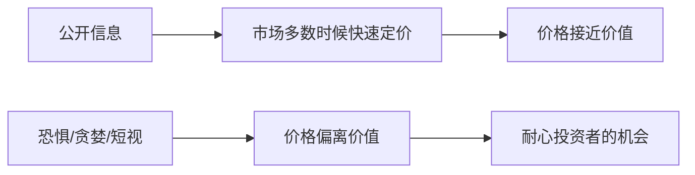

## 巴菲特思维筑基课: 市场多数时候有效，但不总是有效

### 作者
digoal

### 日期
2026-05-19

### 标签
有效市场 , 错误定价 , 市场情绪 , 价格价值 , 独立判断 , 恐惧贪婪 , 巴菲特 , 价值投资 , 机会 , 投资哲学

----

## 背景

> 面向对象: 高中生
> 核心问题: 如果市场已经很聪明，为什么巴菲特还能找到机会?
> 先说结论: 市场经常能快速反映信息，但在恐惧、贪婪和误解中会偏离价值。机会就在“经常有效”和“总是有效”的差别里。

## 一张图先看懂



```
正常日子: 信息 -> 价格较合理
极端日子: 情绪 -> 价格可能荒唐
```

## 求真讲法

### 它到底说了什么

巴菲特并不是说市场愚蠢。他承认市场大多数时候很难战胜。但“难”不等于“不可能”，“经常正确”不等于“永远正确”。

### 它是怎么来的

市场由许多人共同报价。平时信息充分、参与者冷静，价格会接近价值。但当集体恐慌或狂热出现时，价格会被情绪推离价值。

### 它依赖哪些假设

- 企业存在可估算的内在价值。
- 市场参与者会受心理和制度压力影响。
- 投资者能独立评估价值，而不是只复制市场报价。
- 价格偏离最终有机会被纠正。

### 常见误解

误解一: “市场会犯错，所以我一定比市场聪明。”不对。多数人没有足够能力识别市场错误。

误解二: “市场有效，所以研究没用。”也不对。对普通人，指数投资可能更合适；对少数能深度研究的人，错误定价仍有价值。

## 求存讲法

### 它有什么用

它让你尊重市场，但不崇拜市场。你不会因为市场跌就自动恐慌，也不会因为市场涨就自动相信。

### 它怎么迁移到熟悉领域

班级里流行的观点也可能“多数时候有道理”，但不代表永远正确。独立判断就是在关键时刻检查证据。

### 它的适用范围和边界

适用于有可分析基本面的资产。不适合用来给纯短线波动找借口，因为短期价格何时回归很难预测。

### 正例: 怎么用它提升能力

市场因短期坏消息抛售一家现金流稳定的公司。你先检查内在价值是否改变。如果没有改变，低价可能是机会。

### 反例: 前提不成立会怎样

如果企业价值本身已经被技术替代永久破坏，低价不是市场错误，而是市场在重新定价。

## 思考

你能不能同时做到两件事: 尊重市场多数时候比你聪明，又在少数真正看懂的时候敢于不同意市场?

## 最后记住

- 市场多数时候有效，但不是永远有效。
- 错误定价常出现在情绪极端时。
- 独立判断必须建立在事实和估值上。
- 反对“市场永远正确”不等于鼓励盲目自信。

## 参考资料

- Warren Buffett, 1988 and 2006 Berkshire Hathaway shareholder letters.
- Warren Buffett, "The Superinvestors of Graham-and-Doddsville".
- Eugene Fama, efficient market hypothesis literature.
  
#### [PostgreSQL 解决方案集合](../201706/20170601_02.md "40cff096e9ed7122c512b35d8561d9c8")
  
  
#### [德哥 / digoal's Github - 公益是一辈子的事.](https://github.com/digoal/blog/blob/master/README.md "22709685feb7cab07d30f30387f0a9ae")
  
  
#### [About 德哥](https://github.com/digoal/blog/blob/master/me/readme.md "a37735981e7704886ffd590565582dd0")
  
  

  
