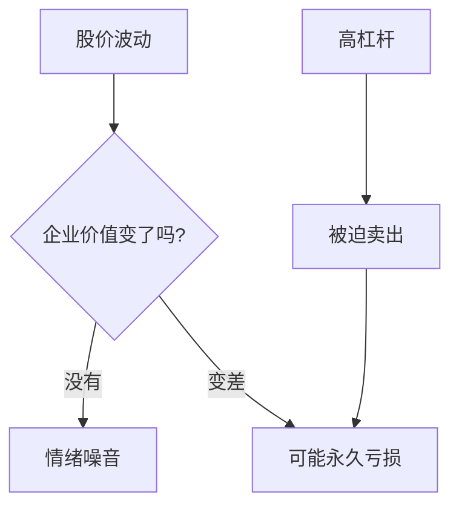

## 巴菲特思维筑基课: 风险不是波动，而是永久性亏损

### 作者
digoal

### 日期
2026-05-19

### 标签
风险 , 永久亏损 , 波动 , 杠杆 , 现金流 , 本金安全 , 复利 , 投资纪律 , 巴菲特 , 风险管理

----

## 背景

> 面向对象: 高中生
> 核心问题: 为什么股价下跌不一定危险，而看不懂却很危险?
> 先说结论: 巴菲特眼中的风险不是价格上下跳，而是本金永久受损，或者你被迫在坏时候出局。

## 一张图先看懂

| 情况 | 是不是核心风险 | 原因 |
|---|---|---|
| 好公司短期跌 20% | 不一定 | 价值未必改变 |
| 企业现金流永久下降 | 是 | 内在价值下降 |
| 借钱买入后被强平 | 是 | 失去等待权 |

## 求真讲法

### 它到底说了什么

传统金融常用波动率衡量风险。巴菲特更关心永久性亏损: 企业变差、买入价过高、债务过重、管理层欺骗，都会让钱回不来。

### 它是怎么来的

如果你拥有一家优秀小店，隔壁每天乱喊报价，并不会改变小店赚钱能力。但如果小店顾客永久流失，或者你欠债太多被迫贱卖，那才是真风险。

### 它依赖哪些假设

- 投资者不用短期资金做长期投资。
- 企业价值可以独立于短期报价进行判断。
- 投资者能区分暂时困难和永久损伤。
- 没有使用会强迫卖出的高杠杆。

### 常见误解

误解一: “波动不是风险，所以下跌都不用管。”不对。下跌可能只是情绪，也可能反映真实恶化。

误解二: “只要长期持有就没有风险。”不对。烂企业长期持有会长期毁灭价值。

## 求存讲法

### 它有什么用

它帮助你把注意力放在会杀死复利的事情上: 看不懂、买贵、造假、杠杆、护城河消失。

### 它怎么迁移到熟悉领域

学习中的风险也不是一次考试波动，而是基础概念没掌握却继续往上堆，最后形成不可逆的知识漏洞。

### 它的适用范围和边界

这个定律适合长期投资。对必须短期用钱的人，价格波动本身也会变成风险，因为他没有等待价值回归的时间。

### 正例: 怎么用它提升能力

投资前做“三问”: 我懂吗? 公司会永久变差吗? 我会不会因借钱或短期用钱被迫卖出? 三问不过，就不买。

### 反例: 前提不成立会怎样

你用借来的钱买优秀公司。公司价值没变但短期跌了，你被迫卖出。永久亏损不是企业造成的，而是资金结构造成的。

## 思考

很多人害怕价格波动，却不害怕自己根本看不懂。你觉得哪一种更危险?

## 最后记住

- 真风险是永久性亏损，不是日常波动。
- 杠杆会把暂时波动变成永久损失。
- 长期持有只适合好企业和合理价格。
- 风险控制的第一步是承认自己可能错。

## 参考资料

- Warren Buffett, Berkshire Hathaway shareholder letters on risk and leverage.
- Benjamin Graham, *The Intelligent Investor*.
- Berkshire discussions of permanent capital loss and financial strength.
  
#### [PostgreSQL 解决方案集合](../201706/20170601_02.md "40cff096e9ed7122c512b35d8561d9c8")
  
  
#### [德哥 / digoal's Github - 公益是一辈子的事.](https://github.com/digoal/blog/blob/master/README.md "22709685feb7cab07d30f30387f0a9ae")
  
  
#### [About 德哥](https://github.com/digoal/blog/blob/master/me/readme.md "a37735981e7704886ffd590565582dd0")
  
  

  
